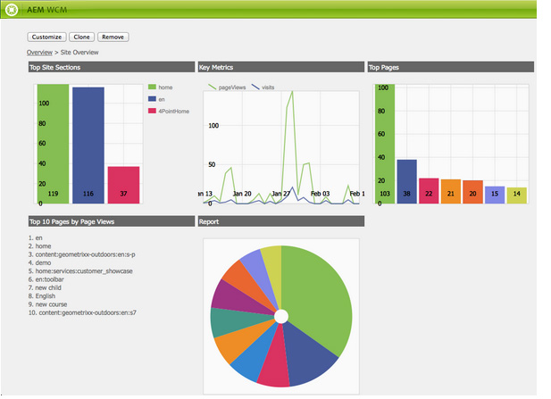
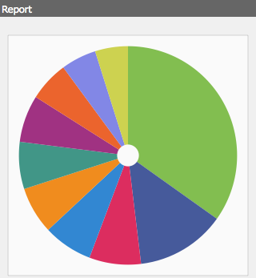

# Dashboards{#dashboards}

When using AEM, you can manage numerous content of different types (for example, pages, assets). AEM Dashboards provide an easy to use and customizable way to define pages that displays consolidated data.

>[!NOTE]
>
>AEM Dashboards are created on a per user basis, so a user can only access to their own dashboard.
>
>However, [Dashboard templates](#creating-a-dashboard-template) can be used to share common configuration and Dashboard layout.



## Administering Dashboards {#administering-dashboards}

### Creating A Dashboard {#creating-a-dashboard}

1. In the **Tools** section, click **Configuration Console**.
1. In the tree, Double-Click **Dashboard**.
1. Click **New Dashboard**.
1. Type the **Title** (for example, My Dashboard) and the **Name**.
1. Click **Create**.

### Cloning A Dashboard {#cloning-a-dashboard}

You may want to have multiple dashboards to quickly see information about your content from different views. To help you to create new Dashboard, AEM provides a clone feature that you can use to duplicate an existing Dashboard. To clone a Dashboard, proceed as follows:

1. In the **Tools** section, click **Configuration Console**.

1. In the tree, Click **Dashboard**.
1. Click on the dashboard you want to clone.

1. Click **Clone**.

1. Type the **Name** of your new dashboard.

### Removing A Dashboard {#removing-a-dashboard}

1. In the **Tools** section, click **Configuration Console**.

1. In the tree, Click **Dashboard**.
1. Click on the dashboard you want to delete.

1. Click **Remove**.

1. Click **Yes** to confirm.

## Dashboard Components {#dashboard-components}

### Overview {#overview}

Dashboard components are nothing more than regular [AEM components](/help/sites-developing/developing-components-samples.md). This section describes reporting components shipped with AEM.

### Web Analytics Reporting Components {#web-analytics-reporting-components}

AEM ships with a set of components that render multiple metrics of your [SiteCatalyst](/help/sites-administering/adobeanalytics.md) data. Those components are listed in the Sidekick under the **Dashboard** section.

Each reporting component provides at least three tabs:

* **Basic**: contains the main configuration.

* **Report:** contains the configuration specific of each report.
* **Style**: contains styling configuration like chart size and margin.

The reporting components are initialized with a default configuration that helps you to quickly set up your dashboard.

#### Basic configuration {#basic-configuration}

The **Basic** tab provides access to the following configuration entries:

**Title** The title displayed on the dashboard.

**Request type** The way data are requested.

**SiteCatalyst Configuration (optional)** The configuration you want to use to connect to SiteCatalyst. If not provided the configuration is assumed to be configured on the Dashboard page (via page properties).

**Report Suite ID (optional)** The SiteCatalyst report suite you want to use to generate the graph.

#### Report configuration {#report-configuration}

To display web statistics, you need to define the date range of the data you want to fecth. The **Report** tab provides two fields to define that range.

>[!NOTE]
>
>Setting a large date range can decrease the responsiveness of the dashboard.

**Date From** Absolute or relative date from which the data is fetched.

**Date To** Absolute or relative date to which the data is fetched.

Each component also defines specific settings.

#### Overtime Report {#overtime-report}


**Date Granularity** Time unit of the X axis (for example, day, hour).

**Metrics** The list of events you want to display.

**Elements** The list of elements that breaks down the metrics data in the graph.

#### Ranked List Report {#ranked-list-report}


**Elements** The element that breaks down the metrics data in the graph.

**Metrics** The event you want to display.

**No. of top items** Number of items displayed by the report.

#### Ranked Report {#ranked-report}


**Metrics** The event you want to display.

**Elements** The element that breaks down the metrics data in the graph.

#### Top Site Section Report {#top-site-section-report}

This component displays a graph showing the more visited section of a website according to the following configuration.


**No. of top items** Number of section displayed by in the report.

#### Trended Report {#trended-report}



**Date Granularity** Time unit of the X axis (for example, day, hour).

**Metrics** The event you want to display.

**Elements** The element that breaks down the metrics data in the graph.

## Extending Dashboard {#extending-dashboard}

### Overview {#overview-1}

Dashboards are normal pages ( `cq:Page`), therefore any components can be used to assemble Dashboards.

There is a default component group `Dashboard` containing analytics reporting components which are enabled on the template by default.

### Creating A Dashboard Template {#creating-a-dashboard-template}

A template defines the default content of a new Dashboard. You may use several templates for creating different types of dashboards.

Dashboard templates are created like other page templates, except that they are stored under `/libs/cq/dashboards/templates/`. See the [Creating Contentpage Template](/help/sites-developing/website.md#creating-the-contentpage-template) section.

>[!NOTE]
>
>Dashboard templates are shared between users.

### Developing a Dashboard component {#developing-a-dashboard-component}

Developing a Dashboard component consists of creating a regular AEM Component. This section describes an example of a component that displays the top 10 of contributors.


The top author components is stored in the repository at `/apps/geometrixx-outdoors/components/reporting` and is composed of :

1. a `jsp` file that reads jcr data and defines the `html` placeholder.

1. a client-side library containing one `js` file that fetches and orders the data, then fills the `html` placeholder.


The following JavaScript file is defined in the `geout.reporting.topauthors` [Client Library](/help/sites-developing/clientlibs.md) as a child of the component itself.

The [QueryBuilder](/help/sites-developing/querybuilder-api.md) is used to query the repository to read `cq:AuditEvent` nodes. The query result is a JSON object from which author contributions are extracted.

#### top_authors.js {#top-authors-js}

```
$.ajax({
  url: "/bin/querybuilder.json",
  cache: false,
  data: {
       "orderby": "cq:time",
       "orderby.sort": "desc",
       "p.hits": "full",
       "p.limit": 100,
       "path": "/var/audit/com.day.cq.wcm.core.page/",
       "type": "cq:AuditEvent"
   },
  dataType: "json"
}).done(function( res ) {
    var authors = {};
    // from JSON to Object
    for(var r in res.hits) {
        var userId = res.hits[r].userId;
        if(userId == undefined) {
            continue;
        }
        var auth = authors[userId] || {userId : userId};
        auth.contrib = (auth.contrib || 0) +1;

        authors[userId] = auth;
    }

    // order by contribution
    var orderedByContrib = [];
    for(var a in authors) {
        orderedByContrib.push(authors[a]);
    }
    orderedByContrib.sort(function(a,b){return b.contrib - a.contrib});

    // produce the list
    for (var i=0, tot=orderedByContrib.length; i < tot; i++) {
        var current = orderedByContrib[i];
        $("<div> #" + (i + 1) +" "+ current.userId + " (" + current.contrib +" contrib.)</div>").appendTo("#authors-list");

    }
});
```

The `JSP` includes both `global.jsp` and `clientlib`.

#### top_authors.jsp {#top-authors-jsp}

```java
<%@page session="false" contentType="text/html; charset=utf-8" %><%
%><%
%><%@include file="/libs/foundation/global.jsp" %><%
%>
<ui:includeClientLib categories="geout.reporting.topauthors" />
<%
String reportletTitle = properties.get("title", "Top Authors");
%>
<html>
     <h3><%=xssAPI.encodeForHTML(reportletTitle) %></h3>
     <div id="authors-list"></div>
</html>
```
