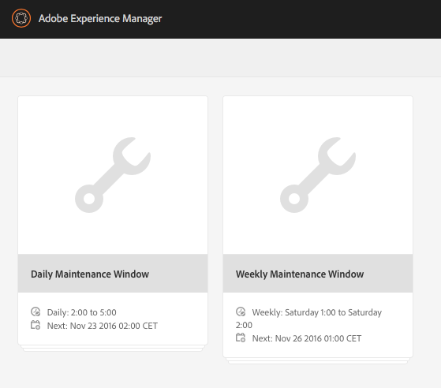
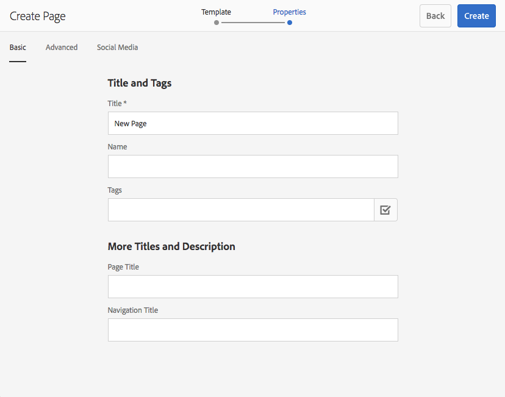

# Data Store Garbage Collection {#data-store-garbage-collection}

When a conventional WCM asset is removed, the reference to the underlying data store record may be removed from the node hierarchy, but the data store record itself remains. This unreferenced data store record then becomes "garbage" that does not need to be retained. In instances where several garbage assets exist, it is beneficial to get rid of them to preserve space and to optimize backup and filesystem maintenance performance.

For the most part, a WCM application tends to collect information but not delete information nearly as often. Although new images are added, even superseding old versions, the version control system still retains the old one and supports reverting to it if needed. Thus the majority of the content we think of as adding to the system is effectively permanently stored. So what is the typical source of "garbage" in the repository that we might want to clean up?

AEM uses the repository as the storage for several internal and housekeeping activities:

* Packages built and downloaded
* Temporary files created for publish replication
* Workflow payloads
* Assets created temporarily during DAM rendering

When any of these temporary objects is large enough to require storage in the data store, and when the object eventually passes out of use, the data store record itself remains as "garbage". In a typical WCM author/publish application, the largest source of garbage of this type is commonly the process of publish activation. When data is being replicated to Publish, it if first gathered in collections in an efficient data format called "Durbo" and stored in the repository under `/var/replication/data`. The data bundles are often larger than the critical size threshold for the data store and therefore wind up stored as data store records. When the replication is complete, the node in `/var/replication/data` is deleted, but the data store record remains as "garbage".

Another source of recoverable garbage is packages. Package data, like everything else, is stored in the repository and thus for packages which are larger than 4KB, in the data store. In the course of a development project or over time while maintaining a system, packages may be built and rebuilt many times, each build resulting in a new data store record, orphaning the previous build's record.

## How does data store garbage collection work? {#how-does-data-store-garbage-collection-work}

If the repository has been configured with an external data store, [data store garbage collection will run automatically](/help/sites-administering/data-store-garbage-collection.md#automating-data-store-garbage-collection) as part of the Weekly Maintenance Window. The system administrator can also [run data store garbage collection manually](#running-data-store-garbage-collection) on as as-needed basis. In general, it is recommended that data store garbage collection be performed periodically, but that the following factors be taken into account in planning data store garbage collections:

* Data store garbage collections take time and may impact performance, so they should be planned accordingly.
* Removal of data store garbage records does not affect normal performance, so this is not a performance optimization.
* If storage utilization and related factors like backup times are not a concern, then data store garbage collection might be safely deferred.

The data store garbage collector first makes a note of the current timestamp when the process begins. The collection is then carried out using a multi-pass mark/sweep pattern algorithm.

In the first phase, the data store garbage collector performs a comprehensive traversal of all the repository content. For each content object that has a reference to a data store record, it located the file in the filesystem, performing a metadata update -- modifying the "last modified" or MTIME attribute. At this point files that are accessed by this phase become newer than the initial baseline timestamp.

In the second phase, the data store garbage collector traverses the physical directory structure of the data store in much the same way as a "find". It examined the "last modified" or MTIME attribute of the file and makes the following determination:

* If the MTIME is newer than the initial baseline timestamp, then either the file was found in the first phase, or it is an entirely new file that was added to the repository while the collection process was ongoing. In either of these cases the record is taken to be active and the file shall not be deleted.
* If the MTIME is prior to the initial baseline timestamp, then the file is not an actively referenced file and it is considered removable garbage.

This approach works well for a single node with a private data store. However the data store may be shared, and if it is this means that potentially active live references to data store records from other repositories are not checked, and active referenced files may be mistakenly removed. It is imperative that the system admin understand the shared nature of the data store before planning any garbage collections, and only use the simple built-in data store garbage collection process when it is known that the data store is not shared.

>[!NOTE]
>
>When performing garbage collection in a clustered or shared data store setup (with Mongo or Segment Tar) the log might display warnings about the inability to delete certain blob IDs. This happens because blob IDs deleted in a previous garbage collection are incorrectly referenced again by other cluster or shared nodes which do not have information about the ID deletions. As a result, when garbage collection is performed it logs a warning when it tries to delete an ID that has already been deleted in the last run. This behavior does not affect performance or functionality.

## Running Data Store Garbage Collection {#running-data-store-garbage-collection}

There are three ways of running data store garbage collection, depending on the data store setup on which AEM is running:

1. Via [Revision Cleanup](/help/sites-deploying/revision-cleanup.md) - a garbage collection mechanism usually used for node store cleanup.

1. Via [Data Store Garbage Collection](/help/sites-administering/data-store-garbage-collection.md#running-data-store-garbage-collection-via-the-operations-dashboard) - a garbage collection mechanism specific for external data stores, available on the Operations Dashboard.
1. Via the [JMX Console](/help/sites-administering/jmx-console.md).

If TarMK is being used as both the node store and data store, then Revision Cleanup can be used for garbage collection of both node store and data store. However if an external data store is configured such as File System Data Store, then data store garbage collection must be explicitly triggered separate from Revision Cleanup. Data store garbage collection can be triggered either via the Operations Dashboard or the JMX Console.

The below table shows the data store garbage collection type that needs to be used for all the supported data store deployments in AEM 6:

<table>
 <tbody>
  <tr>
   <td><strong>Node Store</strong><br /> </td>
   <td><strong>Data Store</strong></td>
   <td><strong>Garbage Collection Mechanism</strong><br /> </td>
  </tr>
  <tr>
   <td>TarMK</td>
   <td>TarMK</td>
   <td>Revision Cleanup (binaries are in-lined with Segment Store)</td>
  </tr>
  <tr>
   <td>TarMK</td>
   <td>External Filesystem</td>
   <td><p>Data Store Garbage Collection task via Operations Dashboard</p> <p>JMX Console</p> </td>
  </tr>
  <tr>
   <td>MongoDB</td>
   <td>MongoDB</td>
   <td><p>Data Store Garbage Collection task via Operations Dashboard</p> <p>JMX Console</p> </td>
  </tr>
  <tr>
   <td>MongoDB</td>
   <td>External Filesystem</td>
   <td><p>Data Store Garbage Collection task via Operations Dashboard</p> <p>JMX Console</p> </td>
  </tr>
 </tbody>
</table>

### Running Data Store Garbage Collection via the Operations Dashboard {#running-data-store-garbage-collection-via-the-operations-dashboard}

The built-in Weekly Maintenance Window, available via the [Operations Dashboard](/help/sites-administering/operations-dashboard.md), contains a built-in task to trigger the Data Store Garbage Collection at 1 am on Sundays.

If you need to run data store garbage collection outside of this time, it can be triggered manually via the Operations Dashboard.

Before running data store garbage collection you should check that no backups are running at the time.

1. Open the Operations Dashboard by **Navigation** > **Tools** > **Operations** > **Maintenance**.
1. Click the **Weekly Maintenance Window**.

   

1. Select the **Data Store Garbage Collection** task and then click the **Run** icon.

   

1. Data store garbage collection runs and its status is displayed in the dashboard.

   

>[!NOTE]
>
>The Data Store Garbage Collection task will only be visible if you have configured an external file data store. See [Configuring node stores and data stores in AEM 6](/help/sites-deploying/data-store-config.md#file-data-store) for information on how to set up a file data store.

### Running Data Store Garbage Collection via the JMX Console {#running-data-store-garbage-collection-via-the-jmx-console}

This section is about manually running data store garbage collection via the JMX Console. If your installation is set up without an external data store, then this does not apply to your installation. Instead see the instructions on how to run Revision cleanup under [Maintaining the Repository](/help/sites-deploying/storage-elements-in-aem-6.md#maintaining-the-repository).

>[!NOTE]
>
>If you are running TarMK with an external data store, it is required you run Revision Cleanup first in order for garbage collection to be effective.

To run garbage collection:

1. In the Apache Felix OSGi Management Console, highlight the **Main** tab and select **JMX** from the following menu.
1. Next, search for and click the **Repository Manager** MBean (or go to `https://<host>:<port>/system/console/jmx/org.apache.jackrabbit.oak%3Aname%3Drepository+manager%2Ctype%3DRepositoryManagement`).
1. Click **startDataStoreGC(boolean markOnly)**.
1. enter "`true`" for the `markOnly` parameter if necessary:

   | **Option** |**Description** |
   |---|---|
   | boolean markOnly |Set to true to only mark references and not sweep in the mark and sweep operation. This mode is to be used when the underlying BlobStore is shared between multiple different repositories. For all other cases set it to false to perform full garbage collection. |

1. Click **Invoke**. CRX runs the garbage collection and indicates when it has completed.

>[!NOTE]
>
>The data store garbage collection will not collect files that have been deleted in the last 24 hours.

>[!NOTE]
>
>The data store garbage collection task will only start if you have configured an external file data store. If an external file data store has not been configured, the task will return the message `Cannot perform operation: no service of type BlobGCMBean found` after invoking. See [Configuring node stores and data stores in AEM 6](/help/sites-deploying/data-store-config.md#file-data-store) for information on how to set up a file data store.

## Automating Data Store Garbage Collection {#automating-data-store-garbage-collection}

If possible, data store garbage collection should be run when there is little load on the system, for example, in the morning.

The built-in Weekly Maintenance Window, available via the [Operations Dashboard](/help/sites-administering/operations-dashboard.md), contains a built-in task to trigger the Data Store Garbage Collection at 1 am on Sundays. You should also check that no backups are running at this time. The start of the maintenance window can be customized via the dashboard as necessary.

>[!NOTE]
>
>The reason not to run it concurrently is so that old (and unused) data store files are also backed up, so that if it is required to roll back to an old revision, the binaries are still there in the backup.

If you do not want to run data store garbage collection with the Weekly Maintenance Window in the Operations Dashboard, it can also be automated using the wget or curl HTTP clients. The following is an example of how to automate garbage collection by using curl:

>[!CAUTION]
>
>In the following example `curl` commands various parameters might need to be configured for your instance; for example, the hostname ( `localhost`), port ( `4502`), admin password ( `xyz`) and various parameters for the actual data store garbage collection.

Here is an example curl command to invoke data store garbage collection via the command line:

```shell
curl -u admin:admin -X POST --data markOnly=true  https://localhost:4503/system/console/jmx/org.apache.jackrabbit.oak"%"3Aname"%"3Drepository+manager"%"2Ctype"%"3DRepositoryManagement/op/startDataStoreGC/boolean

```

The curl command returns immediately.

## Checking Data Store Consistency {#checking-data-store-consistency}

The data store consistency check will report any data store binaries that are missing but are still referenced. To start a consistency check, follow these steps:

1. Go to the JMX console. For information on how to use the JMX console, see [Monitoring Server Resources Using the JMX Console](/help/sites-administering/jmx-console.md#using-the-jmx-console).
1. Search for the **BlobGarbageCollection** Mbean and click it.
1. Click the `checkConsistency()` link.

After the consistency check is complete, a message will show the number of binaries reported as missing. If the number is greater than 0, check the `error.log` for more details on the missing binaries.

Below you will find an example of how the missing binaries are reported in the logs:

```xml
11:32:39.673 INFO [main] MarkSweepGarbageCollector.java:600 Consistency check found [1] missing blobs
```

```xml
11:32:39.673 WARN [main] MarkSweepGarbageCollector.java:602 Consistency check failure intheblob store : DataStore backed BlobStore [org.apache.jackrabbit.oak.plugins.blob.datastore.OakFileDataStore], check missing candidates in file /tmp/gcworkdir-1467352959243/gccand-1467352959243
```
