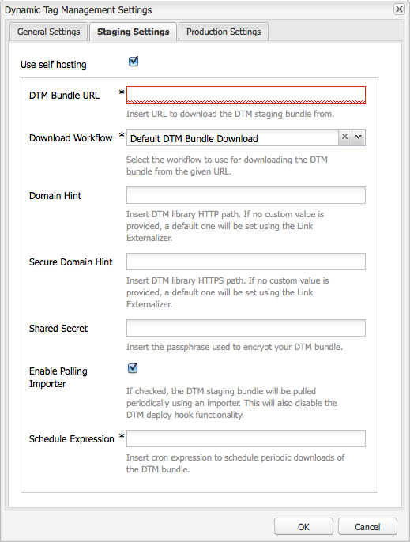
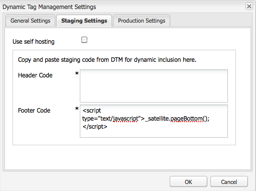
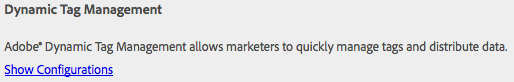
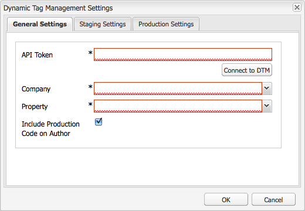
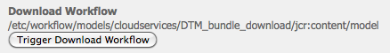
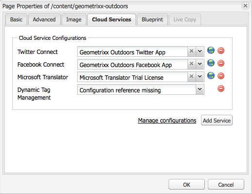
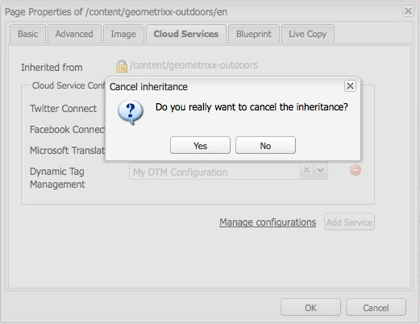

# Integrating with Adobe Dynamic Tag Management {#integrating-with-adobe-dynamic-tag-management}

Integrate [Adobe Dynamic Tag Management](https://business.adobe.com/products/experience-platform/adobe-experience-platform.html) with AEM so that you can use your Dynamic Tag Management web properties to track AEM sites. Dynamic Tag Management enables marketers to manage tags for collecting data, and distribute data across digital marketing systems. For example, use Dynamic Tag Management to collect usage data for your AEM website and distribute the data for analysis in Adobe Analytics or Adobe Target.

Before you integrate, create the Dynamic Tag Management [web property](https://microsite.omniture.com/t2/help/en_US/dtm/#Web_Properties) that tracks the domain of your AEM site. The [hosting options](https://microsite.omniture.com/t2/help/en_US/dtm/#Hosting__Embed_Tab) of the web property must be configured so that you can configure AEM to access the Dynamic Tag Management libraries.

After you configure the integration, changes to Dynamic Tag Management deployment tools and rules do not require you to change the Dynamic Tag Management configuration in AEM. The changes are automatically available to AEM.

>[!NOTE]
>
>If you are using DTM with a custom proxy configuration, configure both HTTP Client proxy configurations as some functionalities of AEM are using the 3.x APIs and some others the 4.x APIs:
>
>* 3.x is configured with [http://localhost:4502/system/console/configMgr/com.day.commons.httpclient](http://localhost:4502/system/console/configMgr/com.day.commons.httpclient)
>* 4.x is configured with [http://localhost:4502/system/console/configMgr/org.apache.http.proxyconfigurator](http://localhost:4502/system/console/configMgr/org.apache.http.proxyconfigurator)
>

## Deployment Options {#deployment-options}

The following deployment options affect the configuration of the integration with Dynamic Tag Management.

### Dynamic Tag Management Hosting {#dynamic-tag-management-hosting}

AEM supports Dynamic Tag Management that is hosted in the cloud or hosted on AEM.

* Cloud-hosted: The Dynamic Tag Management JavaScript libraries are stored in the cloud, and your AEM pages reference them directly.
* AEM-hosted: Dynamic Tag Management generates JavaScript libraries. AEM uses a workflow model to obtain and install the libraries.

The type of hosting that your implementation uses determines some of the configuration and implementation tasks that you perform. For information about the hosting options, see [Hosting - Embed Tab](https://microsite.omniture.com/t2/help/en_US/dtm/#Hosting__Embed_Tab) in Dynamic Tag Management Help.

### Staging and Production Library {#staging-and-production-library}

Decide whether your AEM author instance uses the Dynamic Tag Management staging or production code.

Typically your author instance uses the Dynamic Tag Management staging libraries, and the production instance uses the production libraries. This scenario enables you to use the author instance to test unapproved Dynamic Tag Management configurations.

If desired, your author instance can use the production libraries. Web browser plugins are available that enable you to switch between the use of staging libraries for testing purposes when the libraries are cloud-hosted.

### Using the Dynamic Tag Management Deployment Hook {#using-the-dynamic-tag-management-deployment-hook}

When AEM hosts the Dynamic Tag Management libraries, you can use the Dynamic Tag Management deployment hook service to automatically push library updates to AEM. Library updates are pushed when changes are made to the libraries such as when the Dynamic Tag Management web property properties are edited.

To use the deployment hook, Dynamic Tag Management must be able to connect to the AEM instance that hosts the libraries. [Enable access to AEM](/help/sites-administering/dtm.md#enabling-access-for-the-deployment-hook-service) for the Dynamic Tag Management servers.

In some circumstances AEM can be unreachable, such as when AEM lies behind a firewall. In these cases, you can use the AEM polling importer option to periodically retrieve the libraries. A cron job expression dictates the schedule for library downloads.

## Enabling Access for the Deployment Hook Service {#enabling-access-for-the-deployment-hook-service}

Enable the Dynamic Tag Management deployment hook service to access AEM so that the service can update the AEM-hosted libraries. SpecifytheIP address of Dynamic Tag Management servers that update the staging and production libraries as required:

* Staging: `107.21.99.31`
* Production: `23.23.225.112` and `204.236.240.48`

Perform the configuration using either the [Web Console](/help/sites-deploying/configuring-osgi.md#osgi-configuration-with-the-web-console) or a [`sling:OsgiConfig`](/help/sites-deploying/configuring-osgi.md#osgi-configuration-in-the-repository) node:

* In the Web Console, use the Adobe DTM Deploy Hook Configuration item on the Configuration page.
* For an OSGi configuration, the service PID is `com.adobe.cq.dtm.impl.servlets.DTMDeployHookServlet`.

The following table describes the properties to configure.

| Web Console property |OSGi property |Description |
|---|---|---|
| Staging DTM IP White List | `dtm.staging.ip.whitelist` |The IP address of the Dynamic Tag Management server that updates the staging libraries. |
| Production DTM IP White List | `dtm.production.ip.whitelist` |The IP address of the Dynamic Tag Management server that updates the production libraries. |

## Creating the Dynamic Tag Management Configuration {#creating-the-dynamic-tag-management-configuration}

Create a cloud configuration so that the AEM instance can authenticate with Dynamic Tag Management and interact with your web property.

>[!NOTE]
>
>Avoid the inclusion of two Adobe Analytics tracking codes on your pages when your DTM web property includes the Adobe Analytics tool and you are also using [Content Insight](/help/sites-authoring/content-insights.md). In your [Adobe Analytics Cloud configuration](/help/sites-administering/adobeanalytics-connect.md#configuring-the-connection-to-adobe-analytics), select the Do Not Include Tracking Code option.

### General Settings {#general-settings}

<table>
 <tbody>
  <tr>
   <th>Property</th>
   <th>Description</th>
  </tr>
  <tr>
   <td>API Token</td>
   <td>The value of the API Token property of your Dynamic Tag Management user account. AEM uses this property to authenticate with Dynamic Tag Management.</td>
  </tr>
  <tr>
   <td>Company</td>
   <td>The company with which your login ID is associated.</td>
  </tr>
  <tr>
   <td>Property</td>
   <td>The name of the Web Property that you created for managing the tags for your AEM site.</td>
  </tr>
  <tr>
   <td>Include Production Code on Author</td>
   <td>
Select this option so you cause the AEM author and publish instances to use the production version of the Dynamic Tag Management libraries. 
 
When this option is not selected, the Staging Settings apply to the author instance, and the Production Settings apply to the publish instance.
 </td>
  </tr>
 </tbody>
</table>

### Self Hosting Properties - Staging and Production {#self-hosting-properties-staging-and-production}

The following properties of the Dynamic Tag Management configuration enable AEM to host the Dynamic Tag Management libraries. The properties enable AEM to download and install the libraries. Optionally, you can automatically update the libraries to ensure they reflect any changes made in the Dynamic Tag Management management application.

Some properties use values that you obtain from the Library Download section of the Embed tab for your Dynamic Tag Management web property. For information, see [Library Download](https://microsite.omniture.com/t2/help/en_US/dtm/#Library_Download) in Dynamic Tag Management Help.

>[!NOTE]
>
>When you are hosting the Dynamic Tag Management bundle on AEM, Library Download must be enabled in Dynamic Tag Management before you create the configuration. Also, Akamai must be enabled because Akamai provides the libraries for downloading.

When hosting the Dynamic Tag Management libraries on AEM, AEM automatically configures some properties of the web property according to your configuration. See the descriptions in the following table.

<table>
 <tbody>
  <tr>
   <th>Property</th>
   <th>Description</th>
  </tr>
  <tr>
   <td>Use Self Hosting</td>
   <td>Select when you are hosting the Dynamic Tag Management library file on AEM. Selecting this option causes the other properties in this table to appear.</td>
  </tr>
  <tr>
   <td>DTM Bundle URL</td>
   <td>The URL to use for downloading the Dynamic Tag Management library. Obtain this value from the Download URLs section of the Library Download page of Dynamic Tag Management. For security reasons, this value must be configured manually.</td>
  </tr>
  <tr>
   <td>Download Workflow</td>
   <td>
The workflow model to use for downloading and installing the Dynamic Tag Management library. The default model is Default DTM Bundle Download. Use this model unless you have created a custom model.
 
The default download workflow automatically activates the libraries when they are downloaded.
 </td>
  </tr>
  <tr>
   <td>Domain Hint</td>
   <td>
(Optional) The domain of the AEM server that is hosting the Dynamic Tag Management library. Specify a value so you can override the default domain that is configured for the <a href="/help/sites-developing/externalizer.md">Day CQ Link Externalizer service</a>.
 
When connected to Dynamic Tag Management, AEM uses this value to configure the Staging HTTP Path or the Production HTTP Path of the Library Download properties for the Dynamic Tag Management web property.
 </td>
  </tr>
  <tr>
   <td>Secure Domain Hint</td>
   <td>
(Optional) The domain of the AEM server that is hosting the Dynamic Tag Management library over HTTPS. Specify a value so you can override the default domain that is configured for the <a href="/help/sites-developing/externalizer.md">Day CQ Link Externalizer service</a>.
 
When connected to Dynamic Tag Management, AEM uses this value to configure the Staging HTTPS Path or the Production HTTPS Path of the Library Download properties for the Dynamic Tag Management web property.
 </td>
  </tr>
  <tr>
   <td>Shared Secret</td>
   <td>
(Optional) The shared secret to use for decrypting the download. Obtain this value from the Shared Secret field of the Library Download page of Dynamic Tag Management.
 
<strong>Note:</strong> You must have the OpenSSL libraries installed on the computer where AEM is installed so that AEM can decrypt the downloaded libraries.
 </td>
  </tr>
  <tr>
   <td>Enable Polling Importer</td>
   <td>
(Optional) Select to periodically download and install the Dynamic Tag Management library to ensure you are using an updated version. When selected, Dynamic Tag Management does not send HTTP POST requests to the Deploy Hook URL.
 
AEM automatically configures the Deploy Hook URL property of the Library Download properties for the Dynamic Tag Management web property. When selected, the property is configured with no value. When not selected, the property is configured with the URL of your Dynamic Tag Management configuration.
 
Enable polling importer when the Dynamic Tag Management deploy hook cannot connect to AEM, for example, when AEM is behind a firewall.
 </td>
  </tr>
  <tr>
   <td>Schedule Expression</td>
   <td>(Appears and is required when Enable Polling Importer is selected.) A cron expression that controls when the Dynamic Tag management libraries are downloaded.</td>
  </tr>
 </tbody>
</table>

### Cloud Hosting Properties - Staging and Production {#cloud-hosting-properties-staging-and-production}

You configure the following properties for your Dynamic Tag Management configuration when Dynamic Tag Configuration is cloud-hosted.

<table>
 <tbody>
  <tr>
   <th>Property</th>
   <th>Description</th>
  </tr>
  <tr>
   <td>Use Self Hosting</td>
   <td>Clear this option when the Dynamic Tag Management library file is hosted in the cloud.</td>
  </tr>
  <tr>
   <td>Header Code</td>
   <td>
The header code for staging that is obtained from Dynamic Tag Management for your host. This value is populated automatically when you connect to Dynamic Tag Management.
 
 To see the code in Dynamic Tag Management, click the Embed tab, then click the host name. Expand the Header Code section and click the Copy Embed Code of the Staging Embed Code or the Production Embed Code area as required.
 </td>
  </tr>
  <tr>
   <td>Footer Code</td>
   <td>
The footer code for staging that is obtained from Dynamic Tag Management for your host. This value is populated automatically when you connect to Dynamic Tag Management.
 
To see the code in Dynamic Tag Management, click the Embed tab, then click the host name. Expand the Footer Code section and click the Copy Embed Code of the Staging Embed Code or the Production Embed Code area as required.
 </td>
  </tr>
 </tbody>
</table>

The following procedure uses the touch-optimized UI to configure the integration with Dynamic Tag Management.

1. On the rail, click Tools &gt; Operations &gt; Cloud &gt; Cloud Services.
1. In the Dynamic Tag Management area, one of the following links appears for adding a configuration:

    * Click Configure Now if this is the first configuration that you are adding.
    * Click Show Configurations and then click the + link beside Available Configurations if one or more configurations have been created.

   

1. Type a title for the configuration and then click Create.
1. In the API Token field, enter the value of the API Token property of your Dynamic Tag Management user account.

   To obtain the value of your API Token contact DTM Client Care.

   >[!NOTE]
   >
   >The API token does not expire until the Dynamic Tag Management user explicitly requests it.

   

1. Click Connect to DTM. AEM authenticates with Dynamic Tag Management and retrieves the list of companies that your account is associated with.
1. Select the Company, and then select the Property that you are using to track your AEM site.
1. If you are using staging code on the author instance, deselect Include Production Code On Author.
1. Provide values for the properties on the Staging Settings tab and the Production Settings tab if needed, and then click OK.

## Manually Downloading the Dynamic Tag Management Library {#manually-downloading-the-dynamic-tag-management-library}

Manually download the Dynamic Tag Management libraries to immediately update them on AEM. For example, manually download when you want to test an updated library before the polling importer is scheduled to automatically download the library.

1. On the rail, click Tools &gt; Operations &gt; Cloud &gt; Cloud Services.
1. In the Dynamic Tag Management area, click Show Configurations and then click your configuration.
1. In either the Staging Settings area or the Production Settings area, click the Trigger Download Workflow button to download and deploy the library bundle.

   

>[!NOTE]
>
>The downloaded files are stored under `/etc/clientlibs/dtm/my config/companyID/propertyID/servertype`.
>
>The following are taken directly from your [DTM configuration](#creating-the-dynamic-tag-management-configuration).
>
>* `myconfig`
>* `companyID`
>* `propertyID`
>* `servertype`
>

## Associating a Dynamic Tag Management Configuration With Your Site {#associating-a-dynamic-tag-management-configuration-with-your-site}

Associate your Dynamic Tag Management configuration with the pages of your web site so that AEM adds the required script to the pages. Associate the root page of your site with the configuration. All descendants of that page inherit the association. If necessary, you can override the association on a descendant page.

Use the following procedure to associate a page and the descendants with a Dynamic Tag Management configuration.

1. Open the root page of your site in the classic UI.
1. Use Sidekick to open the page properties.
1. On the Cloud Services tab, click Add Service, select Dynamic Tag Management, and then click OK.

   

1. Use the Dynamic Tag Management drop-down menu to select your configuration, and then click OK.

Use the following procedure to override the inherited configuration association for a page. The override affects the page and all the page descendants.

1. Open the page in the classic UI.
1. Use Sidekick to open the page properties.
1. On the Cloud Services tab, click the padlock icon next to the Inherited From property, then click Yes in the confirmation dialog box.

   

1. Remove or select a different Dynamic Tag Management configuration, and then click OK.
