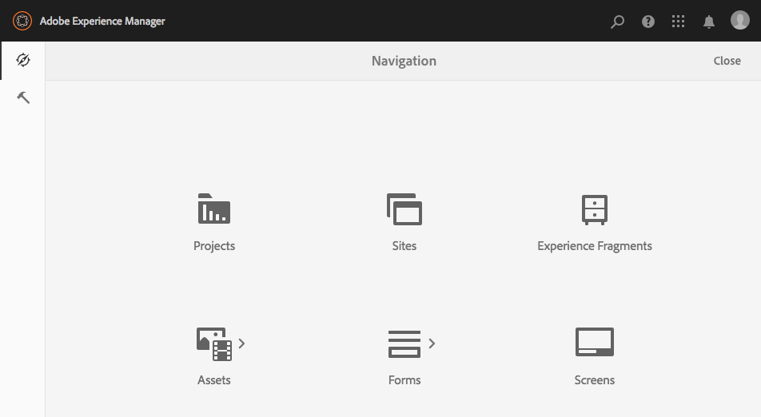

# Admin Consoles{#admin-consoles}

By default, the ability to switch to the classic UI via the admin consoles has been disabled. Therefore the pop-up icons that was seen when mousing over certain console icons, allowing access to classic UI, are no longer displayed.

Every console that has a Classic UI version in `/libs/cq/core/content/nav` can be re-enabled individually so that the **Classic UI** option once again pops up over the console icon when it is moused over.

In this example, we are re-enabling the Classic UI for the Sites console.

1. Using CRXDE Lite, find the node corresponding the the admin console for which you want to re-enable Classic UI. They are found under:

   `/libs/cq/core/content/nav`

   For example

   [ `http://localhost:4502/crx/de/index.jsp#/libs/cq/core/content/nav`](http://localhost:4502/crx/de/index.jsp#/libs/cq/core/content/nav)

1. Select the node corresponding to the console for which you want to re-enable Classic UI. For our example, we will re-enable classic UI for the Sites console.

   `/libs/cq/core/content/nav/sites`

1. Create an overlay using the **Overlay Node** option; for example:

   *  **Path**: `/apps/cq/core/content/nav/sites`
   * **Overlay Location**: `/apps/`
   * **Match Node Types**: active (select the checkbox)
 
1. Add the following boolean property to the overlaid node:

   `enableDesktopOnly = {Boolean}true`

1. The **Classic UI** option is again available as a popover option in the admin console.

   

Repeat these steps for every console for which you wish to re-enable access to the Classic UI version.
