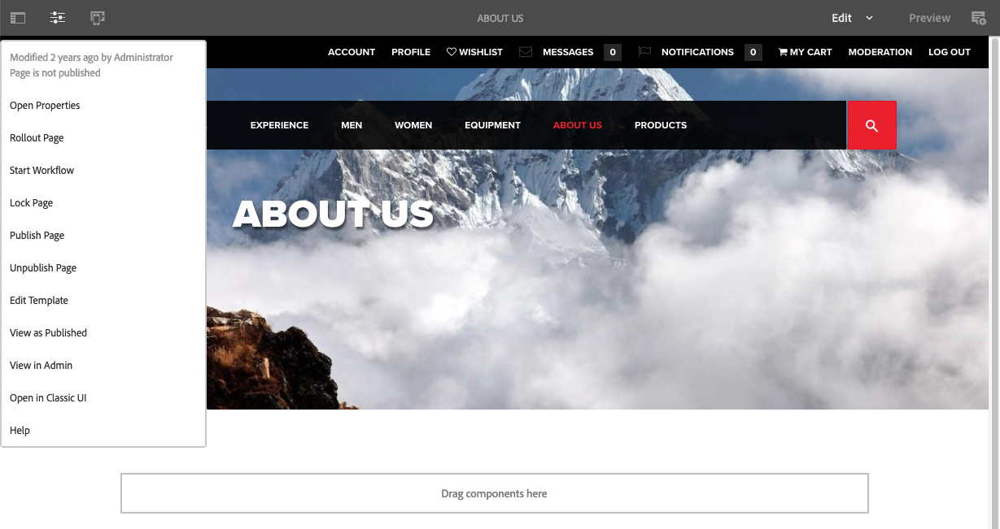

# Editor{#editor}

By default, the ability to switch to the classic UI from the editor has been disabled.

To re-enable the option **Open in Classic UI** in the **Page Information** menu, follow these steps.

1. Using CRXDE Lite, find the following node:

   `/libs/wcm/core/content/editor/jcr:content/content/items/content/header/items/headerbar/items/pageinfopopover/items/list/items/classicui`

   For example

   ` [https://localhost:4502/crx/de/index.jsp#/libs/wcm/core/content/editor/jcr%3Acontent/content/items/content/header/items/headerbar/items/pageinfopopover/items/list/items/classicui](https://localhost:4502/crx/de/index.jsp#/libs/wcm/core/content/editor/jcr%3Acontent/content/items/content/header/items/headerbar/items/pageinfopopover/items/list/items/classicui)`

1. Create an overlay using the **Overlay Node** option; for example:

    * **Path**: `/apps/wcm/core/content/editor/jcr:content/content/items/content/header/items/headerbar/items/pageinfopopover/items/list/items/classicui`
    * **Overlay Location**: `/apps/`
    * **Match Node Types**: active (select the checkbox)

1. Add the following multi-value text property to the overlaid node:

   `sling:hideProperties = ["granite:hidden"]`

1. The **Open in Classic UI** option is again available in the **Page Information** menu when editing pages.

   
