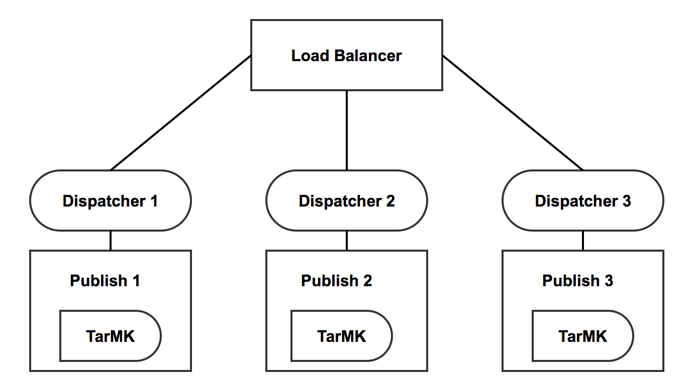
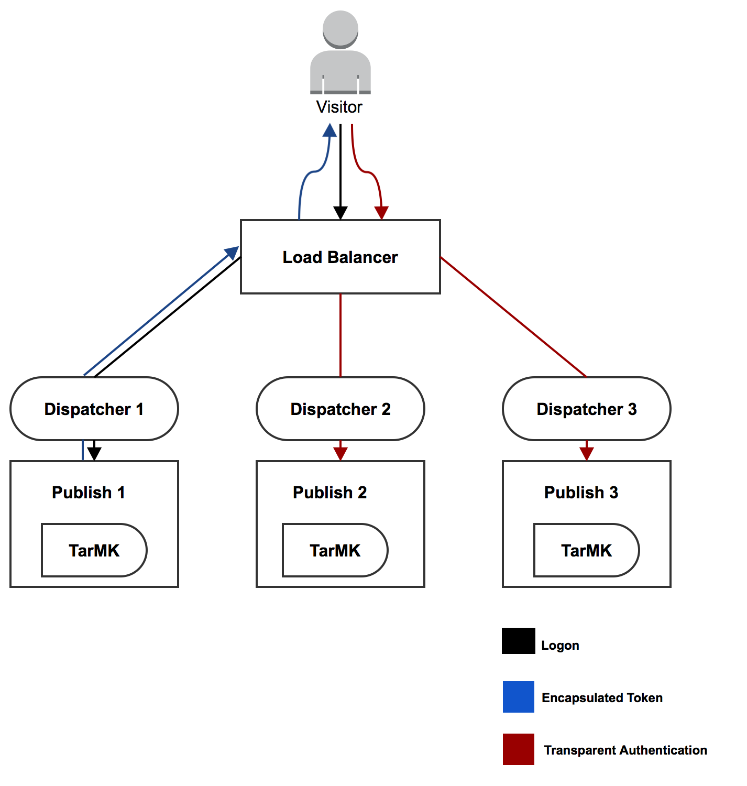

# Encapsulated Token Support{#encapsulated-token-support}

## Introduction {#introduction}

By default, AEM uses the Token Authentication Handler to authenticate each request. However, to serve authentication requests the Token Authentication Handler requires access to the repository for every request. This happens because cookies are used to maintain the authentication state. Logically, the state needs to be persisted in the repository to validate subsequent requests. In effect, this means that the authentication mechanism is stateful.

This is of particular importance for horizontal scalability. In a multi-instances setup like the publish farm depicted below, load balancing cannot be achieved in an optimal manner. With stateful authentication, the persisted authentication state will only be available on the instance where the user is first authenticated.

Take the following scenario as an example:

A user may be authenticated on publish instance one, but if a subsequent request goes to publish instance two, that instance does not have that persisted authentication state, because that state was persisted in the repository of publish one and publish two has its own repository.

The solution for this is to configure sticky connections at the load balancer level. With sticky connections a user would always be directed to the same publish instance. As a consequence, truly optimal load balancing is not possible.

In case a publish instance becomes unavailable, all the users authenticated on that instance will lose their session. This is because repository access is needed to validate the authentication cookie.

## Stateless Authentication with the Encapsulated Token {#stateless-authentication-with-the-encapsulated-token}

The solution for horizontal scalability is stateless authentication with the use of the new Encapsulated Token support in AEM.

The Encapsulated Token is a piece of cryptography that allows AEM to securely create and validate authentication information offline, without accessing the repository. This way, an authentication request can happen on all the publish instances and with no need for sticky connections. It also has the advantage of improving authentication performance because the repository does not need to be accessed for every authentication request.

You can see how this works in a geographically distributed deployment with MongoMK authors and TarMK publish instances below:

>[!NOTE]
>
>The Encapsulated Token is about authentication. It ensures that the cookie can be validated without having to access the repository. However, it is still required that the user exists on all the instances and that the information stored under that user can be accessed by every instance.
>
>For example, if a new user is created on publish instance number one, due to the way the Encapsulated Token works, it will be authenticated successfully on publish number two. If the user does not exist on the second publish instance, the request will still not be successful.
>

## Configuring the Encapsulated Token {#configuring-the-encapsulated-token}

>[!NOTE]
>All authentication handlers that synchronize users and rely on token authentication (like SAML & OAuth) will only work with encapsulated tokens if:
>
>* Sticky sessions are enabled, or
>
>* Users are already created in AEM when the synchronization starts. This means that encapsulated tokens will not be supported in situations where the handlers **create** users during the sync process.

There are a few things you need to take into consideration when configuring the Encapsulated Token:

1. Because of the cryptography involved, all the instances need to have the same HMAC key. Since AEM 6.3, the key material is no longer stored in the repository, but on the actual filesystem. With this in mind, the best way to replicate the keys is to copy them from the filesystem of the source instance to that of the target instance(s) you want to replicate the keys to. See more info under "Replicating the HMAC key" below.
1. The Encapsulated Token needs to be enabled. This can be done through the Web Console.

### Replicating the HMAC key {#replicating-the-hmac-key}

To replicate the key across instances, you need to:

1. Access the AEM instance, typically an author instance, that contains the key material to copy;
1. Locate the `com.adobe.granite.crypto.file` bundle in the local file system. For example, under this path:

    * `<author-aem-install-dir>/crx-quickstart/launchpad/felix/bundle25`

   The `bundle.info` file inside each folder will identify the bundle name.

1. Navigate to the data folder. For example:

    * `<author-aem-install-dir>/crx-quickstart/launchpad/felix/bundle25/data`

1. Copy the HMAC and master files.
1. Then, go to the target instance you want to duplicate the HMAC key to, and navigate to the data folder. For example:

    * `<publish-aem-install-dir>/crx-quickstart/launchpad/felix/bundle25/data`

1. Paste the two files you previously copied.
1. [Refresh the Crypto Bundle](/help/communities/deploy-communities.md#refresh-the-granite-crypto-bundle) if the target instance is already running.

1. Repeat the above steps for all instances you want to replicate the key to.

#### Enabling the Encapsulated Token {#enabling-the-encapsulated-token}

Once the HMAC key has been replicated, you can enable the Encapsulated Token via the Web Console:

1. Point your browser to `https://serveraddress:port/system/console/configMgr`
1. Look for an entry called **Adobe Granite Token Authentication Handler** and click it.
1. In the following window, tick the **Enable encapsulated token support** box and press **Save**.
