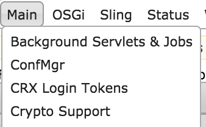
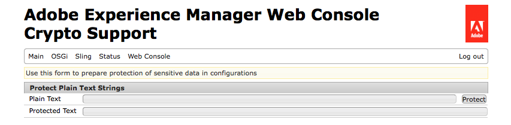
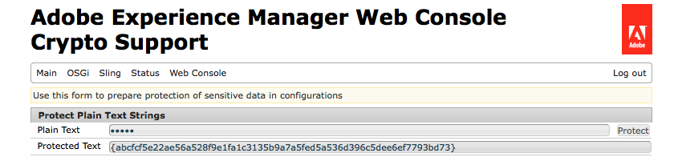
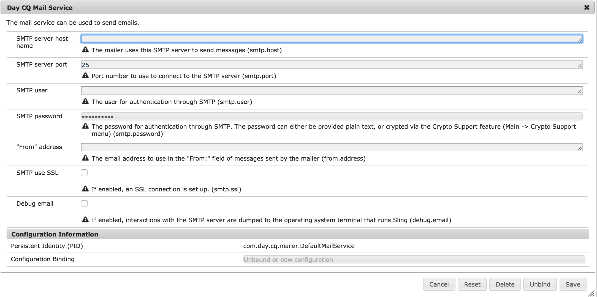

# Encryption Support for Configuration Properties{#encryption-support-for-configuration-properties}

## Overview {#overview}

This feature allows all OSGi configuration properties to be stored in a protected encrypted form instead of clear text. The form intheWeb Console UI is used to create encrypted text from clear text using the system wide encryption master key.

OSGi Configuration Plugin support was added to decrypt the property before it is used by a service.

>[!NOTE]
>
>Services that expect an encrypted value need to use the IsProtected check to see if the value is encrypted before trying to decrypt it, as it may already have been decrypted.

## Enabling Encryption Support {#enabling-encryption-support}

These steps show how to encrypt the SMTP password for the Mail service. You can complete these steps for an OSGI property you want encrypted.

1. Go to the AEM Web Console at *https://&lt;serveraddress&gt;:&lt;serverport&gt;/system/console/configMgr*
1. In the upper left corner, go to **Main - Crypto Support**

   

1. The **Adobe Experience Manager Web Console Crypto Support** page is displayed.

   

1. In the **Plain Text** field, enter the text of the sensitive data you want to protect.
1. Select **Protect**. The Protected text is displayed as encrypted text.

   

1. Copy the Protected Text from Step#5 and paste it into OSGI Form value. In this example, the ecrypted **SMTP password** is added to the *Day CQ Mail Service*.

   

1. Save the Day CQ Mail Service properties. The SMTP password will now be sent as an encrypted value.

## Decryption Support {#decryption-support}

AEM now provides a Configuration Plugin to decrypt configuration properties. This AEM Plugin will automatically decrypt and retrieve the clear text properties.
