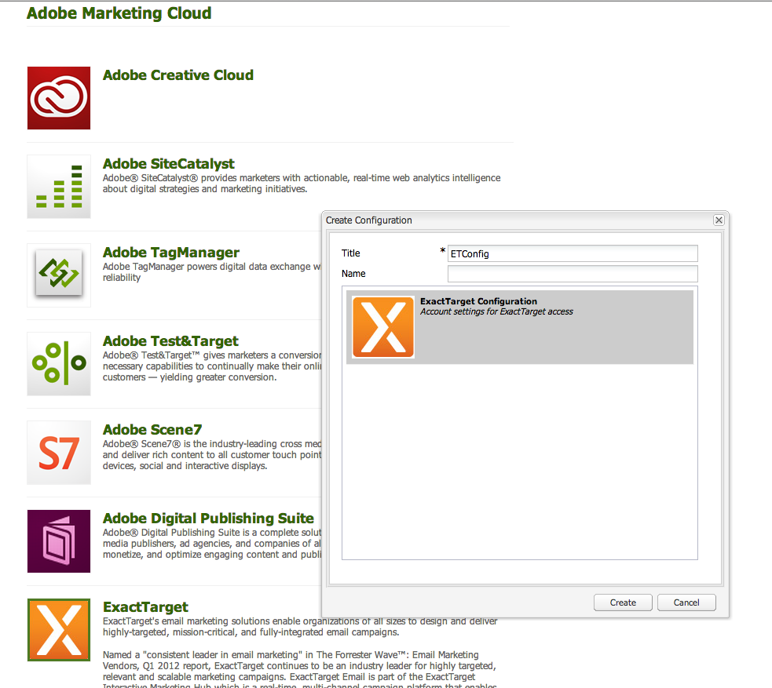
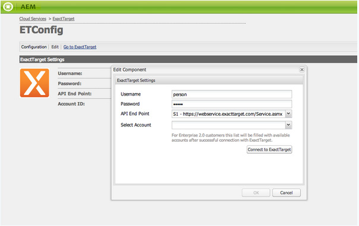
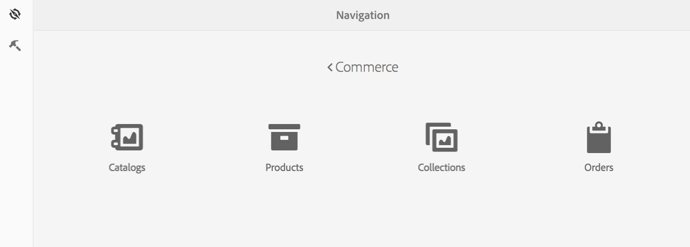
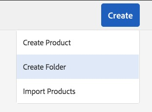

# Integrating with ExactTarget{#integrating-with-exacttarget}

Integrating AEM with Exact Target lets you manage and send email created in AEM via Exact Target. It also allows you to use the lead management features of Exact Target via AEM forms on AEM pages.

The integration provides you with the following features:

* The ability to create Emails in AEM and publish them to Exact Target for distribution.
* The ability to set action of a AEM form to create an Exact Target subscriber.

After ExactTarget is configured, you can publish newsletters or emails to ExactTarget. See [Publishing Newsletters to an Email Service](/help/sites-authoring/personalization.md).

## Creating an ExactTarget Configuration {#creating-an-exacttarget-configuration}

ExactTarget configurations can be added via Cloudservices or Tools. Both methods are described in this section.

### Configuring ExactTarget via Cloudservices {#configuring-exacttarget-via-cloudservices}

To create an ExactTarget configuration in Cloud Services:

1. On the welcome page, click **Cloud Services**. (Or directly access at `https://<hostname>:<port>/etc/cloudservices.html`.)
1. Click **ExactTarget** and then **Configure**. The ExactTarget configuration window opens.

   

1. Enter a title and optionally, a name and click **Create**. The **ExactTarget Settings** configuration window opens.

   

1. Enter the username, password and select an API endpoint (for example, **https://webservice.exacttarget.com/Service.asmx**).
1. Click **Connect to ExactTarget.** When you have successfully connected you see a success dialog. Click **OK** to exit the window.

   

1. Select an account, if available. The account is for Enterprise 2.0 customers. Click **OK**.

   ExactTarget has been configured. You can edit the configuration by clicking **Edit**. You can go to ExactTarget by clicking **Go to ExactTarget**.

1. AEM now provides a Data Extension feature. You can import ExactTarget data extension columns. It can be configured by clicking "+" sign appearing besides successfully created ExactTarget configuration. Any of the existing data extension can be selected from the drop-down list. For more information on how to configure data extensions, see [ExactTarget documentation](https://help.salesforce.com/s/articleView?id=sf.mc_es_data_extension_data_relationships_classic.htm&type=5).

   Imported data extension columns can later be used through the **Text and Personalization** component.

   

### Configuring ExactTarget via Tools {#configuring-exacttarget-via-tools}

To create an ExactTarget configuration in Tools:

1. On the welcome page, click **Tools**. Or navigate there directly by going to `https://<hostname>:<port>/misadmin#/etc`.
1. Select **Tools**, then **Cloud Services Configurations,** then **ExactTarget**.
1. Click **New** to open the **Create Page **window.

   

1. Enter the **Title** and optionally the **Name**, and click **Create**.
1. Enter the configuration information as outlined in step 4 in the previous procedure. Follow that procedure to finish configuring ExactTarget.

### Adding multiple configurations {#adding-multiple-configurations}

To add multiple configurations:

1. On the welcome page, click **Cloud Services** and click **ExactTarget**. Click on **Show Configurations** button which appears if one or more ExactTarget configurations is available. All available configurations are listed.
1. Click the **+** sign next to Available configurations. This opens the **Create Configurations** window. Follow the previous configuration procedure to create a new configuration.
