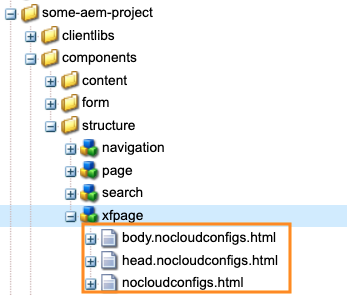
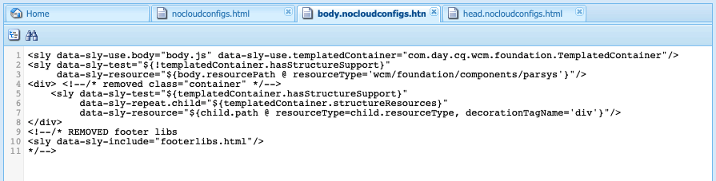
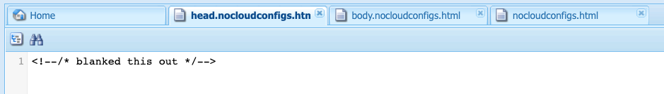
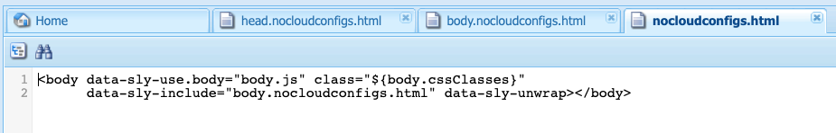

# Exporting Experience Fragments to Adobe Target{#exporting-experience-fragments-to-adobe-target}

You can export [Experience Fragments](/help/sites-authoring/experience-fragments.md), created in Adobe Experience Manager (AEM), to Adobe Target (Target). They can then be used as offers in Target activities, to test, and personalize experiences at scale.

There are three format options available for exporting an Experience Fragment to Adobe Target:

* HTML (default): Support for web and hybrid content delivery
* JSON: Support for headless content delivery
* HTML & JSON

AEM Experience Fragments can be exported to the default workspace in Adobe Target, or to user-defined workspaces for Adobe Target. This is done using the Adobe Developer Console, for which AEM must be [integrated with Adobe Target using IMS](/help/sites-administering/setting-up-ims-integrations-for-aem.md).

>[!NOTE]
>
>[IMS integrations are now configured with S2S OAuth](/help/sites-administering/setting-up-ims-integrations-for-aem.md). 
>
>Previous configurations were made with [JWT Credentials that are now subject to deprecation in the Adobe Developer Console](/help/sites-administering/jwt-credentials-deprecation-in-adobe-developer-console.md). 

>[!NOTE]
>
>The Adobe Target workspaces do not exist in Adobe Target itself. They are defined and managed in Adobe IMS (Identity Management System), then selected for usage across solutions using integrations from the Adobe Developer Console.

>[!NOTE]
>
>Adobe Target workspaces can be used to allow members of an organization (group) to create and manage offers and activities for this organization only; without giving access to other users. For example, country-specific organizations within a global concern.

>[!NOTE]
>
>For further information see also:
>
>* [Adobe Target development](https://developers.adobetarget.com/)
>* [Core Components - Experience Fragments](https://experienceleague.adobe.com/docs/experience-manager-core-components/using/wcm-components/experience-fragment.html)
>

## Prerequisites {#prerequisites}

Various actions are required:

1. You have to [integrate AEM with Adobe Target using IMS](/help/sites-administering/setting-up-ims-integrations-for-aem.md).

   >[!NOTE]
   >
   >[IMS integrations are now configured with S2S OAut](/help/sites-administering/setting-up-ims-integrations-for-aem.md). 
   >
   >Previous configurations were made with [JWT Credentials that are now subject to deprecation in the Adobe Developer Console](/help/sites-administering/jwt-credentials-deprecation-in-adobe-developer-console.md). 

1. Experience Fragments are exported from the AEM author instance, so you must [Configure the AEM Link Externalizer](/help/sites-administering/target-requirements.md#configuring-the-aem-link-externalizer) on the author instance to ensure that any references within the Experience Fragment are externalized for web delivery.

   >[!NOTE]
   >
   >For link rewriting not covered by the default, the [Experience Fragment Link Rewriter Provider](/help/sites-developing/experience-fragments.md#the-experience-fragment-link-rewriter-provider-html) is available. With this, customized rules can be developed for your instance.

## Add the Cloud Configuration {#add-the-cloud-configuration}

Before exporting a fragment, you must add the **Cloud Configuration** for **Adobe Target** to the fragment, or folder. This also enables you to:

* specify the format options to be used for the export
* select a Target workspace as destination
* select an Externalizer domain for rewriting references in the Experience Fragment (optional)

The required options can be selected in **Page Properties** of the required folder and/or fragment; the specification will be inherited as necessary.

1. Navigate to the **Experience Fragments** console.

1. Open **Page Properties** for the appropriate folder or fragment.

   >[!NOTE]
   >
   >If you add the cloud configuration to the Experience Fragment parent folder, the configuration is inherited by all the children.
   >
   >
   >If you add the cloud configuration to the Experience Fragment itself, the configuration is inherited by all variations.

1. Select the **Cloud Services** tab.

1. Under **Cloud Service Configuration**, select **Adobe Target** from the drop-down list.

   >[!NOTE]
   >
   >The JSON format of an Experience Fragment offer can be customized. To do this, define a customer Experience Fragment component and then annotate how to export its properties in the component Sling Model.
   >
   >See the core component:
   >
   >[Core Components - Experience Fragments](https://experienceleague.adobe.com/docs/experience-manager-core-components/using/wcm-components/experience-fragment.html)

   Under **Adobe Target** select:

    * the appropriate configuration
    * the required format option
    * an Adobe Target workspace
    * if necessary - the Externalizer domain

   >[!CAUTION]
   >
   >The Externalizer domain is optional. 
   >
   >An AEM Externalizer is configured when you want the exported content to point to a specific *publish* domain. For more details, see [Configuring the AEM Link Externalizer](/help/sites-administering/target-requirements.md#configuring-the-aem-link-externalizer).
   >
   >Also note that Externalizer Domains are only relevant to the content of the Experience Fragment that is sent to Target, and not metadata such as View Offer Content.

   For example, for a folder:

   

1. **Save & Close**.

## Exporting an Experience Fragment to Adobe Target {#exporting-an-experience-fragment-to-adobe-target}

>[!CAUTION]
>
>For media assets, such as images, only a reference is exported to Target. The asset itself remains stored in AEM Assets and is delivered from the AEM publish instance.
>
>Due to this, the Experience Fragment, with all related assets, must be published before exporting to Target.

To export an Experience Fragment from AEM to Target (after specifying the Cloud Configuration):

1. Navigate to the Experience Fragment console.
1. Select the Experience Fragment you would like to export to target.

   >[!NOTE]
   >
   >It has to be an Experience Fragment Web variation.

1. Click **Export to Adobe Target**.

   >[!NOTE]
   >
   >If the Experience Fragment has already been exported, select **Update in Adobe Target**.

1. Click **Export without publishing** or **Publish** as required.

   >[!NOTE]
   >
   >Selecting **Publish** publishes the Experience Fragment right away and send it to Target.

1. Click **OK** in the confirmation dialog.

   Your Experience Fragment should now be in Target.

   >[!NOTE]
   >
   >[Various details](/help/sites-authoring/experience-fragments.md#details-of-your-experience-fragment) of the export can be seen in **List View** of the console and **Properties**.

   >[!NOTE]
   >
   >When viewing an Experience Fragment in Adobe Target, the *last modified* date that is seen is the date that the fragment was last modified in AEM, not the date that the fragment was last exported to Adobe Target.

>[!NOTE]
>
>Alternatively, you can perform the export from the page editor, using comparable commands in the [Page Information](/help/sites-authoring/author-environment-tools.md#page-information) menu.

## Using your Experience Fragments in Adobe Target {#using-your-experience-fragments-in-adobe-target}

After performing the preceding tasks, the Experience Fragment displays on the Offers page in Adobe Target. Look at the [specific Target documentation](https://experienceleague.adobe.com/docs/target/using/experiences/offers/aem-experience-fragments.html) to learn about what you can achieve there.

>[!NOTE]
>
>When viewing an Experience Fragment in Adobe Target, the *last modified* date that is seen is the date that the fragment was last modified in AEM, not the date that the fragment was last exported to Adobe Target.

## Deleting an Experience Fragment already exported to Adobe Target {#deleting-an-experience-fragment-already-exported-to-adobe-target}

Deleting an Experience Fragment that has already been exported to Target may cause problems if the fragment is already being used in an offer in Adobe Target. Deleting the fragment would render the offer unusable as the fragment content is being delivered by AEM.

To avoid such situations:

* If the Experience Fragment is not being currently used in an activity, AEM allows the user to delete the fragment without a warning message.
* If the Experience Fragment is in use by an activity in Adobe Target, an error message warns the AEM user about possible consequences that deleting the fragment will have on the activity.

  The error message in AEM does not prohibit the user from (force-)deleting the Experience Fragment. If the Experience Fragment is deleted:

  * The Target offer with AEM Experience Fragment may show undesired behavior

    * The offer will likely still render, as the Experience Fragment HTML was pushed to Target
    * Any references in the Experience Fragment may not work correctly if referenced assets were deleted in AEM as well.

  * Any further modifications to the Experience Fragment are impossible as the Experience Fragment does not exist anymore in AEM.


## Removing ClientLibs from Experience Fragments exported to Target {#removing-clientlibs-from-fragments-exported-target}

Experience Fragments contain full html tags and all the necessary Client Libraries (CSS/JS) to render the fragment exactly as it was created by the Experience Fragment Content Author. This is by-design.

When using an Experience Fragment Offer with Adobe Target on a page that is being delivered by AEM, the Targeted page already contains all the necessary Client Libraries. In addition, the extraneous html in the Experience Fragment Offer is not needed either (see [Considerations](#considerations)). 

The following is a pseudo-example of the html in an Experience Fragment Offer:

```html
<!DOCTYPE>
<html>
   <head>
      <title>…</title>
      <!-- all the client libraries (css/js) -->
      …
   </head>
   <body>
        <!--/* Actual XF Offer content would appear here... */-->
   </body>
</html>
```

At a high level, when AEM exports an Experience Fragment to Adobe Target, it does so using several additional Sling Selectors. For example, the URL for the exported Experience Fragment might look like as follows (notice `nocloudconfigs.atoffer`):

* http://www.your-aem-instance.com/content/experience-fragments/my-offers/my-xf-offer.nocloudconfigs.atoffer.html

The `nocloudconfigs` selector is defined by using HTL and can be overlaid by copying it from:

* /libs/cq/experience-fragments/components/xfpage/nocloudconfigs.html

The `atoffer` selector is applied post-processing using [Sling Rewriter](/help/sites-developing/experience-fragments.md#the-experience-fragment-link-rewriter-provider-html). Either can be used to remove the Client Libraries. 

### Example {#example}

For the purpose here, let's illustrate how to do this with `nocloudconfigs`. 

>[!NOTE]
>
>See [Editable Templates](/help/sites-developing/templates.md#editable-templates) for further details.

#### Overlays {#overlays}

In this particular example, the [overlays](/help/sites-developing/overlays.md) being included will remove the Client Libraries *and* the extraneous html. It is assumed that you have already created the Experience Fragment Template Type. The necessary files that need to be copied from `/libs/cq/experience-fragments/components/xfpage/` include:

* `nocloudconfigs.html`
* `head.nocloudconfigs.html`
* `body.nocloudconfigs.html`

#### Template-Type Overlays {#template-type-overlays}

For the purpose of this example, let's the following structure:



The contents of these files are as follows:

* `body.nocloudconfigs.html`

  

* `head.nocloudconfigs.html`

  

* `nocloudconfigs.html`

  

>[!NOTE]
>
>To use `data-sly-unwrap` to remove the body tag, you need `nocloudconfigs.html`.

### Considerations {#considerations}

If you need to support both AEM sites and non-AEM sites using Experience Fragment Offers in Adobe Target, you must create two Experience Fragments (two different template types):

* One with the overlay to remove clientlibs/extra html

* One that does not have the overlay, and therefore includes the required clientlibs