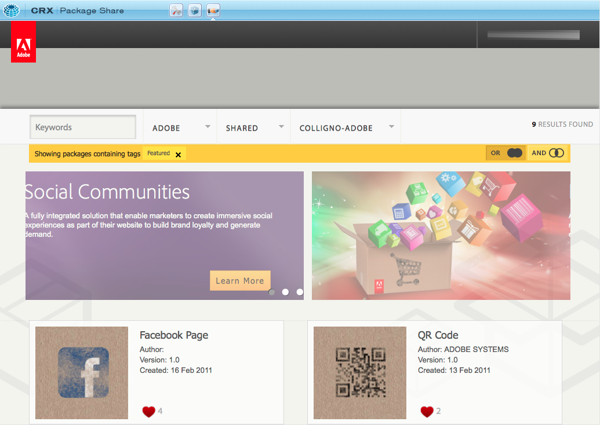

# The External Link Checker{#the-external-link-checker}

An external link checker is provided within AEM. The link checker:

* scans all content pages
* generates a list of all valid and invalid links
* marks invalid links as broken in situ on the individual content pages

## How to Validate External Links {#how-to-validate-external-links}

To use the external link checker:

1. Open the **Tools** console.
1. Double-click on **External Link Checker** (either the right or left pane). A list of all external links is generated.
1. Validate a specific link by selecting it in the list, then clicking **Check**:

   

   Information such as:

    * status of the link
    * URL
    * time since the link was last validated
    * time since the link was last available
    * time since the link was last accessed

   is displayed.

1. On the individual content pages invalid links will be shown as broken:

   

