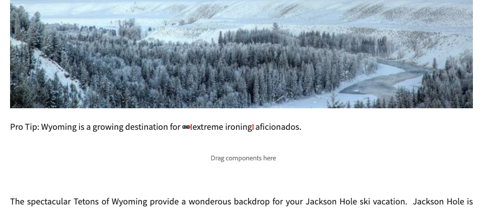
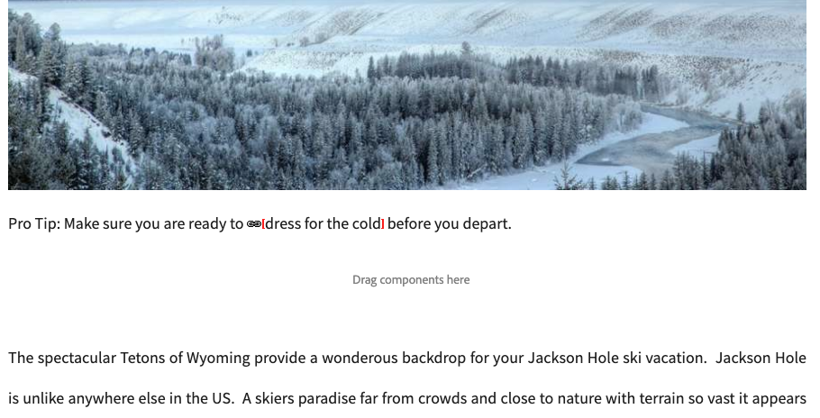
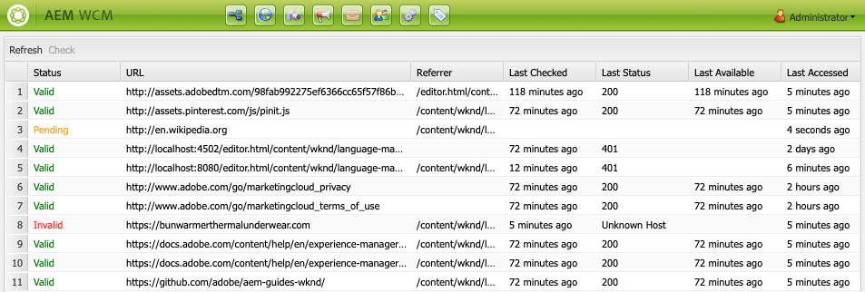

# The Link Checker {#the-link-checker}

Content authors should not have to concern themselves with validating every link that they include in their content pages.

The Link Checker runs automatically to assist content authors with their links including:

* Validating links as they are added to content
* Showing a list of all external links in the content
* Performing link transformations

 The Link Checker has several [configuration options](#configuring) such as defining the validation internal, allowing certain links or link patters to be omitted from validation, and rewriting link rewriting rules.

The Link Checker validates both [internal links](#internal) and [external links.](#external)

>[!NOTE]
>
>Because the Link Checker checks every content page's links, the Link Checker can impact performance on large repositories. In such cases, you may need to [configure how often the Link Checker runs](#configuring) or [disable it.](#disabling)

## Internal Link Checking {#internal}

Internal links are links to other content in your AEM repository. Internal links can be added using the path picker the RTE or using a custom component. For example:

* Your page `/content/wknd/us/en/adventures/ski-touring.html`
* Contain a link to `/content/wknd/us/en/adventures/extreme-ironing.html` in a [Text Component.](https://experienceleague.adobe.com/docs/experience-manager-core-components/using/components/text.html)

Internal links are validated as soon as the content author adds an internal links to a page. If the link becomes invalid:

* It is removed from the publisher. The text of the link remains, but the link itself is removed.
* It is shown as a broken link in the authoring interface.

## External Link Checking {#external}

External links are links to content outside of your AEM repository. External links can be added using the RTE or using a custom component. For example:

* Your page `/content/wknd/us/en/adventures/ski-touring.html`
* Contain a link to `https://bunwarmerthermalunderwear.com` in a [Text Component.](https://experienceleague.adobe.com/docs/experience-manager-core-components/using/components/text.html)

External links are validated for syntax and by checking their availability. This check is done asynchronously at a configurable internal. If the Link Checker finds an external link invalid:

* It is removed from the publisher. The text of the link remains, but the link itself is removed.
* It is shown as a broken link in the authoring interface.

In addition, the [External Link Checker](#external-link-checker) interface provides an overview of all external links on your content pages.

### Using the External Link Checker {#external-link-checker}

To use the External Link Checker:

1. Using **Navigation**, select **Tools**, then **Sites**.
1. Select **External Link Checker** and a list of all external links is displayed.

The following information is displayed:

* **Status** - The validation status of the link which can be one of the following:
  * **Valid** - The external link is reachable by the Link Checker
  * **Pending** - The external link was added to site content, but has not yet been validated by the Link Checker
  * **Invalid** - The external link is not reach able by the Link Checker
* **URL** - The external link
* **Referrer** - The content page that contains the external link
  * This is only populated [if configured.](#configuring)
* **Last Checked** - The last time the Link Checker validated the external link
  * How often links are checked [is configurable.](#configuring)
* **Last Status** - The last HTML status code returned when the Link Checked last checked the external link
* **Last Available** - Time since the link was last available to the Link Checker
* **Last Accessed** - time since the page with the external link was last accessed in the authoring interface

You can manipulate the content of the window, by using the two buttons at the top of the list of links:

* **Refresh** - To refresh the content of the list
* **Check** - To check an individual external link selected in the list

### How the External Link Checker Works {#how-it-works}

Though easy to use, the External Link Checker relies on several services and understanding how they work helps you understand how to [configure the Link Checker](#configuring) to meet your needs.

1. Whenever a content author saves any link to a page, an event handler is triggered.
1. The event handler traverse all content under `/content` and checks for new or updated links and adds them to a cache for the Link Checker.
1. The **Day CQ Link Checker Service** then executes on a regular schedule to check the entries in the cache for valid syntax.
1. The syntax-validated links then appear in the [External Link Checker](#external-link-checker) window. However they will be in a **Pending** state.
1. The **Day CQ Link Checker Task** then executes on a regular basis to validate the links by making a GET call.
1. The **Day CQ Link Checker Task** then updates the entries in the External Link Checker window with the results of the GET calls.

## Configuring the Link Checker {#configuring}

The Link Checker is available automatically out-of-the-box in AEM. However, there are several OSGi configurations that can be modified to change its behavior:

* **Day CQ Link Checker Info Storage Service** - This service defines the size of the Link Checker cache in the repository.
* **Day CQ Link Checker Service** - This service performs asynchronous checking of the syntax of external links. You can define the check period and which types of links are skipped by the checker among other options.
* **Day CQ Link Checker Task** - This service performs the GET validation of external links. It allows separate definitions of intervals to check bad and good links among other options.
* **Day CQ Link Checker Transformer** - Allows for converting links based on a user-defined rule set.

See the document [OSGi Configuration Settings](/help/sites-deploying/osgi-configuration-settings.md) for more details on how to change OSGi settings.

## Disabling the Link Checker {#disabling}

You may choose to disable the Link Checker entirely. To do so:

1. Open the OSGi console.
1. Edit the **Day CQ Link Checker Transformer**
1. Check the option(s) you wish to disable:
   * **Disable Checking** - to disable validation of links
   * **Disable Rewriting** - to disable link transformations

>[!NOTE]
>
>If you disable link checking after starting to create your content, you may still see entries in the [External Link Checker window](#external-link-checker), but they will no longer be updated.
