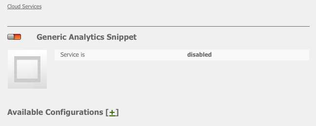
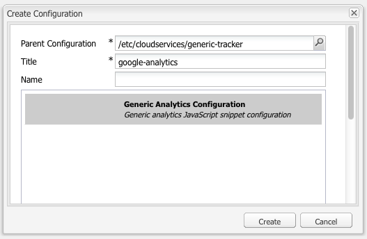
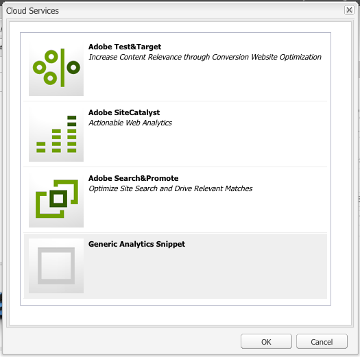
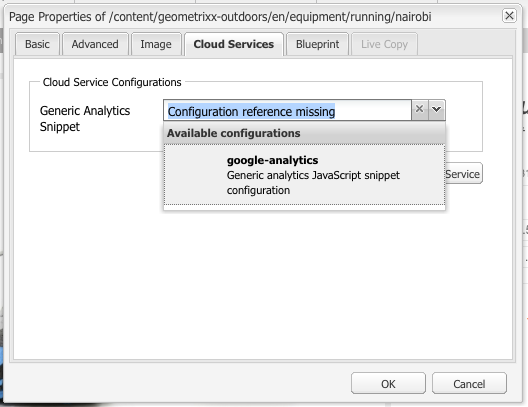

# Analytics with External Providers {#analytics-with-external-providers}

Analytics can provide you with important and interesting information about how your website is being used.

Various out-of-the box configurations are available for integrating with the appropriate service, for example:

* [Adobe Analytics](/help/sites-administering/adobeanalytics.md)
* [Adobe Target](/help/sites-administering/target.md)

You can also configure your own instance of the **Generic Analytics Snippets** to define a new service configuration.

The information is then collected by small snippets of code that are added to the web pages. For example:

>[!CAUTION]
>
>Do not enclose scripts in `script` tags.

```
var _gaq = _gaq || [];
_gaq.push(['_setAccount', 'UA-XXXXX-X']);
_gaq.push(['_trackPageview']);

(function() {
    var ga = document.createElement('script'); ga.type = 'text/javascript'; ga.async = true;
    ga.src = ('https:' == document.location.protocol ? 'https://ssl' : 'https://www') + '.google-analytics.com/ga.js';
    var s = document.getElementsByTagName('script')[0]; s.parentNode.insertBefore(ga, s);
})();
```

Such snippets enable data to be collected and reports generated. The actual data collected depends on the provider and the actual code snippet used. Example statistics include:

* how many visitors over time
* how many pages visited
* search terms used
* landing pages

>[!CAUTION]
>
>The Geometrixx-Outdoors demo site is configured so that the attributes provided in the Page Properties are appended to the html source code (just above the `</html>` end tag) in the corresponding `js` script.
>
>If your own `/apps` do not inherit from the default page component ( `/libs/foundation/components/page`) you (or your developers) have to make sure that the corresponding `js` scripts are included, for example, by either including `cq/cloudserviceconfigs/components/servicescomponents`, or using a similar mechanism.
>
>Without this, none of the services (Generic, Analytics, Target, and so on) will work.

## Creating a Service with a Generic Snippet {#creating-a-new-service-with-a-generic-snippet}

For the basic configuration:

1. Open the **Tools** console.
1. From the left pane, expand **Cloud Services Configurations**.
1. Double-click **Generic Analytics Snippet** to open the page:

   

1. Click + to add a new configuration using the dialog box. At a minimum, assign a name, for example, Google Analytics:

   

1. Click **Create**, the snippet dialog opens immediately - paste the appropriate JavaScript snippet into the field:

   

1. Click **OK** to save.

## Using your new Service on Pages {#using-your-new-service-on-pages}

Having created the service configuration, you must configure the required pages to use it:

1. Navigate to the page.
1. Open the **Page Properties** from sidekick, then the **Cloud Services** tab.
1. Click **Add Service**, then select the required service. For example, the **Generic Analytics Snippet**:

   

1. Click **OK** to save.
1. You are returned to the **Cloud Services** tab. The **Generic Analytics Snippet** is now listed with the message `Configuration reference missing`. Use the drop-down list to select your specific service instance. For example, google-analytics:

   

1. Click **OK** to save.

   The snippet can now be seen if you view the Page Source for the page.

   After an amount of time has elapsed, you can view the collected statistics.

   >[!NOTE]
   >
   >If the configuration is attached to a page that has child pages, the service is inherited by those as well.
