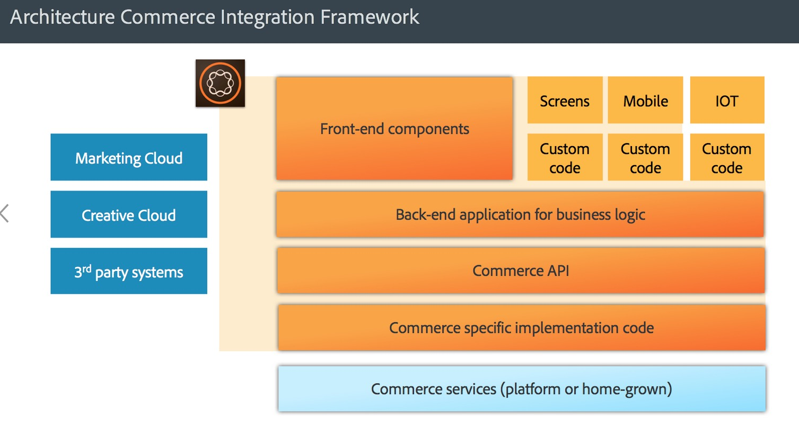
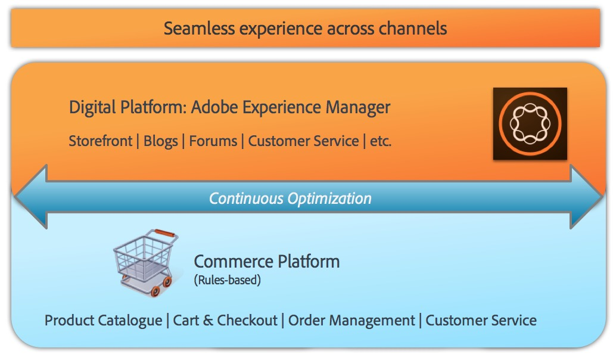

# AEM Commerce - GDPR Readiness{#aem-commerce-gdpr-readiness}

>[!IMPORTANT]
>
>GDPR is used as an example in the sections below, but the details covered are applicable to all data protection and privacy regulations; such as GDPR and CCPA.

The European Union's General Data Protection Regulation on data privacy rights takes effect as of May 2018. See the [GDPR page at the Adobe Privacy Center](https://business.adobe.com/privacy/general-data-protection-regulation.html).

>[!NOTE]
>
>See [AEM GDPR Readiness](/help/managing/data-protection-and-privacy.md) for further details.

With Adobe's out-of-the-box Commerce integrations, AEM is the experience layer, consuming services and sending data back to the customer commerce platform that runs in a headless mode.

For some commerce platforms, Adobe stores profile information ( `/home/users`) and commerce tokens (to log on in the commerce platform) in AEM. For these use cases, read [Handling GDPR Requests for the AEM Platform](/help/sites-administering/handling-gdpr-requests-for-aem-platform.md).

## Handling GDPR Requests for AEM Commerce {#handling-gdpr-requests-for-aem-commerce}

For the Salesforce Commerce Cloud integration, AEM Commerce does not store any GDPR relevant information. Forward the request to the [Salesforce Cloud](https://documentation.b2c.commercecloud.salesforce.com/DOC1/index.jsp).

For the hybris and HCL WebSphere&reg; Commerce integrations, there is some data in AEM. Use the [AEM Platform GDPR instructions](/help/sites-administering/handling-gdpr-requests-for-aem-platform.md) and consider these questions:

1. **Where is my data stored/used?** Cached user profile information such as name, commerce user identifier, token, password, and address data as shown from AEM.
1. **With whom do I share the covered GDPR data?** Any update of GDPR relevant data in AEM Commerce does not get stored (except relevant profile information, as mentioned above) but is proxied back to the commerce platform.
1. **How to delete my user data**? Delete the user profile in AEM and invoke the user deletion on the commerce platform.

>[!NOTE]
>
>Have a look at the [hybris wiki](https://wiki.hybris.com/) or the [HCL WebSphere&reg; Commerce documentation](https://help.hcltechsw.com/commerce/index.html), if necessary.
