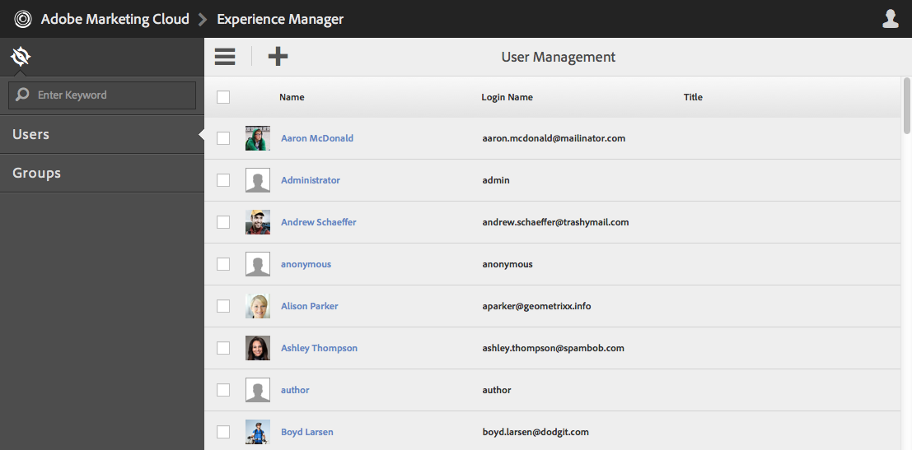
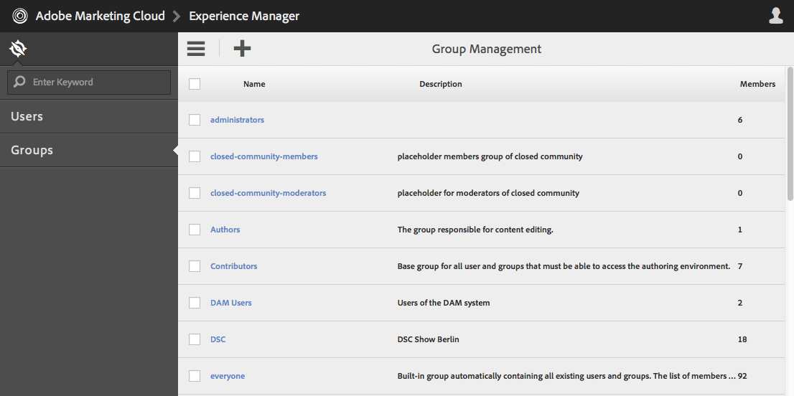
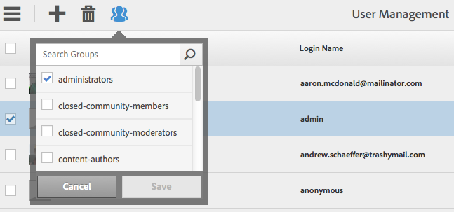
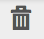
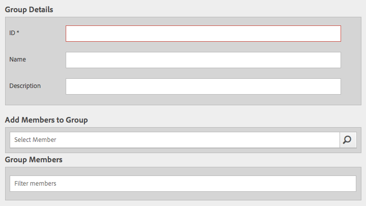

# Granite Operations - User and Group Administration{#granite-operations-user-and-group-administration}

As Granite incorporates the CRX Repository implementation of the JCR API Specification it has its own user and group administration.

These accounts are the underlying basis of the [AEM accounts](/help/sites-administering/security.md) and any account changes made with the Granite administration will be reflected if/when the accounts are accessed from the [AEM Users console](/help/sites-administering/security.md#accessing-user-administration-with-the-security-console) (for example, `http://localhost:4502/useradmin`). From the AEM Users console you can also manage the privileges and other AEM specifics.

Granite user and group administration consoles are both available from the **[Tools](/help/sites-administering/tools-consoles.md)** console of the touch-optimized UI:

Choosing either **Users** or **Groups** from the Tools console opens the appropriate console. In both you can take action either by using the clickbox and then actions from the toolbar, or by opening the account details via the link under **Name**.

* [User Administration](#user-administration)

  

  The **Users** console lists:

    * the user name
    * the user login name (account name)
    * any title that the account has been given

* [Group Administration](#group-administration)

  

  The **Groups** console lists:

    * the group name
    * the group description
    * the number of users/groups in the group

## User Administration {#user-administration}

### Adding a New User {#adding-a-new-user}

1. Use the **Add User** icon:

   

1. The **Create User** form opens:

   

   Here you can enter the user details for the account (most are standard and self-explanatory):

    * **ID**

      This is the unique identification for the user account. It is mandatory and cannot contain spaces.

    * **Email Address**
    * **Password**

      A password is mandatory.

    * **Retype Password**

      This is mandatory as it is required for confirmation of the password.

    * **First Name**
    * **Last Name**
    * **Phone Number**
    * **Job Title**
    * **Street**
    * **Mobile**
    * **City**
    * **Postal Code**
    * **Country**
    * **State**
    * **Title**
    * **Gender**
    * **About**
    * **Account Settings**

        * **Status**
          You can flag the account as either **active** or **inactive**.

    * **Photo**

      Here you can upload a photo to use as an avatar.

      Accepted file types: `.jpg .png .tif .gif`

      Preferred size: `240x240px`

    * **Add User to Groups**

      Use the selection drop-down to select groups that the user should be a member of. Once selected, use the **X** by the name to deselect before saving.

    * **Groups**

      A list of group(s) that the user is currently a member of. Use the **X** by the name to deselect before saving.

1. When you have defined the user account use:

    * **Cancel** to abort the registration.
    * **Save** to complete the registration. Creation of the user account will be confirmed with a message.

### Editing an Existing User {#editing-an-existing-user}

1. Access the user details from the link under the user name in the Users console.

1. You can now edit the details as in [Adding a New User](#adding-a-new-user).

1. Access the user details from the link under the user name in the Users console.

1. You can now edit the details as in [Adding a New User](#adding-a-new-user).

### Changing the Password for an Existing User {#changing-the-password-for-an-existing-user}

1. Access the user details from the link under the user name in the Users console.

1. You can now edit the details as in [Adding a New User](#adding-a-new-user). Under **Account Settings** there is a link for **Change Password**.

   

1. The **Change Password** dialog opens. Enter and retype the new password, together with your password. Use **OK** to confirm the changes.

   

   An message will confirm that the password has been changed.

### Quick Group Assignment {#quick-group-assignment}

1. Use the clickbox to flag one or more users.
1. Use the **Groups** icon:

   

   To open the group selection drop-down:

   

1. In the selection box you can select or deselect groups to which the user account should belong.

1. When you have assigned, or unassigned, the groups as required use:

    * **Cancel** to abort the changes
    * **Save** to confirm the changes

### Deleting Existing User Details {#deleting-existing-user-details}

1. Use the clickbox to flag one or more users.
1. Use the **Delete** icon to delete the user details:

   

1. You will be asked to confirm the deletion, then a message will confirm that the actual deletion has taken place.

## Group Administration {#group-administration}

### Adding a New Group {#adding-a-new-group}

1. Use the Add Group icon:

   

1. The **Create Group** form opens:

   

   Here you can enter the group details:

    * **ID**

      This is a unique identifier for the group. This is mandatory and cannot contain spaces.

    * **Name**

      A name for the group; it is shown in the Groups console.

    * **Description**

      A description of the group.

    * **Add Members to Group**

      Use the selection drop-down to select user(s) to add to the group. Once selected, use the **X** by the name to deselect before saving.

    * **Group Members**

      A list of user(s) in the group. Use the **X** by the name to deselect before saving.

1. When you have defined the group, use:

    * **Cancel** to abort the registration.
    * **Save** to complete the registration. Creation of the group will be confirmed with a message.

### Editing an Existing Group {#editing-an-existing-group}

1. Access the group details from the link under the group name in the Groups console.

1. You can now edit and save the details as in [Adding a New Group](#adding-a-new-group).

### Copying an Existing Group {#copying-an-existing-group}

1. Use the clickbox to flag a group.
1. Use the **Copy** icon to copy the group details:

   

1. The **Edit Group Settings** form will be opened.

   The group ID will be the same as the original, but prefixed with `Copy of`. Edit this ID because it cannot contain spaces. All other details are the same as the original.

   You can now edit and save the details as in [Adding a New Group](#adding-a-new-group).

### Deleting an Existing Group {#deleting-an-existing-group}

1. Use the clickbox to flag one or more groups.
1. Use the **Delete** icon to delete the group details:

   

1. You will be asked to confirm the deletion, then a message will confirm that the actual deletion has taken place.
