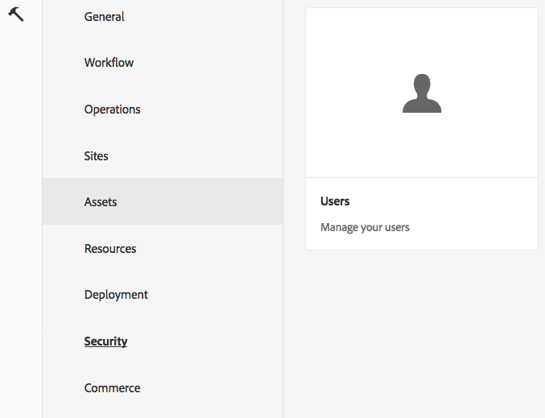
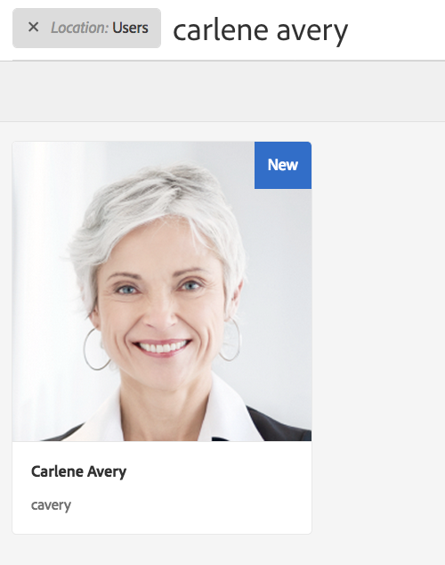
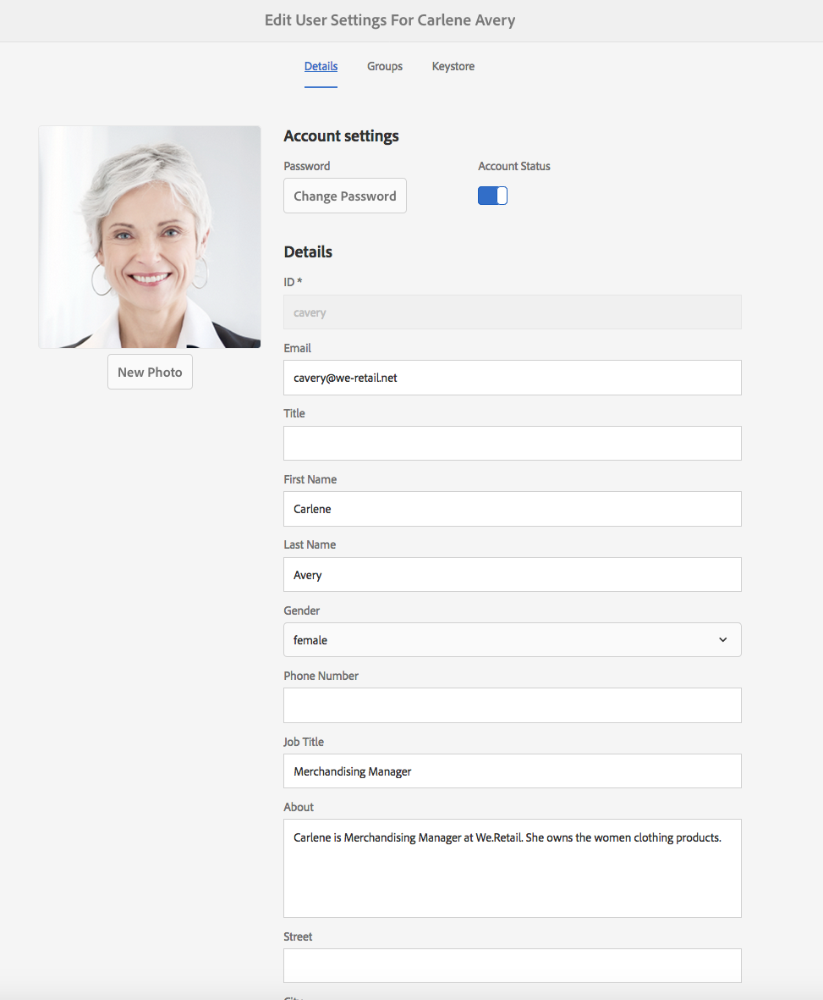
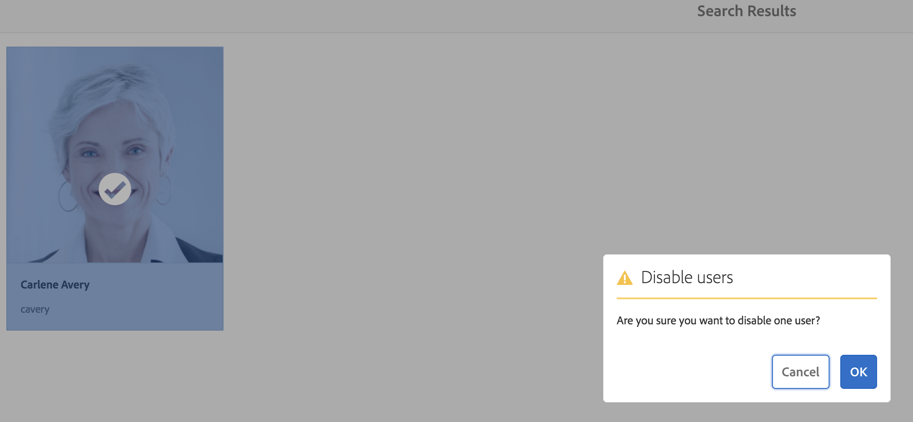
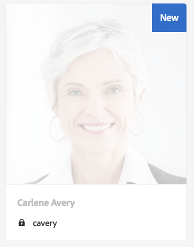
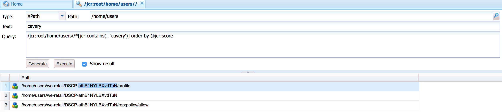
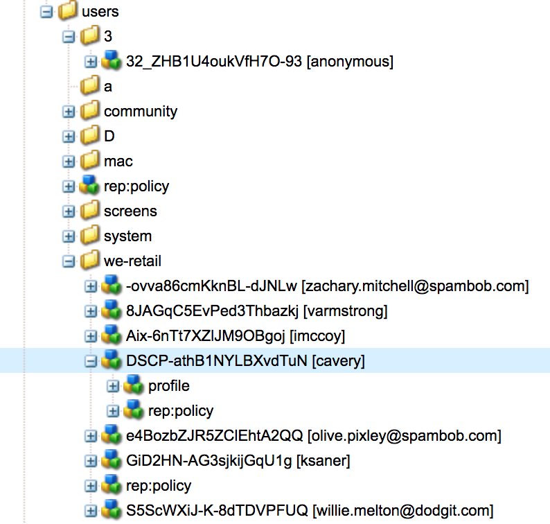
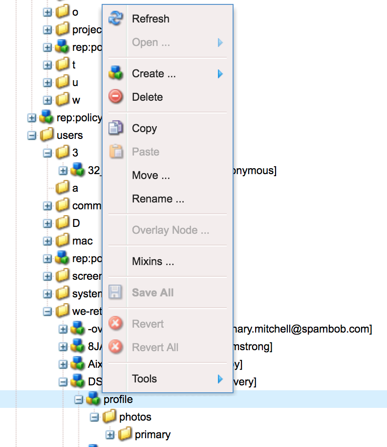

# Handling GDPR Requests for the Adobe Experience Manager (AEM) Foundation{#handling-gdpr-requests-for-the-aem-foundation}

>[!IMPORTANT]
>
>GDPR is used as an example in the sections below, but the details covered are applicable to all data protection and privacy regulations; such as GDPR, CCPA, and so on.

## AEM Foundation GDPR support {#aem-foundation-gdpr-support}

At the AEM Foundation level, the Personal Data that is stored  is  the User Profile. Therefore, the information in this article primarily addresses how to access and delete user profiles, to address the GDPR Access, and Delete requests respectively.

## Accessing a User Profile {#accessing-a-user-profile}

### Manual Steps {#manual-steps}

1. Open the User Administration console, by browsing to **[!UICONTROL Settings - Security - Users]** or by browsing directly to `https://<serveraddress>:<serverport>/libs/granite/security/content/useradmin.html`

   

1. Then, search for the user in question by typing the name in the search bar at the top of the page:

   

1. Finally, open the user profile by clicking it, then check under the **[!UICONTROL Details]** tab.

   

### HTTP API {#http-api}

As mentioned, Adobe provides APIs for accessing user data, to facilitate automation. There are several types of APIs which you can use:

**UserProperties API**

```shell
curl -u user:password http://localhost:4502/libs/granite/security/search/profile.userproperties.json\?authId\=cavery
```

**Sling API**

*Discovering the user home:*

```xml
curl -g -u user:password 'http://localhost:4502/libs/granite/security/search/authorizables.json?query={"condition":[{"named":"cavery"}]}'
     {"authorizables":[{"type":"user","authorizableId_xss":"cavery","authorizableId":"cavery","name_xss":"Carlene Avery","name":"Carlene Avery","home":"/home/users/we-retail/DSCP-athB1NYLBXvdTuN"}],"total":1}
```

*Retrieving user data*

Using the node path from the home property of the JSON payload returned from the above command:

```shell
curl -u user:password  'http://localhost:4502/home/users/we-retail/DSCP-athB1NYLBXvdTuN/profile.-1.json'
```

```shell
curl -u user:password  'http://localhost:4502/home/users/we-retail/DSCP-athB1NYLBXvdTuN/profiles.-1.json'
```

## Disabling a User and Deleting the Associated Profiles {#disabling-a-user-and-deleting-the-associated-profiles}

### Disable User {#disable-user}

1. Open the User Administration console and search for the user in question, as described above.
1. Hover over the user and click the select icon. The profile turns gray indicating that it is selected.  

1. Press the Disable button in the upper menu to disable the user:

   

1. Finally, confirm the action:

   

   The user interface indicates that the user is deactivated by graying out and adding a lock to the profile card:

   

### Delete User Profile Information {#delete-user-profile-information}

1. Log in to CRXDE Lite, then search for the `[!UICONTROL userId]`: 

   

1. Open the user node which is located under `[!UICONTROL /home/users]` by default:

   

1. Delete profile nodes and all their children. There are two formats to the profile nodes, depending on the AEM version:

    1. The default private profile under `[!UICONTROL /profile]` 
    1. `[!UICONTROL /profiles]`, for new profiles created using AEM 6.5.

   

### HTTP API {#http-api-1}

The following procedures use the `curl` command-line tool to illustrate how to disable the user with the **[!UICONTROL cavery]** `userId` and delete profiles of `cavery` that are available at the default location.

* *Discovering the user home*

```shell
curl -g -u user:password 'http://localhost:4502/libs/granite/security/search/authorizables.json?query={"condition":[{"named":"cavery"}]}'
     {"authorizables":[{"type":"user","authorizableId_xss":"cavery","authorizableId":"cavery","name_xss":"Carlene Avery","name":"Carlene Avery","home":"/home/users/we-retail/DSCP-athB1NYLBXvdTuN"}],"total":1}
```

* *Disabling the user*

Using the node path from the home property of the JSON payload returned from the above command:

```shell
curl -X POST -u user:password -FdisableUser="describe the reasons for disabling this user (GDPR in this case)" 'http://localhost:4502/home/users/we-retail/DSCP-athB1NYLBXvdTuN.rw.userprops.html'
```

* *Deleting user profiles*

Using the node path from the home property of the JSON payload returned from the account discovery command and the known out of the box profile node locations:

```shell
curl -X POST -u user:password -H "Accept: application/json,**/**;q=0.9" -d ':operation=delete' 'http://localhost:4502/home/users/we-retail/DSCP-athB1NYLBXvdTuN/profile'
```

```shell
curl -X POST -u user:password -H "Accept: application/json,**/**;q=0.9" -d ':operation=delete' 'http://localhost:4502/home/users/we-retail/DSCP-athB1NYLBXvdTuN/profile'
```
