# Adobe IMS Authentication and [!DNL Admin Console] Support for AEM Managed Services {#adobe-ims-authentication-and-admin-console-support-for-aem-managed-services}

>[!NOTE]
>
>Please note that this feature is available to Adobe Managed Services customers only.

>[!NOTE]
>
>AEM currently does not support assigning groups to profiles.  Users should be added individually instead.

## Introduction {#introduction}

AEM 6.4.3.0 introduces [!DNL Admin Console] support for AEM instances and Adobe IMS(Identity Management System) based authentication for **AEM Managed Services** customers.

AEM onboarding to the [!DNL Admin Console] will allow AEM Managed Services customers to manage all Experience Cloud users in one console. Users can be assigned to product profiles associated with AEM instances, allowing them to log in to a specific instance.

## Key Highlights {#key-highlights}

* AEM IMS authentication support is only for AEM Authors, Admins or Developers, not for external end users of customer site like site visitors
* The [!DNL Admin Console] will represent AEM Managed Services customers as IMS Organizations and their Instances as Product Contexts. Customer System and Product Admins will be able to manage access to instances
* AEM Managed Services will sync customer topologies with the [!DNL Admin Console]. There will be one instance of AEM Managed Services Product Context per Instance in the [!DNL Admin Console].
* Product Profiles in [!DNL Admin Console] will determine which instances a user can access
* Federated authentication using customers' own SAML 2 compliant Identity Providers is supported
* Only Enterprise or Federated IDs(for customer Single Sign-On) will be supported, not personal Adobe IDs.
* [!DNL User Management] (in Adobe [!DNL Admin Console]) will continue to be owned by the customer admins.

## Architecture {#architecture}

IMS Authentication works by using the OAuth protocol between AEM and the Adobe IMS endpoint. Once a user has been added to IMS and has an Adobe Identity, they can log in to AEM Managed Services instances using IMS credentials.

The user login flow is shown below, the user will be redirected to IMS and optionally to the customer IDP for SSO validation and then redirected back to AEM.

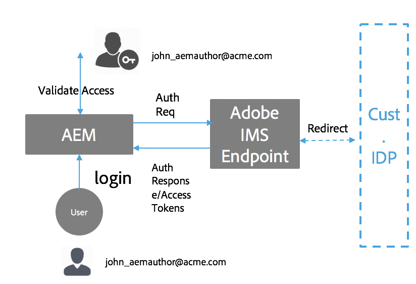

## How To Set Up {#how-to-set-up}

### Onboarding Organizations to [!DNL Admin Console] {#onboarding-organizations-to-admin-console}

The customer onboarding to [!DNL Admin Console] is a pre-requisite to using Adobe IMS for AEM authentication.

As the first step, customers should have an Organization provisioned in Adobe IMS. Adobe Enterprise customers are represented as IMS Organizations in the [Adobe [!DNL Admin Console]](https://helpx.adobe.com/enterprise/using/admin-console.html).

AEM Managed Services customers should already have an organization provisioned, and as part of the IMS provisioning, the customer instances will be made available in the [!DNL Admin Console] for managing user entitlements and access.

The move to IMS for user authentication will be a joint effort between AMS and customers, with each having their workflows to complete.

Once a customer exists as an IMS Organization and AMS is done with provisioning the customer for IMS, this is the summary of the configuration workflows required:

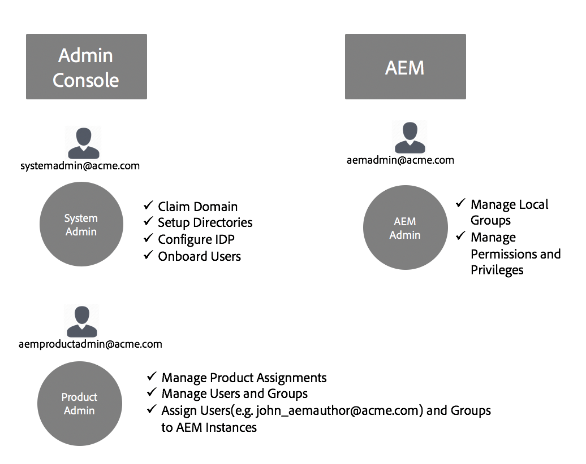

1. The designated System Admin receives an invite to log in to the [!DNL Admin Console]
1. The System Admin Claims Domain to confirm the ownership of the domain (in this example acme.com)
1. The System Admin sets up User Directories
1. The System Admin configures the Identity Provider (IDP) in the [!DNL Admin Console] for SSO setup.
1. The AEM Admin manages the local groups, permissions and privileges as usual. See User and Group Sync

>[!NOTE]
>
>For more information about the Adobe Identity Management Basics, including IDP configuration see the article [this page.](https://helpx.adobe.com/enterprise/using/set-up-identity.html)
>
>For more info about the Enterprise Administration and [!DNL Admin Console] see the article [this page](https://helpx.adobe.com/enterprise/managing/user-guide.html).

### Onboarding Users to the [!DNL Admin Console] {#onboarding-users-to-the-admin-console}

There are three ways to onboard users depending on the size of the customer and their preference:

1. Manually create users and groups in [!DNL Admin Console]
1. Upload a CSV file with users
1. Sync users and groups from the customer's enterprise Active Directory.

#### Manual Addition through [!DNL Admin Console] UI {#manual-addition-through-admin-console-ui}

Users and Groups can be manually created in the [!DNL Admin Console] UI. This method can be used if they do not have a large number of users to manage. For example, a number of less than 50 AEM users.

Users can also be manually created if the customer is already using this method for administering other Adobe products like Analytics, Target or Creative Cloud applications.

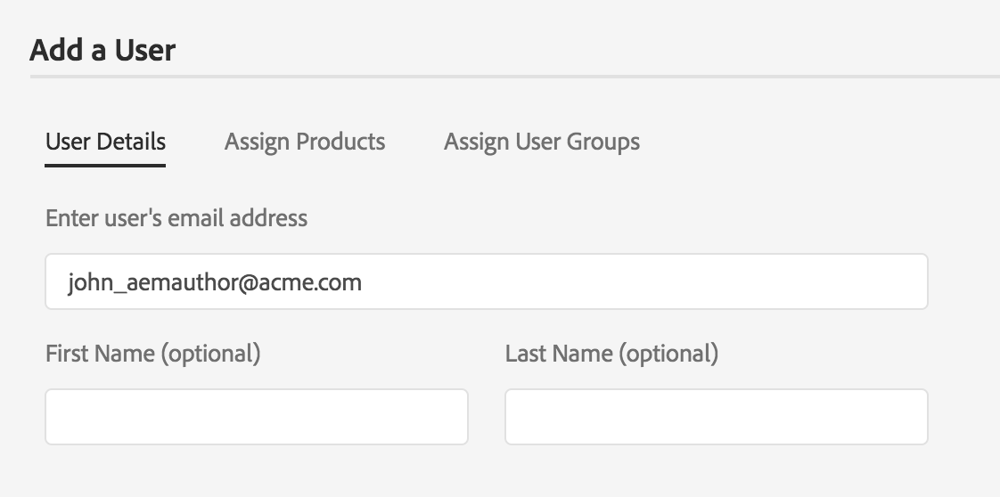

#### File Upload in the [!DNL Admin Console] UI {#file-upload-in-the-admin-console-ui}

For easy handling of user creation, a CSV file can be uploaded for adding users in bulk:

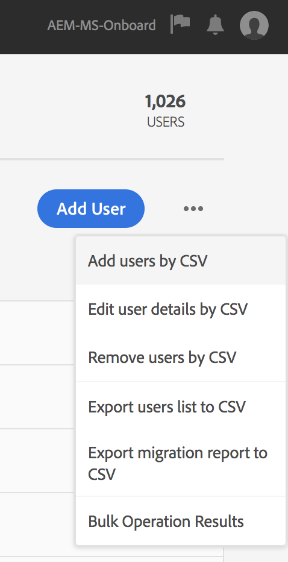

#### User Sync Tool {#user-sync-tool}

The User Sync Tool (UST in short) enables enterprise customers to create or manage Adobe users utilizing Active Directory or other tested OpenLDAP directory services. The target users are IT Identity Administrators (Enterprise Directory and System Admins) who will be able to install and configure the tool. The open source tool is customizable so that customers can have a developer modify it to suit their own particular requirements.

When User Sync runs, it fetches a list of users from the organization's Active Directory (or any other compatible data source) and compares it with the list of users within the [!DNL Admin Console]. It then calls the Adobe [!DNL User Management] API so that the [!DNL Admin Console] is synchronized with the organization's directory. The change flow is entirely one-way; any edits made in the [!DNL Admin Console] do not get pushed out to the directory.

The tool allows the system admin to map user groups in the customer's directory with product configuration and user groups in the [!DNL Admin Console], the new UST version also allows dynamic creation of user groups in the [!DNL Admin Console].

To set up User Sync, the organization needs to create a set of credentials in the same way they would use the [[!DNL User Management] API](https://www.adobe.io/apis/cloudplatform/usermanagement/docs/setup.html).

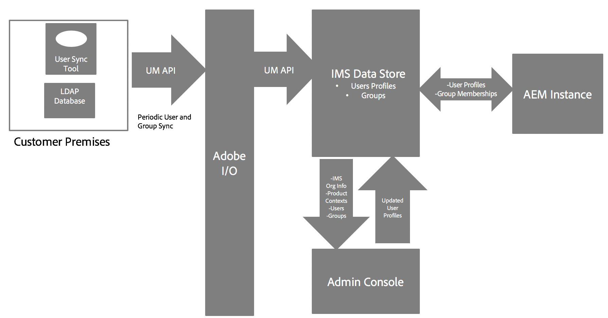

User Sync is distributed through the Adobe Github repository at this location:

[https://github.com/adobe-apiplatform/user-sync.py/releases/latest](https://github.com/adobe-apiplatform/user-sync.py/releases/latest)

Note that a pre-release version 2.4RC1 is available with dynamic group creation support and can be found here: [https://github.com/adobe-apiplatform/user-sync.py/releases/tag/v2.4rc1](https://github.com/adobe-apiplatform/user-sync.py/releases/tag/v2.4rc1)

The major features for this release are the ability to dynamically map new LDAP groups for user membership in the [!DNL Admin Console], as well as dynamic user group creation.

More information about the new group features can be found here:

[https://adobe-apiplatform.github.io/user-sync.py/en/user-manual/advanced_configuration.html#additional-group-options](https://adobe-apiplatform.github.io/user-sync.py/en/user-manual/advanced_configuration.html#additional-group-options)

>[!NOTE]
>
>For more information regarding the User Sync Tool, refer to the [documentation page](https://adobe-apiplatform.github.io/user-sync.py/en/).
>
>
>The User Sync Tool needs to register as an Adobe I/O client UMAPI using the procedure described [here](https://adobe-apiplatform.github.io/umapi-documentation/en/UM_Authentication.html).
>
>The Adobe I/O Console Documentation can be found [here](https://developer.adobe.com/developer-console/docs/guides/).
>
>
>The [!DNL User Management] API that is used by the User Sync Tool is covered at this [location](https://adobe-apiplatform.github.io/umapi-documentation/en/).

>[!NOTE]
>
>The AEM IMS configuration will be handled by the Adobe Managed Services team. However, the customer administrator may modify it as per their requirements (for example Auto Group Membership or Group Mapping). The IMS client will also be registered by your Managed Services team.

## How to Use {#how-to-use}

### Managing Products and User Access in [!DNL Admin Console] {#managing-products-and-user-access-in-admin-console}

When the customer Product Administrator logs in to [!DNL Admin Console], they will see multiple instances of the AEM Managed Services Product Context as shown below:

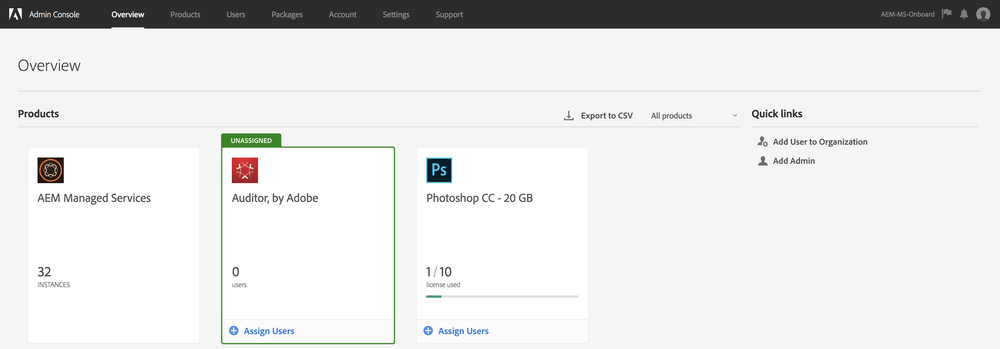

In this example, the org *AEM-MS-Onboard* has 32 instances spanning different topologies and environments like Stage, Prod, etc.

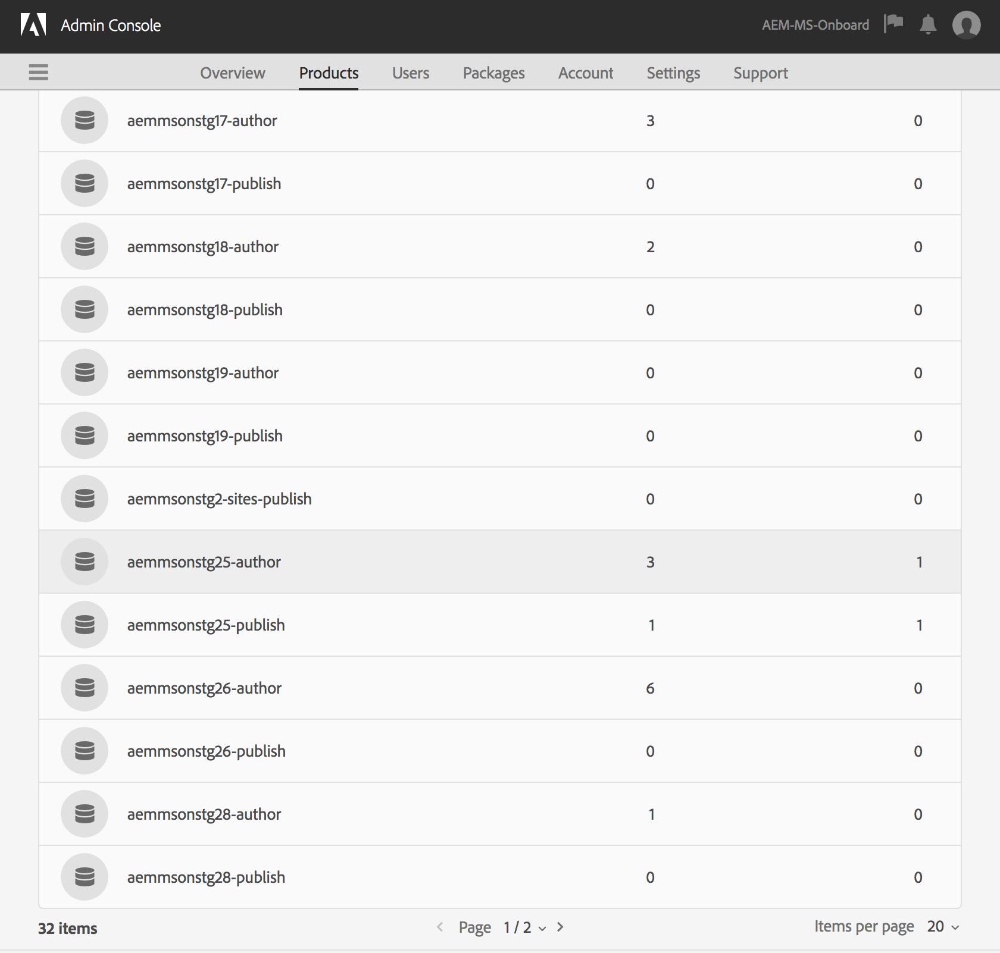

The instance details can be checked to identify the instance:

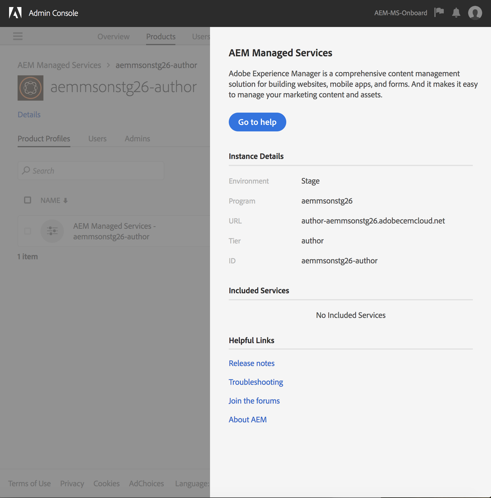

Under each Product Context instance, there will be an associated Product Profile. This product profile is used for assigning access to users.

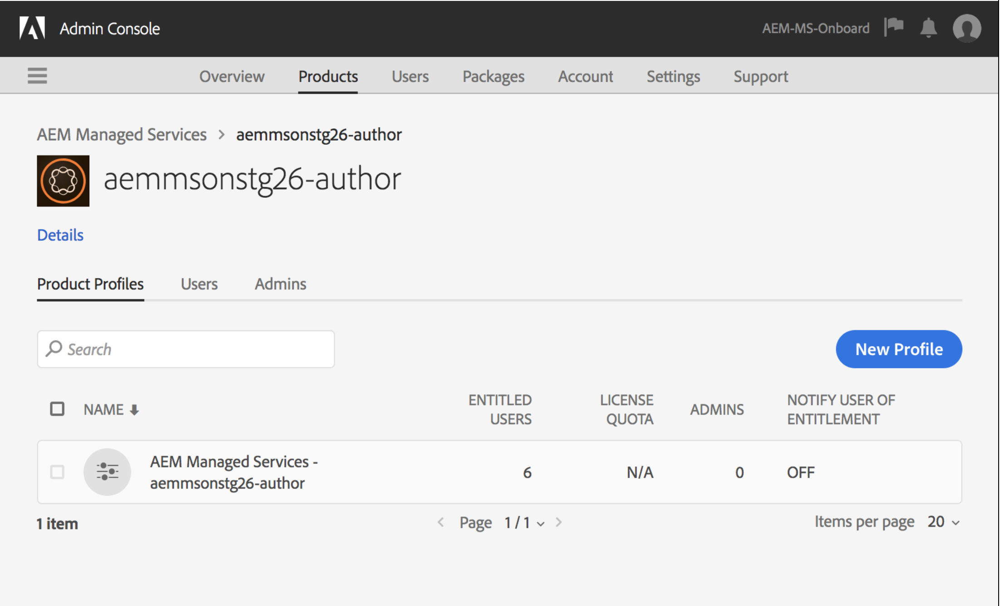

Any users added under this product profile will be able to login to that instance as shown in the example below:

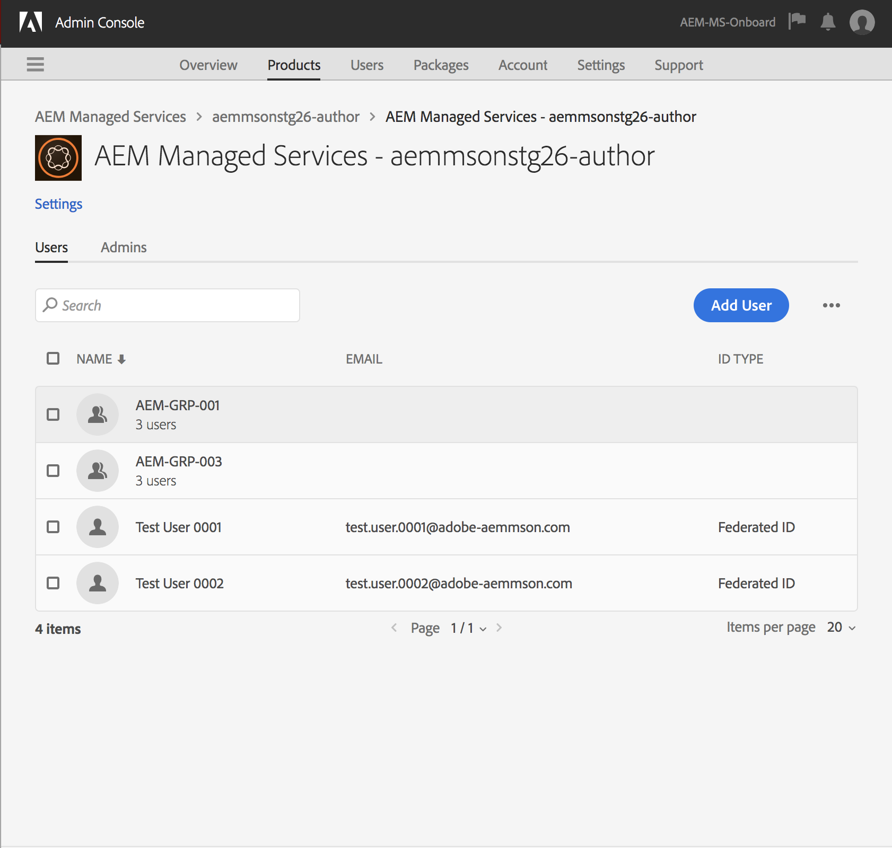

### Logging into AEM {#logging-into-aem}

#### Local Admin Login {#local-admin-login}

AEM can continue to support local logins for Admin users, as the login screen has an option to log in locally:

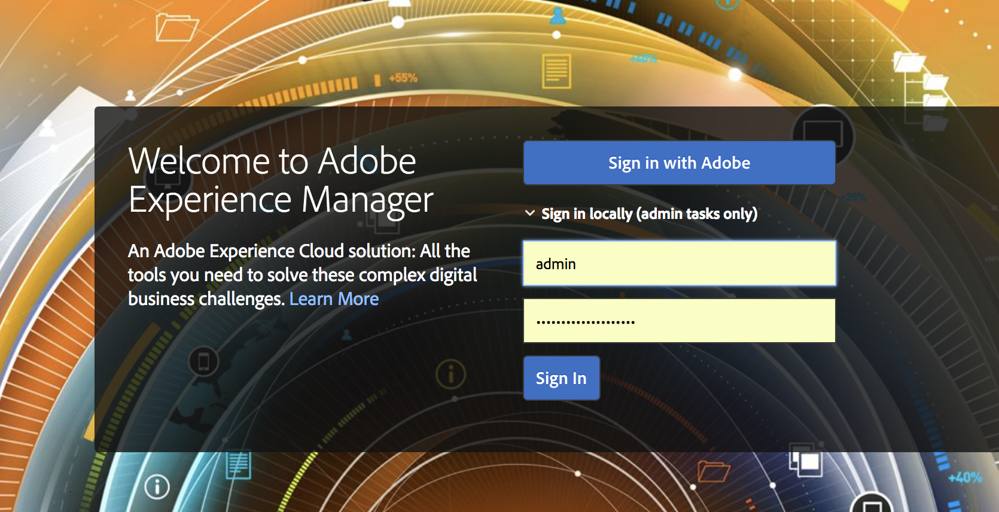

#### IMS Based Login {#ims-based-login}

For other users, the IMS based login can be used once IMS is configured on the instance. The user will first click on the **Sign in with Adobe** button as shown below:

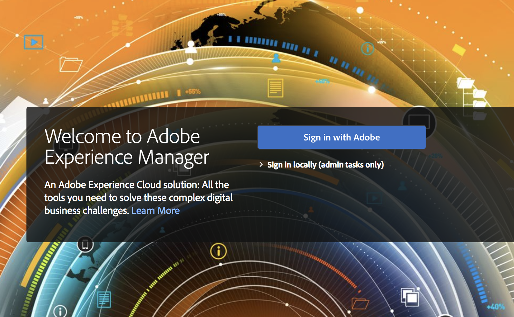

They will then be redirected to the IMS login screen and enter their credentials:

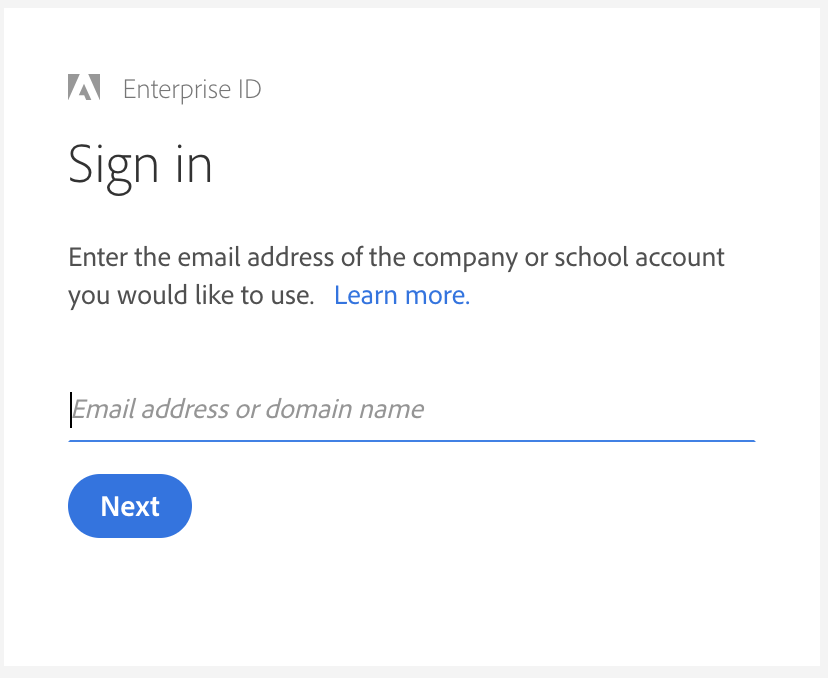

If a federated IDP is configured during initial [!DNL Admin Console] setup, then the user will be redirected to the customer IDP for SSO.

The IDP is Okta in the below example:

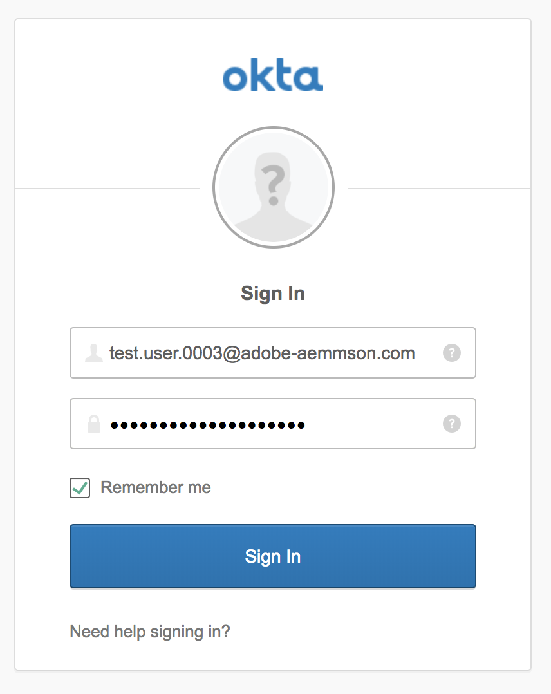

After authentication is complete, the user will be redirected back to AEM and logged in:

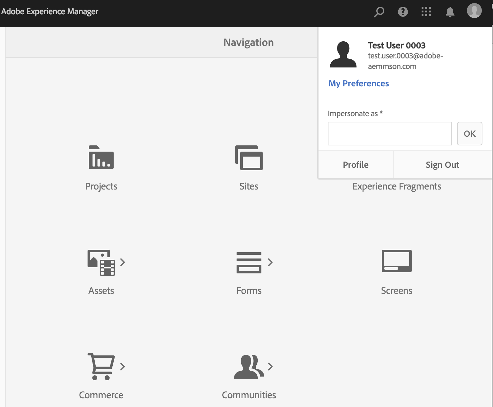

### Migrating Existing Users {#migrating-existing-users}

For existing AEM instances that are using another method of Authentication and are now being migrated to IMS, there needs to be a migration step.

Existing users in the AEM repository( sourced locally, via LDAP or SAML) can be migrated to point to IMS as the IDP using the User Migration Utility.

This utility will be run by your AMS team as part of IMS provisioning.

### Managing Permissions and ACLs in AEM {#managing-permissions-and-acls-in-aem}

Access control and permissions will continue to be managed in AEM, this can be achieved using separation of User Groups coming from IMS( e.g. AEM-GRP-008 in the example below) and local groups where the permissions and access control is defined. The user groups that are synced from IMS can be assigned to local groups and inherit the permissions.

In the example below, we are adding synced groups to the local *Dam_Users* group as an example.

Here, a user has also been assigned to a few groups in the [!DNL Admin Console]. ( Please note that the users and groups can be synced from LDAP using the user sync tool or created locally, please see the section **Onboarding Users to the [!DNL Admin Console]** above).

>[!NOTE]
>
>User groups only get synced when the users log in to the instance.

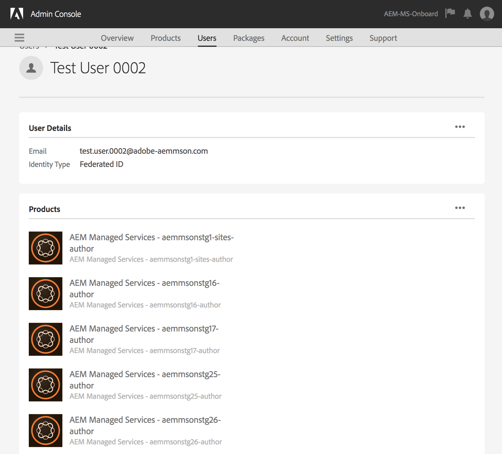

The user is part of the following Groups in IMS:

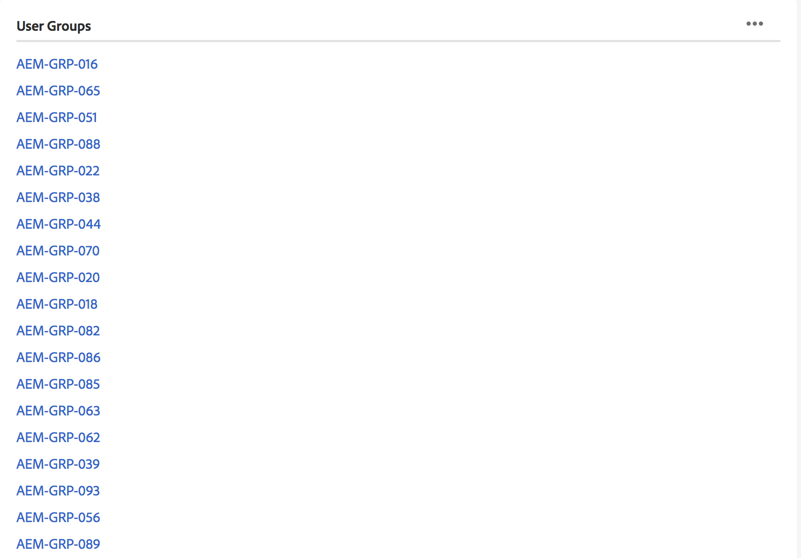

When the user logs in, their Group Memberships are synced, as shown below:

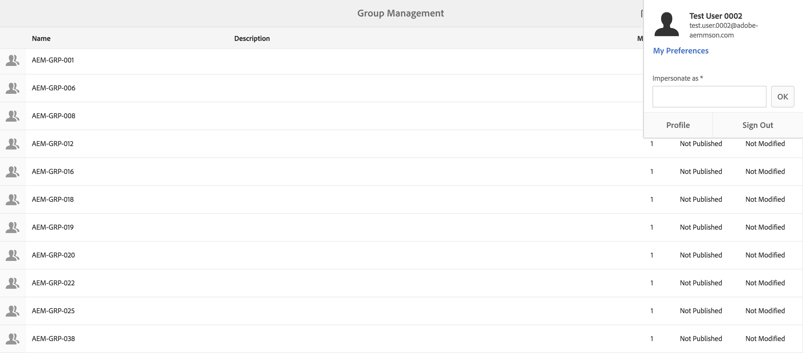

In AEM, the user groups synced from IMS can be added as members to existing local groups, e.g. DAM Users.

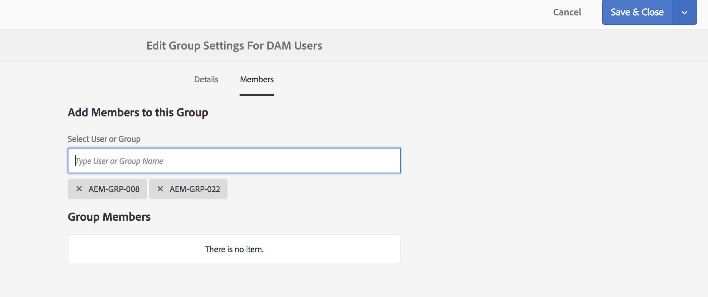 

As shown below, the group *AEM-GRP_008* inherits the Permissions and Privileges of DAM Users. This is an effective way of managing permissions for synced groups and is commonly used in LDAP based Authentication methods as well.

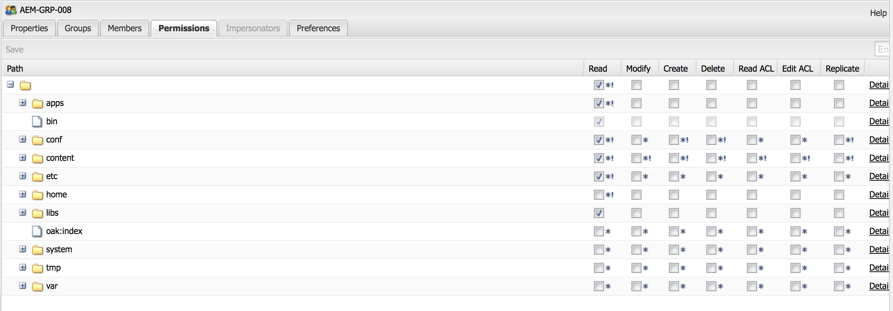
