# Integration with Adobe Target using IMS{#integration-with-adobe-target-using-ims}

The integration of AEM with Adobe Target via the Target Standard API requires the configuration of Adobe IMS (Identity Management System) using the Adobe Developer Console.

>[!NOTE]
>
>Support for the Adobe Target Standard API is new in AEM 6.5. The Target Standard API uses IMS authentication.
>
>Using the Adobe Target Classic API in AEM is still supported for backward compatibility. The [Target Classic API uses user credentials authentication](/help/sites-administering/target-configuring.md#manually-integrating-with-adobe-target).
>
>The API selection is driven by the authentication method used for AEM/Target integration. 
>See also the [Tenant ID and Client Code](#tenant-client) section.

## Prerequisites {#prerequisites}

Before starting this procedure:

* [Adobe Support](https://helpx.adobe.com/contact/enterprise-support.ec.html) must provision your account for:

  * Adobe Console
  * Adobe Developer Console
  * Adobe Target and 
  * Adobe IMS (Identity Management System)

* Your organization's System Admininstrator should use the Admin Console to add the required developers in your organization to the relevant product profiles. 

  * This provides the specific developers with permissions to enable integrations within the Adobe Developer Console. 
  * For further details see [Manage Developers](https://helpx.adobe.com/enterprise/admin-guide.html/enterprise/using/manage-developers.ug.html).

## Configuring an IMS Configuration - Generating a Public Key {#configuring-an-ims-configuration-generating-a-public-key}

The first stage of the configuration is to create an IMS Configuration in AEM and generate the Public Key.

1. In AEM open the **Tools** menu.
1. In the **Security** section select **Adobe IMS Configurations**.
1. Select **Create** to open the **Adobe IMS Technical Account Configuration**.
1. Using the drop down under **Cloud Configuration**, select **Adobe Target**.
1. Activate **Create new certificate** and enter a new alias.
1. Confirm with **Create certificate**.

   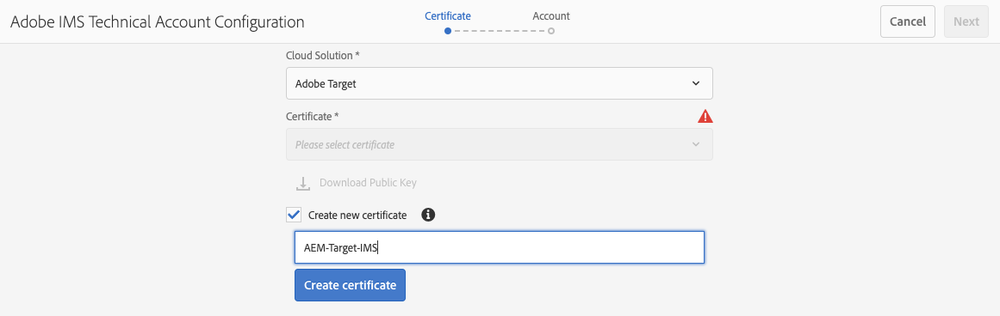

1. Select **Download** (or **Download Public Key**) to download the file to your local drive, so that it is ready for use when [configuring IMS for Adobe Target integration with AEM](#configuring-ims-for-adobe-target-integration-with-aem).

   >[!CAUTION]
   >
   >Keep this configuration open, it will be needed again when [Completing the IMS Configuration in AEM](#completing-the-ims-configuration-in-aem).

   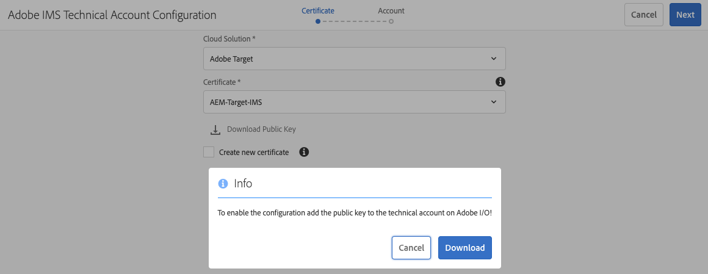

## Configuring IMS for Adobe Target integration with AEM {#configuring-ims-for-adobe-target-integration-with-aem}

Using the Adobe Developer Console you need to create a Project (integration) with Adobe Target that AEM will use, then assign the required privileges.

### Creating the Project {#creating-the-project}

Open the Adobe Developer Console to create a Project with Adobe Target that AEM will use:

1. Open the Adobe Developer Console for Projects:

   [https://developer.adobe.com/console/projects](https://developer.adobe.com/console/projects)

1. Any projects that you have will be shown. Select **Create New Project** - the location and usage will depend on:

   * If you do not have any project yet, **Create new project** will be center, bottom. 
     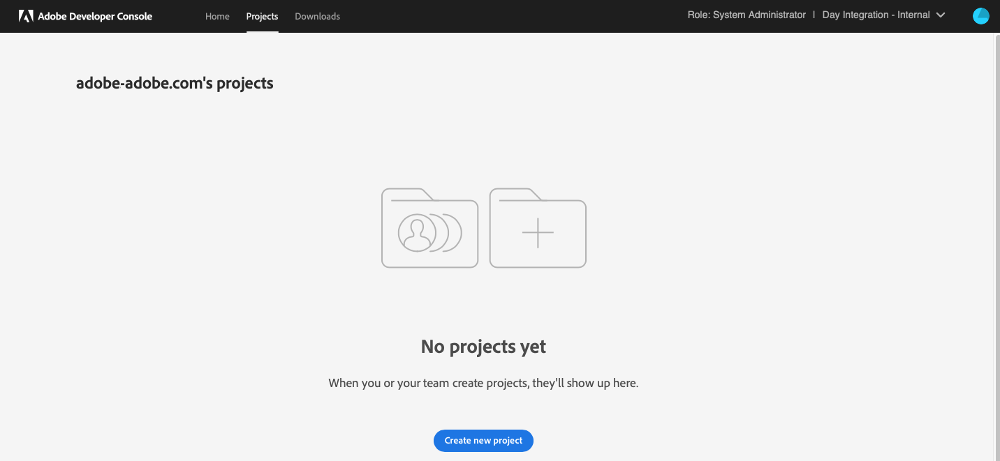
   * If you already have existing projects these will be listed and **Create new project** will be top right. 
     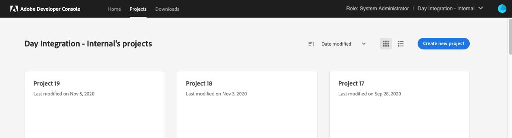

1. Select **Add to Project** followed by **API**:

   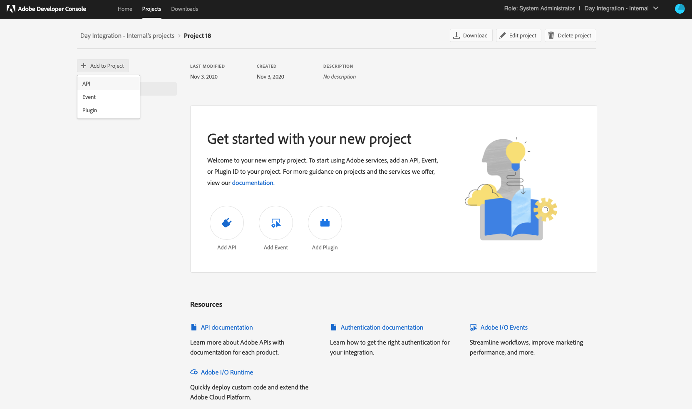

1. Select **Adobe Target**, then **Next**:

   >[!NOTE]
   >
   >If you are subscribed to Adobe Target, but do not see it listed then you should check the [Prerequistes](#prerequisites).

   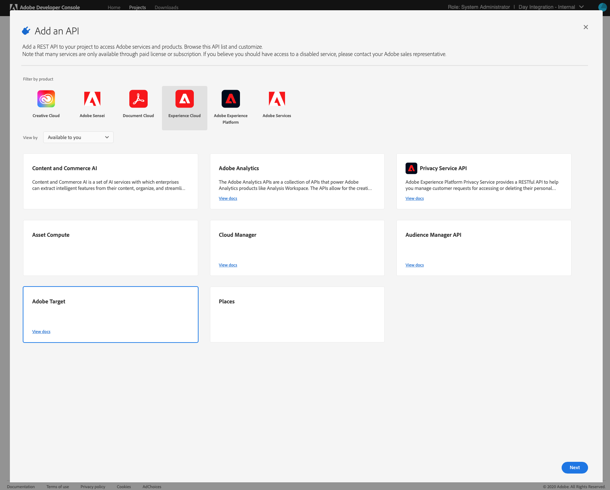

1. **Upload your public key**, and when complete, continue with **Next**:

   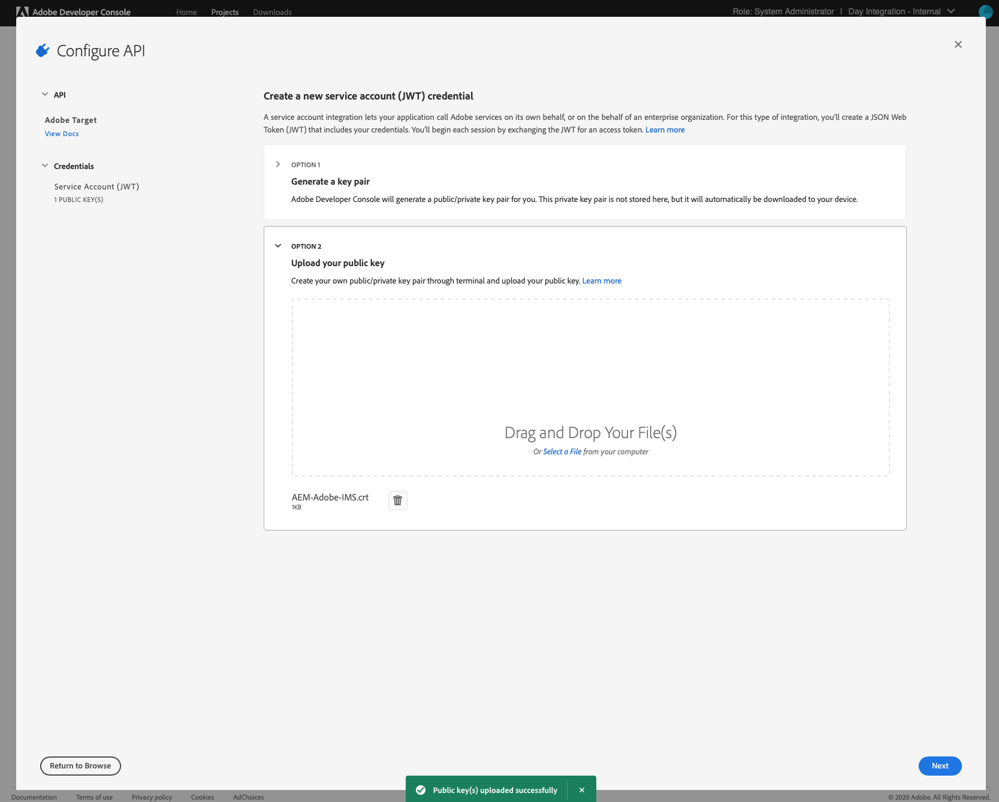

1. Review the credentials, and continue with **Next**:

   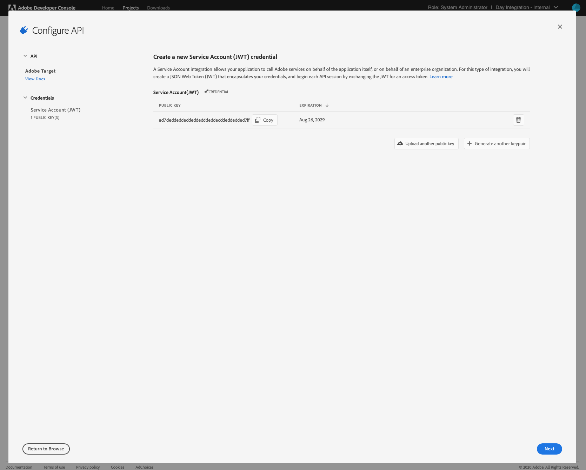

1. Select the required product profiles, and continue with **Save configured API**:

   >[!NOTE]
   >
   >The product profiles displayed with depend on whether you have:
   >
   >* Adobe Target Standard - only **Default Workspace** is available
   >* Adobe Target Premium - all available workspaces are listed, as shown below

   

1. The creation will be confirmed.

<!--
1. The creation will be confirmed, you can now **Continue to integration details**; these are needed for [Completing the IMS Configuration in AEM](#completing-the-ims-configuration-in-aem).

   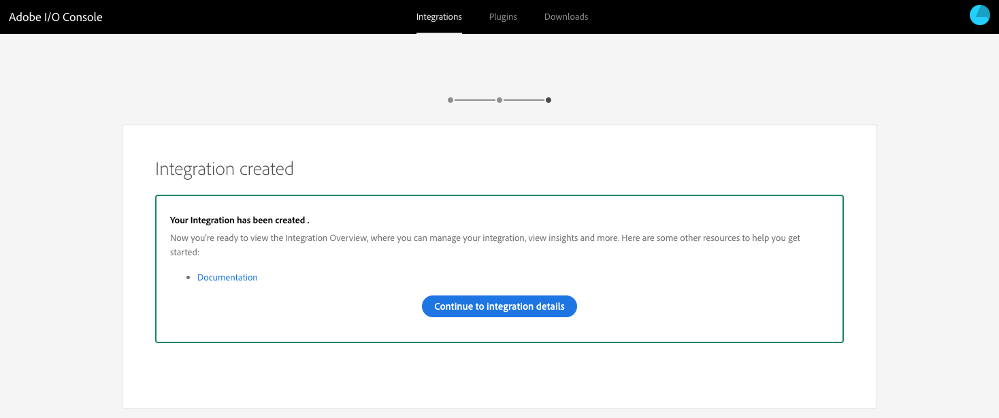
-->

### Assigning privileges to the Integration {#assigning-privileges-to-the-integration}

You must now assign the required privileges to the integration:

1. Open the Adobe **Admin Console**:

    * [https://adminconsole.adobe.com](https://adminconsole.adobe.com/)

1. Navigate to **Products** (top toolbar), then select **Adobe Target - &lt;*your-tenant-id*&gt;** (from the left panel).
1. Select **Product Profiles**, then your required workspace from the list presented. For example, Default Workspace.
1. Select **API Credentials**, then the required integration configuration.
1. Select **Editor** as the **Product Role**; instead of **Observer**.

## Details stored for the Adobe Developer Console Integration Project {#details-stored-for-the-ims-integration-project}

From the Adobe Developer Console - Projects you can see a list of all your integration projects:

* [https://developer.adobe.com/console/projects](https://developer.adobe.com/console/projects)

Select **View** (to the right of a specific project entry) to show further details about the configuration. These include:

* Project overview
* Insights
* Credentials
  * Service Account (JWT)
    * Credential details
    * Generate JWT
* APIS
  * For example, Adobe Target

Some of these you will need to complete the integration of Adobe Target in AEM based on IMS.

## Completing the IMS Configuration in AEM {#completing-the-ims-configuration-in-aem}

Returning to AEM you can complete the IMS configuration by adding required values from the Adobe Developer Console integration for Target:

1. Return to the [IMS Configuration open in AEM](#configuring-an-ims-configuration-generating-a-public-key).
1. Select **Next**.

1. Here you can use the [details from the project configuration in the Adobe Developer Console](#details-stored-for-the-ims-integration-project):

   * **Title**: Your text.
   * **Authorization Server**: Copy/paste this from the `aud` line of the **Payload** section below, e.g. `https://ims-na1.adobelogin.com` in the example below
   * **API Key**: Copy this from the [Overview](#details-stored-for-the-ims-integration-project) section 
   * **Client Secret**: Generate this in the [Overview](#details-stored-for-the-ims-integration-project) section, and copy
   * **Payload**: Copy this from the [Generate JWT](#details-stored-for-the-ims-integration-project) section 

   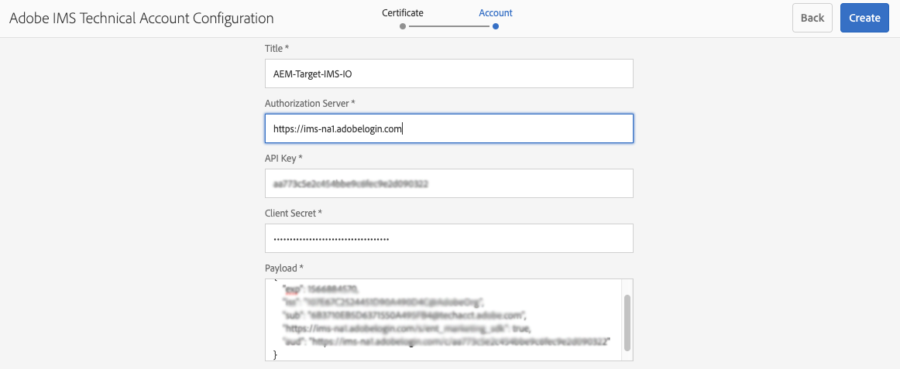

1. Confirm with **Create**.

1. Your Adobe Target configuration will be shown in the AEM console.

   

## Confirming the IMS Configuration {#confirming-the-ims-configuration}

To confirm that the configuration is operating as expected:

1. Open:

    * `https://localhost<port>/libs/cq/adobeims-configuration/content/configurations.html`

   For example:

    * `https://localhost:4502/libs/cq/adobeims-configuration/content/configurations.html`

1. Select your configuration.
1. Select **Check Health** from the toolbar, followed by **Check**.

   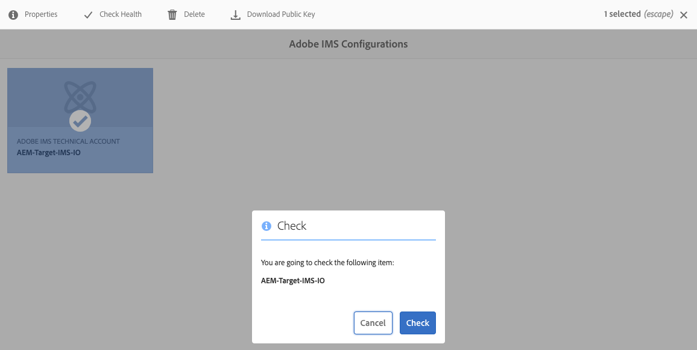

1. If successful, you will see the message:

   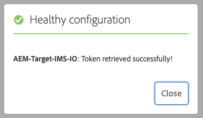

## Configuring the Adobe Target Cloud Service {#configuring-the-adobe-target-cloud-service}

The configuration can now be referenced for a Cloud Service to use the Target Standard API:

1. Open the **Tools** menu. Then, within the **Cloud Services** section, select **Legacy Cloud Services**.
1. Scroll down to **Adobe Target** and select **Configure now**.

   The **Create Configuration** dialog will open.

1. Enter a **Title** and, if you want, a **Name** (if left blank this will be generated from the title).

   You can also select the required template (if more than one is available).

1. Confirm with **Create**.

   The **Edit Component** dialog will open.

1. Enter the details in the **Adobe Target Settings** tab:

    * **Authentication**: IMS

    * **Tenant ID**: the Adobe IMS Tenant ID. See also the [Tenant ID and Client Code](#tenant-client) section.

      >[!NOTE]
      >
      >For IMS this value needs to be taken from Target itself. You can log into Target and extract the Tenant ID from the URL.
      >
      >For example, if the URL is:
      >
      >`https://experience.adobe.com/#/@yourtenantid/target/activities`
      >
      >Then you would use `yourtenantid`.

    * **Client Code**: See the [Tenant ID and Client Code](#tenant-client) section.

    * **IMS Configuration**: select the name of the IMS Configuration

    * **API Type**: REST

    * **A4T Analytics Cloud Configuration**: Select the Analytics cloud configuration that is used for target activity goals and metrics. You need this if you are using Adobe Analytics as the reporting source when targeting content. If you do not see your cloud configuration, see note in [Configuring A4T Analytics Cloud Configuration](/help/sites-administering/target-configuring.md#configuring-a-t-analytics-cloud-configuration).

    * **Use accurate targeting**: By default this check box is selected. If selected, the cloud service configuration will wait for the context to load before loading content. See note that follows.

    * **Synchronize segments from Adobe Target**: Select this option to download segments that are defined in Target to use them in AEM. You must select this option when the API Type property is REST, because inline segments are not supported and you always need to use segments from Target. (Note that the AEM term of 'segment' is equivalent to the Target 'audience'.)

    * **Client library**: Select whether you want the AT.js client library, or mbox.js (deprecated).

    * **Use Tag Management System to deliver client library**: Use DTM (deprecated), Adobe Launch or any other tag management system.

    * **Custom AT.js**: Leave blank if you checked the Tag Management box or to use the default AT.js. Alternatively upload your custom AT.js. Only appears if you have selected AT.js.

   >[!NOTE]
   >
   >[Configuration of a Cloud Service to use the Target Classic API](/help/sites-administering/target-configuring.md#manually-integrating-with-adobe-target) has been deprecated (uses the Adobe Recommendations Settings tab).

1. Click **Connect to Target** to initialize the connection with Adobe Target.

   If the connection is successful, the message **Connection successful** is displayed.

1. Select **OK** on the message, followed by **OK** on the dialog to confirm the configuration.

1. You can now proceed to [Adding a Target Framework](/help/sites-administering/target-configuring.md#adding-a-target-framework) to configure ContextHub or ClientContext parameters that will be sent to Target. Note this may not be required for exporting AEM Experience Fragments to Target.

### Tenant ID and Client Code {#tenant-client}

With [Adobe Experience Manager 6.5.8.0](/help/release-notes/release-notes.md), the Client Code field had been added to the Target configuration window.

When configuring the Tenant ID and Client Code fields, please be aware of the following:

1. For most customers, the Tenant ID and the Client Code are the same. This means that both fields contain the same information and are identical. Make sure you enter the Tenant ID in both fields.
2. For legacy purposes, you can also enter different values in the Tenant ID and the Client Code fields.

In both cases, be aware that:

* By default, the Client Code (if added first) will also be automatically copied into the Tenant ID field.
* You have the option to change the default Tenant ID set.
* Accordingly, the backend calls to Target will be based on the Tenant ID and the client side calls to Target will be based on the Client Code.

As stated previously, the first case is the most common for AEM 6.5. Either way, make sure **both** fields contain the correct information depending on your requirements.

>[!NOTE]
>
>If you want to change an existing Target Configuration:
>
>1. Re-enter the Tenant ID.
>2. Re-connect to Target.
>3. Save the configuration.
