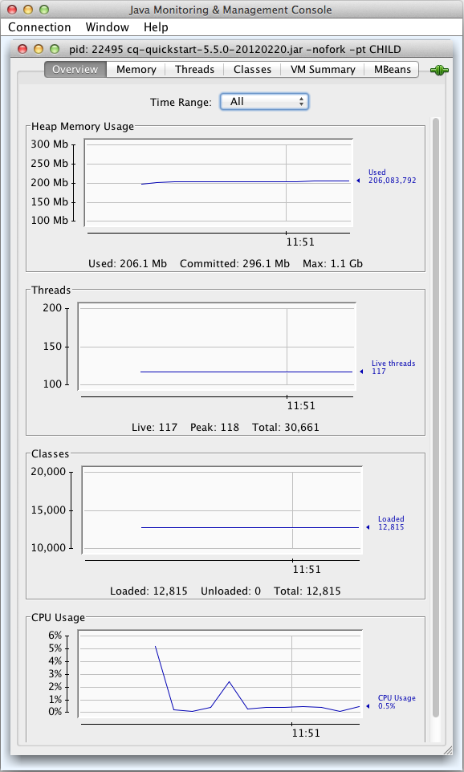

# Monitoring Server Resources Using the JMX Console{#monitoring-server-resources-using-the-jmx-console}

The JMX Console enables you to monitor and manage services on the CRX server. The sections that follow summarize the attributes and operations that are exposed through the JMX framework.

For information about how to use the console controls, see [Using the JMX Console](#using-the-jmx-console). For background information about JMX, see the [Java Management Extensions (JMX) Technology](https://www.oracle.com/technetwork/java/javase/tech/javamanagement-140525.html) page on the Oracle website.

For information about creating MBeans to manage your services using the JMX Console, see [Integrating Services with the JMX Console](/help/sites-developing/jmx-integration.md).

## Workflow Maintenance {#workflow-maintenance}

Operations for administering running, completed, stale, and failed workflow instances.

* Domain: com.adobe.granite.workflow
* Type: Maintenance

>[!NOTE]
>
>See the [workflow console](/help/sites-administering/workflows-administering.md) for additional workflow administration tools and descriptions of possible workflow instance statuses.

### Operations {#operations}

**listRunningWorkflowsPerModel** Lists the number of workflow instances that are running for each workflow model.

* Arguments: none
* Returned value: Tabular data containing the Count and ModelId columns.

**listCompletedWorkflowsPerModel** Lists the number of completed workflow instances for each workflow model.

* Arguments: none
* Returned value: Tabular data containing the Count and ModelId columns.

**returnWorkflowQueueInfo** Lists information about workflow items that have been processed and that are queued for processing.

* Arguments: none
* Returned value: Tablular data containing the following columns:

    * Jobs
    * Queue Name
    * Active Jobs
    * Average Processing Time
    * Average Waiting Time
    * Cancelled Jobs
    * Failed Jobs
    * Finished Jobs
    * Processed Jobs
    * Queued Jobs

**returnWorkflowJobTopicInfo** Lists processing information for workflow jobs, organized by topic.

* Arguments: none
* Returned value: Tabular data containing the following columns:

    * Topic Name
    * Average Processing Time
    * Average Waiting Time
    * Cancelled Jobs
    * Failed Jobs
    * Finished Jobs
    * Processed Jobs

**returnFailedWorkflowCount** Shows the number of workflow instances that have failed. You can specify a workflow model to query or retrieve information for all workflow models.

* Arguments:

    * model: The ID of the model to query. To see a count of failed workflow instances for all workflow models, specify no value. The ID is the path to the model node, for example:

      `/conf/global/settings/workflow/models/dam/update_asset/jcr:content/model`

* Returned value: The number of failed workflow instances.

**returnFailedWorkflowCountPerModel** Shows the number of workflow instances that have failed for each workflow model.

* Arguments: none.
* Returned value: Tabular data containing the Count and Model ID columns.

**terminateFailedInstances** Terminate workflow instances that have failed. You can terminate all failed instances or only the failed instances for a specific model. Optionally you can restart the instances after they are terminated. You can also test the operation to see the results without actually performing the operation.

* Arguments:

    * Restart the instance: (Optional) Specify a value of `true` to restart the instances after they are terminated. The default value of `false` causes no restarting of terminated workflow instances.
    * Dry run: (Optional) Specify a value of `true` to see the results of the operation without actually performing the operation. The default value of `false` causes the operation to be performed.
    * Model: (Optional) The ID of the model to which the operation is applied. Specify no model to apply the operation to the failed instances of all workflow models. The ID is the path to the model node, for example:

      `/conf/global/settings/workflow/models/dam/update_asset/jcr:content/model`

* Returned value: Tablular data about the instances that are terminated, containing the following columns:

    * Initiator
    * InstanceId
    * ModelId
    * Payload
    * StartComment
    * WorkflowTitle

**retryFailedWorkItems** Attempts to execute work item steps that have failed. You can retry all failed work items or only the failed work items for a specific workflow model. You optionally test the operation to see the results without actually performing the operation.

* Arguments:

    * Dry run: (Optional) Specify a value of `true` to see the results of the operation without actually performing the operation. The default value of `false` causes the operation to be performed.
    * Model: (Optional) The ID of the model to which the operation is applied. Specify no model to apply the operation to the failed work items of all workflow models. The ID is the path to the model node, for example:

      `/conf/global/settings/workflow/models/dam/update_asset/jcr:content/model`

* Returned value: Tablular data about the failed work items that are retried, including the following columns:

    * Initiator
    * InstanceId
    * ModelId
    * Payload
    * StartComment
    * WorkflowTitle

**PurgeActive** Removes active workflow instances of a specific age. You can purge active instances for all models or only the instances for a specific model. You can optionally test the operation to see the results without actually performing the operation.

* Arguments:

    * Model: (Optional) The ID of the model to which the operation is applied. Specify no model to apply the operation to the workflow instances of all workflow models. The ID is the path to the model node, for example:

      `/conf/global/settings/workflow/models/dam/update_asset/jcr:content/model`
    * Number of days since workflow started: The age of the workflow instances to purge, in days.
    * Dry run: (Optional) Specify a value of `true` to see the results of the operation without actually performing the operation. The default value of `false` causes the operation to be performed.

* Returned value: Tabular data about the active workflow instances that are purged, including the following columns:

    * Initiator
    * InstanceId
    * ModelId
    * Payload
    * StartComment
    * WorkflowTitle

**countStaleWorkflows** Returns the number of workflow instances that are stale. You can retrieve the number of stale instances for all workflow models or for a specific model.

* Arguments:

    * Model: (Optional) The ID of the model to which the operation is applied. Specify no model to apply the operation to the workflow instances of all workflow models. The ID is the path to the model node, for example:

      `/conf/global/settings/workflow/models/dam/update_asset/jcr:content/model`

* Returned value: The number of stale workflow instances.

**restartStaleWorkflows** Restarts stale workflow instances. You can restart all stale instances or only the stale instances for a specific model. You can also test the operation to see the results without actually performing the operation.

* Arguments:

    * Model: (Optional) The ID of the model to which the operation is applied. Specify no model to apply the operation to the stale instances of all workflow models. The ID is the path to the model node, for example:

      `/conf/global/settings/workflow/models/dam/update_asset/jcr:content/model`
    * Dry run: (Optional) Specify a value of `true` to see the results of the operation without actually performing the operation. The default value of `false` causes the operation to be performed.

* Returned value: A list of workflow instances that are restarted.

**fetchModelList** Lists all workflow models.

* Arguments: none
* Returned value: Tablular data that identifies the workflow models including the ModelId and ModelName columns.

**countRunningWorkflows** Returns the number of workflow instances that are running. You can retrieve the number of running instances for all workflow models or for a specific model.

* Arguments:

    * Model: (Optional) The ID of the model for which the number of running instances is returned. Specify no model to return the number of running instances of all workflow models. The ID is the path to the model node, for example:

      `/conf/global/settings/workflow/models/dam/update_asset/jcr:content/model`

* Returned value: The number of running workflow instances.

**countCompletedWorkflows** Returns the number of workflow instances that are completed. You can retrieve the number of completed instances for all workflow models or for a specific model.

* Arguments:

    * Model: (Optional) The ID of the model for which the number of completed instances is returned. Specify no model to return the number of completed instances of all workflow models. The ID is the path to the model node, for example:

      `/conf/global/settings/workflow/models/dam/update_asset/jcr:content/model`

* Returned value: The number of completed workflow instances.

**purgeCompleted** Removes records of completed workflows of a specific age from the repository. Use this operation periodically to minimize the size of the repository when you make heavy use of workflows. You can purge completed instances for all models or only the instances for a specific model. You can optionally test the operation to see the results without actually performing the operation.

* Arguments:

    * Model: (Optional) The ID of the model to which the operation is applied. Specify no model to apply the operation to the workflow instances of all workflow models. The ID is the path to the model node, for example:

      `/conf/global/settings/workflow/models/dam/update_asset/jcr:content/model`
    * Number of days since workflow has been completed: The number of days that the workflow instances have been in the completed state.
    * Dry run: (Optional) Specify a value of `true` to see the results of the operation without actually performing the operation. The default value of `false` causes the operation to be performed.

* Returned value: Tabular data about the completed workflow instances that are purged, including the following columns:

    * Initiator
    * InstanceId
    * ModelId
    * Payload
    * StartComment
    * WorkflowTitle

## Repository {#repository}

Information about the CRX repository

* Domain: com.adobe.granite
* Type: Repository

### Attributes {#attributes}

**Name** The name of the JCR repository implementation. Read-only.

**Version** The repository implementation version. Read-only.

**HomeDir** The directory where the repository is located. The default location is <QuickStart_Jar_Location>/crx-quickstart/repository. Read-only.

**CustomerName** The name of the customer that the software license is issued to. Read-only.

**LicenseKey** The unique license key for this installation of the repository. Read-only.

**AvailableDiskSpace** The disk space that is available to this instance of the repository, in Mbytes. Read-only.

**MaximumNumberOfOpenFiles** The number of files that can be opened at one time. Read-only.

**SessionTracker** The value of the crx.debug.sessions system variable. true indicates a debug session. false indicates a normal session. Read/write.

**Descriptors** A set of key-value pairs that represent repository properties. All properties are read-only.

<table>
 <tbody>
  <tr>
   <th>Key</th>
   <th>Value</th>
  </tr>
  <tr>
   <td>option.node.and.property.with.same.name.supported</td>
   <td>Indicates whether a node and a property of the node can have the same name. true indicates same names are supported, false indicates it is not supported. </td>
  </tr>
  <tr>
   <td>identifier.stability</td>
   <td>Indicates the stability of non-referenceable node identifiers. The following values are possible:
    <ul>
     <li>identifier.stability.indefinite.duration: Identifiers do not change.</li>
     <li>identifier.stability.method.duration: Identifiers can change between method calls.</li>
     <li>identifier.stability.save.duration: Identifiers do not change within a save/refresh cycle.</li>
     <li>identifier.stability.session.duration: Identifiers do not change during a session.</li>
    </ul> </td>
  </tr>
  <tr>
   <td>query.xpath.pos.index</td>
   <td>Indicates whether the JCR 1.0 XPath query language is supported. true indicates support, and false indicates no support.</td>
  </tr>
  <tr>
   <td>crx.repository.systemid</td>
   <td>The system identifier as found in the system.id file.</td>
  </tr>
  <tr>
   <td>option.query.sql.supported</td>
   <td>Indicates whether the JCR 1.0 XPath query language is supported. true indicates support, and false indicates no support.</td>
  </tr>
  <tr>
   <td>jcr.repository.version</td>
   <td>The version of the repository implementation.</td>
  </tr>
  <tr>
   <td>option.update.primary.node.type.supported</td>
   <td>Indicates whether the primary node type of a node can be changed. true indicates you can change the primary node type, and false indicates the change is not supported.</td>
  </tr>
  <tr>
   <td>option.node.type.management.supported</td>
   <td>Indicates whether node type management is supported. true indicates it is supported, and false indicates no support.</td>
  </tr>
  <tr>
   <td>node.type.management.overrides.supported</td>
   <td>Indicates whether you can override the inherited property or child node definition of a node type. true indicates overrides are supported, and false indicates no overrides.</td>
  </tr>
  <tr>
   <td>option.observation.supported</td>
   <td>true indicates that asynchronous observation of repository changes is supported. Support of asynchronous observation enables applications to recieve and respond to notifications about each change as they occur.</td>
  </tr>
  <tr>
   <td>query.jcrscore</td>
   <td><p>true indicates indicates that the jcr:score pseudo-property is available in XPath and SQL queries that include a jcrfn:contains (in XPath) or CONTAINS (in SQL) function to perform a full-text search.</p> </td>
  </tr>
  <tr>
   <td>option.simple.versioning.supported</td>
   <td>true indicates that the repository supports simple versioning. With simple versioning, the repository maintains a sequential series of versions of a node.</td>
  </tr>
  <tr>
   <td>option.workspace.management.supported</td>
   <td>true indicates that the repository supports the creation and deletion of workspaces using APIs.</td>
  </tr>
  <tr>
   <td>option.update.mixin.node.types.supported</td>
   <td>true indicates that the repository supports the addition and removal of mixin node types of an existing node.</td>
  </tr>
  <tr>
   <td>node.type.management.primary.item.name.supported</td>
   <td>true indicates that the repository enables node definitions to contain a primary item as a child. A primary item is accessible using the API without knowing the item name.</td>
  </tr>
  <tr>
   <td>level.2.supported</td>
   <td>true indicates that both LEVEL_1_SUPPORTED and OPTION_XML_IMPORT_SUPPORTED are true.</td>
  </tr>
  <tr>
   <td>write.supported</td>
   <td>true indicates that the repository provides write-access using the API. false indicates read-only access.</td>
  </tr>
  <tr>
   <td>node.type.management.update.in.use.supported</td>
   <td>true indicates that you can change node definitions that are in-use by existing nodes.</td>
  </tr>
  <tr>
   <td>jcr.specification.version</td>
   <td>The version of the JCR specification that the repository implements.</td>
  </tr>
  <tr>
   <td>option.journaled.observation.supported</td>
   <td>true indicates that applications can perfom journaled observation of the repository. with journaled observation, a set of change notifications can be obtained for a specific period of time. </td>
  </tr>
  <tr>
   <td>query.languages</td>
   <td>The query languages that the repository supports. No value indicates no query support.</td>
  </tr>
  <tr>
   <td>option.xml.export.supported</td>
   <td>true indicates that the repository supports exporting nodes as XML code.</td>
  </tr>
  <tr>
   <td>node.type.management.multiple.binary.properties.supported</td>
   <td>true indicates that the repository supports the registration of node types that have multiple binary properties. false indicates a single binary property is supported for a node type.</td>
  </tr>
  <tr>
   <td>option.access.control.supported</td>
   <td>true indicates that the repository supports access control, for setting and determining user privileges for node access.</td>
  </tr>
  <tr>
   <td>option.baselines.supported</td>
   <td>true indicates that the repository supports both configurations and baselines.</td>
  </tr>
  <tr>
   <td>option.shareable.nodes.supported</td>
   <td>true indicates that the repository supports the creation of shareable nodes.</td>
  </tr>
  <tr>
   <td>crx.cluster.id</td>
   <td>The identifier of the repository cluster.</td>
  </tr>
  <tr>
   <td>query.stored.queries.supported</td>
   <td>true indicates that the repository supports stored queries.</td>
  </tr>
  <tr>
   <td>query.full.text.search.supported</td>
   <td>true indicates that the repository supports full-text search.</td>
  </tr>
  <tr>
   <td>node.type.management.inheritance</td>
   <td><p>Indicates the level of repository support for node type inheritance. The following values are possible:</p> <p>node.type.management.inheritance.minimal: Registration of primary node types is limited to those that have only nt:base as a supertype. Registration of mixin node types is limited to those with no supertype.</p> <p>node.type.management.inheritance.single: Registration of primary node types is limited to those with one supertype. Registration of mixin node types is limited to those with at most one supertype.</p> <p><br /> node.type.management.inheritance.multiple: Primary node types can be registered with one or more supertypes. Mixin node types can be registered with zero or more supertypes.</p> </td>
  </tr>
  <tr>
   <td>crx.cluster.preferredMaster</td>
   <td>true indicates that this cluster node is the preferred master of the cluster.</td>
  </tr>
  <tr>
   <td>option.transactions.supported</td>
   <td>true indicates that the repository supports transactions.</td>
  </tr>
  <tr>
   <td>jcr.repository.vendor.url</td>
   <td>The URL of the repository vendor.</td>
  </tr>
  <tr>
   <td>node.type.management.value.constraints.supported</td>
   <td>true indicates that the repository supports value constraints for node properties.</td>
  </tr>
  <tr>
   <td>node.type.management.property.types</td>
   <td>an array of javax.jcr.PropertyType constants that represent the property types that a registered node type can specify. A zero-length array indicates registered node types cannot specify property definitions. Property types are STRING, URI, BOOLEAN, LONG, DOUBLE, DECIMAL, BINARY, DATE, NAME, PATH, WEAKREFERENCE, REFERENCE, and UNDEFINED (if supported)</td>
  </tr>
  <tr>
   <td>node.type.management.orderable.child.nodes.supported</td>
   <td>true indicates that the repository supports the preservation of the order of child nodes.</td>
  </tr>
  <tr>
   <td>jcr.repository.vendor</td>
   <td>The name of the repository vendor.</td>
  </tr>
  <tr>
   <td>query.joins</td>
   <td><p>The level of support for joins in queries. The following values are possible:</p>
    <ul>
     <li>query.joins.none: No support for joins. Queries can use one selector.</li>
     <li>query.joins.inner: Support for inner joins.</li>
     <li>query.joins.inner.outer: Support for inner and outer joins.</li>
    </ul> </td>
  </tr>
  <tr>
   <td>org.apache.jackrabbit.spi.commons.AdditionalEventInfo</td>
   <td> </td>
  </tr>
  <tr>
   <td>query.xpath.doc.order</td>
   <td>true indicates that the repository supports the XPath 1.0 query language.</td>
  </tr>
  <tr>
   <td>query.jcrpath</td>
   <td> </td>
  </tr>
  <tr>
   <td>option.xml.import.supported</td>
   <td>true indicates that the repository supports the importing XML code as content.</td>
  </tr>
  <tr>
   <td>node.type.management.same.name.siblings.supported</td>
   <td>true indicates that the repository supports sibling nodes (nodes with the same parent) with the same names.</td>
  </tr>
  <tr>
   <td>node.type.management.residual.definitions.supported</td>
   <td>true indicates that the repository supports name properties with residual definitions. When supported, the name attribute of an item definition can be an asterisk ("*").</td>
  </tr>
  <tr>
   <td>node.type.management.autocreated.definitions.supported</td>
   <td>true indicates that the repository supports the automatic creation of child items (nodes or properties) of a node when the node is created.</td>
  </tr>
  <tr>
   <td>crx.cluster.master</td>
   <td>true indicates this repository node is the master node of the cluster.</td>
  </tr>
  <tr>
   <td>level.1.supported</td>
   <td>true indicates that option.xml.export.support is true and query.languages is of non-zero length.</td>
  </tr>
  <tr>
   <td>option.unfiled.content.supported</td>
   <td>true indicates that the repository supports unfiled content. Unfiled nodes are not part of the repository hierarchy.</td>
  </tr>
  <tr>
   <td>jcr.specification.name</td>
   <td>The name of the JCR specification that the repository implements.</td>
  </tr>
  <tr>
   <td>option.versioning.supported</td>
   <td>true indicates that the repository supports full versioning.</td>
  </tr>
  <tr>
   <td>jcr.repository.name</td>
   <td>The name of the repository.</td>
  </tr>
  <tr>
   <td>option.locking.supported</td>
   <td>true indicates that the repository supports the locking of nodes. Locking enables a user to temporarily prevent other users from making changes.</td>
  </tr>
  <tr>
   <td>jcr.repository.version.display</td>
   <td> </td>
  </tr>
  <tr>
   <td>option.activities.supported</td>
   <td>true indicates that the repository supports activities. Activities are a set of changes that are performed in a workspace that are merged into another workspace.</td>
  </tr>
  <tr>
   <td>node.type.management.multivalued.properties.supported</td>
   <td>true indicates that the repository supports node properties that can have zero or more values.</td>
  </tr>
  <tr>
   <td>option.retention.supported</td>
   <td>true indicates that the repository supports the use of external retention management applications to apply retention policies to content and supports hold and release.</td>
  </tr>
  <tr>
   <td>option.lifecycle.supported</td>
   <td>true indicates that the repository supports lifecycle management.</td>
  </tr>
 </tbody>
</table>

**WorkspaceNames** The names of the workspaces in the repository. Read-only.

**DataStoreGarbageCollectionDelay** The amount of time in milliseconds that garbage collection sleeps after scanning every tenth node. Read/write.

**BackupDelay** The amount of time in milliseconds that the backup process sleeps between each step of the backup. Read/write.

**BackupInProgress** A value of true indicates that a backup process is executing. Read-only.

**BackupProgress** For the current backup, the percentage of all files that have been backed up. Read-only.

**CurrentBackupTarget** For the current backup, the ZIP file where backup files are being stored. When a backup is not in progress, no value appears. Read-only.

**BackupWasSuccessful** A value of true indicates that no errors have occurred during the current backup, or no backup is in progress. false indicates an error occurred during the current backup. Read-only.

**BackupResult** The status of the current backup. The following values are possible:

* Backup in progress: A backup is currently executing.
* Backup canceled: The backup has been cancelled.
* Backup finished with error: An error occurred during the backup. The error message provides information about the cause.
* Backup completed: The backup was successful.
* No backup executed so far: There is no backup in progress.

Read-only.

**TarOptimizationRunningSince** The time at which the current TAR file optimization process began. Read-only.

**TarOptimizationDelay** The amount of time in milliseconds that the TAR optimization process sleeps between each step of the process. Read/write.

**ClusterProperties** A set of key-value pairs that represent cluster properties and values. Each row in the table represents a cluster property. Read-only.

**ClusterNodes** The members of the repository cluster.

**ClusterId** The identifier of this repository cluster. Read-only.

**ClusterMasterId** The identifier of the master node of this repository cluster. Read-only.

**ClusterNodeId** The identifier of this node of the repository cluster. Read-only.

### Operations {#operations-1}

**createWorkspace** Creates a workspace in this repository.

* Arguments:

    * name: A String value that represents the name of the new workspace.

* Returned value: none

**runDataStoreGarbageCollection** Executes garbage collection on the repository nodes.

* Arguments:

    * delete: A Boolean value that indicates whether to delete unused repository items. A value of true causes the deletion of unused nodes and properties. A value of false causes all nodes to be scanned but none are deleted.

* Returned value: none

**stopDataStoreGarbageCollection** Stops a running data store garbage collection.

* Arguments: none
* Returned value: string representation of the current status

**startBackup** Backs up repository data in a ZIP file.

* Arguments:

    * `target`: (Optional) A `String` value that represents the name of the ZIP file or directory in which to archive the repository data. To use a ZIP file, Include the ZIP file name extension. To use a directory, include no file name extension.

      To perform an incremental backup, specify the directory that was previously used for the backup.

      You can specify an absolute or a relative path. Relative paths are relative to the parent of the crx-quickstart directory.

      When you specify no value, the default value of `backup-currentdate.zip` is used, where `currentdate` is in the format `yyyyMMdd-HHmm`.

* Returned value: none

**cancelBackup** Stops the current backup process and deletes the temporary archive that the process created for archiving data.

* Arguments: none
* Returned value: none

**blockRepositoryWrites** Blocks changes to the repository data. All repository backup listeners are notified of the block.

* Arguments: none
* Returned value: none

**unblockRepositoryWrites** Removes the block from the repository. All repository backup listeners are notified of the block removal.

* Arguments: none
* Returned value: none

**startTarOptimization** Starts the TAR file optimization process using the default value for tarOptimizationDelay.

* Arguments: none
* Returned value: none

**stopTarOptimization** Stops TAR file optimization.

* Arguments: none
* Returned value: none

**tarIndexMerge** Merges the top index files of all TAR sets. Top index files are files with different major versions. For example, the following files are merged into the file index_3_1.tar: index_1_1.tar, index_2_0.tar, index_3_0.tar. The files that have been merged are deleted (in the previous example, index_1_1.tar, index_2_0.tar, and index_3_0.tar are deleted).

* Arguments:

    * `background`: A Boolean value that indicates whether to run the operation in the background so that the Web Console is usable during execution. A value of true runs the operation in the background.

* Returned value: none

**becomeClusterMaster** Sets this repository node as the master node of the cluster. If not already master, this command stops the current master instance's listener and starts a master listener on the current node. This node is then set as the master node and restarts, causing all other nodes in the cluster (that is, those that are controlled by the master) to connect to this instance.

* Arguments: none
* Returned value: none

**joinCluster** Adds this repository to a cluster as a node that is controlled by the cluster master. Provide a user name and password for authentication purposes. The connection uses basic authentication. The security credentials are base-64 encoded before being sent to the server.

* Arguments:

    * `master`: A string value that represents the IP address or computer name of the computer that runs the master repository node.
    * `username`: The name to use to authenticate with the cluster.
    * `password`: The password to use for authentication.

* Returned value: none

**traversalCheck** Traverses and optionally fixes inconsistencies in a subtree beginning at a specific node. This is covered in full detail in the documentation on Persistence Managers.

**consistencyCheck** Checks and optionally fixes consistency in the Datastore. This is covered in full detail in the documentation on the Datastore.

## Repository Statistics (TimeSeries) {#repository-statistics-timeseries}

The value of the TimeSeries field for each statistic type that `org.apache.jackrabbit.api.stats.RepositoryStatistics` defines.

* Domain: `com.adobe.granite`
* Type: `TimeSeries`
* Name: One of the following values from the `org.apache.jackrabbit.api.stats.RepositoryStatistics.Type` Enum class:

    * BUNDLE_CACHE_ACCESS_COUNTER
    * BUNDLE_CACHE_MISS_AVERAGE
    * BUNDLE_CACHE_MISS_COUNTER
    * BUNDLE_CACHE_MISS_DURATION
    * BUNDLE_CACHE_SIZE_COUNTER
    * BUNDLE_COUNTER
    * BUNDLE_READ_COUNTER
    * BUNDLE_WRITE_AVERAGE
    * BUNDLE_WRITE_COUNTER
    * BUNDLE_WRITE_DURATION
    * BUNDLE_WS_SIZE_COUNTER
    * QUERY_AVERAGE
    * QUERY_COUNT
    * QUERY_DURATION
    * SESSION_COUNT
    * SESSION_LOGIN_COUNTER
    * SESSION_READ_AVERAGE
    * SESSION_READ_COUNTER
    * SESSION_READ_DURATION
    * SESSION_WRITE_AVERAGE
    * SESSION_WRITE_COUNTER
    * SESSION_WRITE_DURATION

### Attributes {#attributes-1}

The following attributes are provided for each statistic type that is reported:

* ValuePerSecond: The measured value per second over the last minute. Read-only.
* ValuePerMinute: The measured value per minute over the last hour. Read-only.
* ValuePerHour: The measured value per hour over the last week. Read-only.
* ValuePerWeek: The measured value per week over the last three years. Read-only.

## Repository Query Stats {#repository-query-stats}

Statistical information about repository queries.

* Domain: com.adobe.granite
* Type: QueryStat

### Attributes {#attributes-2}

**SlowQueries** Information about the repository queries that have taken the longest time to complete. Read-only.

**SlowQueriesQueueSize** The maximum number of queries to include in the SlowQueries list. Read-write.

**PopularQueries** Information about the repository queries that have occurred the most. Read-only.

**PopularQueriesQueueSize** The maximum number of queries in the PopularQueries list. Read-write.

### Operations {#operations-2}

**clearSlowQueriesQueue** Removes all queries from the SlowQueries list.

* Arguments: none
* Returned value: none

**clearPopularQueriesQueue** Removes all queries from the PopularQueries list.

* Arguments: none
* Returned value: none

## Replication Agents {#replication-agents}

Monitor the services for each replication agent. When you create a replication agent, the service automatically appears in the JMX console.

* **Domain:** com.adobe.granite.replication
* **Type:** agent
* **Name:** no value
* **Properties:** {id="*Name*"}, where *Name* is the value of the agent Name property.

### Attributes {#attributes-3}

**Id** A String value that represents the identifier of the replication agent configuration. Multiple agents can use the same configuration. Read-only.

**Valid** A boolean value that indicates whether the agent is configured correctly:

* `true`: Valid configuration.
* `false` : The configuration contains errors.

Read-only.

**Enabled** A boolean value that indicates whether the agent is enabled:

* `true`: Enabled.
* `false`: Disabled.

**QueueBlocked** A boolean value that indicates whether the queue exists and is blocked:

* `true`: Blocked. An automatic retry is pending.
* `false`: Not blocked or does not exist.

Read-only.

**QueuePaused** A boolean value that indicates whether the job queue is paused:

* `true`: Paused (suspended)
* `false`: Not paused or does not exist.

Read-write.

**QueueNumEntries** An int value that represents the number of jobs in the agent queue. Read-only.

**QueueStatusTime** A Date value that indicates the time on the server when the displayed status values were obtained. The value corresponds with the time that the page was loaded. Read-only.

**QueueNextRetryTime** For blocked queues, a Date value that indicates when the next automatic retry occurs. When no time appears, the queue is not blocked. Read-only.

**QueueProcessingSince** A Date value that indicates when processing began for the current job. When no time appears, the queue is either blocked or idle. Read-only.

**QueueLastProcessTime** A Date value that indicates when the previous job was completed. Read-only.

### Operations {#operations-3}

**queueForceRetry** For blocked queues, issues the retry command to the queue.

* Arguments: none
* Returned value: none

**queueClear** Removes all jobs from the queue.

* Arguments: none
* Returned value: none

## Sling Engine {#sling-engine}

Provides statistics about HTTP requests so that you can monitor the performance of the SlingRequestProcessor service.

* Domain: org.apache.sling
* Type: engine
* Properties: {service=RequestProcessor}

### Attributes {#attributes-4}

**RequestsCount** The number of requests that have occurred since the statistics were last reset.

**MinRequestDurationMsec** The shortest amount of time (in milliseconds) that was required to process a request since the statistics were last reset.

**MaxRequestDuratioMsec** The longest amount of time (in milliseconds) that was required to process a request since the statistics were last reset.

**StandardDeviationDurationMsec** The standard deviation of the amount of time that was required to process requests. The standard deviation is calculated using all requests since the statistics were last reset.

**MeanRequestDurationMsec** The mean amount of time that was required to process a request. The mean is calculated using all requests since the statistics were last reset

### Operations {#operations-4}

**resetStatistics** Sets all statistics to zero. Reset the statistics when you need to analyze request processing performance during a specific time frame.

* Arguments: none
* Returned value: none

**id** The String representation of the package ID.

**installed** A boolean value that indicates whether the package is installed:

* `true`: Installed.
* `false`: Not installed.

**installedBy** The ID of the user who last installed the package.

**installedDate** The date when the package was last installed.

**size** A long value that holds the size of the package in bytes.


## Quickstart Launcher {#quickstart-launcher}

Information about the startup process and the Quickstart launcher.

* Domain: com.adobe.granite.quickstart
* Type: Launcher

### Operations {#operations-5}

**log**

Displays a message in the QuickStart window.

Arguments:

* p1: A `String` value that represents the message to display. 
* Returned value: none

**startupFinished**

Calls the startupFinished method of the server launcher. The method attempts to open the Welcome page in a web browser.

* Arguments: none
* Returned value: none

**startupProgress**

Sets the completion value of the server startup process. The progress bar on the QuickStart window represents the completion value.

* Arguments:
  * p1: A Float value that represents how much of the startup process is complete, as a fraction. The value should be between zero and one. For example, 0.3 indicates 30% complete.
* Returned value: none.

## Third-Party Services {#third-party-services}

Several third-party server resources install MBeans that expose attributes and operations to the JMX console. The following table lists the third-party resources and provides links to more information.

<table>
 <tbody>
  <tr>
   <th>Domain</th>
   <th>Type</th>
   <th>MBean Class</th>
  </tr>
  <tr>
   <td>JMImplementation</td>
   <td>MBeanServerDelegate</td>
   <td><a href="https://docs.oracle.com/javase/8/docs/api/javax/management/MBeanServerDelegate.html">javax.management.MBeanServerDelegate</a></td>
  </tr>
  <tr>
   <td>com.sun.management</td>
   <td>HotSpotDiagnostic</td>
   <td><a href="https://docs.oracle.com/javase/8/docs/jre/api/management/extension/com/sun/management/HotSpotDiagnosticMXBean.html">com.sun.management.HotSpotDiagnosticMXBean</a></td>
  </tr>
  <tr>
   <td>java.lang</td>
   <td>
    <ul>
     <li>ClassLoading</li>
     <li>Compilation</li>
     <li>GarbageCollector</li>
     <li>Memory</li>
     <li>MemoryManager</li>
     <li>MemoryPool</li>
     <li>OperatingSystem</li>
     <li>Runtime</li>
     <li>Threading</li>
    </ul> </td>
   <td><a href="https://docs.oracle.com/javase/8/docs/api/javax/management/package-summary.html">javax.management</a> package</td>
  </tr>
  <tr>
   <td>java.util.logging</td>
   <td> </td>
   <td><a href="https://docs.oracle.com/javase/8/docs/api/java/util/logging/LoggingMXBean.html">java.util.logging.LoggingMXBean</a></td>
  </tr>
  <tr>
   <td>osgi.core</td>
   <td>
    <ul>
     <li>bundleState</li>
     <li>framework</li>
     <li>packageState</li>
     <li>serviceState</li>
    </ul> </td>
   <td><a href="https://osgi.org/specification/osgi.enterprise/7.0.0/service.jmx.html#d0e42567">org.osgi.jmx.framework</a> package</td>
  </tr>
 </tbody>
</table>

## Using the JMX Console {#using-the-jmx-console}

The JMX Console displays information about several services that are running on the server:

* Attributes: Service properties such as configurations or runtime data. Attributes can be read-only or read-write.
* Operations: Commands that you can invoke on the service.

MBeans that are deployed with an OSGi service expose service attributes and operations to the console. The MBean determines the attributes and operations that are exposed, and whether the attributes are read-only or read-write.

The main page of the JMX console includes a table of services. Each row in the table represents a service that is exposed by an MBean.

1. Open the Web Console and click the JMX tab. ([http://localhost:4502/system/console/jmx](http://localhost:4502/system/console/jmx))
2. Click a cell value for a service to see the attributes and operations for the service.
3. To change an attribute value, click the value, specify the value in the dialog box that appears, and click Save.
4. To invoke a service operation, click the operation name, specify argument values in the dialog box that appears, and click Invoke.

## Using External JMX Applications for Monitoring {#using-external-jmx-applications-for-monitoring}

CRX allows external applications to interact with Managed Beans (MBeans) via [Java Management Extensions (JMX)](https://docs.oracle.com/javase/6/docs/technotes/guides/management/overview.html). Using generic consoles such as [JConsole](https://java.sun.com/developer/technicalArticles/J2SE/jconsole.html) or domain-specific monitoring applications, allows getting and setting CRX configurations and properties, and the monitoring of performance and resource usage.

### Using JConsole to connect to CRX {#using-jconsole-to-connect-to-crx}

To connect to CRX using JConsole, follow these steps:

1. Open a terminal window.
1. Enter the following command:

   `jconsole`

JConsole will start and the JConsole window will appear.

### Connecting to a local CRX process {#connecting-to-a-local-crx-process}

JConsole will display a list of local Java Virtual Machine processes. The list will contain two quickstart processes. Select the quickstart "CHILD" process from the list of local processes (usually the one with the higher PID).


### Connecting to a remote CRX process {#connecting-to-a-remote-crx-process}

To connect to a remote CRX process, the JVM that hosts the remote CRX process must be enabled to accept remote JMX connections.

To enable remote JMX connections, the following system property must be set when starting the JVM:

`com.sun.management.jmxremote.port=portNum`

In the property above, `portNum` is the port number through which you want to enable JMX RMI connections. Be sure to specify an unused port number. In addition to publishing an RMI connector for local access, setting this property publishes an additional RMI connector in a private read-only registry at the specified port using a well known name, "jmxrmi".

By default, when you enable the JMX agent for remote monitoring, it uses password authentication based on a password file that needs to be specified using the following system property when starting the Java VM:

`com.sun.management.jmxremote.password.file=pwFilePath`

See the [relevant JMX documentation](https://docs.oracle.com/javase/6/docs/technotes/guides/management/agent.html) for detailed instructions on setting up a password file.

Example:

```shell
$ java
  -Dcom.sun.management.jmxremote.password.file=pwFilePath
  -Dcom.sun.management.jmxremote.port=8463
  -jar ./cq-quickstart.jar
```

### Using the MBeans provided by CRX {#using-the-mbeans-provided-by-crx}

After connecting to the quickstart process, JConsole provides a range of general monitoring tools for the JVM that CRX is running in.



To access CRX's internal monitoring and configuration options, go to the MBeans tab, and from the hierarchical content tree on the left, select the Attributes or Operations section that you are interested in. For example, the com.adobe.granite/Repository/Operations section.

Within that section, select the desired attribute or operation in the left pane.


