# Integrating with Livefyre{#integrating-with-livefyre}

>[!IMPORTANT]
>
>[Adobe Livefyre is officially end-of-service as of November 30, 2021](https://experienceleague.adobe.com/docs/discontinued/using/livefyre.html?lang=en).

<!-- Learn how to integrate Livefyre's industry-leading curation capabilities with your AEM 6.5 instance, allowing you to publish valuable user-generated content (UGC) from social networks to your site in minutes.

## Getting Started {#getting-started}

### Install Livefyre Package for AEM {#install-livefyre-package-for-aem}

AEM 6.5 comes with Livefyre feature package 1.2.6 pre-installed. This package only includes limited Livefyre integration with AEM Sites and must be uninstalled before installing an updated package. With the latest package, you can experience the full integration of Livefyre with AEM, including Sites, Assets, and Commerce.

>[!NOTE]
>
>Some features of the AEM-LF package depend on Social Component Framework (SCF). If you are using the Livefyre feature pack as part of a non-communities site, you must declare *cq.social.scf* as a dependency in the author clientlibs of the website. If you are using the LF feature pack as part of a communities website, this dependency should already be declared.

1. From the AEM homepage, click the **Tools** icon on the left rail.
1. Navigate to **Deployment &gt; Packages**.
1. In the Package Manager, scroll until you see the pre-installed Livefyre feature package, then click the package title **cq-social-livefyre-pkg-1.2.6.zip** to expand the options.
1. Click **More &gt; Uninstall**.

   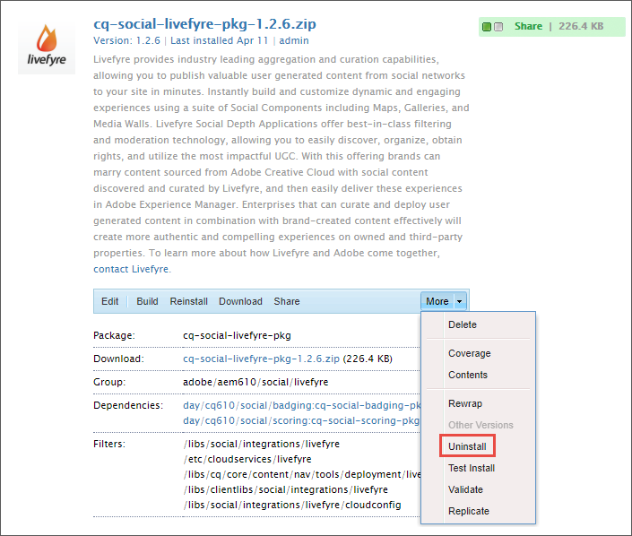

1. Download Livefyre package from [Software Distribution](https://experience.adobe.com/#/downloads/content/software-distribution/en/aem.html).

1. From the Package Manager, install the downloaded package. See [How to Work with Packages](/help/sites-administering/package-manager.md) for more information on using Software Distribution and packages in AEM

   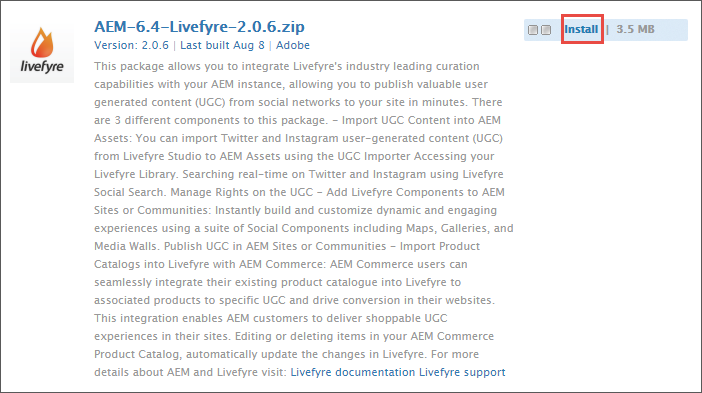

   Your Livefyre-AEM package is now installed. Before you can begin using the integration features, you must Configure AEM to use Livefyre.

   For more information and release notes on feature packs, see [Feature Packs](https://experienceleague.adobe.com/docs/experience-manager-65/release-notes/home.html).

### Configure AEM to use Livefyre: Create a Configuration Folder {#configure-aem-to-use-livefyre-create-a-configuration-folder}

1. From the AEM homepage, click the **Tools** icon in the left rail, then navigate to **General &gt; Configuration Browser**.
   * See the [Configuration Browser](/help/sites-administering/configurations.md) documentation for more information.
1. Click **Create** to open the Create Configuration dialog.
1. Name your configuration and check the **Cloud Configurations** checkbox.

   This will create a folder under **Tools &gt; Deployment &gt; Livefyre Configuration** with the name provided.

   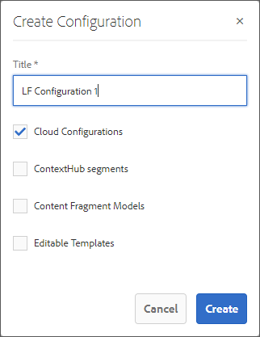

### Configure AEM to use Livefyre: Create a Livefyre Configuration {#configure-aem-to-use-livefyre-create-a-livefyre-configuration}

Configure AEM to use your organization's Livefyre license credentials, allowing communication between Livefyre and AEM.

1. From the AEM homepage, click the **Tools** icon in the left rail, then navigate to **Deployment &gt; Livefyre Configuration**.
1. Select the configuration folder in which you want to create a new Livefyre configuration, then click **Create**.

   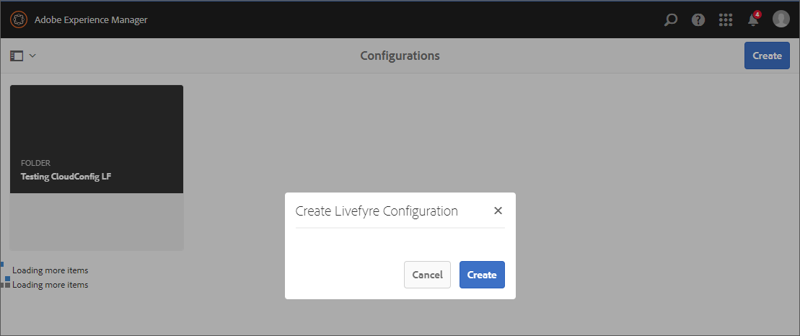

   >[!NOTE]
   >
   >Folders must have Cloud Configurations enabled in their properties before Livefyre configurations can be added to them. Configuration folders are created and managed in the [Configuration Browser.](/help/sites-administering/configurations.md)
   >
   >You cannot create a name for a configuration—it is referenced by the path of the folder it is in. You can only have one configuration per folder.

1. Select the newly created Livefyre configuration card, then click **Properties**.

   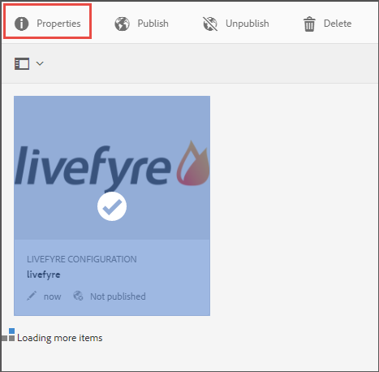

1. Enter your organization's Livefyre credentials, then click **OK**.

   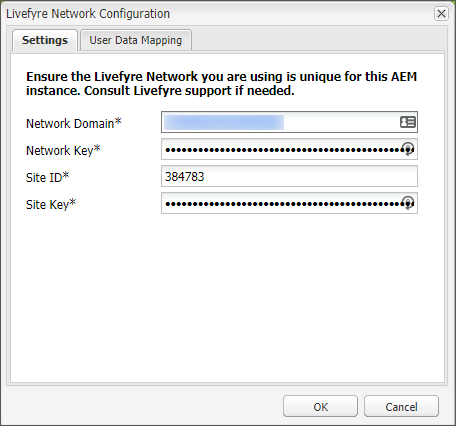

   To access this information, open Livefyre studio and navigate to **Settings &gt; Integration Settings &gt; Credentials**.

   Your AEM instance is now configured to use Livefyre and you can use the integration features.

### Customize Single Sign-on Integration {#customize-single-sign-on-integration}

The Livefyre for AEM package includes an out-of-the-box integration between AEM Communities profiles and Livefyre's SSO service.

When users log into your AEM site, they are also logged into Livefyre social components. When a logged-out user attempts to use a Livefyre component feature that requires authentication (like uploading a photo), the Livefyre component initiates user authentication.

The default authentication integration may not be perfect for every site. To best match the authentication flow in your site templates, you can override the default Livefyre Authentication Delegate to meet your needs. Use these steps:

1. Using CRXDE Lite, copy */libs/social/integrations/livefyre/components/authorizablecomponent/authclientlib* to */apps/social/integrations/livefyre/components/authorizablecomponent/authclientlib*.
1. Edit and save */apps/social/integrations/livefyre/components/authorizablecomponent/authclientlib/auth.js* to implement a Livefyre Auth Delegate that meets your needs.

   For more information on AEM Clientlibs, see [Using Client-Side Libraries](https://experienceleague.adobe.com/docs/experience-manager-65/developing/introduction/clientlibs.html).

## Use Livefyre with AEM Sites {#use-livefyre-with-aem-sites}

### Add Livefyre Components to a Page {#add-livefyre-components-to-a-page}

Before adding Livefyre components to a page within Sites, you must enable Livefyre for the page by either inheriting a Livefyre cloud configuration from a parent page or by adding the configuration directly to the page. Refer to your implementation for how to include cloud services on your site.

Once Livefyre is enabled for the page, containers must be configured to allow Livefyre components. See [Configuring Components in Design Mode](https://experienceleague.adobe.com/docs/experience-manager-65/authoring/siteandpage/default-components-designmode.html) for instructions on how to enable different components.

>[!NOTE]
>
>Apps requiring authentication to post do not function until authentication is configured in Customize Single Sign-on Integration.

1. From the **Components** side panel in design mode, select **Livefyre** from the menu to limit the list to available Livefyre components.

   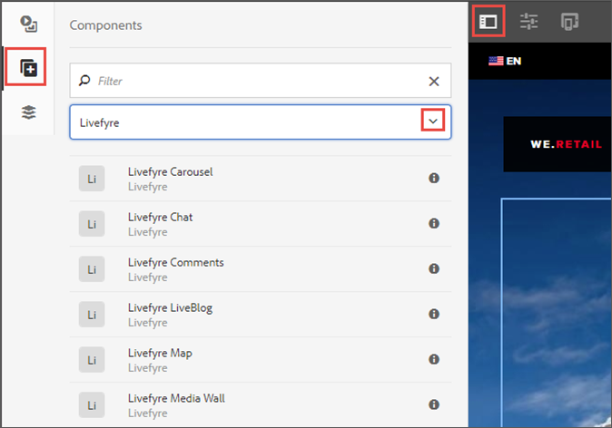

1. Select a Livefyre component, and drag it into position on your page.
1. Select whether to create a new Livefyre app or to embed an existing one.

   If embedding an existing app, AEM asks you to select the App. If creating a new App, the App will need to be populated before any content appears. The App will be created in the Livefyre site and network selected when Livefyre cloud configuration was enabled for the page.

   For more information on inserting components, see [Editing Page Content](https://experienceleague.adobe.com/docs/experience-manager-65/authoring/authoring/editing-content.html).

### Edit a Livefyre Component for an AEM Page. {#edit-a-livefyre-component-for-an-aem-page}

You can only configure and edit a Livefyre component in Livefyre Studio. From AEM:

1. Click the Livefyre component to configure.
1. Click the **Configure** icon (wrench) to open the configuration dialog.
1. Click **To edit this component, go to Livefyre Studio**.
1. Edit the App in Livefyre Studio.

## Use Livefyre with AEM Assets {#use-livefyre-with-aem-assets}

### Request Rights and Import UGC into AEM Assets {#request-rights-and-import-ugc-into-aem-assets}

You can import Twitter and Instagram user-generated content (UGC) from Livefyre Studio to AEM Assets using the UGC Importer. After selecting the content to import, you must then request rights to the content before the import can be completed.

>[!NOTE]
>
>Before using Assets to import UGC, you must set up Social Accounts and Rights Requests accounts in Livefyre Studio. See [Setting: Rights Requests](https://experienceleague.adobe.com/docs/livefyre/using/rights-requests/c-how-requesting-rights-works.html) for more information.

To import UGC into AEM Assets:

1. From the AEM homepage, navigate to **Assets &gt; Files**.
1. Click **Create**, then click **Import UGC.**

   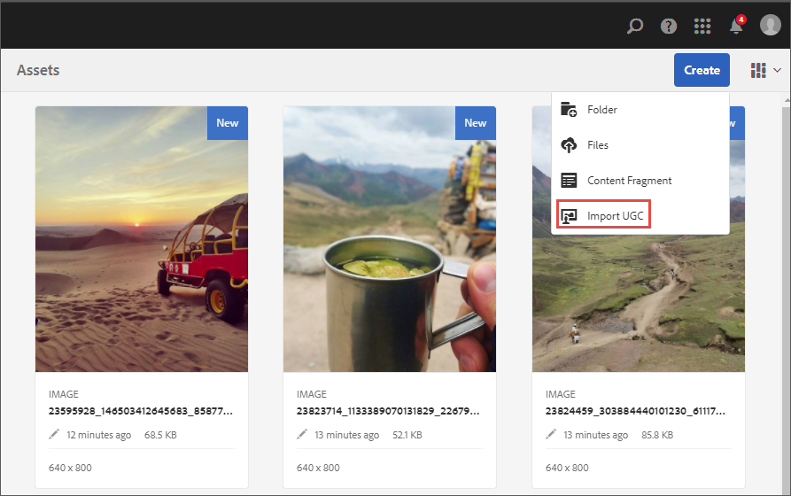

1. Find content:

    * From Livefyre by clicking the UGC Library tab. Use the filters and search to find content from the UGC Library.
    * From Twitter and Instagram by clicking the Twitter or Instagram tab. Use the search or filters to find content.

1. Select the assets you want to import. The assets you select are automatically counted and saved under the **Selected** tab.
1. **Optional**: Click the **Selected** tab and review your selected UGC content to import.
1. Click **Next**.

   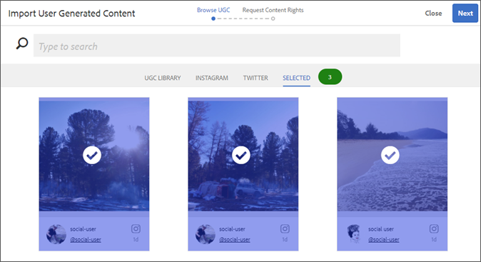

1. For rights requests, choose one of the following options for each asset:

   For Instagram:

    * **Manually Request Rights** to get a message that can be copied and pasted and manually sent to the content owners via Instagram.
    * **Manually Attribute Content Rights** to override the rights for individual assets.

   >[!NOTE]
   >
   >Due to updates affecting the aggregation of content from non-business user accounts, we can no longer post comments on your behalf or automatically check for replies from the author. [Click here to find out more](https://developers.facebook.com/blog/post/2018/04/04/facebook-api-platform-product-changes/).

   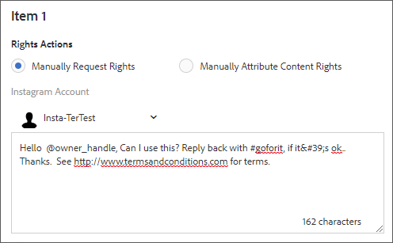

   For Twitter:

    * **Message Author** to send a message to the content owner requesting rights to the asset.
    * **Manually Attribute Content Rights** to override the rights for individual assets.

1. Click **Import**.

   If you sent a Twitter rights request, the content owner will see the rights request message on their account:

   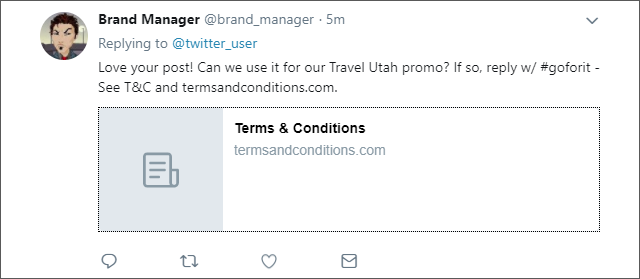

   >[!NOTE]
   >
   >Twitter has limits on identical requests coming from the same account. When importing more than a couple assets, modify the messages individually to avoid being flagged.

1. Click **Done** in the top-right corner to finish the Rights Request workflow.

   You can see the status of a pending Rights Request for an asset in Livefyre Studio. If content is pending a rights request, the asset will not display in AEM Assets until rights are granted. The asset automatically appears in AEM Assets when a Rights Request is granted.

   For Instagram, you must track the content owner's response and manually grant rights if given rights to the content.

## Use Livefyre with AEM Commerce {#use-livefyre-with-aem-commerce}

### Import Product Catalogs into Livefyre with AEM Commerce {#import-product-catalogs-into-livefyre-with-aem-commerce}

AEM Commerce users can seamlessly integrate their existing product catalog into Livefyre to drive user engagement in Livefyre's visualization Apps.

After you import the product catalog, the products show up in real time in your Livefyre instance. If you edit or delete items in your AEM Commerce Product Catalog, the changes automatically update in Livefrye.

1. Ensure you have the latest Livefyre for AEM package installed on your AEM instance.
1. From the AEM homepage, navigate to **AEM Commerce**.
1. Create a new collection or use an existing collection.
1. Hover over the collection and click **Collection Properties** (pencil icon).
1. Check **Sync to Livefyre**.
1. Fill in **Livefyre Page Prefix** to link this collection to a specific page in AEM.

   The page prefix defines the root path in your environment where searching for product pages begins. Livefyre chooses the first page that has a corresponding product associated to it. To get different pages for different products, multiple collections are needed.

## AEM Support Matrix for Livefyre Apps {#aem-support-matrix-for-livefyre-apps}

| Livefyre Apps |AEM 6.1 |AEM 6.2 |AEM 6.3 |AEM 6.4 |
|---|---|---|---|---|
| Carousel |X |X |X |X |
| Chat |X |X |X |X |
| Comments |X |X |X |X |
| Filmstrip |  |X |X |X |
| LiveBlog |X |X |X |X |
| Map |X |X |X |X |
| Media Wall |X |X |X |X |
| Mosaic |X |X |X |X |
| Poll |  |X |X |X |
| Reviews |  |X |X |X |
| Single Card |X |X |X |X |
| Storify 2 |  |X |X |X |
| Trending |  |X |X |X |
| Upload Button |  |X |X |X | -->
