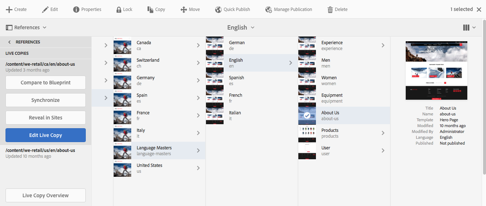
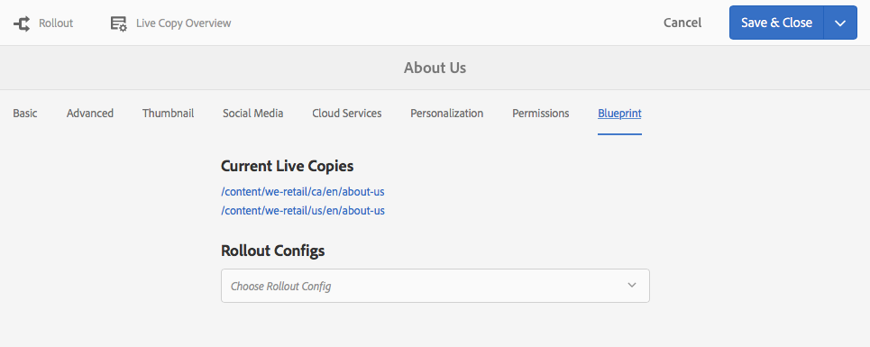
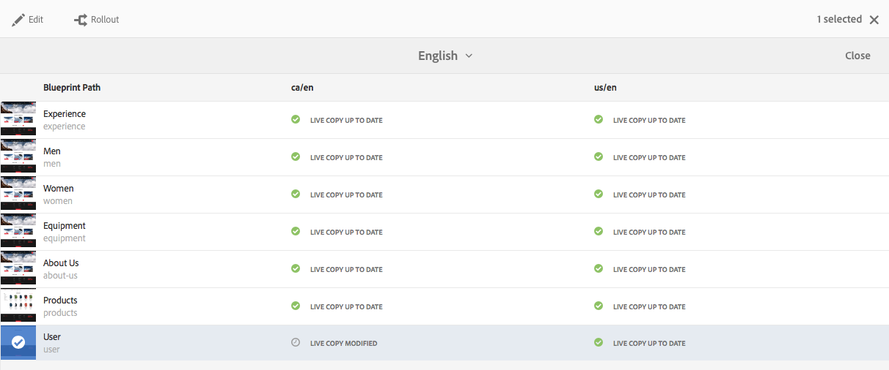
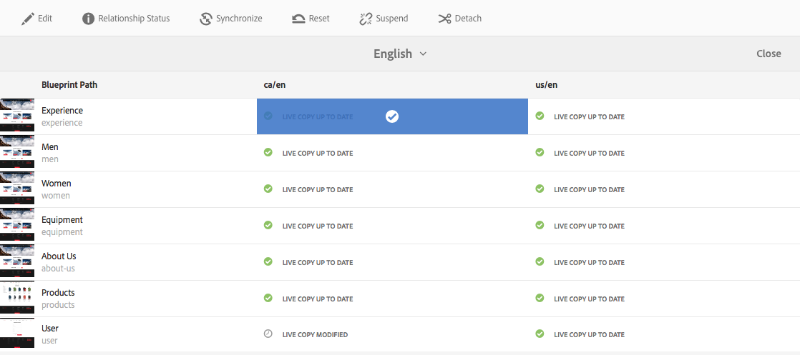
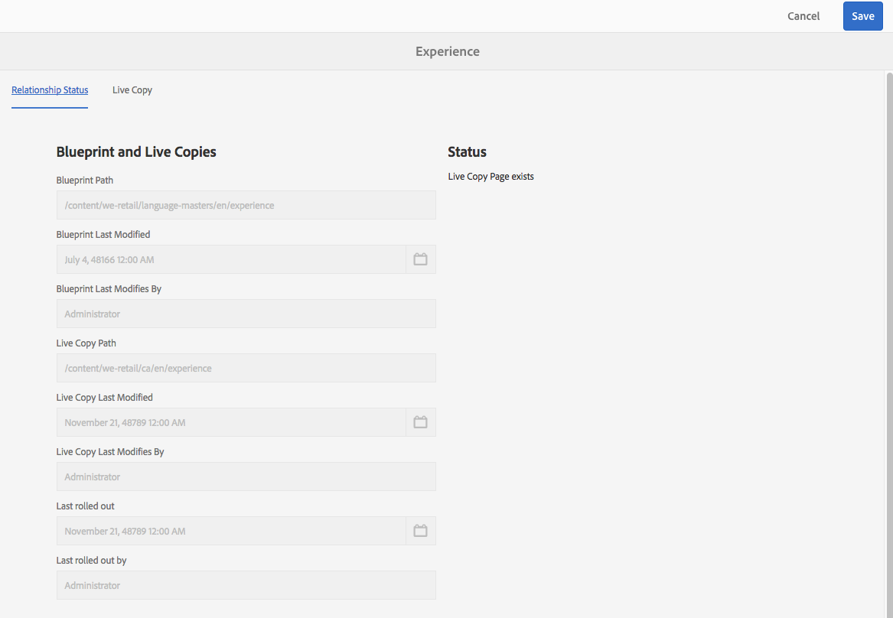
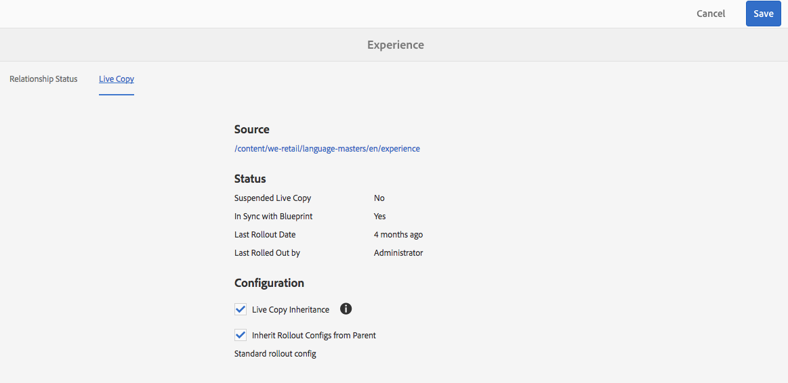

# Live Copy Overview Console{#live-copy-overview-console}

The **Live Copy Overview** enables you to:

* View/manage inheritance across a site:

    * View the blueprint tree and corresponding live copy structure, together with their inheritance status
    * Change the inheritance status; for example, suspend, resume
    * View blueprint and live copy properties

* Perform rollout actions

## Opening the Live Copy Overview {#opening-the-live-copy-overview}

You can open the Live Copy Overview from the:

* [References side panel of a blueprint page (Sites console)](#opening-live-copy-overview-references-for-a-blueprint-page)
* [Properties of a blueprint page](#opening-live-copy-overview-properties-of-a-blueprint-page)

### Opening Live Copy Overview - References for a Blueprint Page {#opening-live-copy-overview-references-for-a-blueprint-page}

The **Live Copy Overview** can be opened from the **References** side panel of the **Sites** console:

1. In the **Sites** console, [navigate to your blueprint page and select it](/help/sites-authoring/basic-handling.md#viewing-and-selecting-resources).
1. Open the **[References](/help/sites-authoring/basic-handling.md#references)** panel and select **Live Copies**.

   

   >[!NOTE]
   >
   >You can also open References first and then select the blueprint.

1. Select **Live Copy Overview** to show and use the overview of all live copies related to the selected blueprint.
1. Use **Close** to exit and return to the **Sites** console.

### Opening Live Copy Overview - Properties of a Blueprint Page {#opening-live-copy-overview-properties-of-a-blueprint-page}

The **Live Copy Overview** can be opened when viewing properties of a blueprint page:

1. Open **Properties** for the appropriate blueprint page.
1. Open the **Blueprint** tab - the **Live Copy Overview** option is shown in the top toolbar:

   

1. Select **Live Copy Overview** to show and use the overview of all live copies related to the current blueprint.

1. Use **Close** to exit and return to the **Sites** console.

## Using the Live Copy Overview {#using-the-live-copy-overview}

The **Live Copy Overview** can also be used to perform actions on the live copy:

1. Open the **Live Copy Overview**.
1. Select the required blueprint or live copy page - the toolbar will be updated to show the available actions. The [actions](/help/sites-administering/msm.md#terms-used) available depend on whether you select a [blueprint](#actions-for-a-blueprint-page) or [live copy](#actions-for-a-live-copy-page) page:

### Actions for a Blueprint Page {#actions-for-a-blueprint-page}

When you select a blueprint page, the following actions are available:

* Edit

    * Open the blueprint page for editing.

* [Rollout](/help/sites-administering/msm.md#rollout-and-synchronize)

    * Perform a rollout to push changes from the source to the livecopy.

### Actions for a Live Copy Page {#actions-for-a-live-copy-page}

When you select a live copy page, the following actions are available:

* Edit

    * Open the live copy page for editing.

* [Relationship Status](#relationship-status)

    * View information about the status and inheritance.

* [Synchronize](/help/sites-administering/msm.md#rollout-and-synchronize)

    * Synchronize a live copy to pull changes from the source to the livecopy.

* [Reset](/help/sites-administering/msm-livecopy.md#resetting-a-live-copy-page)

    * Reset a live copy page to remove all inheritance cancellations and return the page to the same state as the source page.

* [Suspend](/help/sites-administering/msm.md#suspending-and-cancelling-inheritance-and-synchronization)

    * Temporarily deactivates the live relationship between a live copy and its blueprint page.

* [Resume](/help/sites-administering/msm-livecopy.md#resuming-inheritance-for-a-page)

    * Resume lets you reinstate a suspended relationship.

* [Detach](/help/sites-administering/msm.md#detaching-a-live-copy)

    * Permanently removes the live relationship between a live copy and its blueprint page.

## Relationship Status {#relationship-status}

The **Relationship Status** console has two tabs providing a range of functionality:

* [Relationship Status Information](#relationship-status-information)
* [Live Copy Information](#live-copy-information)

### Relationship Status Information {#relationship-status-information}

This tab provides detailed information about the status of the relationship between the blueprint and live copy:

### Live Copy Information {#live-copy-information}

This tab lets you view and edit the live copy configuration:

