# Creating and Synchronizing Live Copies{#creating-and-synchronizing-live-copies}

You can create a live copy from a page or blueprint configuration, then can manage inheritance and synchronization.

## Managing Blueprint Configurations {#managing-blueprint-configurations}

A blueprint configuration identifies an existing website that you want to use as the source for one or more live copy pages.

>[!NOTE]
>
>Blueprint configurations enable you to push content changes to live copies. See [Live Copies - Source, Blueprints and Blueprint Configurations](/help/sites-administering/msm.md#source-blueprints-and-blueprint-configurations).

When you create a blueprint configuration, you select a template that defines the internal structure of the blueprint. The default blueprint template assumes that the source website has the following characteristics:

* The web site has a root page.
* The immediate child pages of the root are language branches of the web site. When creating a live copy, the languages are presented as optional content to include in the copy.
* The root of each language branch has one or more child pages. When creating a live copy, child pages are presented as chapters that you can include in the live copy.

>[!NOTE]
>
>A different structure requires another blueprint template.

After you create the blueprint configuration, you configure the following properties:

* **Name**: The name of the blueprint configuration.
* **Source Path**: The path of the root page of the site that you are using as the source (blueprint).
* **Description**. (Optional)A description of the blueprint configuration. The description appears in the list of blueprint configurations to choose from when creating a site.

When your blueprint configuration is used, you can associate it with a rollout configuration that determines how the live copies of the source/blueprint are synchronized. See [Specifying the Rollout Configurations To Use](/help/sites-administering/msm-sync.md#specifying-the-rollout-configurations-to-use).

### Creating a Blueprint Configuration {#creating-a-blueprint-configuration}

To create a blueprint configuration:

1. [Navigate](/help/sites-authoring/basic-handling.md#global-navigation) to the **Tools** menu, then select the **Sites** menu.
1. Select **Blueprints** to open the **Blueprint Configurations** console:

   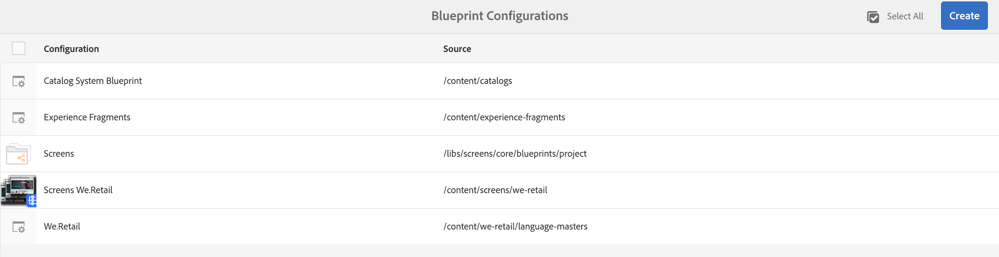

1. Select **Create**.
1. Select the blueprint template, then **Next** to continue.
1. Select the source page to be used as the blueprint; then **Next** to continue.
1. Define:

    * **Title**: mandatory title for the blueprint
    * **Description**: an optional description to provide more details.

1. **Create** will create the blueprint configuration based on your specification.

### Editing or Deleting a Blueprint Configuration {#editing-or-deleting-a-blueprint-configuration}

You can edit or delete an existing blueprint configuration:

1. [Navigate](/help/sites-authoring/basic-handling.md#global-navigation) to the **Tools** menu, then select the **Sites** menu.
1. Select **Blueprints** to open the **Blueprint Configurations** console:

   

1. Select the required blueprint configuration - the appropriate actions will become available in the toolbar:

    * **Properties**; you can use this to view and then edit the properties of the configuration.
    * **Delete**

## Creating a Live Copy {#creating-a-live-copy}

### Creating a Live Copy of a Page {#creating-a-live-copy-of-a-page}

You can create a live copy of any page or branch. When you create the live copy, you can specify the rollout configurations to use for synchronizing the content:

* The selected rollout configurations apply to the live copy page and its child pages.
* If you do not specify any rollout configurations, MSM determines which rollout configurations to use. See [Specifying the Rollout Configuration To Use](/help/sites-administering/msm-sync.md#specifying-the-rollout-configurations-to-use).

You can create a live copy of any page:

* Pages that are referenced by a [blueprint configuration](#creating-a-blueprint-configuration).
* And pages that have no connection to a configuration.
* AEM also supports creating a live copy within the pages of another live copy.

The only difference is that availability of the **Rollout** command on the source/blueprint pages is dependent on whether source is referenced by a blueprint configuration:

* If you create the live copy from a source page that **is** referenced in a blueprint configuration, then the Rollout command will be available on the source/blueprint page(s).
* If you create the live copy from a source page that **is not** referenced in a blueprint configuration, then the Rollout command will not be available on the source/blueprint page(s).

To create a live copy:

1. In the **Sites** console select **Create**, then **Live Copy**.

   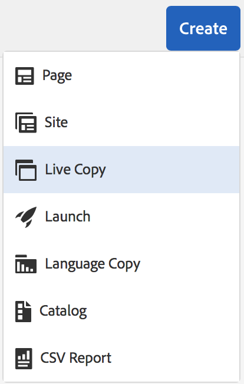

1. Select the source page then click **Next**. For example:

   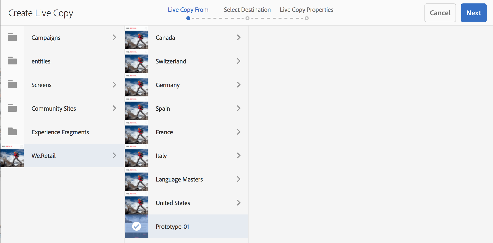

1. Specify the destination path of the live copy (open the parent folder/page of the live copy) and then click **Next**.

   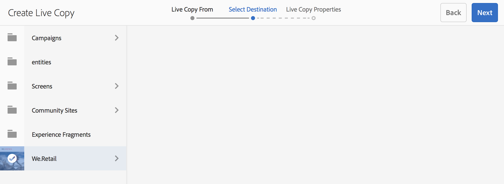

   >[!NOTE]
   >
   >The destination path cannot be within the source path.

1. Enter:

    * a **Title** for the page.
    * a **Name**, that is used in the URL.

   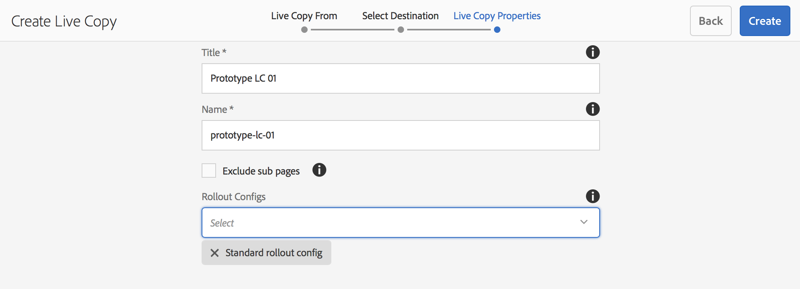

1. Use the **Exclude sub pages** checkbox:

    * Selected: create a live copy of the selected page only (shallow live copy)
    * Not Selected: create a live copy that includes all descendants of the selected page (deep live copy)

1. (Optional) To specify one or more rollout configurations to use for the livecopy, use the **Rollout Configs** drop-down list to select them; selected configurations are shown underneath the drop-down selector.
1. Click **Create**. A confirmation message is shown, from here you can select either **Open** or **Done**.

### Creating a Live Copy of a Site from a Blueprint Configuration {#creating-a-live-copy-of-a-site-from-a-blueprint-configuration}

Create a live copy using a blueprint configuration to create a site based on the blueprint (source) content. When you create a live copy from a blueprint configuration, you select one or more language branches of the blueprint source to copy, then you select the chapters to copy from the language branches. See [Creating a Blueprint Configuration](/help/sites-administering/msm-livecopy.md#creating-a-blueprint-configuration).

If you omit some language branches or chapters from the live copy, you can add them later; see [Creating a Live Copy Inside a Live Copy (Blueprint Configuration)](#creating-a-live-copy-inside-a-live-copy-blueprint-configuration).

>[!CAUTION]
>
>When the blueprint source contains links and references that target a paragraph in a different branch, the targets are not updated in the live copy pages, but remain pointed to the original destination.

When you create the site, provide values for the following properties:

* **Initial Languages**: The language branches of the blueprint source to include in the live copy.
* **Initial Chapters**: The child pages of the blueprint language branches to include in the live copy.
* **Destination Path**: The location of the root page of the live copy site.
* **Title**: The title of the root page of the live copy site.
* **Name**: (Optional) The name of the JCR node that stores the root page of the live copy. The default value is based on the title.
* **Site Owner**: (Optional)
* **Live Copy**: Select this option to establish a live relationship with the source site. If you do not select this option, a copy of the blueprint is created but is not subsequently synchronized with the source.
* **Rollout Configs**: (Optional) Select one or more rollout configurations to use for synchronizing the live copy. By default, the rollout configurations are inherited from the blueprint; see [Specifying the Rollout Configurations to Use](/help/sites-administering/msm-sync.md#specifying-the-rollout-configurations-to-use) for more details.

To create a live copy of a site from a blueprint configuration:

1. In the **Sites** console, select **Create**, then **Site** from the drop-down selector.
1. Select the blueprint configuration to use as the source of the live copy and proceed with **Next**:

   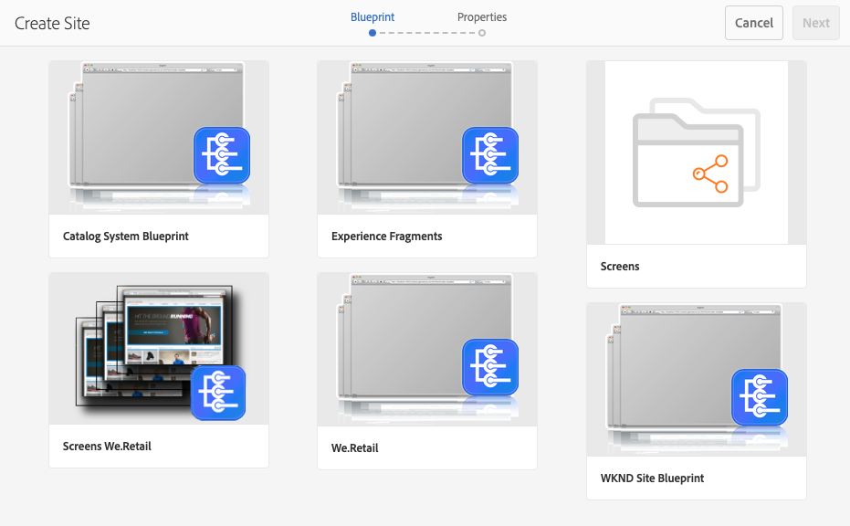

1. Use the **Initial Languages** selector to specify the languages of the blueprint site to use for the live copy.

   All available languages are selected by default. To remove a language, click the **X** that appears next to the language.

   For example:

   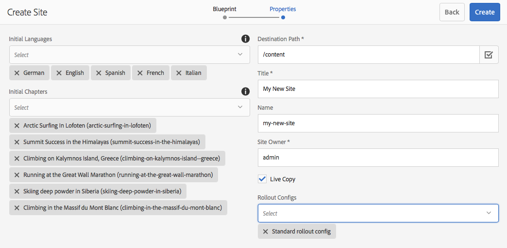

1. Use the **Initial Chapters** drop-down to select the sections of the blueprint to include in the live copy. Again all available chapters are included by default, but can be removed.
1. Provide values for the remaining properties and then select **Create**. In the confirmation dialog box, select **Done** to return to the **Sites** console, or **Open Site** to open the root page of the site.

### Creating a Live Copy Inside a Live Copy (Blueprint Configuration) {#creating-a-live-copy-inside-a-live-copy-blueprint-configuration}

When you create a live copy inside the existing live copy (created using a blueprint configuration), you can insert any language copy or chapters that were not included when the live copy was originally created.

## Monitoring your Live Copy {#monitoring-your-live-copy}

### Seeing the Status of a Live Copy {#seeing-the-status-of-a-live-copy}

The properties of a live copy page show the following information about the live copy:

* **Source**: The source page of the live copy page.
* **Status**: The synchronization status of the live copy. The status includes whether the live copy is up to date with the source, and when the last synchronization occurred and who performed the synchronization.
* **Configuration**:

  * Whether the page is still subject to live copy inheritance.
  * Whether the configuration is inherited from the parent page.
  * Any rollout configurations that the live copy uses.

To view the properties:

1. In the **Sites** console, select the live copy page and open the properties.
1. Select the **Live Copy** tab.

   For example:

   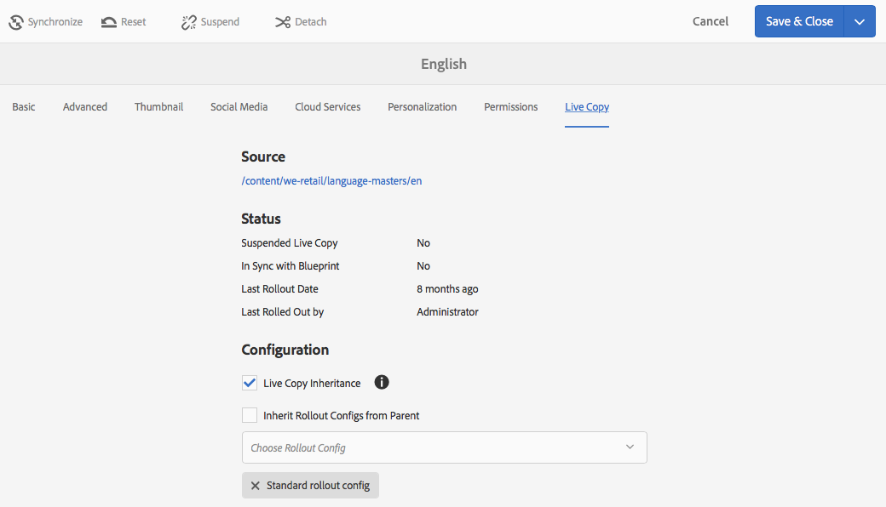

### Seeing the Live Copies of a Blueprint Page {#seeing-the-live-copies-of-a-blueprint-page}

Blueprint pages (that are referenced in a blueprint configuration) provide you with a list of the live copy pages that use the current (blueprint) page as the source. Use this list to keep track of the live copies. The list appears on the **Blueprint** tab of the [page properties](/help/sites-authoring/editing-page-properties.md).

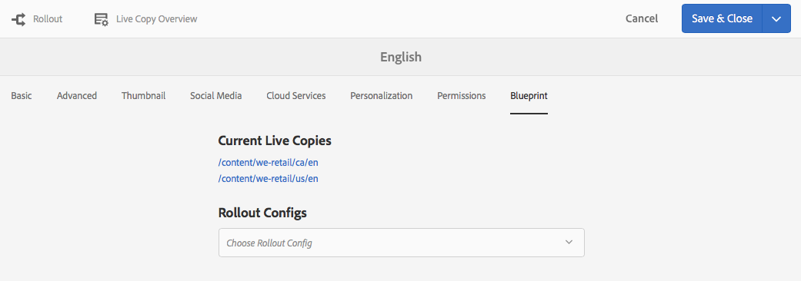

## Synchronizing your Live Copy {#synchronizing-your-live-copy}

### Rolling Out a Blueprint {#rolling-out-a-blueprint}

Roll out a blueprint page to push content changes to live copies. A **Rollout** action executes the rollout configurations that use the [On Rollout](/help/sites-administering/msm-sync.md#rollout-triggers) trigger.

>[!NOTE]
>
>Conflicts can occur if new pages with the same page name are created in both the blueprint branch and a dependent live copy branch.
>
>Such [conflicts need to be handled and resolved upon rollout](/help/sites-administering/msm-rollout-conflicts.md).
>

#### Rolling Out a Blueprint from Page Properties {#rolling-out-a-blueprint-from-page-properties}

1. In the **Sites** console, select the page in the blueprint and open the properties.
1. Open the **Blueprint** tab.
1. Select **Rollout**.

   

1. Specify the pages and any sub-pages, then confirm with the check mark:

   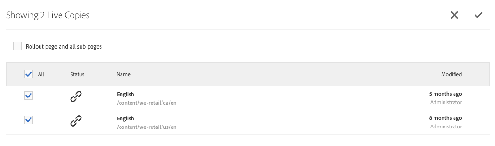

1. Specify if the rollout job should be executed immediately (**Now**) or at another date/time (**Later**).

   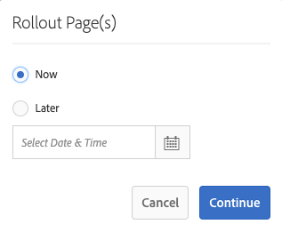

Rollouts are processed as asynchronous jobs and can be checked in the [**Async Jobs Status** dashboard](asynchronous-jobs.md#monitor-the-status-of-asynchronous-operations) at **Global Navigation** > **Tools** > **Operations** > **Jobs**

>[!NOTE]
>
>Asynchronous rollout processing requires AEM 6.5.3.0 or higher. In previous versions, pages were processed immediately and synchronously.

#### Roll Out a Blueprint from the Reference Rail {#roll-out-a-blueprint-from-the-reference-rail}

1. In the **Sites** console, select the page in the live copy and open the **[References](/help/sites-authoring/basic-handling.md#references)** panel (from the toolbar).
1. Select the **Blueprint** option from the list, to show the blueprints associated with this page.
1. Select the required blueprint from the list.
1. Click **Rollout**.
1. You will be asked to confirm details of the rollout:

    * **Rollout scope**:

      Specify whether the scope is for the selected page alone, or should include subpages.

    * **Schedule**:

      Specify if the rollout job should be executed immediately (**Now**) or at a later date/time (**Later**).

      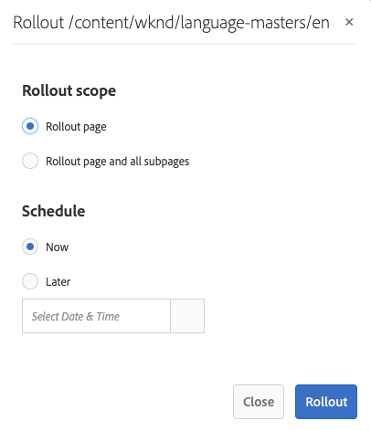

1. After confirming these details, select **Rollout** to perform the action.

Rollouts are processed as asynchronous jobs and can be checked in the [**Async Jobs Status** dashboard](asynchronous-jobs.md#monitor-the-status-of-asynchronous-operations) at **Global Navigation** > **Tools** > **Operations** > **Jobs**

>[!NOTE]
>
>Asynchronous rollout processing requires AEM 6.5.3.0 or higher. In previous versions, pages were processed immediately and synchronously unless the **Background rollout** option was checked.

#### Roll Out a Blueprint from the Live Copy Overview {#roll-out-a-blueprint-from-the-live-copy-overview}

The [Rollout action is also available from the Live Copy Overview](/help/sites-administering/msm-livecopy-overview.md#using-the-live-copy-overview), when a Blueprint page is selected.

1. Open the [Live Copy Overview](/help/sites-administering/msm-livecopy-overview.md#using-the-live-copy-overview) and select a Blueprint Page.
1. Select **Rollout** from the toolbar.
1. Specify the pages and any sub-pages, then confirm with the check mark:

   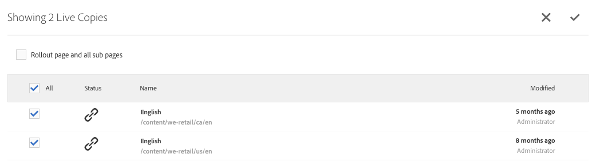

1. Specify if the rollout job should be executed immediately (**Now**) or at another date/time (**Later**).

   

Rollouts are processed as asynchronous jobs and can be checked in the [**Async Jobs Status** dashboard](asynchronous-jobs.md#monitor-the-status-of-asynchronous-operations) at **Global Navigation** > **Tools** > **Operations** > **Jobs**

>[!NOTE]
>
>Asynchronous rollout processing requires AEM 6.5.3.0 or higher. In previous versions, pages were processed immediately and synchronously.

### Synchronizing a Live Copy {#synchronizing-a-live-copy}

Synchronize a live copy page to pull content changes from the source to the live copy.

#### Synchronize a Live Copy from Page Properties {#synchronize-a-live-copy-from-page-properties}

Synchronize a live copy to pull changes from the source to the livecopy.

>[!NOTE]
>
>Synchronizing executes the rollout configurations that use the [On Rollout](/help/sites-administering/msm-sync.md#rollout-triggers) trigger.

1. In the **Sites** console, select the live copy page and open the properties.
1. Open the **Live Copy** tab.
1. Click **Synchronize**.

   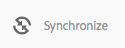

   Confirmation will be requested, use **Sync** to proceed.

#### Synchronize a Live Copy from the Live Copy Overview {#synchronize-a-live-copy-from-the-live-copy-overview}

The [Synchronize action is also available from the Live Copy Overview](/help/sites-administering/msm-livecopy-overview.md#using-the-live-copy-overview), when a Live Copy page is selected.

1. Open the [Live Copy Overview](/help/sites-administering/msm-livecopy-overview.md#using-the-live-copy-overview) and select a Live Copy Page.
1. Select **Synchronize** from the toolbar.
1. Confirm the **Rollout** action in the dialog after specifying whether you want to include:

    * **Page and Sub Pages**
    * **Page Only**

   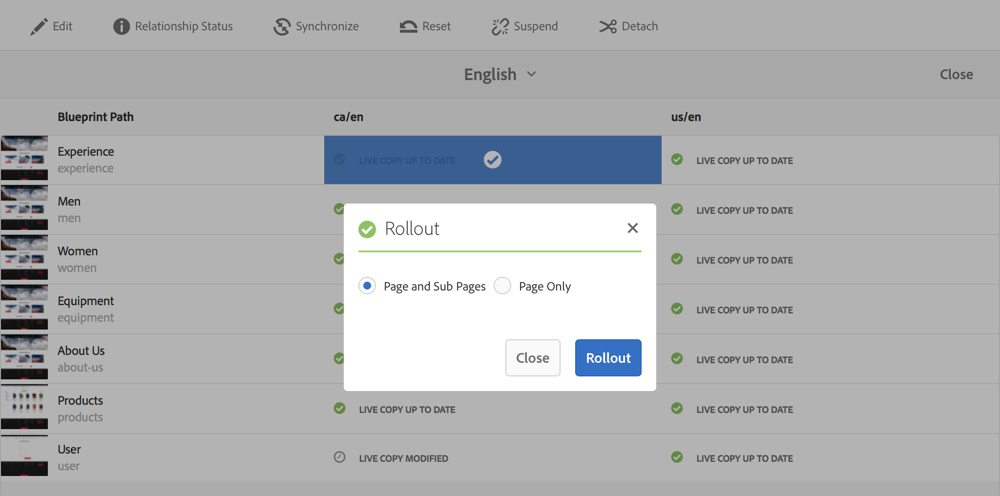

## Changing Live Copy Content {#changing-live-copy-content}

To change live copy content, you can:

* Add paragraphs to the page.
* Update existing content by breaking the live copy inheritance for any page or component.

>[!NOTE]
>
>If you manually create a page in the live copy, then it is local to the live copy, meaning it does not have a corresponding source page to attach to.
>
>The best practice to create a local page that is part of the relationship would be to create it in the source and to do a (deep) rollout. That will create the page locally as live copies.

>[!NOTE]
>
>Conflicts can occur if new pages with the same page name are created in both the blueprint branch and a dependent live copy branch.
>
>Such [conflicts need to be handled and resolved upon rollout](/help/sites-administering/msm-rollout-conflicts.md).
>

### Adding Components to a Live Copy Page {#adding-components-to-a-live-copy-page}

Add components to a live copy page at any time. The inheritance status of the live copy and its paragraph system does not control your ability to add components.

When the live copy page is synchronized with the source page, the added components remain unchanged. See also [Changing the Order of Components on a Live Copy Page](#changing-the-order-of-components-on-a-live-copy-page).

>[!NOTE]
>
>Changes made locally to a component marked as a container will not be overwritten by the content of the blueprint on a rollout. See [MSM Best Practices](/help/sites-administering/msm-best-practices.md#components-and-container-synchronization) for more information.

### Suspending Inheritance for a Page {#suspending-inheritance-for-a-page}

When you create a live copy, the live copy configuration is saved on the root page of the copied pages. All child pages of the root page inherit the live copy configurations. The components on the livecopy pages also inherit the live copy configuration.

You can suspend the live copy inheritance for a live copy page so that you can change page properties and components. When you suspend inheritance, the page properties and components are no longer synchronized with the source.

>[!NOTE]
>
>You can also [detach a live copy](#detaching-a-live-copy) from its blueprint to remove all connections. The Detach action is permanent and non-reversible.

>[!NOTE]
>
>If the component is marked as a container, the cancellation and suspend actions do not apply to its child components. See also [MSM Best Practices](/help/sites-administering/msm-best-practices.md#components-and-container-synchronization) for additional information.

#### Suspending Inheritance from Page Properties {#suspending-inheritance-from-page-properties}

To suspend inheritance on a page:

1. Open the properties of the live copy page either using the **View Properties** command of the **Sites** console or using **Page Information** on the page toolbar.
1. Click the **Live Copy** tab.
1. Select **Suspend** from the toolbar. You can then select either:

    * **Suspend**: current page only
    * **Suspend with children**: current page together with any child pages

1. Select **Suspend** on the confirmation dialog.

#### Suspending Inheritance from the Live Copy Overview {#suspending-inheritance-from-the-live-copy-overview}

The [Suspend action is also available from the Live Copy Overview](/help/sites-administering/msm-livecopy-overview.md#using-the-live-copy-overview), when a Live Copy page is selected.

1. Open the [Live Copy Overview](/help/sites-administering/msm-livecopy-overview.md#using-the-live-copy-overview) and select a Live Copy Page.
1. Select **Suspend** from the toolbar.
1. Select the appropriate option from:

    * **Suspend**
    * **Suspend with children**

   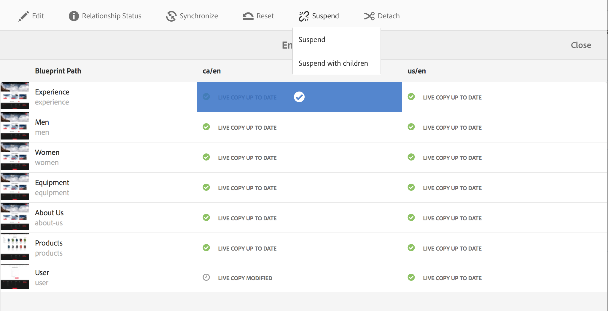

1. Confirm the **Suspend** action in the **Suspend Live Copy** dialog:

   

### Resuming Inheritance for a Page {#resuming-inheritance-for-a-page}

Suspending live copy inheritance for a page is a temporary action. Once suspended the **Resume** action becomes available, allowing you to reinstate the live relationship.

When you re-enable inheritance, the page is not automatically synchronized with the source. You can request a synchronization, if this is required, either:

* In the **Resume**/**Revert** dialog; for example:

  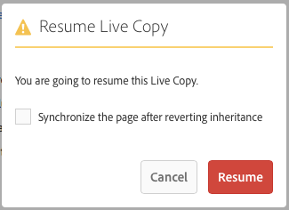

* At a later stage, by manually selecting the synchronize action.

>[!CAUTION]
>
>When you re-enable inheritance, the page is not automatically synchronized with the source. You can manually request a synchronization if this is required; either at the time of resuming or later.

#### Resuming Inheritance from Page Properties {#resuming-inheritance-from-page-properties}

Once [suspended](#suspending-inheritance-from-page-properties) the **Resume** action becomes in the toolbar of the page properties:

When selected, the dialog is shown. You can select a synchronization, if necessary, then confirm the action.

#### Resume a Live Copy Page from the Live Copy Overview {#resume-a-live-copy-page-from-the-live-copy-overview}

The [Resume action is also available from the Live Copy Overview](/help/sites-administering/msm-livecopy-overview.md#using-the-live-copy-overview), when a Live Copy page is selected.

1. Open the [Live Copy Overview](/help/sites-administering/msm-livecopy-overview.md#using-the-live-copy-overview) and select a Live Copy Page that has been suspended; it is shown as **INHERITANCE CANCELLED**.
1. Select **Resume** from the toolbar.
1. Indicate whether you want to synchronize the page after reverting inheritance, then confirm the **Resume** action in the **Resume Live Copy** dialog.

### Changing Inheritance Depth (Shallow/Deep) {#changing-inheritance-depth-shallow-deep}

On an existing live copy you can change the depth for a page; that is, whether child pages are included.

* Switching to a shallow live copy:

  * Will have immediate effect and is non-reversible.

    * Child pages are explicitly detached from the live copy. Further modifications on children cannot be preserved if undone.

    * Will remove any descendant `LiveRelationships` even if there are nested `LiveCopies`.

* Switching to a deep live copy:

  * Child-pages remain untouched.
  * To see the effect of the switch, you can make a roll-out, any content modifications are applied according the roll-out configuration.

* Switching to a shallow live copy, then back to deep:

  * All children of the (formerly) shallow live copy are treated as if they had been created manually and are therefore moved away using `[oldname]_msm_moved name`.

To specify or change the depth:

1. Open the properties of the live copy page either using the **View Properties** command of the **Sites** console or using **Page Information** on the page toolbar.
1. Click the **Live Copy** tab.
1. In the **Configuration** section, set or clear the **Live Copy Inheritance** option depending on whether child pages are included:

    * checked - a deep live copy (the child pages are included)
    * clear - a shallow live copy (child pages are excluded)

   >[!CAUTION]
   >
   >Switching to a shallow live copy will have immediate effect and is non-reversible.
   >
   >See [Live Copies - Composition](/help/sites-administering/msm.md#live-copies-composition) for more information.

1. Click **Save** to persist your updates.

### Cancelling Inheritance for a Component {#cancelling-inheritance-for-a-component}

Cancel the live copy inheritance for a component so that the component is no longer synchronized with the source component. You can enable inheritance at a later point if necessary.

>[!NOTE]
>
>If the component is marked as a container, the cancellation and suspend actions do not apply to its child components. See also [MSM Best Practices](/help/sites-administering/msm-best-practices.md#components-and-container-synchronization) for additional information.

>[!NOTE]
>
>When you re-enable inheritance, the component is not automatically synchronized with the source. You can manually request a synchronization if this is required.

Cancel inheritance to change the component content or delete the component:

1. Click the component for which you want to cancel inheritance.

   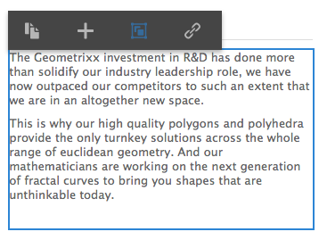

1. On the component toolbar, click the **Cancel Inheritance** icon.

   

1. In the Cancel Inheritance dialog box, confirm the action with **Yes**.

   The component toolbar is updated to include all (appropriate) editing commands.

### Re-enabling Inheritance for a Component {#re-enabling-inheritance-for-a-component}

To enable inheritance for a component, click the **Re-enable Inheritance** icon on the component toolbar.

### Changing the Order of Components on a Live Copy Page {#changing-the-order-of-components-on-a-live-copy-page}

If a live copy contains components that are part of a paragraph system, inheritance of that paragraph system adheres to the following rules:

* The order of components in an inherited paragraph system can be modified, even with inheritance established.
* On rollout, the order of the components will be restored from the blueprint. if new components were added to the live copy before rollout, they will be reordered along with the components above which they were added.
* If inheritance of the paragraph system is cancelled, the order of components will not be restored on rollout and will remain as is in the live copy.

>[!NOTE]
>
>When reverting a cancelled inheritance on a paragraph system, the order of components **will not be automatically restored** from the blueprint. You can manually request a synchronization if this is required.

Use the following procedure to cancel inheritance of the paragraph system.

1. Open the live copy page.
1. Drag an existing component to a new location on the page.
1. In the **Cancel Inheritance** dialog box, confirm the action with **Yes**.

### Overriding Properties of a Live Copy Page {#overriding-properties-of-a-live-copy-page}

The page properties of a Live Copy page are inherited (and not editable) from the source page by default.

You can cancel inheritance for a property when you need to change the property value for the live copy. A link icon indicates that inheritance is enabled for the property.

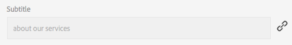

When you cancel inheritance, you can change the property value. A broken-link icon indicates that inheritance is cancelled.

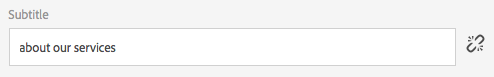

You can later re-enable inheritance for a property if necessary.

>[!NOTE]
>
>When you re-enable inheritance, the live copy page property is not automatically synchronized with the source property. You can manually request a synchronization if this is required.

1. Open the properties of the live copy page using either the **View Properties** option of the **Sites** console or **Page Information** icon on the page toolbar.
1. To cancel inheritance of a property, click the link icon that appears to the right of the property.

   

1. In the **Cancel Inheritance** confirmation dialog, click **Yes**.

### Revert Properties of a Live Copy Page {#revert-properties-of-a-live-copy-page}

To enable inheritance for a property, click the **Revert Inheritance** icon that appears next to the property.

### Resetting a Live Copy Page {#resetting-a-live-copy-page}

Reset a live copy page to:

* Remove all inheritance cancellations and
* Return the page to the same state as the source page.

Resetting affects changes that you have made to page properties, the paragraph system and components.

#### Reset a Live Copy Page from the Page Properties {#reset-a-live-copy-page-from-the-page-properties}

1. In the **Sites** console, select the live copy page and select **View Properties**.
1. Open the **Live Copy** tab.
1. Select **Reset** from the toolbar.

   

1. In the **Reset Live Copy** dialog box, confirm with **Reset**.

#### Reset a Live Copy Page from the Live Copy Overview {#reset-a-live-copy-page-from-the-live-copy-overview}

The [Reset action is also available from the Live Copy Overview](/help/sites-administering/msm-livecopy-overview.md#using-the-live-copy-overview), when a Live Copy page is selected.

1. Open the [Live Copy Overview](/help/sites-administering/msm-livecopy-overview.md#using-the-live-copy-overview) and select a Live Copy Page.
1. Select **Reset** from the toolbar.
1. Confirm the **Reset** action in the **Reset Live Copy** dialog:

   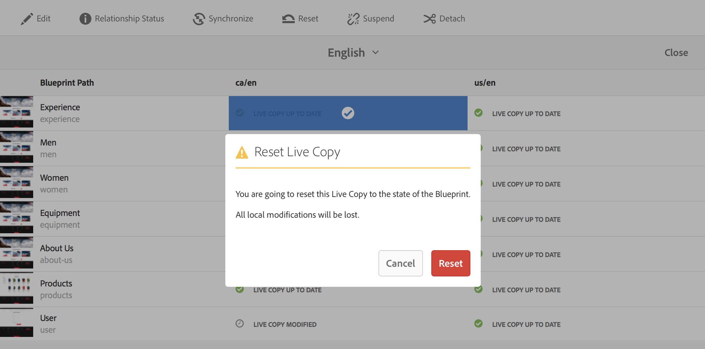

## Comparing a Live Copy Page with a Blueprint Page {#comparing-a-live-copy-page-with-a-blueprint-page}

To track the changes you have made, you can view the blueprint page in **References** and compare it with its live copy page:

1. In the **Sites** console, [navigate to a blueprint or live copy page and select it](/help/sites-authoring/basic-handling.md#viewing-and-selecting-resources).
1. Open the **[References](/help/sites-authoring/basic-handling.md#references)** panel and select:

    * **Blueprint** (when a live copy page selected)
    * **Live Copies** (when a blueprint page selected)

1. Select your specific live copy then either:

    * **Compare to Blueprint** (when a live copy page selected)
    * **Compare to Live Copy** (when a blueprint page selected)

   For example:

   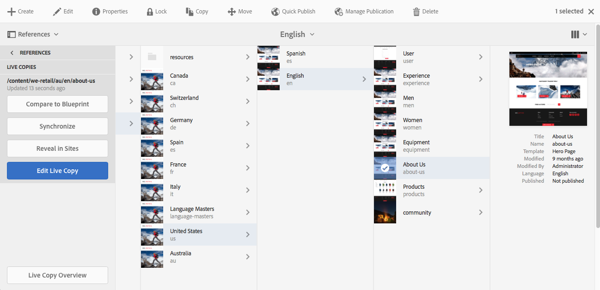

1. The two pages (live copy and blueprint) will be opened side-by-side.

   For full information about using this feature see [Page Diff](/help/sites-authoring/page-diff.md).

## Detaching a Live Copy {#detaching-a-live-copy}

Detach permanently removes the live relationship between a live copy and its source/blueprint page. All MSM-relevant properties are removed from the live copy and the live copy pages become a standalone copy.

>[!CAUTION]
>
>You cannot reinstate the live relationship after you detach the live copy.
>
>To remove the live relationship with the option of later reinstating it, you can [cancel live copy inheritance](#suspending-inheritance-for-a-page) for the page.

There are implications on where within the tree that you use **Detach**:

* **Detach on a Root Page of a LiveCopy**

  When this operation is performed on the root page of a live copy it removes the live relationship between all pages of the blueprint and its livecopy.

  Further changes to pages in the blueprint (as was) **will not** impact the livecopy (as was).

* **Detach on a Sub-Page of a LiveCopy**

  When this operation is performed on a sub-page (or branch) within a live copy:

  * the live relationship is removed for that sub-page (or branch)
  * and the (sub-)pages in the live copy branch are treated as if they had been manually created.

  *However*, the sub-pages are still subject to the live relationship of the parent branch so a further rollout of the blueprint page(s) will both:

    1. Rename the detached page(s):

        * This is because MSM considers them as manually created pages that cause a conflict as they have the same name as the livecopy pages it is trying to create.

    1. Create a (livecopy) page with the original name, containing the changes from the rollout.

  >[!NOTE]
  >
  >See [MSM Rollout Conflicts](/help/sites-administering/msm-rollout-conflicts.md) for details of such situations.

### Detach a Live Copy Page from the Page Properties {#detach-a-live-copy-page-from-the-page-properties}

To detach a live copy:

1. In the **Sites** console, select the live copy page and click **View Properties**.
1. Open the **Live Copy** tab.
1. On the toolbar, select **Detach**.

   

1. A confirmation dialog is shown, select **Detach** to complete the action.

### Detach a Live Copy Page from the Live Copy Overview {#detach-a-live-copy-page-from-the-live-copy-overview}

The [Detach action is also available from the Live Copy Overview](/help/sites-administering/msm-livecopy-overview.md#using-the-live-copy-overview), when a Live Copy page is selected.

1. Open the [Live Copy Overview](/help/sites-administering/msm-livecopy-overview.md#using-the-live-copy-overview) and select a Live Copy Page.
1. Select **Detach** from the toolbar.
1. Confirm the **Detach** action in the **Detach Live Copy** dialog:

   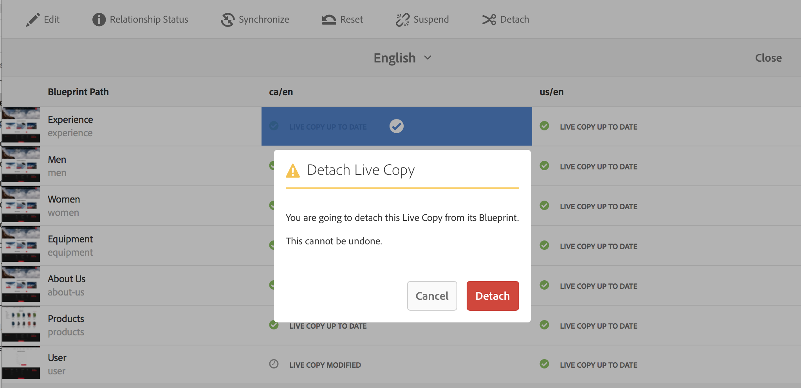
