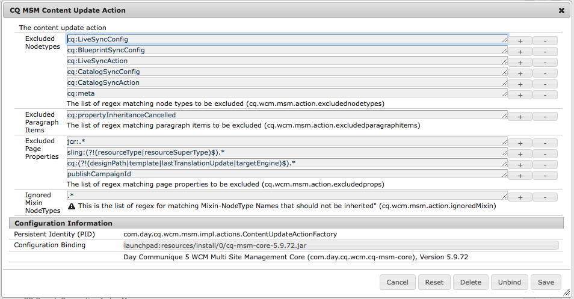
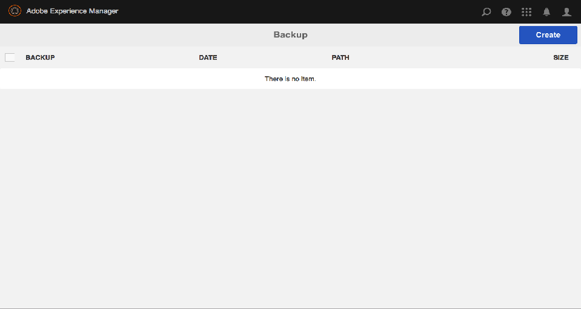
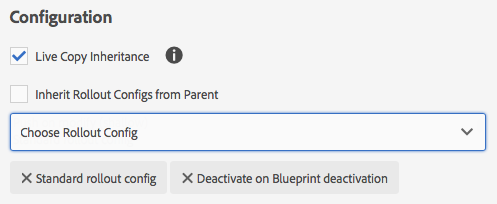

# Configuring Live Copy Synchronization{#configuring-live-copy-synchronization}

Perform the following tasks to control how and when live copies are synchronized with their source content.

* Decide whether existing rollout configurations meet your requirements, or whether you need to create one or more.
* Specify the rollout configurations to use for your live copies.

## Installed and Custom Rollout Configurations {#installed-and-custom-rollout-configurations}

This section provides information about the installed rollout configurations and the synchronization actions that they use, and how to create custom configurations if necessary.

>[!CAUTION]
>
>Updating or changing an out of the box (installed) rollout configuration is **not** recommended. If there is a requirement for a custom live action then it should be added in a custom rollout configuration.

### Rollout Triggers {#rollout-triggers}

Each rollout configuration uses a rollout trigger that causes the rollout to occur. Rollout configurations can use one of the following triggers:

* **On Rollout**: The **Rollout** command is used on the blue print page, or the **Synchronize** command is used on the live copy page.

* **On Modification**: The source page is modified.

* **On Activation**: The source page is activated.

* **On Deactivation**: The source page is deactivated.

>[!NOTE]
>
>Use of the On Modification trigger can impact performance. See [MSM best practices](/help/sites-administering/msm-best-practices.md#onmodify) for more information.

### Installed Rollout Configurations {#installed-rollout-configurations}

The following table lists the rollout configurations that are installed with AEM. The table includes the trigger and synchronization actions of each rollout configuration. If the installed rollout configuration actions do not meet your requirements, you can [create a rollout configuration](#creating-a-rollout-configuration).

<table>
 <tbody>
  <tr>
   <th>Name</th>
   <th>Description</th>
   <th>Trigger</th>
   <th>Synchronization Actions    see also <a href="#installed-synchronization-actions">Installed Synchronization Actions</a></th>
  </tr>
  <tr>
   <td>Standard rollout config</td>
   <td>Standard rollout configuration which lets you start rollout process on rollout trigger and runs actions: create, update, delete content and order children nodes.</td>
   <td>On Rollout</td>
   <td>contentUpdate  contentCopy  contentDelete  referencesUpdate  productUpdate  orderChildren</td>
  </tr>
  <tr>
   <td>Activate on Blueprint activation</td>
   <td>Publishes the live copy when the source is published.</td>
   <td>On Activation</td>
   <td>targetActivate</td>
  </tr>
  <tr>
   <td>Deactivate on Blueprint deactivation</td>
   <td>Deactivates the live copy when the source is deactivated.</td>
   <td>On Deactivation</td>
   <td>targetDeactivate  </td>
  </tr>
  <tr>
   <td>Push on modify</td>
   <td>
Pushes the content to the live copy when the source is modified.
 
Use this rollout configuration sparingly as it uses the On Modification trigger.
 </td>
   <td>On Modification</td>
   <td>contentUpdate  contentCopy  contentDelete  referencesUpdate  orderChildren  </td>
  </tr>
  <tr>
   <td>Push on modify (shallow)</td>
   <td>
Pushes content to the live copy when the blueprint page is modified, without updating references (for example, for shallow copies).
 
Use this rollout configuration sparingly as it uses the On Modification trigger.
 </td>
   <td>On Modification</td>
   <td>contentUpdate  contentCopy  contentDelete  orderChildren</td>
  </tr>
  <tr>
   <td>Promote Launch</td>
   <td>Standard rollout configuration for promoting launch pages.</td>
   <td>On Rollout</td>
   <td>contentUpdate  contentCopy  contentDelete  referencesUpdate  orderChildren  markLiveRelationship</td>
  </tr>
  <tr>
   <td>Catalog Page Content Rollout Config</td>
   <td>Applies page templates from a catalog blueprint.</td>
   <td>On Rollout</td>
   <td>contentUpdate  contentCopy  contentDelete  referencesUpdate  productCreateUpdate  orderChildren</td>
  </tr>
  <tr>
   <td>Catalog page update rollout config</td>
   <td>Applies target properties from a catalog blueprint. Must run after Catalog Page Content Rollout Config.</td>
   <td>On Rollout</td>
   <td>catalogRolloutHooks</td>
  </tr>
  <tr>
   <td>DPS Publications Rollout Config</td>
   <td>DPS Publication rollout configuration which lets you start rollout process on rollout trigger while excluding FolioProducer binding properties on initial rollout</td>
   <td>On Rollout</td>
   <td>contentUpdate  contentCopy  contentDelete  referencesUpdate  orderChildren  dpsMetadataFilter</td>
  </tr>
  <tr>
   <td>Legacy (5.6.0) Catalog Rollout Config</td>
   <td>Deprecated. Use Catalog Generator instead of MSM for catalog rollouts.</td>
   <td>On Rollout</td>
   <td>editProperties</td>
  </tr>
 </tbody>
</table>

### Installed Synchronization Actions {#installed-synchronization-actions}

The following table lists the synchronization actions that are installed with AEM. If the installed actions do not meet your requirements, you can [Create a New Synchronization Action](/help/sites-developing/extending-msm.md#creating-a-new-synchronization-action).

<table>
 <tbody>
  <tr>
   <th>Action Name</th>
   <th>Description</th>
   <th>Properties  </th>
  </tr>
  <tr>
   <td>contentCopy</td>
   <td>When nodes of the source do not exist on the live copy, copies the nodes to the live copy. <a href="#excluding-properties-and-node-types-from-synchronization">Configure the CQ MSM Content Copy Action service</a> to specify the node types, paragraph items, and page properties to exclude.   </td>
   <td> </td>
  </tr>
  <tr>
   <td>contentDelete</td>
   <td>
Deletes nodes of the live copy that do not exist on the source. <a href="#excluding-properties-and-node-types-from-synchronization">Configure the CQ MSM Content Delete Action service</a> to specify the node types, paragraph items, and page properties to exclude. 
 </td>
   <td> </td>
  </tr>
  <tr>
   <td>contentUpdate</td>
   <td>Updates the live copy content with the changes from the source. <a href="#excluding-properties-and-node-types-from-synchronization">Configure the CQ MSM Content Update Action service</a> to specify the node types, paragraph items, and page properties to exclude.   </td>
   <td> </td>
  </tr>
  <tr>
   <td>editProperties</td>
   <td>
Edits properties of the live copy. The editMap property determines which properties are edited and their value. The value of the editMap property must use the following format:
 
<code>[property_name_1]#[current_value]#</code>[new_value],  <code>[property_name_2]#[current_value]#</code>[new_value],  ... ,  <code>[property_name_n]#[current_value]#</code>[new_value]
 
The <code>current_value</code> and <code>new_value</code> items are regular expressions.   
 
For example, consider the following value for editMap:
 
<code>sling:resourceType#/</code>(contentpage|homepage)#/  mobilecontentpage,  cq:template#/contentpage#/mobilecontentpage
 
This value edits the properties of the live copy nodes as follows:

    <ul>
     <li>The <code>sling:resourceType</code> properties that are either set to <code>contentpage</code> or to <code>homepage</code> are set to <code>mobilecontentpage.</code></li>
     <li>The <code>cq:template</code> properties that are set to <code>contentpage</code> are set to <code>mobilecontentpage.</code></li>
    </ul> </td>
   <td>
 
 
editMap: (String) Identifies the property, the current value, and the new value. See the Description for information.  
 </td>
  </tr>
  <tr>
   <td>notify</td>
   <td>Sends a page event that the page has been rolled out. To be notified, one needs to first subscribe to rollout events.</td>
   <td> </td>
  </tr>
  <tr>
   <td>orderChildren</td>
   <td>On the live copy, it orders the children (nodes), based on the order on the blueprint  </td>
   <td> </td>
  </tr>
  <tr>
   <td>referencesUpdate</td>
   <td>
On the live copy, this synchronization action updates references such as links.  It searches for paths in the live copy pages that point to a resource within the blueprint. When found, it updates the path to point to the related resource inside the live copy (instead of the blueprint). References that have targets outside the blueprint are not changed.
 
<a href="#excluding-properties-and-node-types-from-synchronization">Configure the CQ MSM References Update Action service</a> to specify the node types, paragraph items, and page properties to exclude. 
 </td>
   <td> </td>
  </tr>
  <tr>
   <td>targetVersion</td>
   <td>
Creates a version of the live copy.
 
This action must be the only synchronization action included in a rollout configuration.
 </td>
   <td> </td>
  </tr>
  <tr>
   <td>targetActivate</td>
   <td>
Activates the live copy.
 
This action must be the only synchronization action included in a rollout configuration.
 </td>
   <td> </td>
  </tr>
  <tr>
   <td>targetDeactivate</td>
   <td>
Deactivates the live copy.
 
This action must be the only synchronization action included in a rollout configuration.
 </td>
   <td> </td>
  </tr>
  <tr>
   <td>workflow</td>
   <td>
Starts the workflow that is defined by the target property (for pages only) and takes the live copy as payload.
 
The target path is the path of the model node.
 </td>
   <td>target: (String) The path to the workflow model.  </td>
  </tr>
  <tr>
   <td>mandatory</td>
   <td>
Sets the permission of several ACLs on the live copy page to read-only for a specific user group. The following ACLs are configured:

    <ul>
     <li>ActionSet.ACTION_NAME_REMOVE</li>
     <li>ActionSet.ACTION_NAME_SET_PROPERTY</li>
     <li>ActionSet.ACTION_NAME_ACL_MODIFY</li>
    </ul> 
Use this action for pages only.
 </td>
   <td>target: (String) The ID of the group for which you are setting permissions.   </td>
  </tr>
  <tr>
   <td>mandatoryContent</td>
   <td>
Sets the permission of several ACLs on the live copy page to read-only for a specific user group. The following ACLs are configured:

    <ul>
     <li>ActionSet.ACTION_NAME_SET_PROPERTY</li>
     <li>ActionSet.ACTION_NAME_ACL_MODIFY</li>
    </ul> 
Use this action for pages only.
 </td>
   <td>target: (String) The ID of the group for which you are setting permissions. </td>
  </tr>
  <tr>
   <td>mandatoryStructure</td>
   <td>Sets the permission of the ActionSet.ACTION_NAME_REMOVE ACL on the live copy page to read-only for a specific user group. Use this action for pages only.</td>
   <td>target: (String) The ID of the group for which you are setting permissions. </td>
  </tr>
  <tr>
   <td>VersionCopyAction</td>
   <td>If the blueprint/source page has been published at least once, creates a live copy page using the version that is published. Note: this action is only available for creating a live copy page based on a published source page, not for updating an existing live copy page. </td>
   <td> </td>
  </tr>
  <tr>
   <td>PageMoveAction</td>
   <td>
The PageMoveAction applies when a page has been moved in the blueprint.
 
The action copies rather than moves the (related) LiveCopy page from the location before the move to the location after.
 
The PageMoveAction does not change the LiveCopy page at the location before the move. Therefore, for consecutive RolloutConfigurations it has the status of a LiveRelationhip without Blueprint.
 
<a href="#excluding-properties-and-node-types-from-synchronization">Configure the CQ MSM Page Move Action service</a> to specify the node types, paragraph items, and page properties to exclude. 
 
This action must be the only synchronization action included in a rollout configuration.
 </td>
   <td>
prop_referenceUpdate: (Boolean) Set to true to update references. Default is true.
 
 
 </td>
  </tr>
  <tr>
   <td>productCreateUpdate</td>
   <td>Creates or updates Product resources within a catalog. This action is meant to be used in one of the following situations:
    <ul>
     <li>Generating or rolling out a catalog (or catalog section)</li>
     <li>A user restores synchronization inheritance for a product component.</li>
    </ul> </td>
   <td> </td>
  </tr>
  <tr>
   <td>markLiveRelationship</td>
   <td>Indicates a live relationship exists for launch-created content.</td>
   <td> </td>
  </tr>
  <tr>
   <td>catalogRolloutHooks</td>
   <td>Executes catalog-generation-specific rollout hooks. Calls the executePageRolloutHooks and executeProductRolloutHooks methods of the CatalogGenerator.  See com.adobe.cq.commerce.pim.api.CatalogGenerator in the AEM Javadocs.</td>
   <td> </td>
  </tr>
  <tr>
   <td>productUpdate</td>
   <td>Updates product pages in a live copy of a product catalog</td>
   <td> </td>
  </tr>
 </tbody>
</table>

### Creating a Rollout Configuration {#creating-a-rollout-configuration}

You can [create a rollout configuration](/help/sites-developing/extending-msm.md#creating-a-new-rollout-configuration) when the installed rollout configurations do not meet your application requirements:

* [Create the rollout configuration](/help/sites-developing/extending-msm.md#create-the-rollout-configuration).
* [Add synchronization actions to the rollout configuration](/help/sites-developing/extending-msm.md#add-synchronization-actions-to-the-rollout-configuration).

The new rollout configuration is then available to you when setting rollout configurations on a blueprint or live copy page.

### Excluding Properties and Node Types From Synchronization {#excluding-properties-and-node-types-from-synchronization}

You can configure several OSGi services that support corresponding synchronization actions so that they do not affect specific node types and properties. For example, many properties and subnodes related to the internal functioning of AEM should not be included in a live copy. Only the content that is relevent to the user of the page should be copied.

When working with AEM, there are several methods of managing the configuration settings for such services; see [Configuring OSGi](/help/sites-deploying/configuring-osgi.md) for more details and the recommended practices.

The following table lists the synchronization actions for which you can specify the nodes to exclude. The table provides the names of the services to configure using the Web Console and the PID for configuring using a repository node.

| Synchronization Action |Service Name in Web Console |Service PID |
|---|---|---|
| contentCopy |CQ MSM Content Copy Action |com.day.cq.wcm.msm.impl.actions.ContentCopyActionFactory |
| contentDelete |CQ MSM Content Delete Action |com.day.cq.wcm.msm.impl.actions.ContentDeleteActionFactory |
| contentUpdate |CQ MSM Content Update Action |com.day.cq.wcm.msm.impl.actions.ContentUpdateActionFactory |
| PageMoveAction |CQ MSM Page Move Action |com.day.cq.wcm.msm.impl.actions.PageMoveActionFactory |
| referencesUpdate |CQ MSM References Update Action |com.day.cq.wcm.msm.impl.actions.ReferencesUpdateActionFactory |

The following table describes the properties that you can configure:

<table>
 <tbody>
  <tr>
   <th>Web Console property / OSGi property</th>
   <th>Description</th>
  </tr>
  <tr>
   <td>
Excluded Nodetypes
 
cq.wcm.msm.action.excludednodetypes
 </td>
   <td>A regular expression that matches the node types to be excluded from the synchronization action.</td>
  </tr>
  <tr>
   <td>
Excluded Paragraph Items
 
cq.wcm.msm.action.excludedparagraphitems
 </td>
   <td>A regular expression that matches the paragraph items to be excluded from the synchronization action.</td>
  </tr>
  <tr>
   <td>
Excluded Page Properties
 
cq.wcm.msm.action.excludedprops
 </td>
   <td>A regular expression that matches the page properties to be excluded from the synchronization action.</td>
  </tr>
  <tr>
   <td>
Ignored Mixin NodeTypes
 
cq.wcm.msm.action.ignoredMixin
 </td>
   <td>Availalbe only for CQ MSM Content Update Action. A regular expression that matches the names of mixin node types to be excluded from the synchronization action.</td>
  </tr>
 </tbody>
</table>

>[!NOTE]
>
>In the Classic UI, the lock icon that appears in the Page Properties dialog box for LiveCopy pages does not reflect the configuration of the Excluded Page Properties property. The lock icon appears even for properties that are excluded from the synchronization action.

>[!NOTE]
>
>In the touch-optimized UI see also [Configuring MSM Locks on Page Properties(Touch-Optimized UI)](/help/sites-developing/extending-msm.md#configuring-msm-locks-on-pagep-roperties-touch-optimized-ui).

#### CQ MSM Content Update Action - Exclusions {#cq-msm-content-update-action-exclusions}

Several properties and node types are excluded by default, these are defined in the OSGi configuration of **CQ MSM Content Update Action**, under **Excluded Page Properties**.

By default properties matching the following regular expressions are excluded (that is, not updated) on rollout:

You can change the expressions defining the exclusion list as required.

For example, if you want the page **Title** to be included in the changes considered for rollout, remove `jcr:title` from the exclusions. For example, with the regex:

`jcr:(?!(title)$).*`

### Configuring Synchronization for Updating References {#configuring-synchronization-for-updating-references}

You can configure several OSGi services that support corresponding synchronization actions related to updating references.

When working with AEM, there are several methods of managing the configuration settings for such services; see [Configuring OSGi](/help/sites-deploying/configuring-osgi.md) for more details and the recommended practices.

The following table lists the synchronization actions for which you can specify the reference update. The table provides the names of the services to configure using the Web Console and the PID for configuring using a repository node.

<table>
 <tbody>
  <tr>
   <th>Web Console property / OSGi property</th>
   <th>Description</th>
  </tr>
  <tr>
   <td>
Update Reference across nested LiveCopies
 
cq.wcm.msm.impl.action.referencesupdate.prop_updateNested
 </td>
   <td>Only available for CQ MSM References Update Action. Select this option (Web Console) or set this boolean property to true (repository configuration) to replace references that target any resource that is within the branch of the top-most LiveCopy.</td>
  </tr>
  <tr>
   <td>
Update Referencing Pages
 
cq.wcm.msm.impl.actions.pagemove.prop_referenceUpdate
 </td>
   <td>Only available for CQ MSM Page Move Action. Select this option (Web Console) or set this boolean property to <code>true</code> (repository configuration) to update any references to use the original page to instead reference the LiveCopy page.</td>
  </tr>
 </tbody>
</table>

## Specifying the Rollout Configurations to Use {#specifying-the-rollout-configurations-to-use}

MSM enables you to specify sets of rollout configurations that are used generally, and when required you can override them for specific live copies. MSM provides several locations for specifying the rollout configurations to use. The location determines whether the configuration applies to a specific live copy.

The following list of locations where you can specify the rollout configurations to use describes how MSM determines which rollout configurations to use for a live copy:

* **[Live copy page properties](/help/sites-administering/msm-sync.md#setting-the-rollout-configurations-for-a-live-copy-page):** When a live copy page is configured to use one or more rollout configurations, MSM uses those rollout configurations.
* **[Blueprint page properties](/help/sites-administering/msm-sync.md#setting-the-rollout-configuration-for-a-blueprint-page):** When a live copy is based on a blueprint, and the live copy page is not configured with a rollout configuration, the rollout configuration that is associated with the blueprint source page is used.
* **Live copy parent page properties:** When neither the live copy page nor the blueprint source page are configured with a rollout configuration, the rollout configuration that applies to the live copy page's parent page is used.
* **[System default](/help/sites-administering/msm-sync.md#setting-the-system-default-rollout-configuration):** When the rollout configuration of the live copy's parent page cannot be determined, the system default rollout configuration is used.

For example, a blueprint uses the We.Retail Reference Site as source content. A site is created from the blueprint. Each item in the following list describes a different scenario regarding the use of rollout configurations:

* None of the blueprint pages or the live copy pages are configured to use a rollout configuration. MSM uses the system default rollout configuration for all the live copy pages.
* The root page of the We.Retail Reference Site is configured with several rollout configurations. MSM uses these rollout configurations for all the live copy pages.
* The root page of the We.Retail Reference Site is configured with several rollout configurations, and the root page of the live copy site is configured with a different set of rollout configurations. MSM uses the rollout configurations that are configured on the root page of the live copy site.

### Setting the Rollout Configurations for a Live Copy Page {#setting-the-rollout-configurations-for-a-live-copy-page}

Configure a live copy page with the rollout configurations to use when the source page is rolled out. Child pages inherit the configuration by default. When you configure the rollout configuration to use, you are overriding the configuration that the live copy page inherits from its parent.

You can also configure the rollout configurations for a live copy page when you [create the live copy](/help/sites-administering/msm-livecopy.md#creating-a-live-copy-of-a-page).

1. Use the **Sites** console to select the live copy page.
1. Select **Properties** from the toolbar.
1. Open the **Live Copy** tab.

   The **Configuration** section shows the rollout configurations that the page inherits.

   

1. If necessary, adjust the **Live Copy Inheritance** flag. If checked the live copy configuration is effective on all children.

1. Clear the **Inherit Rollout Configuration From Parent** property, then select one or more rollout configurations from the list.

   The selected rollout configurations appear below the drop-down list.

   

1. Click **Save**.

### Setting the Rollout Configuration for a Blueprint Page {#setting-the-rollout-configuration-for-a-blueprint-page}

Configure a blueprint page with the rollout configurations to use when the blueprint page is rolled out.

The child pages of the blueprint page inherit the configuration. When you configure the rollout configuration to use, you could be overriding the configuration that the page inherits from its parent.

1. Use the **Sites** console to select the root page of the blueprint.
1. Select **Properties** from the toolbar.
1. Open the **Blueprint** tab.
1. Select one or more **Rollout Configurations** using the drop-down selector.
1. Persist your updates with **Save**.

### Setting the System Default Rollout Configuration {#setting-the-system-default-rollout-configuration}

Specify a rollout configuration to use as the sytem default. To specify the default, configure the OSGi service:

* **Day CQ WCM Live Relationship Manager**
  the service PID is `com.day.cq.wcm.msm.impl.LiveRelationshipManagerImpl`

Configure the service using either the [Web Console](/help/sites-deploying/configuring-osgi.md#osgi-configuration-with-the-web-console) or a [repository node](/help/sites-deploying/configuring-osgi.md#osgi-configuration-in-the-repository).

* In the web console, the name of the property to configure is Default rollout config.
* Using a repository node, the name of the property to configure is `liverelationshipmgr.relationsconfig.default`.

Set this property value to the path of the rollout configuration to use as the system default. The default value is `/libs/msm/wcm/rolloutconfigs/default`, which is the **Standard Rollout Config**.
