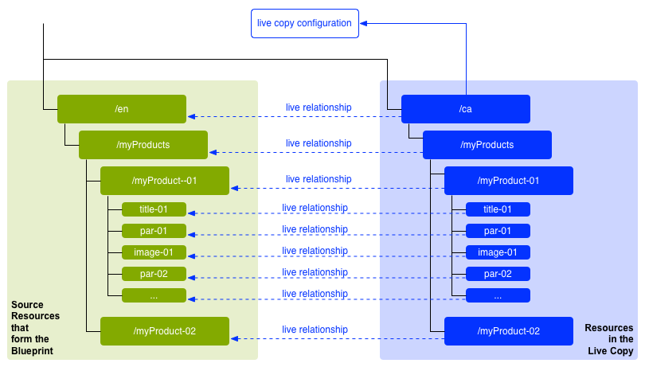
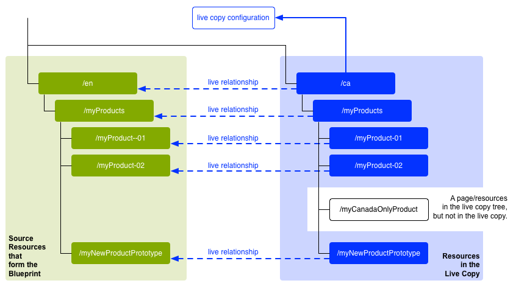
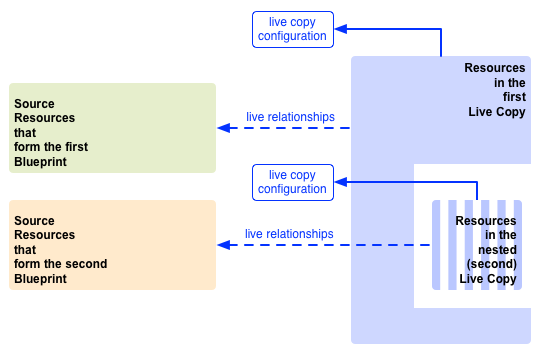
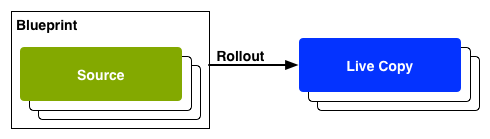
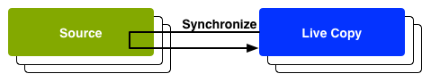

# Reusing Content: Multi Site Manager and Live Copy{#reusing-content-multi-site-manager-and-live-copy}

Multi Site Manager (MSM) enables you to use the same site content in multiple locations. MSM uses its Live Copy functionality to achieve this:

* With MSM you can:

  * Create content once and then
  * Copy this content to, and reuse this content in, other areas ([live copies](#live-copies)) of the same or other sites.

* MSM then maintains the (live) relationships between your source content and its live copies so that:

  * When you change the source content, the source and live copies are synchronized (to apply these changes to the live copies too).
  * You can adjust the content of the live copies by disconnecting the live relationship for individual subpages, or components, or both. By doing this, changes to the source are no longer applied to the live copy.

This and the following pages cover the related issues:

* [Creating and Synchronizing Live Copies](/help/sites-administering/msm-livecopy.md)
* [Live Copy Overview Console](/help/sites-administering/msm-livecopy-overview.md)
* [Configuring Live Copy Synchronization](/help/sites-administering/msm-sync.md)
* [MSM Rollout Conflicts](/help/sites-administering/msm-rollout-conflicts.md)
* [MSM Best Practices](/help/sites-administering/msm-best-practices.md)

## Possible Scenarios {#possible-scenarios}

There are many use-cases for MSM and live copies, some scenarios include:

* **Multinationals - Global to Local Company**

  One typical use case that MSM supports is to reuse content in several multinational same-language sites. This allows the core content to be reused, while allowing for national variations.

  For example, the English section of the We.Retail Reference Site sample is created for customers in the USA. Most of the content in this site can also be used for other We.Retail sites that cater to English-speaking customers of different countries and cultures. The core content remains the same over all sites, while regional adjustments can be made.

  The following structure can be used for sites for the United States, United Kingdom, Canada, and Australia:

  ```xml
  /content
      |- we.retail
          |- language-masters
              |- en
      |- we.retail
          |- us
              |- en
      |- we.retail
          |- gb
              |- en
      |- we.retail
          |- ca
              |- en
      |- we.retail
          |- au
              |- en

  ```

  >[!NOTE]
  >
  >MSM does not translate the content. It is used to create the required structure and deploy the content.
  >
  >
  >See [Translating Content for Multilingual Sites](/help/sites-administering/translation.md) if you want to extend such an example.

* **National - Head-Office to Regional Branches**

  Alternatively a company with a network of dealers might want separate websites for their individual dealerships - each being a variation of the main site provided by the head-office. This might be for a single company with multiple regional offices, or a national franchise system comprised of a central franchisor and multiple local franchisees.

  The head office can supply the core information, whereas the regional entities can add local information, such as contact details, opening hours and events.

  ```xml
  /content
      |- head-office-Berlin
      |- branch-Hamburg
      |- branch-Stuttgart
      |- branch-Munich
      |- branch-Frankfurt
  ```

* **Multiple Versions**

  Or, you can use MSM to create versions of a specific subbranch. For example, a support subsite that holds details of the different versions of a specific product, where the base information remains constant and only the updated features must be changed:

  ```xml
  /content
      |- support
          |- product X
              |- v5.0
              |- v4.0
              |- v3.0
              |- v2.0
              |- v1.0
  ```

  >[!NOTE]
  >
  >In such a scenario, you must decide whether to make a straightforward copy or use live copies.
  >
  >There is a balance of:
  >
  >  * How much of the core content needs updating over the multiple versions.
  >
  >Against:
  >
  >  * How much of the individual copies must be adjusted.

## MSM from the UI {#msm-from-the-ui}

MSM is directly accessible in the UI using various options from the appropriate console. To provide an introduction the following lists the main locations:

* **Create Site** (**Sites**)

    * MSM helps you to manage multiple websites that share common content. For example, websites are often provided for international audiences such that most of the content is common across all countries, with a subset of the content specific to each individual country. MSM lets you [create live copies that automatically update one or more sites based on your source site](/help/sites-administering/msm-livecopy.md#creating-a-live-copy-of-a-site-from-a-blueprint-configuration). This also helps you enforce a common base structure, use the common content across the multiple sites, maintain a common look and feel, and focus efforts on managing the content that actually differs between the sites.
    * It requires a predefined blueprint configuration to specify the source.
    * Creates a live copy of the (predefined) source.
    * It provides the user with the **Rollout** button.

* **Create Live Copy** (**Sites**)

    * MSM lets you [create an ad-hoc (one-off) live copy of an individual page or subbranch of a website](/help/sites-administering/msm-livecopy.md#creating-a-live-copy-of-a-page); for example, duplicating a subbranch to provide information about a new/updated version of a product.
    * Creates an ad-hoc live copy (no blueprint configuration required).
    * It can be used to (immediately) create a live copy of any page/branch.
    * Requires **Synchronize** (does not provide the **Rollout** button).

* **View Properties** (**Sites**)

    * Where appropriate, this option helps you [monitor your live copy](/help/sites-administering/msm-livecopy.md#monitoring-your-live-copy) by providing information on the related **Live Cop**y or **Blueprint**.

* **References** (**Sites**)

    * The [References](/help/sites-authoring/basic-handling.md#references) rail provides information about **Live Copies** together with access to appropriate actions.

* **Live Copy Overview** (**Sites**)

    * This console lets you [view and manage your blueprint and its live copies](/help/sites-administering/msm-livecopy-overview.md).

* **Blueprints** (**Tools** - **Sites**)

    * This console lets you [create and manage your blueprint configurations](/help/sites-administering/msm-livecopy.md#creating-a-blueprint-configuration).

>[!NOTE]
>
>MSM can be used with both pages and [Experience Fragments](/help/sites-authoring/experience-fragments.md) as these fragments are part of an experience (page).

>[!NOTE]
>
>Aspects of MSM functionality are used in several other Adobe Experience Manager (AEM) features (for example, Launches, Catalog); in these cases the live copy is managed by that feature.

### Terms Used {#terms-used}

As an introduction, the following table provides an overview of the main terms used with MSM; these are covered in more detail in the subsequent sections and pages:

<table>
 <tbody>
  <tr>
   <td><strong>Term</strong></td>
   <td><strong>Definition</strong></td>
   <td><strong>Further details</strong></td>
  </tr>
  <tr>
   <td><strong>Source</strong></td>
   <td>The original pages.</td>
   <td>Synonymous with Blueprints and/or Blueprint pages.</td>
  </tr>
  <tr>
   <td><strong>Live Copy</strong></td>
   <td>The copy (of the source), maintained by synchronization actions as defined by the rollout configurations. </td>
   <td> </td>
  </tr>
  <tr>
   <td><strong>Live Copy Configuration</strong></td>
   <td>Definition of the configuration details for a live copy.</td>
   <td> </td>
  </tr>
  <tr>
   <td><strong>Live Relationship</strong><br /> </td>
   <td>Effective definition of the inheritance for a given resource; the connections between the source and live copies.<br /> </td>
   <td>Ensures that changes to the source can be synchronized with the live copy.</td>
  </tr>
  <tr>
   <td><strong>Blueprint</strong></td>
   <td>Synonymous with Source.</td>
   <td>It can be defined by a blueprint configuration.</td>
  </tr>
  <tr>
   <td><strong>Blueprint Configuration</strong></td>
   <td>Predefined configuration specifying a source path.</td>
   <td>When a blueprint page is referenced in a blueprint configuration, the Rollout command becomes available.</td>
  </tr>
  <tr>
   <td><strong>Synchronization</strong></td>
   <td>The generic term for the synchronization of content between the source and the live copies (by both <strong>Rollout</strong> and <strong>Synchronize</strong>).</td>
   <td> </td>
  </tr>
  <tr>
   <td><strong>Rollout</strong><br /> </td>
   <td>Synchronizes from the source to the live copy.<br /> It can be triggered by an author (on a blueprint page) or by a system event (as defined by the rollout configuration).</td>
   <td> </td>
  </tr>
  <tr>
   <td><strong>Rollout Configuration</strong></td>
   <td>Rules that determine which properties are synchronized, how and when.</td>
   <td> </td>
  </tr>
  <tr>
   <td><strong>Synchronize</strong></td>
   <td>A manual request for synchronization, made from the live copy pages.</td>
   <td> </td>
  </tr>
  <tr>
   <td><strong>Inheritance</strong></td>
   <td>A live copy page/component inherits content from its source page/component when synchronization occurs.</td>
   <td> </td>
  </tr>
  <tr>
   <td><strong>Suspend</strong></td>
   <td>Temporarily removes the live relationship between a live copy and its blueprint page.</td>
   <td> </td>
  </tr>
  <tr>
   <td><strong>Detach</strong></td>
   <td>Permanently removes the live relationship between a live copy and its blueprint page.</td>
   <td> </td>
  </tr>
  <tr>
   <td><strong>Reset</strong></td>
   <td><p>Reset a live copy page to:</p>
    <ul>
     <li>Remove all inheritance cancellations and<br /> </li>
     <li>Return the page to the same state as the source page.</li>
    </ul> <p>Reset affects any changes that you have made to page properties, the paragraph system, and components.</p> </td>
   <td> </td>
  </tr>
  <tr>
   <td><strong>Shallow</strong></td>
   <td>A live copy of a single page.</td>
   <td> </td>
  </tr>
  <tr>
   <td><strong>Deep</strong></td>
   <td>A live copy of a page, together with its child pages.</td>
   <td> </td>
  </tr>
 </tbody>
</table>

>[!NOTE]
>
>See [Overview of the Java&trade; API](/help/sites-developing/extending-msm.md#overview-of-the-java-api) for the object names.

## Live Copies {#live-copies}

An MSM live copy is a copy of specific site content for which a live relationship with the original source is maintained:

* The live copy inherits content from its source.
* Synchronization performs the actual transfer of content when changes are made to the source.
* A live copy can be considered as either:

    * Shallow: a single page
    * Deep: the page, together with its child pages

* Synchronization rules&ndash;called rollout configurations&ndash;determine which properties are synchronized and when the synchronization occurs.

In the previous example, `/content/we-retail/language-masters/en` is the global master site in English. To reuse the content of this site, MSM live copies are created:

* The content below `/content/we-retail/language-masters/en` is the source.

* The content below `/content/we-retail/language-masters/en` is copied below the `/content/we-retail/us/en/`, `/content/we-retail/gb/en`, `/content/we-retail/ca/en`, and `/content/we-retail/au/en` nodes. These are the live copies.

* Authors can change pages below `/content/we-retail/language-masters/en`.
* When triggered, MSM synchronizes these changes to the live copies.

### Live Copies - Composition {#live-copies-composition}

>[!NOTE]
>
>The diagrams and descriptions in this section represent snapshots of potential live copies. They are not comprehensive, but provide an overview to highlight specific characteristics.

When you initially create a live copy, the selected source pages are reflected on a 1:1 basis in the live copy. After this, new resources (pages and/or paragraphs) can also be created directly within the live copy, so it is useful to be aware of these variations and how they impact synchronization. Possible compositions include:

* [Live Copy with non-Live-Copy pages](#live-copy-with-non-live-copy-pages)
* [Nested Live Copies](#nested-live-copies)

The basic form of live copy has:

* Live copy pages that reflect the selected source pages on a 1:1 basis.
* One configuration definition.
* A live relationship defined for every resource:

    * Link the live copy resource with its blueprint/source.
    * Used when realizing inheritance and rollout.

* Changes can be [synchronized](/help/sites-administering/msm-livecopy.md#synchronizing-your-live-copy) according to requirements.



#### Live Copy with non-Live-Copy pages {#live-copy-with-non-live-copy-pages}

When you create a live copy in AEM, you can see and navigate through the live copy branch - and use normal AEM functionality on the live copy branch. This means that you (or a process) can create resources (pages, or paragraphs, or both) inside the live copy branch. For example, `myCanadaOnlyProduct`.

* Such resources have no live relationship to the source/blueprint pages and are not synchronized.
* Scenarios can occur that the MSM handles as special cases. For example, when you (or a process) create a page with the same position and name in both the source/blueprint and live copy branches. For such situations, see [MSM Rollout Conflicts](/help/sites-administering/msm-rollout-conflicts.md) for more information.



#### Nested Live Copies {#nested-live-copies}

When you (or a process) create a [page within an existing live copy](#live-copy-with-non-live-copy-pages), this new page can also be set up as a live copy of a different blueprint. This is known as a Nested Live Copy, here the behavior of the second (inner) live copy is affected by the first (outer) live copy in the following way:

* A deep rollout triggered for the top-level live copy can be continued into the nested live copy (for example, if the trigger matches).
* Any links between the sources are rewritten within the live copies.

  For example, links from the second to the first blueprint are rewritten as links from the nested/second live copy to the first live copy.



>[!NOTE]
>
>If you move/rename a page within the live copy branch, then (internally) this is treated as a nested live copy to enable AEM to track the relationships.

#### Stacked Live Copies {#stacked-live-copies}

A live copy is known as a Stacked Live Copy when it is created as the child of a shallow live copy. It behaves in the same manner as a [Nested Live Copy](#nested-live-copies).

### Source, Blueprints, and Blueprint Configurations {#source-blueprints-and-blueprint-configurations}

Any page or branch of pages can be used as the source of a live copy.

However, MSM also lets you define a blueprint configuration that specifies a source path. The benefits of using a blueprint configuration are that they:

* Allow the author to use the **Rollout** option on a blueprint - to (explicitly) push modifications to live copies that inherit from this blueprint.
* Allow the author to use **Create Site**; this allows the user to easily select languages and configure the structure of the live copy.
* Define a default rollout configuration for live copies that have a relationship with the blueprint.

The source for a live copy can be either regular pages or pages encompassed by a blueprint configuration - both are valid use cases.

The source forms the blueprint for the live copy. The blueprint is defined when you either:

* [Create a Blueprint configuration](/help/sites-administering/msm-livecopy.md#creating-a-blueprint-configuration)

  The configuration defines (in advance) the pages to be used to create the live copy.

* [Create a Live Copy of a Page](/help/sites-administering/msm-livecopy.md#creating-a-live-copy-of-a-page)

  The pages used to create the live copy (the source pages) are the blueprint pages.

  The source page can be referenced by a blueprint configuration, or not.

### Rollout and Synchronize {#rollout-and-synchronize}

A rollout is the central MSM action that synchronizes live copies with their source. You can perform rollouts manually or they can occur automatically:

* A [rollout configuration](#rollout-configurations) can be defined so that specific [events](/help/sites-administering/msm-sync.md#rollout-triggers) can cause a rollout to occur automatically.
* When authoring a blueprint page, you can use the [Rollout](/help/sites-administering/msm-livecopy.md#rolling-out-a-blueprint) command to push changes to the live copy.

  **The Rollout** command is available on a blueprint page that is referenced by a blueprint configuration.

  

* When authoring a live copy page, you can use the [Synchronize](/help/sites-administering/msm-livecopy.md#synchronizing-a-live-copy) command to pull changes from the source to the live copy.

  The **Synchronize** command is always available on the live copy page (regardless of whether the source/blueprint page is encompassed by a blueprint configuration).

  

### Rollout Configurations {#rollout-configurations}

A rollout configuration defines when and how a live copy is synchronized with the source content. A rollout configuration consists of a trigger and one or more synchronization actions:

* **Trigger**

  A trigger is an event that causes the live action synchronization to occur, such as the activation of a source page. MSM defines the triggers that you can use.

* **Synchronization actions**

  Performed on the live copy to synchronize it with the source. Example actions are copying content, ordering child nodes, and activating the live copy page. MSM provides several synchronization actions.

  >[!NOTE]
  >
  >You can create custom actions for your instance using the Java&trade; API.

Rollout configurations can be reused, so that more than one live copy can use the same rollout configuration. Several [rollout configurations](/help/sites-administering/msm-sync.md#installed-rollout-configurations) are included in a standard installation.

### Rollout Conflicts {#rollout-conflicts}

Rollouts can become complicated, especially when authors are editing content in both the source and the live copy, so it is useful to be aware of how AEM handles any [conflicts that might occur during rollout](/help/sites-administering/msm-rollout-conflicts.md).

### Suspending and Canceling Inheritance and Synchronization {#suspending-and-cancelling-inheritance-and-synchronization}

Each page and component in a live copy is associated with its source page and component by way of a live relationship. The live relationship configures the synchronization of live copy content from the source.

You can **Suspend** the live copy inheritance for a live copy page so that you can change page properties and components. When you suspend inheritance, the page properties and components are no longer synchronized with the source.

When editing an individual page, authors can **Cancel Inheritance** for a component. When inheritance is canceled, the live relationship is suspended and synchronization does not occur for that component. Canceling inheritance and synchronization is useful when subsections of the content must be customized.

### Detaching a Live Copy {#detaching-a-live-copy}

You can also [detach a live copy](/help/sites-administering/msm-livecopy.md#detaching-a-live-copy) from its blueprint to remove all connections.

>[!CAUTION]
>
>The Detach action is permanent and non-reversible.

Detach permanently removes the live relationship between a live copy and its blueprint page. All MSM-relevant properties are removed from the live copy and the live copy pages become a standalone copy.

>[!NOTE]
>
>See [Detaching a Live Copy](/help/sites-administering/msm-livecopy.md#detaching-a-live-copy) for full details; including the related impact on sub- and parent pages.

## Standard Steps for Using MSM {#standard-steps-for-using-msm}

The following steps describe the standard procedure for using MSM to reuse content and synchronize changes to live copies.

1. Develop the content of the source site.
1. Determine the rollout configuration to use.

    1. MSM [installs several rollout configurations](/help/sites-administering/msm-sync.md#installed-rollout-configurations) that can satisfy various use cases.
    1. Optionally you can [create a rollout configuration](/help/sites-administering/msm-sync.md#creating-a-rollout-configuration) if necessary.

1. Determine where you must [specify the rollout configurations to use](/help/sites-administering/msm-sync.md#specifying-the-rollout-configurations-to-use) and configure as required.
1. If necessary, [create a blueprint configuration](/help/sites-administering/msm-livecopy.md#creating-a-blueprint-configuration) that identifies the source content of the live copy.
1. [Create a live copy](/help/sites-administering/msm-livecopy.md#creating-a-live-copy).
1. Change the source content as required. Employ the normal content review and approval process that your organization has established.
1. [Roll out](/help/sites-administering/msm-livecopy.md#rolling-out-a-blueprint) the blueprint, or [synchronize the live copy](/help/sites-administering/msm-livecopy.md#synchronizing-a-live-copy) with the changes.

## Customizing MSM {#customizing-msm}

MSM provides tools so that your implementation can adapt to the exceptional complexities that can exist when sharing content:

* **Custom Rollout Configurations**
  [Create a rollout configuration](/help/sites-administering/msm-sync.md#creating-a-rollout-configuration) when the installed rollout configurations do not meet your requirements. You can use any available rollout trigger and synchronization action.

* **Custom Synchronization Actions**
  [Create a custom synchronization action](/help/sites-developing/extending-msm.md#creating-a-new-synchronization-action) when the installed actions do not meet your specific application requirements. MSM provides a Java&trade; API for creating custom synchronization actions.

## Best Practices {#best-practices}

The [MSM Best Practices](/help/sites-administering/msm-best-practices.md) page contains important information regarding your implementation.
