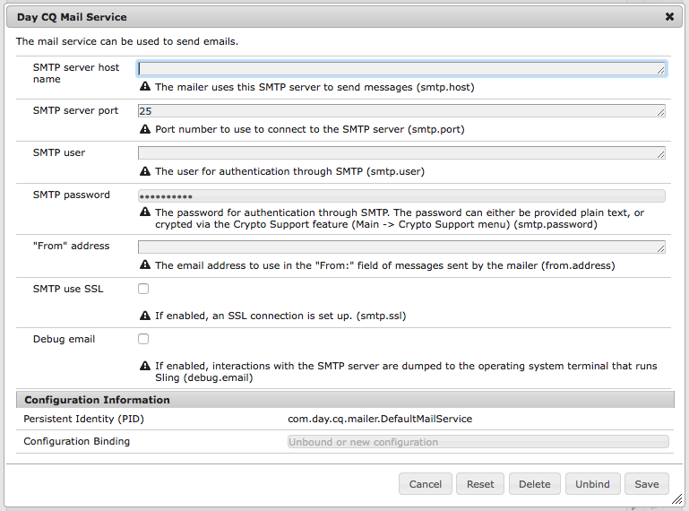
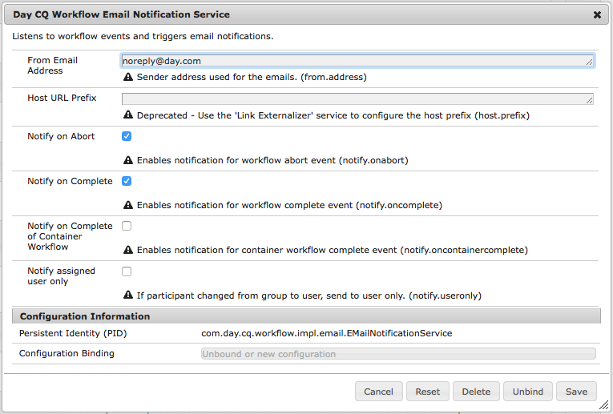

# Configuring Email Notification{#configuring-email-notification}

AEM sends email notifications to users who:

* Have subscribed to page events, for example modification or replication. The [Notification Inbox](/help/sites-classic-ui-authoring/author-env-inbox.md#subscribing-to-notifications) section describes how to subscribe to such events.  

* Have subscribed to forum events.
* Have to perform a step in a workflow. The [Participant Step](/help/sites-developing/workflows-step-ref.md#participant-step) section describes how to trigger email notification in a workflow.

Pre-requisites:

* The user(s) needs to have a valid email address defined in his profile.
* The **Day CQ Mail Service** needs to be properly configured.

When a user is notified, he receives an email in the language that is defined in his profile. Each language has its own template that can be customized. New email templates can be added for new languages.

>[!NOTE]
>
>When working with AEM there are several methods of managing the configuration settings for such services; see [Configuring OSGi](/help/sites-deploying/configuring-osgi.md) for more details and the recommended practices.

## Configuring the Mail Service {#configuring-the-mail-service}

For AEM to be able to send emails, the **Day CQ Mail Service** needs to be properly configured. You can view the configuration in the Web console. When working with AEM there are several methods of managing the configuration settings for such services; see [Configuring OSGi](/help/sites-deploying/configuring-osgi.md) for more details and the recommended practices.

The following constraints apply:

* The **SMTP server port** must be 25 or higher.  

* The **SMTP server host name** must not be blank.
* The **"From" address** must not be blank.

To help you debug an issue with the **Day CQ Mail Service**, you can watch the logs of the service:

`com.day.cq.mailer.DefaultMailService`

The configuration looks as follows in the Web console:

 

## Configuring the Email Notification Channel {#configuring-the-email-notification-channel}

When you subscribe to either page or forum events notifications, the from-email address is set to `no-reply@acme.com` per default. You can change this value by configuring the **Notification Email Channel** service in the Web Console.

To configure the from-email address, add a `sling:OsgiConfig` node to the repository. Use the following procedure to add the node directly using CRXDE Lite:

1. In CRXDE Lite, add a folder named `config` below your application folder.
1. In the config folder, add a node named:

   `com.day.cq.wcm.notification.email.impl.EmailChannel` of type `sling:OsgiConfig`

1. Add a `String` property to the node] named `email.from`. For the value, specify the email address that you want to use.

1. Click **Save All**.

Use the following procedure to define the node in your content package source folders:

1. In your `jcr_root/apps/*app_name*/config folder`, create a file named `com.day.cq.wcm.notification.email.impl.EmailChannel.xml` 

1. Add the following XML to represent the node:

   `<?xml version="1.0" encoding="UTF-8"?> <jcr:root xmlns:sling="https://sling.apache.org/jcr/sling/1.0" xmlns:jcr="https://www.jcp.org/jcr/1.0" jcr:primaryType="sling:OsgiConfig" email.from="name@server.com"/>`
1. Replace the value of the `email.from` attribute ( `name@server.com`) with your email address.

1. Save the file.

## Configuring the Workflow Email Notification Service {#configuring-the-workflow-email-notification-service}

When you receive workflow email notifications, both the from-email address and the host URL prefix are set to default values. You can change these values by configuring the **Day CQ Workflow Email Notification Service** in the Web Console. If you do so, it is recommended to persist the change in the repository.

The default configuration looks as follows in the Web Console:

 

### Email Templates for Page Notification {#email-templates-for-page-notification}

Email templates for page notifications are located below:

`/etc/notification/email/default/com.day.cq.wcm.core.page`

The default English template ( `en.txt`) is defined as follows:

```xml
subject=[CQ Page Event Notification]: Page Event

header=-------------------------------------------------------------------------------------\n \
Time: ${time}\n \
User: ${userFullName} (${userId})\n \
-------------------------------------------------------------------------------------\n\n

message=The following pages were affected by the event: \n \
 \n \
${modifications} \n \
 \n\n
footer=\n \
-------------------------------------------------------------------------------------\n \
This is an automatically generated message. Please do not reply.
```

#### Customizing Email Templates for Page Notification {#customizing-email-templates-for-page-notification}

To customize the English email template for page notification:

1. In CRXDE, open the file:

   `/etc/notification/email/default/com.day.cq.wcm.core.page/en.txt`

1. Modify the file to your needs.
1. Save the changes.

The template needs to have the following format:

```
 subject=<text_1>
 header=<text_2>
 message=<text_3>
 footer=<text_4>
```

Where &lt;text_x&gt; can be a mix of static text and dynamic string variables. The following variables can be used within the email template for page notifications:

* `${time}`, the event date and time.  

* `${userFullName}`, the full name of the user who triggered the event.  

* `${userId}`, the ID of the user who triggered the event.
* `${modifications}`, describes the type of the page event and the page path in the format:

  &lt;page event type&gt; =&gt; &lt;page path&gt;

  For example:

  PageModified =&gt; /content/geometrixx/en/products

### Email Templates for Forum Notification {#email-templates-for-forum-notification}

Email templates for forum notifications are located under:

`/etc/notification/email/default/com.day.cq.collab.forum`

The default English template ( `en.txt`) is defined as follows:

```xml
subject=[CQ Forum Notification]

header=-------------------------------------------------------------------------------------\n \
Time: Time: ${time}\n \
Forum Page Path: ${forum.path}\n \
-------------------------------------------------------------------------------------\n\n

message=Page: ${host.prefix}${forum.path}.html\n

footer=\n \
-------------------------------------------------------------------------------------\n \
This is an automatically generated message. Please do not reply.

```

#### Customizing Email Templates for Forum Notification {#customizing-email-templates-for-forum-notification}

To customize the English email template for forum notification:

1. In CRXDE, open the file: 

   `/etc/notification/email/default/com.day.cq.collab.forum/en.txt`

1. Modify the file to your needs.
1. Save the changes.

The template needs to have the following format:

```
 subject=<text_1>
 header=<text_2>
 message=<text_3>
 footer=<text_4>
```

Where `<text_x>` can be a mix of static text and dynamic string variables.

The following variables can be used within the email template for forum notifications:

* `${time}`, the event date and time.  

* `${forum.path}`, the path to the forum page.

### Email Templates for Workflow Notification {#email-templates-for-workflow-notification}

The email template for workflow notifications (English) is located at:

`/etc/workflow/notification/email/default/en.txt`

It is defined as follows:

```xml
subject=Workflow notification: ${event.EventType}

header=-------------------------------------------------------------------------------------\n \
Time: ${event.TimeStamp}\n \
Step: ${item.node.title}\n \
User: ${participant.name} (${participant.id})\n \
Workflow: ${model.title}\n \
-------------------------------------------------------------------------------------\n\n

message=Content: ${host.prefix}${payload.path.open}\n

footer=\n \
-------------------------------------------------------------------------------------\n \
View the overview in your ${host.prefix}/aem/inbox\n \
-------------------------------------------------------------------------------------\n \
This is an automatically generated message. Please do not reply.
```

#### Customizing Email Templates for Workflow Notification {#customizing-email-templates-for-workflow-notification}

To customize the English email template for workflow event notification:

1. In CRXDE, open the file:

   `/etc/workflow/notification/email/default/en.txt`

1. Modify the file to your needs.
1. Save the changes.

The template needs to have the following format:

```
subject=<text_1>
 header=<text_2>
 message=<text_3>
 footer=<text_4>
```

>[!NOTE]
>
>Where `<text_x>` can be a mix of static text and dynamic string variables. Each line of an `<text_x>` item needs to be ended with a backslash ( `\`), except for the last instance, when the absence of the backslash indicates the end of the `<text_x>` string variable.
>
>More information about the template format can be found in the [javadocs of the Properties.load()](https://docs.oracle.com/javase/8/docs/api/java/util/Properties.html#load-java.io.InputStream-) method.

The method `${payload.path.open}` reveals the path to the payload of the workitem. For example, for a page in Sites then then `payload.path.open` would be similar to `/bin/wcmcommand?cmd=open&path=…`.; this is without the server name, which is why the template prepends this with `${host.prefix}`.

The following variables can be used within the email template:

* `${event.EventType}`, type of the event
* `${event.TimeStamp}`, date and time of the event
* `${event.User}`, the user who triggered the event
* `${initiator.home}`, the initiator node path  

* `${initiator.name}`, the initiator name  

* `${initiator.email}`, email address of the initiator
* `${item.id}`, the id of the work item
* `${item.node.id}`, id of the node in the workflow model associated with this workitem
* `${item.node.title}`, title of the work item
* `${participant.email}`, email address of the participant
* `${participant.name}`, name of the participant
* `${participant.familyName}`, family name of the participant
* `${participant.id}`, id of the participant
* `${participant.language}`, the participant language
* `${instance.id}`, the workflow id
* `${instance.state}`, the workflow state
* `${model.title}`, title of the workflow model
* `${model.id}`, the id of the workflow model  

* `${model.version}`, the version of the workflow model
* `${payload.data}`, the payload  

* `${payload.type}`, the payload type
* `${payload.path}`, path of the payload
* `${host.prefix}`, host prefix, e.g.: http://localhost:4502

### Adding an Email Template for a New Language {#adding-an-email-template-for-a-new-language}

To add a template for a new language:

1. In CRXDE, add a file `<language-code>.txt` below:

    * `/etc/notification/email/default/com.day.cq.wcm.core.page` : for page notifications 
    * `/etc/notification/email/default/com.day.cq.collab.forum` : for forum notifications
    * `/etc/workflow/notification/email/default` : for workflow notifications

1. Adapt the file to the language.
1. Save the changes.

>[!NOTE]
>
>The `<language-code>` used as the filename for the email template needs to be a two-letters lower-case language code that is recognized by AEM. For language codes, AEM relies on ISO-639-1.

## Configuring AEM Assets email notifications {#assetsconfig}

When Collections in AEM Assets are shared or unshared, users can receive email notifications from AEM. To configure email notifications, follow these steps.

1. Configure the email service, as described above in [Configuring the Mail Service](/help/sites-administering/notification.md#configuring-the-mail-service).
1. Log into AEM as an administrator. Click **Tools** &gt;  **Operations** &gt;  **Web Console** to open Web Console Configuration.
1. Edit **Day CQ DAM Resource Collection Servlet**. Select **send email**. Click **Save**.

