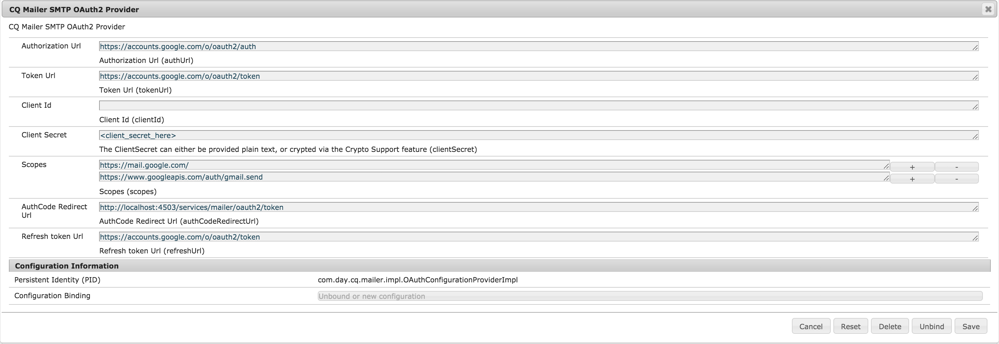

# Configuring Email Notification{#configuring-email-notification}

AEM sends email notifications to users who:

* Have subscribed to page events, for example modification or replication. The [Notification Inbox](/help/sites-classic-ui-authoring/author-env-inbox.md#subscribing-to-notifications) section describes how to subscribe to such events.

* Have subscribed to forum events.
* Have to perform a step in a workflow. The [Participant Step](/help/sites-developing/workflows-step-ref.md#participant-step) section describes how to trigger email notification in a workflow.

Pre-requisites:

* The user(s) needs to have a valid email address defined in his profile.
* The **Day CQ Mail Service** needs to be properly configured.

When a user is notified, he receives an email in the language that is defined in his profile. Each language has its own template that can be customized. New email templates can be added for new languages.

>[!NOTE]
>
>When working with AEM there are several methods of managing the configuration settings for such services; see [Configuring OSGi](/help/sites-deploying/configuring-osgi.md) for more details and the recommended practices.

## Configuring the Mail Service {#configuring-the-mail-service}

For AEM to be able to send emails, the **Day CQ Mail Service** needs to be properly configured. You can view the configuration in the Web console. When working with AEM there are several methods of managing the configuration settings for such services; see [Configuring OSGi](/help/sites-deploying/configuring-osgi.md) for more details and the recommended practices.

The following constraints apply:

* The **SMTP server port** must be 25 or higher.

* The **SMTP server host name** must not be blank.
* The **"From" address** must not be blank.

To help you debug an issue with the **Day CQ Mail Service**, you can watch the logs of the service:

`com.day.cq.mailer.DefaultMailService`

The configuration looks as follows in the Web console:


## Configuring the Email Notification Channel {#configuring-the-email-notification-channel}

When you subscribe to either page or forum events notifications, the from-email address is set to `no-reply@acme.com` per default. You can change this value by configuring the **Notification Email Channel** service in the Web Console.

To configure the from-email address, add a `sling:OsgiConfig` node to the repository. Use the following procedure to add the node directly using CRXDE Lite:

1. In CRXDE Lite, add a folder named `config` below your application folder.
1. In the config folder, add a node named:

   `com.day.cq.wcm.notification.email.impl.EmailChannel` of type `sling:OsgiConfig`

1. Add a `String` property to the node named `email.from`. For the value, specify the email address that you want to use.

1. Click **Save All**.

Use the following procedure to define the node in your content package source folders:

1. In your `jcr_root/apps/*app_name*/config folder`, create a file named `com.day.cq.wcm.notification.email.impl.EmailChannel.xml`

1. Add the following XML to represent the node:

   `<?xml version="1.0" encoding="UTF-8"?> <jcr:root xmlns:sling="https://sling.apache.org/jcr/sling/1.0" xmlns:jcr="https://www.jcp.org/jcr/1.0" jcr:primaryType="sling:OsgiConfig" email.from="name@server.com"/>`
1. Replace the value of the `email.from` attribute ( `name@server.com`) with your email address.

1. Save the file.

## Configuring the Workflow Email Notification Service {#configuring-the-workflow-email-notification-service}

When you receive workflow email notifications, both the from-email address and the host URL prefix are set to default values. You can change these values by configuring the **Day CQ Workflow Email Notification Service** in the Web Console. If you do so, it is recommended to persist the change in the repository.

The default configuration looks as follows in the Web Console:


### Email Templates for Page Notification {#email-templates-for-page-notification}

Email templates for page notifications are located below:

`/libs/settings/notification-templates/com.day.cq.wcm.core.page`

The default English template ( `en.txt`) is defined as follows:

```xml
subject=[CQ Page Event Notification]: Page Event

header=-------------------------------------------------------------------------------------\n \
Time: ${time}\n \
User: ${userFullName} (${userId})\n \
-------------------------------------------------------------------------------------\n\n

message=The following pages were affected by the event: \n \
 \n \
${modifications} \n \
 \n\n
footer=\n \
-------------------------------------------------------------------------------------\n \
This is an automatically generated message. Please do not reply.
```

#### Customizing Email Templates for Page Notification {#customizing-email-templates-for-page-notification}

To customize the English email template for page notification:

1. In CRXDE, open the file:

   `/libs/settings/notification-templates/com.day.cq.wcm.core.page/en.txt`

1. Modify the file to your needs.
1. Save the changes.

The template needs to have the following format:

```
 subject=<text_1>
 header=<text_2>
 message=<text_3>
 footer=<text_4>
```

Where &lt;text_x&gt; can be a mix of static text and dynamic string variables. The following variables can be used within the email template for page notifications:

* `${time}`, the event date and time.

* `${userFullName}`, the full name of the user who triggered the event.

* `${userId}`, the ID of the user who triggered the event.
* `${modifications}`, describes the type of the page event and the page path in the format:

  &lt;page event type&gt; =&gt; &lt;page path&gt;

  For example:

  PageModified =&gt; /content/geometrixx/en/products

### Email Templates for Workflow Notification {#email-templates-for-workflow-notification}

The email template for workflow notifications (English) is located at:

`/libs/settings/workflow/notification/email/default/en.txt`

It is defined as follows:

```xml
subject=Workflow notification: ${event.EventType}

header=-------------------------------------------------------------------------------------\n \
Time: ${event.TimeStamp}\n \
Step: ${item.node.title}\n \
User: ${participant.name} (${participant.id})\n \
Workflow: ${model.title}\n \
-------------------------------------------------------------------------------------\n\n

message=Content: ${host.prefix}${payload.path.open}\n

footer=\n \
-------------------------------------------------------------------------------------\n \
View the overview in your ${host.prefix}/aem/inbox\n \
-------------------------------------------------------------------------------------\n \
This is an automatically generated message. Please do not reply.
```

#### Customizing Email Templates for Workflow Notification {#customizing-email-templates-for-workflow-notification}

To customize the English email template for workflow event notification:

1. In CRXDE, open the file:

   `/libs/settings/workflow/notification/email/default/en.txt`

1. Modify the file to your needs.
1. Save the changes.

The template needs to have the following format:

```
subject=<text_1>
 header=<text_2>
 message=<text_3>
 footer=<text_4>
```

>[!NOTE]
>
>Where `<text_x>` can be a mix of static text and dynamic string variables. Each line of an `<text_x>` item needs to be ended with a backslash ( `\`), except for the last instance, when the absence of the backslash indicates the end of the `<text_x>` string variable.
>
>More information about the template format can be found in the [javadocs of the Properties.load()](https://docs.oracle.com/javase/8/docs/api/java/util/Properties.html#load-java.io.InputStream-) method.

The method `${payload.path.open}` reveals the path to the payload of the workitem. For example, for a page in Sites then then `payload.path.open` would be similar to `/bin/wcmcommand?cmd=open&path=…`.; this is without the server name, which is why the template prepends this with `${host.prefix}`.

The following variables can be used within the email template:

* `${event.EventType}`, type of the event
* `${event.TimeStamp}`, date and time of the event
* `${event.User}`, the user who triggered the event
* `${initiator.home}`, the initiator node path

* `${initiator.name}`, the initiator name

* `${initiator.email}`, email address of the initiator
* `${item.id}`, the id of the work item
* `${item.node.id}`, id of the node in the workflow model associated with this workitem
* `${item.node.title}`, title of the work item
* `${participant.email}`, email address of the participant
* `${participant.name}`, name of the participant
* `${participant.familyName}`, family name of the participant
* `${participant.id}`, id of the participant
* `${participant.language}`, the participant language
* `${instance.id}`, the workflow id
* `${instance.state}`, the workflow state
* `${model.title}`, title of the workflow model
* `${model.id}`, the id of the workflow model

* `${model.version}`, the version of the workflow model
* `${payload.data}`, the payload

* `${payload.type}`, the payload type
* `${payload.path}`, path of the payload
* `${host.prefix}`, host prefix, e.g.: http://localhost:4502

### Adding an Email Template for a New Language {#adding-an-email-template-for-a-new-language}

To add a template for a new language:

1. In CRXDE, add a file `<language-code>.txt` below:

    * `/libs/settings/notification-templates/com.day.cq.wcm.core.page` : for page notifications
    * `/libs/settings/workflow/notification/email/default` : for workflow notifications

1. Adapt the file to the language.
1. Save the changes.

>[!NOTE]
>
>The `<language-code>` used as the filename for the email template needs to be a two-letters lower-case language code that is recognized by AEM. For language codes, AEM relies on ISO-639-1.

## Configuring AEM Assets email notifications {#assetsconfig}

When Collections in AEM Assets are shared or unshared, users can receive email notifications from AEM. To configure email notifications, follow these steps.

1. Configure the email service, as described above in [Configuring the Mail Service](/help/sites-administering/notification.md#configuring-the-mail-service).
1. Log into AEM as an administrator. Click **Tools** &gt;  **Operations** &gt;  **Web Console** to open Web Console Configuration.
1. Edit **Day CQ DAM Resource Collection Servlet**. Select **send email**. Click **Save**.

## Setting Up OAuth {#setting-up-oauth}

AEM offers OAuth2 support for its integrated Mailer Service, in order to allow organizations to adhere to secure email requirements.

You can configure OAuth for multiple email providers, as outlined below.

>[!NOTE]
>
>This procedure is an example for a Publish instance. If you wish to enable email notifications on an Author instance, you need to follow the same steps on the Author.

### Gmail {#gmail}

1. Create your project at `https://console.developers.google.com/projectcreate`
1. Select your project, then go to **APIs & Services** - **Dashboard - Credentials**
1. Configure the OAuth Consent Screen per your requirements
1. In the Update Screen that follows, add these two scopes:
   * `https://mail.google.com/`
   * `https://www.googleapis.com//auth/gmail.send`
1. Once you have added the scopes, go back to **Credentials** in the left hand menu, then go to **Create Credentials** - **OAuth Client ID** - **Desktop app**
1. A new window will open containing the Client ID and Client Secret. 
1. Save these credentials.

**AEM Side Configurations**

>[!NOTE]
>
>Adobe Managed Service customers can work with their Customer Service Engineer to make these changes to production environments.

First, configure the Mail Service:

1. Open the AEM Web Console by going to `http://serveraddress:serverport/system/console/configMgr`
1. Look for, then click on **Day CQ Mail Service**
1. Add the following settings:
   * SMTP Server Host Name: `smtp.gmail.com`
   * SMTP Server Port: `25` or `587`, depending on the requirements
   * Check the tickboxes for **SMPT use StarTLS** and **SMTP requires StarTLS**
   * Check **OAuth flow** and click **Save**.

Next, configure your SMTP OAuth provder by following the procedure below:

1. Open the AEM Web Console by going to `http://serveraddress:serverport/system/console/configMgr`
1. Look for, then click on **CQ Mailer SMTP OAuth2 Provider**
1. Fill in the required information as follows:
   * Authorization URL: `https://accounts.google.com/o/oauth2/auth`
   * Token URL: `https://accounts.google.com/o/oauth2/token`
   * Scopes: `https://www.googleapis.com/auth/gmail.send` and `https://mail.google.com/`. You can add more than one scope by pressing the **+** button to the right hand side of each configured scope.
   * Client ID and Client Secret: configure these fields with the values that you retrieved as described in the above paragraph.
   * Refresh token URL: `https://accounts.google.com/o/oauth2/token`
   * Refresh Token Expiry: never
1. Click **Save**.

<!-- clarify refresh token expiry, currrently not present in the UI -->

Once configured, the settings should look like this:



Now, activate the OAuth components. You can do this by:

1. Go to the Components Console by visiting this URL: `http://serveraddress:serverport/system/console/components`
1. Look for the following components
   * `com.day.cq.mailer.oauth.servlets.handler.OAuthCodeGenerateServlet`
   * `com.day.cq.mailer.oauth.servlets.handler.OAuthCodeAccessTokenGenerator`
1. Press the Play icon to the left of the components
   
   

Finally, confirm the configuration by:

1. Going to the address of the Publish instance, and logging in as admin.
1. Open a new tab in the browser and go to `http://serveraddress:serverport/services/mailer/oauth2/authorize`. This will redirect you to the page of your SMTP provider, in this case Gmail.
1. Login and consent to giving required permissions
1. After consenting, the token will be stored in the repository. You can access it under `accessToken` by directly accessing this URL on your publish instance: `http://serveraddress:serverport/crx/de/index.jsp#/conf/global/settings/mailer/oauth`
1. Repeat the above for each publish instance

<!-- clarify if the ip/server address in the last procedure is that of the publish instance -->

### Microsoft Outlook {#microsoft-outlook}

1. Go to [https://portal.azure.com/](https://portal.azure.com/) and log in.
1. Search for **Azure Active Directory** in the search bar and click on the result. Alternatively, you can browse directly to [https://portal.azure.com/#blade/Microsoft_AAD_IAM/ActiveDirectoryMenuBlade/Overview](https://portal.azure.com/#blade/Microsoft_AAD_IAM/ActiveDirectoryMenuBlade/Overview)
1. Click on **App Registration** - **New Registration**

   

1. Fill in the information according to your requirements, then click on **Register**
1. Go to the newly created app, and select **API Permissions** 
1. Go to **Add Permission** - **Graph Permission** - **Delegated Permissions**
1. Select the below permissions for your app, then click **Add Permission**:
   * `SMTP.Send`
   * `Mail.Read`
   * `Mail.Send`
   * `openid`
   * `offline_access`
1. Go to **Authentication** - **Add a platform** - **Web**, and in the **Redirect Urls** section, add the following URL for redirecting the OAuth code, then press **Configure**:
   * `http://localhost:4503/services/mailer/oauth2/token`
1. Repeat the above for each publish instance 
1. Configure the settings according to your requirements
1. Next, go to **Certificates and Secrets**, click on **New client secret** and follow the on screen steps to create a secret. Make sure to take note of this secret for later use
1. Press **Overview** in the left hand pane and copy the values for **Application (client) ID** and **Directory (tenant) ID** for later use

To recap, you will need to the following information to configure OAuth2 for the Mailer service on the AEM side:

* The Auth URL, which will be constructed with the tenant ID. It will have this form: `https://login.microsoftonline.com/<tenantID>/oauth2/v2.0/authorize`
* The Token URL, which will be constructed with the tenant ID. It will have this form: `https://login.microsoftonline.com/<tenantID>/oauth2/v2.0/token`
* The Refresh URL, which will be constructed with the tenant ID. It will have this form: `https://login.microsoftonline.com/<tenantID>/oauth2/v2.0/token`
* The Client ID
* The Client Secret

**AEM Side Configurations**

Next, integrate your OAuth2 settings with AEM:

1. Go to the Web Console of your local instance by browsing to `http://serveraddress:serverport/system/console/configMgr`
1. Look for and click on **Day CQ Mail Service**
1. Add the following settings:
   * SMTP Server Host Name: `smtp.office365.com`
   * SMTP user: your username in email format
   * "From" address: The email address to use in the "From:" field of messages sent by the mailer
   * SMTP Server Port: `25` or `587` depending on the requirements
   * Check the tickboxes for **SMPT use StarTLS** and **SMTP requires StarTLS**
   * Check **OAuth flow** and click **Save**.
1. Look for, then click on **CQ Mailer SMTP OAuth2 Provider**
1. Fill in the required information as follows:
   * Fill in the Authorization Url, Token Url and Refresh Token URL by constructing them as described at [the end of this procedure](#microsoft-outlook)
   * Client ID and Client Secret: configure these fields with the values that you retrieved as described above.
   * Add the following Scopes to the configuration:
     * openid
     * offline_access
     * `https://outlook.office365.com/Mail.Send`
     * `https://outlook.office365.com/Mail.Read`
     * `https://outlook.office365.com/SMTP.Send`
   * AuthCode Redirect Url: `http://localhost:4503/services/mailer/oauth2/token`
   * Refresh Token URL: this should have the same value as the Token Url above
1. Click **Save**.

Once configured, the settings should look like this:


Now, activate the OAuth components. You can do this by:

1. Go to the Components Console by visiting this URL: `http://serveraddress:serverport/system/console/components`
1. Look for the following components
   * `com.day.cq.mailer.oauth.servlets.handler.OAuthCodeGenerateServlet`
   * `com.day.cq.mailer.oauth.servlets.handler.OAuthCodeAccessTokenGenerator`
1. Press the Play icon to the left of the components


Finally, confirm the configuration by:

1. Going to the address of the Publish instance, and logging in as admin.
1. Open a new tab in the browser and go to `http://serveraddress:serverport/services/mailer/oauth2/authorize`. This will redirect you to the page of your SMTP provider, in this case Outlook.
1. Login and consent to giving required permissions
1. After consenting, the token will be stored in the repository. You can access it under `accessToken` by directly accessing this URL on your publish instance: `http://serveraddress:serverport/crx/de/index.jsp#/conf/global/settings/mailer/oauth`
