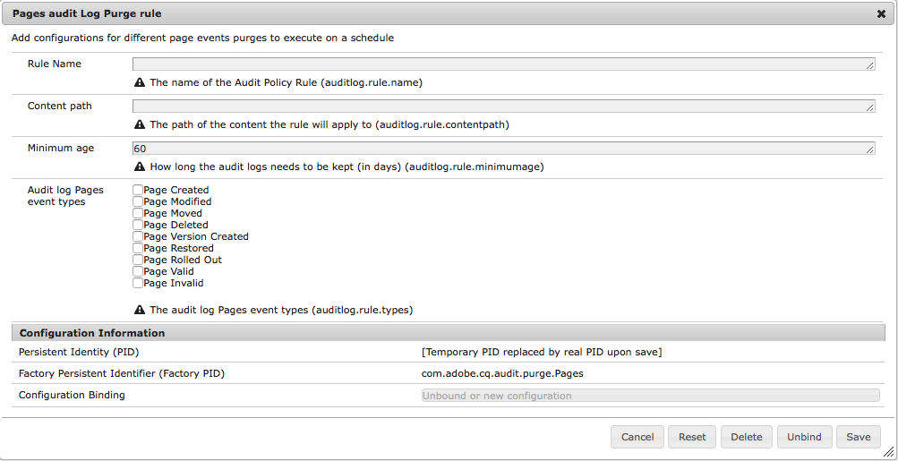

# Audit Log Maintenance in AEM 6{#audit-log-maintenance-in-aem}

AEM events that qualify for audit logging generate much archived data. This data can quickly grow over time due to replications, asset uploads and other system activities.

The Audit Log Maintenance includes several parts of functionality that enables the ability to automate audit log maintenance under specific policies.

It is implemented as a configurable weekly maintenance task and is accessible via the Operations Dashboard monitoring console.

For more information, see the [Operations Dashboard Documentation](/help/sites-administering/operations-dashboard.md).

There are three types of Audit Log Purge options:

1. [Page Audit Log Purging](/help/sites-administering/operations-audit-log.md#configure-page-audit-log-purging)
1. [DAM Audit Log Purging](/help/sites-administering/operations-audit-log.md#configure-dam-audit-log-purging)
1. [Replication Audit Log Puring](/help/sites-administering/operations-audit-log.md#configure-replication-audit-log-purging)

Each can be configured by creating rules in the AEM Web Console. After they have been configured, you can trigger them by going to **Tools - Operations - Maintenance - Weekly Maintenance Window** and running the **AuditLog Maintenance Task**.

## Configure Page Audit Log Purging {#configure-page-audit-log-purging}

Follow these steps to configure Audit Log Purging:

1. Go to the Web Console Admin by pointing your browser to `http://localhost:4502/system/console/configMgr/`

1. Search for an item called **Pages audit Log Purge rule** and click it.

   

1. Next, configure the purge scheduler according to your requirements. The available options are:

    * **Rule name:** the name of the audit policy rule;
    * **Content path:** the path of the content the rule will apply to;
    * **Minimum age:** the time in days the audit logs need to be kept;
    * **Audit log type:** the type of audit log that should be purged.

   >[!NOTE]
   >
   >The content path only applies to children of the `/var/audit/com.day.cq.wcm.core.page` node in the repository.

1. Save the rule.
1. The rule you created needs to be exposed in the Operations Dashboard in order for it to be executed. To do this, go **Tools - Operations - Maintenance** from the AEM Welcome screen.

1. Press the **Weekly Maintenance Window** card.

1. You will find the maintenance task already present under the **AuditLog Maintenance Task** card.

   

1. You can either inspect the date of the next execution, configure it, or manually executing it by pressing the play button.

In AEM 6.3, if the scheduled maintenance window closes before the Audit Log Purge task can complete, the task stops automatically. It will resume when the next maintenance window opens.

**With AEM 6.5**, you can manually stop a running Audit Log Purge Task by clicking the **Stop** icon. On the next execution the task will safely resume.

>[!NOTE]
>
>To stop the maintenance task means to suspend its execution without losing track of the job already in progress.

## Configure DAM Audit Log Purging {#configure-dam-audit-log-purging}

1. Navigate to the System Console at *https://&lt;serveraddress&gt;:&lt;serverport&gt;/system/console/configMgr*
1. Search for **DAM audit Log Purge** rule and click the result.
1. In the next window, configure your rule accordingly. The options are:

    * **Rule name:** the name of the audit policy rule;
    * **Content path:** the path of the content the rule will apply to
    * **Minimum age:** the time in days the audit logs need to be kept
    * **Audit Log Dam event types:** the types of DAM audit events that should be purged.

1. Click **Save** to save your configuration

## Configure Replication Audit Log Purging  {#configure-replication-audit-log-purging}

1. Navigate to the System Console at *https://&lt;serveraddress&gt;:&lt;serverport&gt;/system/console/configMgr*
1. Search for **Replication audit Log Purge Scheduler** and click the result
1. In the next window, configure your rule accordingly. The options are:

    * **Rule name:** the name of the audit policy rule
    * **Content path:** the path of the content the rule will apply to
    * **Minimum age:** the time in days the audit logs need to be kept
    * **Audit log Replication event types:** the types of Replication audit events that should be purged

1. Click **Save** to save your configuration.
