# Operations Dashboard {#operations-dashboard}

## Introduction {#introduction}

The Operations Dashboard in AEM 6 helps system operators to monitor AEM system health at a glance. It also provides auto-generated diagnosis information on relevant aspects of AEM and lets you configure and run self-contained maintenance automation to reduce project operations and support cases significantly. The Operations Dashboard can be extended with custom health checks and maintenance tasks. Further, Operations Dashboard data can be accessed from external monitoring tools via JMX.

**The Operations Dashboard:**

* Is a one-click system status to help operations departments gain efficiency
* Provides system health overview in a single, centralized place
* Reduces time to find, analyze, and fix issues
* Provides self-contained maintenance automation that helps reduce project operations costs significantly

It can be accessed by going to **Tools** - **Operations** from the AEM Welcome screen.

>[!NOTE]
>
>To be able to access the Operations Dashboard, the logged in user must be part of the "Operators" user group. For more info, see documentation on [User, Group, and Access Right Administration](/help/sites-administering/user-group-ac-admin.md).

## Health Reports {#health-reports}

The Health Report system provides information on the health of an AEM instance through Sling Health Checks. You accomplish this operation by way of either OSGI, JMX, HTTP requests (by way of JSON) or through the Touch UI. It offers measurements and threshold of certain configurable counters and sometimes, offers information on how to resolve the issue.

It has several features, described below.

## Health Checks {#health-checks}

The **Health Reports** are a system of cards indicating good or bad health about a specific product area. These cards are visualizations of the Sling Health Checks, which aggregate data from JMX and other sources and expose processed information again as MBeans. These MBeans can also be inspected in the [JMX web console](/help/sites-administering/jmx-console.md), under the **org.apache.sling.healthcheck** domain.

The Health Reports interface can be accessed through the **Tools** - **Operations** - **Health Reports** menu on the AEM Welcome screen, or directly through the following URL:

`https://<serveraddress>:port/libs/granite/operations/content/healthreports/healthreportlist.html`

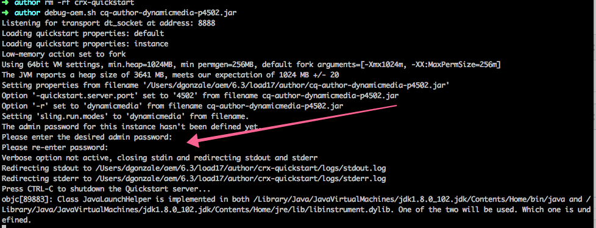

The card system exposes three possible states: **OK**, **WARN** and **CRITICAL**. The states are a result of rules and thresholds, which can be configured by hovering the mouse over the card and then clicking the gear icon in the action bar:

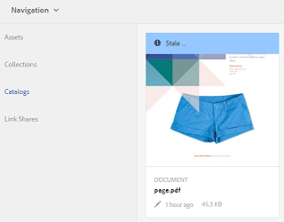

### Health Check Types {#health-check-types}

There are two types of health checks in AEM 6:

1. Individual Health Checks
1. Composite Health Checks

An **Individual Health Check** is a single health check that corresponds to a status card. Individual Health Checks can be configured with rules or thresholds and they can provide one or more hints and links to solve identified health issues. Let's take the "Log Errors" check as an example: if there are ERROR entries in the instance logs, find them on the details page of the health check. At the top of the page, you can see a link to the "Log Message" analyzer in the Diagnosis Tools section, which lets you analyze these errors in more detail and reconfigure the loggers.

A **Composite Health Check** is a check that aggregates information from several individual checks.

Composite health checks are configured with the aid of **filter tags**. In essence, all single checks that have the same filter tag are grouped as a composite health check. A Composite Health Check has an OK status only if all the single checks that it aggregates have OK statuses as well.

### How to create Health Checks {#how-to-create-health-checks}

In the Operations Dashboard, you can visualize the result of both individual and composite Health Checks.

### Creating an individual Health Check {#creating-an-individual-health-check}

Creating an individual Health Check involves two steps: implementing a Sling Health Check and adding an entry for the Health Check in the Dashboard's configuration nodes.

1. To create a Sling Health Check, create an OSGI component implementing the Sling HealthCheck interface. Add this component inside a bundle. The properties of the component fully identify the Health Check. After the component is installed, a JMX MBean is automatically created for the Health Check. See the [Sling Health Check Documentation](https://sling.apache.org/documentation/bundles/sling-health-check-tool.html) for more information.

   Example of a Sling Health Check component, written with OSGI service component annotations:

   ```java
   @Component(service = HealthCheck.class,
   property = {
       HealthCheck.NAME + "=Example Check",
       HealthCheck.TAGS + "=example",
       HealthCheck.TAGS + "=test",
       HealthCheck.MBEAN_NAME + "=exampleHealthCheckMBean"
   })
    public class ExampleHealthCheck implements HealthCheck {
       @Override
       public Result execute() {
           // health check code
       }
    }

   ```

   >[!NOTE]
   >
   >The `MBEAN_NAME` property defines the name of the mbean that is generated for this health check.

1. After creating a Health Check, a new configuration node must be created to make it accessible in the Operations Dashboard interface. For this step, it is necessary to know the JMX Mbean name of the Health Check (the `MBEAN_NAME` property). To create a configuration for the Health Check, open CRXDE and add a node (of type **nt:unstructured**) under the following path: `/apps/settings/granite/operations/hc`

   The following properties should be set on the new node:

    * **Name:** `sling:resourceType`

        * **Type:** `String`
        * **Value:** `granite/operations/components/mbean`

    * **Name:** `resource`

        * **Type:** `String`
        * **Value:** `/system/sling/monitoring/mbeans/org/apache/sling/healthcheck/HealthCheck/exampleHealthCheck`

   >[!NOTE]
   >
   >The resource path above is created as follows: if the mbean name of your Health Check is "test", add "test" to the end of the path `/system/sling/monitoring/mbeans/org/apache/sling/healthcheck/HealthCheck`
   >
   >So the final path is the following:
   >
   >`/system/sling/monitoring/mbeans/org/apache/sling/healthcheck/HealthCheck/test`

   >[!NOTE]
   >
   >Make sure that the `/apps/settings/granite/operations/hc` path has the following properties set to true:
   >
   >
   >`sling:configCollectionInherit`
   >
   >`sling:configPropertyInherit`
   >
   >
   >This process tells the configuration manager to merge the new configurations with the existing ones from `/libs`.

### Creating a Composite Health Check {#creating-a-composite-health-check}

A Composite Health Check's role is to aggregate several individual Health Checks sharing a set of common features. For example, the Security Composite Health Check groups all the individual health checks performing security-related verifications. The first step to create a composite check is to add an OSGI configuration. For it to be displayed in the Operations Dashboard, a new configuration node must be added in the same way as a simple check.

1. Go to the Web Configuration Manager in the OSGI Console. Access `https://serveraddress:port/system/console/configMgr`
1. Search for the entry called **Apache Sling Composite Health Check**. After you find it, notice that there are two configurations already available: one for the System Checks and another one for the Security Checks.
1. Create a configuration by pressing the "+" button on the right-hand side of the configuration. A new window appears, as shown below:

   

1. Create a configuration and save it. A Mbean is created with the new configuration.

   The purpose of each configuration property is as follows:

    * **Name (hc.name):** The name of the Composite Health Check. A meaningful name is recommended.
    * **Tags (hc.tags):** The tags for this Health Check. If this composite health check is intended to be a part of another composite health check (such as in a hierarchy of health checks), add the tags this composite is related to.
    * **MBean Name (hc.mbean.name):** The name of the Mbean that is given to the JMX MBean of this composite health check.
    * **Filter Tags (filter.tags):** The property that is specific to composite health checks. These tags are aggregated by the composite. The composite health check aggregates under its group all the health checks that have any tag matching any of the filter tags of this composite. For example, a composite health check having the filter tags **test** and **check**, aggregates all the individual and composite health checks that have any of the **test** and **check** tags in their tags property ( `hc.tags`).

   >[!NOTE]
   >
   >A new JMX Mbean is created for each new configuration of the Apache Sling Composite Health Check.**

1. Finally, the entry of the composite health check that has been created must be added in the Operations Dashboard configuration nodes. The procedure is the same as with individual health checks: a node of type **nt:unstructured** must be created under `/apps/settings/granite/operations/hc`. The resource property of the node is defined by the value of **hc.mean.name** in the OSGI configuration.

   For example, if you created a configuration and set the **hc.mbean.name** value to **diskusage**, the configuration nodes look like the following:

    * **Name:** `Composite Health Check`

        * **Type:** `nt:unstructured`

   With the following properties:

    * **Name:** `sling:resourceType`

        * **Type:** `String`
        * **Value:** `granite/operations/components/mbean`

    * **Name:** `resource`

        * **Type:** `String`
        * **Value:** `/system/sling/monitoring/mbeans/org/apache/sling/healthcheck/HealthCheck/diskusage`

   >[!NOTE]
   >
   >If you create individual health checks that logically belong under a composite check that is already present in the Dashboard by default, they are automatically captured and grouped under the respective composite check. As such, there is no need to create a configuration node for these checks.
   >
   >For example, if you create an individual security health check, assign it the "**security**" tag, and it is installed. It automatically appears under the Security Checks composite check in the Operations Dashboard.

### Health Checks Provided with AEM {#health-checks-provided-with-aem}

<table>
 <tbody>
  <tr>
   <td><strong>zHealthcheck Name</strong></td>
   <td><strong>Description</strong></td>
  </tr>
  <tr>
   <td>Query Performance</td>
   <td><p>This health check was simplified <strong>in AEM 6.4</strong>, and now checks the recently refactored <code>Oak QueryStats</code> MBean, more specifically the <code>SlowQueries </code>attribute. If the statistics contain any slow queries, then the health check returns a warning. Otherwise, it returns the OK status.<br /> </p> <p>The MBean for this health check is <a href="http://localhost:4502/system/console/jmx/org.apache.sling.healthcheck%3Aname%3DqueriesStatus%2Ctype%3DHealthCheck">org.apache.sling.healthcheck:name=queriesStatus,type=HealthCheck</a>.</p> </td>
  </tr>
  <tr>
   <td>Observation Queue Length</td>
   <td><p>Observation Queue Length iterates over all Event Listeners and Background Observers, compares their <code>queueSize </code>to their <code>maxQueueSize</code> and:</p>
    <ul>
     <li>returns Critical status if the <code>queueSize</code> value exceeds the <code>maxQueueSize</code> value (that is when events would be dropped)</li>
     <li>returns Warn if the <code>queueSize</code> value is over the <code>maxQueueSize * WARN_THRESHOLD</code> (the default value is 0.75) </li>
    </ul> <p>The maximum length of each queue comes from separate configurations (Oak and AEM), and is not configurable from this health check. The MBean for this health check is <a href="http://localhost:4502/system/console/jmx/org.apache.sling.healthcheck%3Aname%3DObservationQueueLengthHealthCheck%2Ctype%3DHealthCheck">org.apache.sling.healthcheck:name=ObservationQueueLengthHealthCheck,type=HealthCheck</a>.</p> </td>
  </tr>
  <tr>
   <td>Query Traversal Limits</td>
   <td><p>Query Traversal Limits checks the <code>QueryEngineSettings</code> MBean, more specifically the <code>LimitInMemory</code> and <code>LimitReads</code> attributes, and returns the following status:</p>
    <ul>
     <li>returns the Warn status if one of the limits is equal or higher than the <code>Integer.MAX_VALUE</code></li>
     <li>returns the Warn status if one of the limits is lower than 10000 (the recommended setting from Oak)</li>
     <li>returns the Critical status if the <code>QueryEngineSettings</code> or any of the limits cannot be retrieved</li>
    </ul> <p>The Mbean for this health check is <a href="http://localhost:4502/system/console/jmx/org.apache.sling.healthcheck%3Aname%3DqueryTraversalLimitsBundle%2Ctype%3DHealthCheck">org.apache.sling.healthcheck:name=queryTraversalLimitsBundle,type=HealthCheck</a>.</p> </td>
  </tr>
  <tr>
   <td>Synchronized Clocks</td>
   <td><p>This check is relevant only for <a href="https://github.com/apache/sling-old-svn-mirror/blob/4df9ab2d6592422889c71fa13afd453a10a5a626/bundles/extensions/discovery/oak/src/main/java/org/apache/sling/discovery/oak/SynchronizedClocksHealthCheck.java">document nodestore clusters</a>. It returns the following status:</p>
    <ul>
     <li>returns the Warn status when the instance clocks get out of sync and go over a predefined low threshold</li>
     <li>returns the Critical status when the instance clocks get out of sync and go over a predefined high threshold</li>
    </ul> <p>The Mbean for this health check is <a href="http://localhost:4502/system/console/jmx/org.apache.sling.healthcheck%3Aname%3DslingDiscoveryOakSynchronizedClocks%2Ctype%3DHealthCheck">org.apache.sling.healthcheck:name=slingDiscoveryOakSynchronizedClocks,type=HealthCheck</a>.</p> </td>
  </tr>
  <tr>
   <td>Asynchronous Indexes</td>
   <td><p>The Asynchronous Indexes check:</p>
    <ul>
     <li>returns Critical status if at least one indexing lane is failing</li>
     <li>checks the <code>lastIndexedTime</code> for all indexing lanes and:
      <ul>
       <li>returns Critical status if it's more than 2 hours ago </li>
       <li>returns Warning status if it's between 2 hours and 45 minutes ago </li>
       <li>returns OK status if it's less than 45 minutes ago </li>
      </ul> </li>
     <li>if none of these conditions are met, it returns the OK status</li>
    </ul> <p>Both the Critical and Warn status thresholds are configurable. The Mbean for this health check is <a href="http://localhost:4502/system/console/jmx/org.apache.sling.healthcheck%3Aname%3DasyncIndexHealthCheck%2Ctype%3DHealthCheck">org.apache.sling.healthcheck:name=asyncIndexHealthCheck,type=HealthCheck</a>.</p> <p><strong>Note: </strong>This health check is available with AEM 6.4 and has been backported to AEM 6.3.0.1.</p> </td>
  </tr>
  <tr>
   <td>Large Lucene Indexes</td>
   <td><p>This check uses the data exposed by the <code>Lucene Index Statistics</code> MBean to identify large indexes and returns:</p>
    <ul>
     <li>a Warning status if there is an index with more than 1 billion documents</li>
     <li>a Critical status if there is an index with more than 1.5 billion documents</li>
    </ul> <p>The thresholds are configurable and the MBean for the health check is <a href="http://localhost:4502/system/console/jmx/org.apache.sling.healthcheck%3Aname%3DlargeIndexHealthCheck%2Ctype%3DHealthCheck">org.apache.sling.healthcheck:name=largeIndexHealthCheck,type=HealthCheck.</a></p> <p><strong>Note: </strong>This check is available with AEM 6.4 and has been backported to AEM 6.3.2.0.</p> </td>
  </tr>
  <tr>
   <td>System Maintenance</td>
   <td><p>System Maintenance is a composite check that returns the OK if all maintenance tasks are running as configured. Keep in mind that:</p>
    <ul>
     <li>each maintenance task is accompanied by an associated health check</li>
     <li>if a task is not added to a maintenance window, its health check returns Critical</li>
     <li>configure the Audit Log and Workflow Purge maintenance tasks or otherwise remove them from the maintenance windows. If left unconfigured, these tasks fail on the first attempted run, so the System Maintenance check returns the Critical status.</li>
     <li><strong>With AEM 6.4</strong>, there is also a check for the <a href="/help/sites-administering/operations-dashboard.md#automated-maintenance-tasks">Lucene Binaries Maintenance</a> task</li>
     <li>on AEM 6.2 and lower, the system maintenance check returns a Warning status right after startup because the tasks never run. Starting with 6.3, they return OK if the first maintenance window was not reached yet.</li>
    </ul> <p>The MBean for this health check is <a href="http://localhost:4502/system/console/jmx/org.apache.sling.healthcheck%3Aname%3Dsystemchecks%2Ctype%3DHealthCheck">org.apache.sling.healthcheck:name=systemchecks,type=HealthCheck</a>.</p> </td>
  </tr>
  <tr>
   <td>Replication Queue</td>
   <td><p>This check iterates over replication agents and looks at their queues. For the item at the top of the queue, the check looks at how many times the agent retried replication. If the agent retried replication more than the value of the <code>numberOfRetriesAllowed</code> parameter, it returns a warning. The <code>numberOfRetriesAllowed</code> parameter is configurable. </p> <p>The MBean for this health check is <a href="http://localhost:4502/system/console/jmx/org.apache.sling.healthcheck%3Aname%3DreplicationQueue%2Ctype%3DHealthCheck" target="_blank">org.apache.sling.healthcheck:name=replicationQueue,type=HealthCheck</a>.</p> </td>
  </tr>
  <tr>
   <td>Sling Jobs</td>
   <td>
    <div>
      Sling Jobs checks the number of jobs queued in the JobManager, compares it to the
     <code>maxNumQueueJobs</code> threshold, and:
    </div>
    <ul>
     <li>returns Critical if more than the <code>maxNumQueueJobs</code> are in the queue</li>
     <li>returns Critical if there are long-running active jobs that are older than 1 hour</li>
     <li>returns Critical if there are queued jobs, and the last finished job time is older than 1 hour</li>
    </ul> <p>Only the maximum number of queued jobs parameter is configurable and it has the default value of 1000.</p> <p>The MBean for this health check is <a href="http://localhost:4502/system/console/jmx/org.apache.sling.healthcheck%3Aname%3DslingJobs%2Ctype%3DHealthCheck" target="_blank">org.apache.sling.healthcheck:name=slingJobs,type=HealthCheck</a>.</p> </td>
  </tr>
  <tr>
   <td>Request Performance</td>
   <td><p>This check looks at the <code>granite.request.metrics.timer</code> <a href="http://localhost:4502/system/console/slingmetrics" target="_blank">Sling metric </a>and:</p>
    <ul>
     <li>returns Critical if the 75th percentile value is over the critical threshold (the default value is 500 milliseconds)</li>
     <li>returns Warn if the 75th percentile value is over the warn threshold (the default value is 200 milliseconds)</li>
    </ul> <p>The MBean for this health check is<em> </em><a href="http://localhost:4502/system/console/jmx/org.apache.sling.healthcheck%3Aname%3DrequestsStatus%2Ctype%3DHealthCheck" target="_blank">org.apache.sling.healthcheck:name=requestsStatus,type=HealthCheck</a>.</p> </td>
  </tr>
  <tr>
   <td>Log Errors</td>
   <td><p>This check returns the Warn status if there are errors in the log.</p> <p>The MBean for this health check is <a href="http://localhost:4502/system/console/jmx/org.apache.sling.healthcheck%3Aname%3DlogErrorHealthCheck%2Ctype%3DHealthCheck" target="_blank">org.apache.sling.healthcheck:name=logErrorHealthCheck,type=HealthCheck</a>.</p> </td>
  </tr>
  <tr>
   <td>Disk Space</td>
   <td><p>The Disk Space check looks at the <code>FileStoreStats</code> MBean, retrieves the size of the Node Store and the amount of usable disk space on the Node Store partition, and:</p>
    <ul>
     <li>returns Warn if the usable disk space to repository size ratio is less than the warn threshold (the default value is 10)</li>
     <li>returns Critical if the usable disk space to repository size ratio is less than the critical threshold (the default value is 2)</li>
    </ul> <p>Both thresholds are configurable. The check only works on instances with a Segment Store.</p> <p>The MBean for this health check is <a href="http://localhost:4502/system/console/jmx/org.apache.sling.healthcheck%3Aname%3DDiskSpaceHealthCheck%2Ctype%3DHealthCheck" target="_blank">org.apache.sling.healthcheck:name=DiskSpaceHealthCheck,type=HealthCheck</a>.</p> </td>
  </tr>
  <tr>
   <td>Scheduler Health Check</td>
   <td><p>This check returns a warning if the instance has Quartz jobs running for more than 60 seconds. The acceptable duration threshold is configurable.</p> <p>The MBean for this health check is <a href="http://localhost:4502/system/console/jmx/org.apache.sling.healthcheck%3Aname%3DslingCommonsSchedulerHealthCheck%2Ctype%3DHealthCheck" target="_blank">org.apache.sling.healthcheck:name=slingCommonsSchedulerHealthCheck,type=HealthCheck</a><em>.</em></p> </td>
  </tr>
  <tr>
   <td>Security Checks</td>
   <td><p>The Security check is a composite which aggregates the results of multiple security-related checks. These individual health checks address different concerns from the security checklist available at the <a href="/help/sites-administering/security-checklist.md">Security Checklist documentation page.</a> The check is useful as a security smoke test when the instance is started. </p> <p>The MBean for this health check is <a href="http://localhost:4502/system/console/jmx/org.apache.sling.healthcheck%3Aname%3Dsecuritychecks%2Ctype%3DHealthCheck" target="_blank">org.apache.sling.healthcheck:name=securitychecks,type=HealthCheck</a></p> </td>
  </tr>
  <tr>
   <td>Active Bundles</td>
   <td><p>Active Bundles checks the state of all bundles and:</p>
    <ul>
     <li>returns the Warn status if any of the bundles is not active or (starting, with lazy activation)</li>
     <li>it ignores the status of bundles in the ignore list</li>
    </ul> <p>The ignore list parameter is configurable.</p> <p>The MBean for this health check is <a href="http://localhost:4502/system/console/jmx/org.apache.sling.healthcheck%3Aname%3DinactiveBundles%2Ctype%3DHealthCheck" target="_blank">org.apache.sling.healthcheck:name=inactiveBundles,type=HealthCheck</a>.</p> </td>
  </tr>
  <tr>
   <td>Code Cache Check</td>
   <td><p>A Health Check that verifies several JVM conditions that can trigger a CodeCache bug present in Java&trade; 7:</p>
    <ul>
     <li>returns Warn if the instance is running on Java&trade; 7, with Code Cache flushing enabled</li>
     <li>returns Warn if the instance is running on Java&trade; 7, and the Reserved Code Cache size is less than a minimum threshold (the default value is 90 MB)</li>
    </ul> <p>The <code>minimum.code.cache.size</code> threshold is configurable. For more information about the bug, see <a href="https://bugs.java.com/bugdatabase/"> and then search on Bug ID 8012547</a>.</p> <p>The MBean for this health check is <a href="http://localhost:4502/system/console/jmx/org.apache.sling.healthcheck%3Aname%3DcodeCacheHealthCheck%2Ctype%3DHealthCheck" target="_blank">org.apache.sling.healthcheck:name=codeCacheHealthCheck,type=HealthCheck</a>.</p> </td>
  </tr>
  <tr>
   <td>Resource Search Path Errors</td>
   <td><p>Checks if there are any resources in the path <code>/apps/foundation/components/primary</code> and:</p>
    <ul>
     <li>returns Warn if there are child nodes under <code>/apps/foundation/components/primary</code></li>
    </ul> <p>The MBean for this health check is <a href="http://localhost:4502/system/console/jmx/org.apache.sling.healthcheck%3Aname%3DresourceSearchPathErrorHealthCheck%2Ctype%3DHealthCheck" target="_blank">org.apache.sling.healthcheck:name=resourceSearchPathErrorHealthCheck,type=HealthCheck</a>.</p> </td>
  </tr>
 </tbody>
</table>

### Health Check Configuration {#health-check-configuration}

By default, for an out-of-the-box AEM instance, the health checks run every 60 seconds.

You can configure the **Period** with the [OSGi configuration](/help/sites-deploying/configuring-osgi.md) **Query Health Check Configuration** (com.adobe.granite.queries.impl.hc.QueryHealthCheckMetrics). 

## Monitoring with Nagios {#monitoring-with-nagios}

The Health Check Dashboard can integrate with Nagios via the Granite JMX Mbeans. The below example illustrates how to add a check that shows used memory on the server running AEM.

1. Set up and install Nagios on the monitoring server.
1. Next, install the Nagios Remote Plugin Executor (NRPE).

   >[!NOTE]
   >
   >For more info on how to install Nagios and NRPE on your system, consult the [Nagios Documentation](https://library.nagios.com/library/products/nagios-core/manuals//).

1. Add a host definition for the AEM server. You can accomplish this task by way of the Nagios XI Web Interface, by using the Configuration Manager:

    1. Open a browser and point to the Nagios server.
    1. Press the **Configure** button in the top menu.
    1. In the left pane, press the **Core Config Manager** under **Advanced Configuration**.
    1. Press the **Hosts** link under the **Monitoring** section.
    1. Add the host definition:

   

   Below is an example of a host configuration file, in case you are using Nagios Core:

   ```xml
   define host {
      address 192.168.0.5
      max_check_attempts 3
      check_period 24x7
      check-command check-host-alive
      contacts admin
      notification_interval 60
      notification_period 24x7
   }
   ```

1. Install Nagios and NRPE on the AEM server.
1. Install the [check_http_json](https://github.com/phrawzty/check_http_json) plugin on both servers.
1. Define a generic JSON check command on both servers:

   ```xml
   define command{

       command_name    check_http_json-int

       command_line    /usr/lib/nagios/plugins/check_http_json --user "$ARG1$" --pass "$ARG2$" -u 'https://$HOSTNAME$:$ARG3$/$ARG4$' -e '$ARG5$' -w '$ARG6$' -c '$ARG7$'

   }
   ```

1. Add a service for used memory on the AEM server:

   ```xml
   define service {

       use generic-service

       host_name my.remote.host

       service_description AEM Author Used Memory

       check_command  check_http_json-int!<cq-user>!<cq-password>!<cq-port>!system/sling/monitoring/mbeans/java/lang/Memory.infinity.json!{noname}.mbean:attributes.HeapMemoryUsage.mbean:attributes.used.mbean:value!<warn-threshold-in-bytes>!<critical-threshold-in-bytes>

       }
   ```

1. Check your Nagios dashboard for the newly created service:

   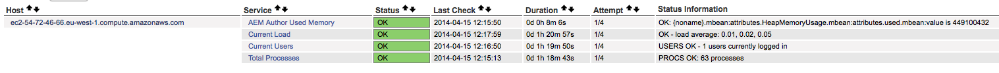

## Diagnosis tools {#diagnosis-tools}

The Operation Dashboard also provides access to Diagnosis Tools that can help finding and troubleshooting root causes of the warnings coming from the Health Check Dashboard, and providing important debug information for system operators.

Among its most important features are:

* A log message analyzer
* The ability to access heap and thread dumps
* Requests and query performance analyzers

You can reach the Diagnosis Tools screen by going to **Tools - Operations - Diagnosis** from the AEM Welcome screen. You can also access the screen by directly accessing the following URL: `https://serveraddress:port/libs/granite/operations/content/diagnosis.html`

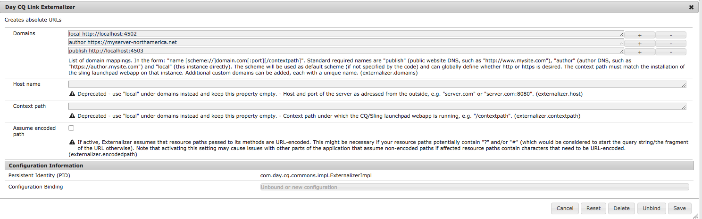

### Log Messages {#log-messages}

The log messages User Interface displays all ERROR messages by default. If you want to have more log messages displayed, configure a logger with the appropriate log level.

The log messages use an in memory log appender and therefore, are not related to the log files. Another consequence is that changing the log levels in this UI does not change the information that gets logged in the traditional log files. Adding and removing loggers in this UI only affects the memory logger. Also, changing the logger configurations is reflected in the future of the in memory logger. The entries that are already logged and are not relevant anymore are not deleted, but similar entries are not logged in the future.

You can configure what gets logged by providing logger configurations from the upper left gear button in the UI. There, you can add, remove, or update logger configurations. A logger configuration is composed of a **log level** (WARN / INFO / DEBUG) and a **filter name**. The **filter name** has the role of filtering the source of the log messages that get logged. Alternatively, if a logger should capture all the log messages for the specified level, the filter name should be "**root**". Setting the level of a logger triggers the capture of all messages with a level equal or higher than the one specified.

Examples:

* If you plan on capturing all the **ERROR** messages - no configuration is required. All the ERROR messages are captured by default.
* If you plan on capturing all the **ERROR**, **WARN** and **INFO** messages - the logger name should be set to: "**root**", and the logger level to: **INFO**.

* If you plan on capturing all the messages coming from a certain package (for example com.adobe.granite) - the logger name should be set to: "com.adobe.granite". And, the logger level set to: **DEBUG** (doing so captures all the **ERROR**, **WARN**, **INFO**, and **DEBUG** messages), as shown in the image below.

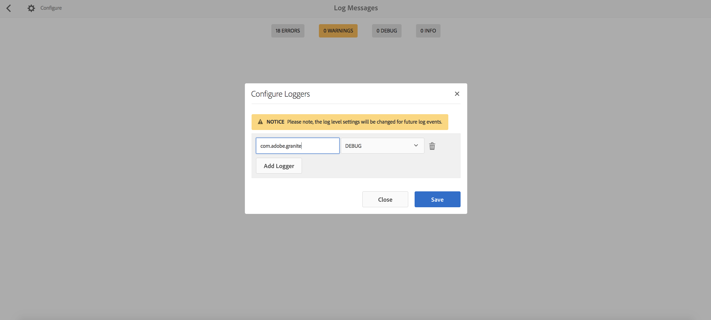

>[!NOTE]
>
>You cannot set a logger name to capture only ERROR messages via a specified filter. By default, all the ERROR messages are captured.

>[!NOTE]
>
>The log messages user interface does not reflect the actual error log. Unless you are configuring other types of log messages in the UI, you see ERROR messages only. For how to display specific log messages, see instructions above.

>[!NOTE]
>
>The settings in the diagnosis page do not influence what is logged to the log files and conversely. So, while the error log might catch INFO messages, you might not see them in the log messages UI. Also, through the UI it's possible to catch DEBUG messages from certain packages without it affecting the error log. For more information on how to configure the log files, see [Logging](/help/sites-deploying/configure-logging.md).

>[!NOTE]
>
>**With AEM 6.4**, maintenance tasks are logged out of the box in a more information rich format at the INFO level. This workflow allows for better visibility into the state of the maintenance tasks.
>
>In case you are using third-party tools (such as Splunk) to monitor and react to maintenance task activity you can use the following log statements:

```
Log level: INFO
DATE+TIME [MaintanceLogger] Name=<MT_NAME>, Status=<MT_STATUS>, Time=<MT_TIME>, Error=<MT_ERROR>, Details=<MT_DETAILS>

```

### Request performance {#request-performance}

The Request Performance page allows the analysis of the slowest page requests processed. Only content requests are registered on this page. More specifically, the following requests are captured:

1. Requests accessing resources under `/content`
1. Requests accessing resources under `/etc/design`
1. Requests having the `".html"` extension

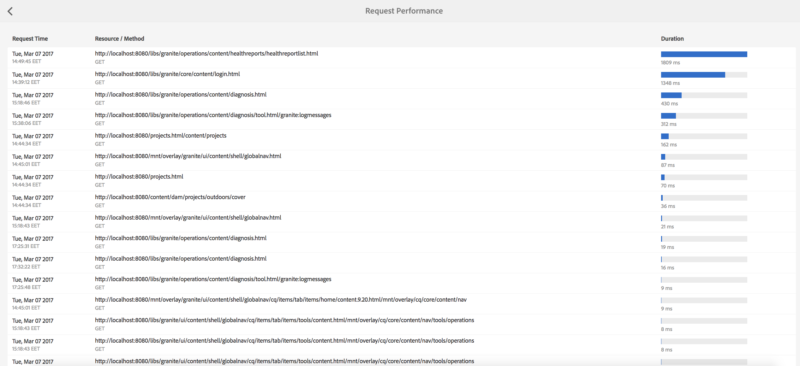

The page displays:

* The time when the request was made
* The URL and the method of request
* The duration in milliseconds

By default, the slowest 20 page requests are captured, but the limit can be modified in the Configuration Manager.

### Query Performance {#query-performance}

The Query Performance page allows the analysis of the slowest queries performed by the system. This information is provided by the repository in a JMX Mbean. In Jackrabbit, the `com.adobe.granite.QueryStat` JMX Mbean provides this information, while in the Oak repository, it is offered by `org.apache.jackrabbit.oak.QueryStats.`

The page displays:

* The time when the query was made
* The language of the query
* The number of times the query was issued
* The statement of the query
* The duration in milliseconds

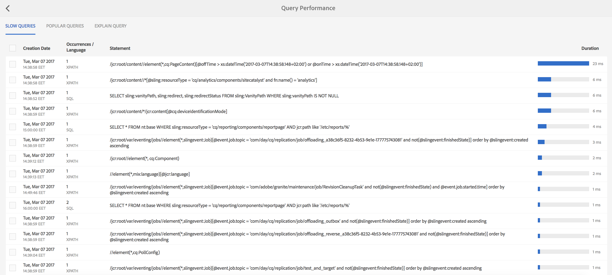

### Explain Query {#explain-query}

For any given query, Oak attempts to figure out the best way to execute based on the Oak indexes defined in the repository under the **oak:index** node. Depending on the query, different indexes may be chosen by Oak. Understanding how Oak is executing a query is the first step to optimizing the query.

The Explain Query is a tool that explains how Oak is executing a query. It can be accessed by going to **Tools - Operations - Diagnosis** from the AEM Welcome Screen. Then, click **Query Performance** and switch over to the **Explain Query** tab.

**Features**

* Supports the Xpath, JCR-SQL, and JCR-SQL2 query languages
* Reports the actual execution time of the provided query
* Detects slow queries and warns about queries that could be potentially slow
* Reports the Oak index used to execute the query
* Displays the actual Oak Query engine explanation
* Provides click-to-load list of Slow and Popular queries

After you are in the Explain Query UI, enter the query, and press the **Explain** button:

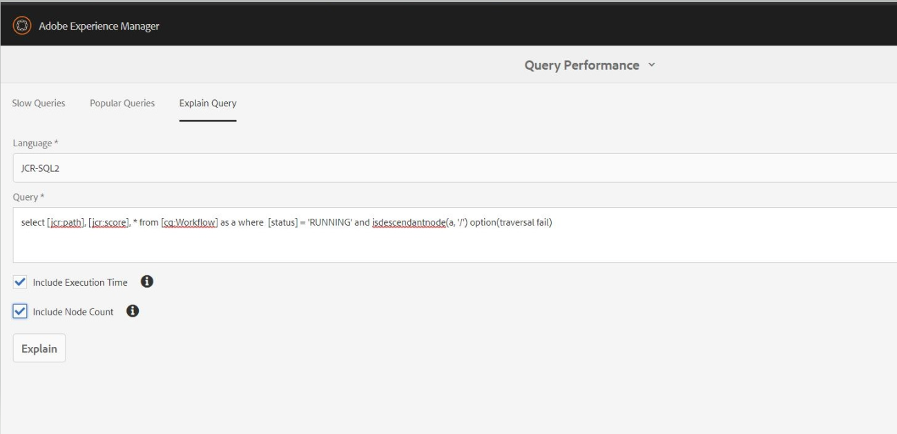

The first entry in the Query Explanation section is the actual explanation. The explanation shows the type of index that was used to execute the query.

The second entry is the execution plan.

Ticking the **Include execution time** box before running the query also shows the amount of time the query was run in. The **Include Node Count** option reports the node count. The report allows for more information that can be used for optimizing the indexes for your application or deployment.

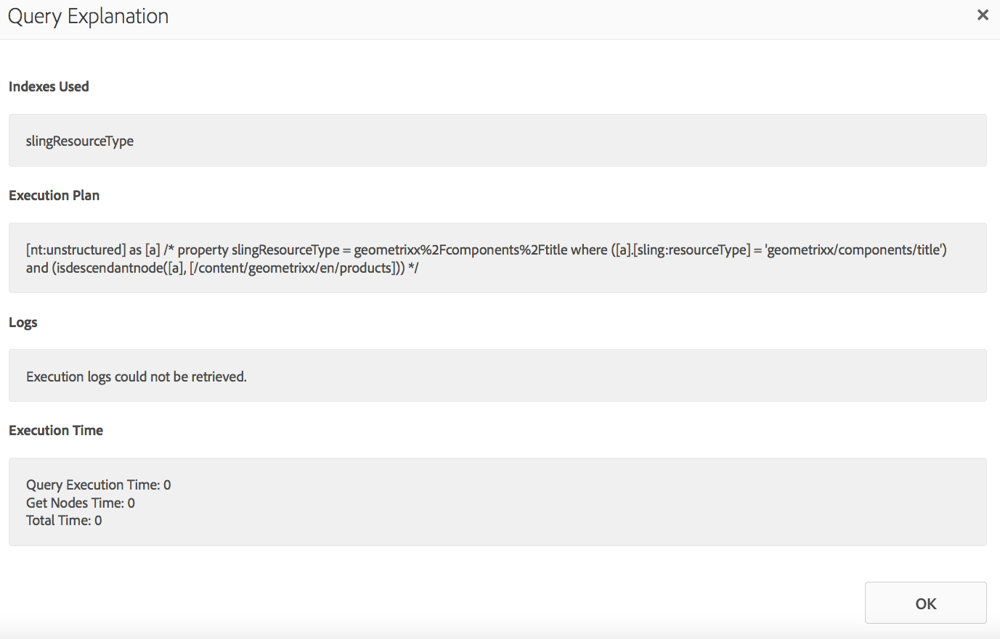

### The Index Manager {#the-index-manager}

The purpose of the Index Manager is to facilitate index management such as maintaining indexes, or viewing their status.

It can be accessed by going to **Tools - Operations - Diagnosis **from the Welcome Screen, and then clicking the **Index Manager** button.

It can also be accessed directly at this URL: `https://serveraddress:port/libs/granite/operations/content/diagnosistools/indexManager.html`

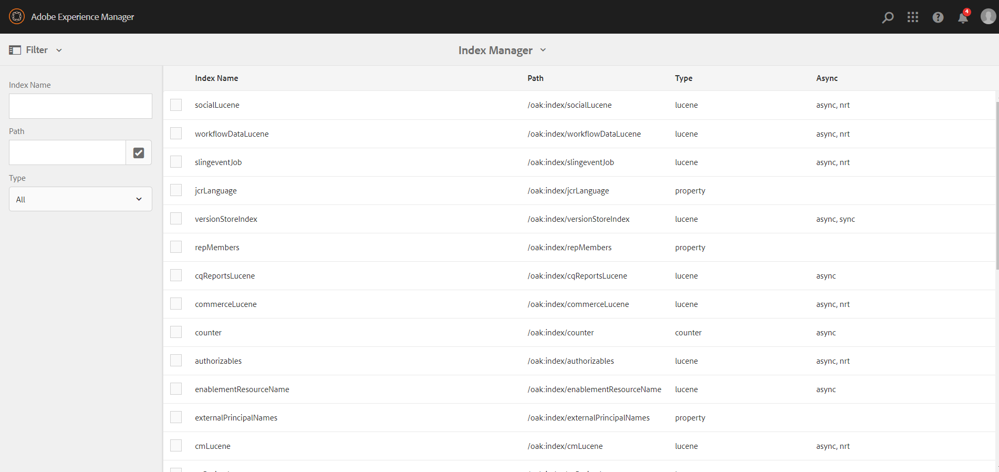

The UI can be used to filter indexes in the table by typing in the filter criteria in the search box in the upper left corner of the screen.

### Download Status ZIP {#download-status-zip}

This action triggers the download of a zip containing useful information about the system status and configuration. The archive contains instance configurations, a list of bundles, OSGI, Sling metrics and statistics, which can result in a large file. You can reduce the impact of large status files by using the **Download Status ZIP **window. The window can be accessed from:** AEM &gt; Tools &gt; Operations &gt; Diagnosis &gt; Download Status ZIP.**

From this window, you can select what to export (log files and or thread dumps) and the number of days of logs included in the download relative to the current date.


### Download Thread Dump {#download-thread-dump}

This action triggers the download of a zip containing information about the threads present in the system. Information about each thread is provided, such as its status, the classloader, and the stacktrace.

### Download Heap Dump {#download-heap-dump}

You can download a snapshot of the heap to analyze it later. This action triggers the download of a large (hundreds of megabytes) file.

## Automated Maintenance Tasks {#automated-maintenance-tasks}

The Automated Maintenance Tasks page is a place where you can view and track recommended maintenance tasks scheduled for periodic execution. The tasks are integrated with the Health Check system. The tasks can also be manually executed from the interface.

To get to the Maintenance page in the Operations Dashboard, from the AEM Welcome screen, go to **Tools - Operations - Dashboard - Maintenance**, or directly follow this link:

`https://serveraddress:port/libs/granite/operations/content/maintenance.html`

The following tasks are available in the Operations Dashboard:

1. The **Revision Clean Up**task, located under the **Daily Maintenance Window** menu.
1. The **Lucene Binaries Cleanup** task, located under the **Daily Maintenance Window** menu.
1. The **Workflow purge** task, located under the **Weekly Maintenance Window** menu.
1. The **Data Store Garbage Collection** task, located under the **Weekly Maintenance Window** menu.
1. The **Audit Log Maintenance** task, located under the **Weekly Maintenance Window** menu.
1. The **Version Purge Maintenance** task, located under the **Weekly Maintenance Window** menu.

The default timing for the daily maintenance window is 2:00 A.M. through 5:00 A.M. The tasks configured to run in the weekly maintenance window run between 1:00 A.M and 2:00 A.M. on Saturdays.

You can also configure the timings by pressing the gear icon on any of the two maintenance cards:

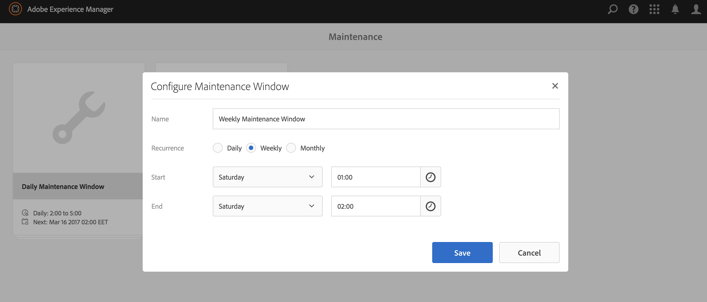

>[!NOTE]
>
>Since AEM 6.1, the existing maintenance windows can also be configured to run monthly.

### Revision Clean Up {#revision-clean-up}

For more information on performing Revision Clean Up, [see this dedicated article](/help/sites-deploying/revision-cleanup.md).

### Lucene Binaries Cleanup {#lucene-binaries-cleanup}

By using the Lucene Binaries Cleanup task, you can purge lucene binaries and reduce the running data store size requirement. Lucene's binary churn is reclaimed daily instead of the earlier dependency on a successful [data store garbage collection](/help/sites-administering/data-store-garbage-collection.md) run.

Though the maintenance task was developed to reduce Lucene related revision garbage, there are general efficiency gains when running the task:

* The weekly running of the data store garbage collection task can complete more quickly.
* It may also slightly improve the overall AEM performance.

You can access the Lucene Binaries Cleanup task from: **AEM &gt; Tools &gt; Operations &gt; Maintenance &gt; Daily Maintenance Window &gt; Lucene Binaries Cleanup**.

### Data Store Garbage Collection {#data-store-garbage-collection}

For details on Data Store Garbage Collection, see the dedicated [documentation page](/help/sites-administering/data-store-garbage-collection.md).

### Workflow purge {#workflow-purge}

Workflows can also be purged from the Maintenance Dashboard. To run the Workflow Purge task, do the following:

1. Click the **Weekly Maintenance Window** page.
1. In the following page, click **Play** in the **Workflow purge** card.

>[!NOTE]
>
>For more detailed information about Workflow Maintenance, see [this page](/help/sites-administering/workflows-administering.md#regular-purging-of-workflow-instances).

### Audit Log Maintenance {#audit-log-maintenance}

For Audit Log Maintenance, see the [separate documentation page.](/help/sites-administering/operations-audit-log.md)

### Version Purge {#version-purge}

You can schedule the Version Purge maintenance task to delete old versions automatically. This action minimizes the need to manually use the [Version Purge tools](/help/sites-deploying/version-purging.md). You can schedule and configure the Version Purge task by accessing **Tools &gt; Operations &gt; Maintenance &gt; Weekly Maintenance Window** and following these steps:

1. Click **Add**.
1. Choose **Version Purge** from the drop-down menu.

   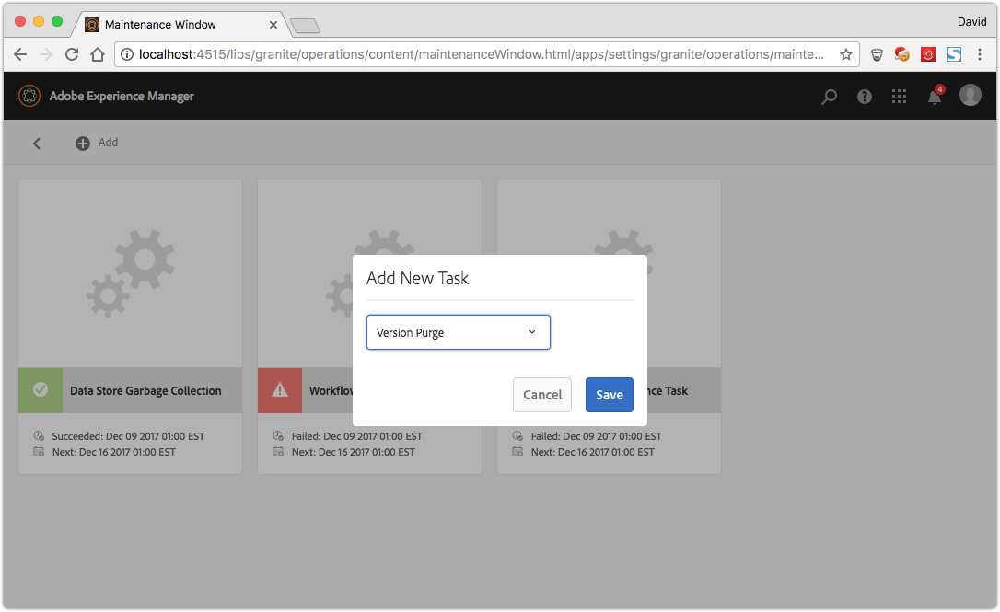

1. To configure the Version Purge task, click the **gears** icon on the newly created Version Purge maintenance card.

   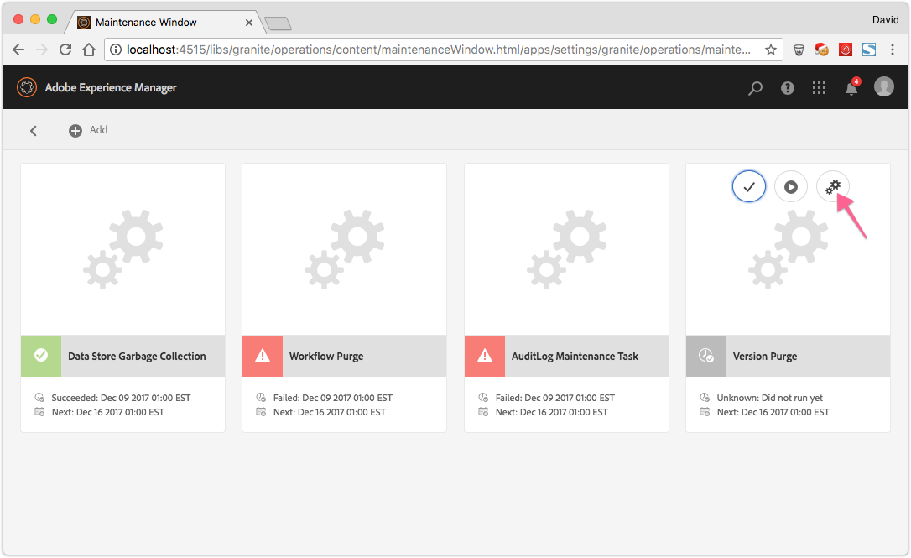

**With AEM 6.4**, you can stop the Version Purge maintenance task as follows:

* Automatically - If the scheduled maintenance window closes before the task can complete, the task stops automatically. It will resume when the next maintenance window opens.
* Manually - To manually stop the task, on the Version Purge maintenance card, click the **Stop** icon. On the next execution, the task will safely resume.

>[!NOTE]
>
>Stopping the maintenance task means to suspend its running without losing track of the job already in progress.

>[!CAUTION]
>
>To optimize the repository size that you should run the version purge task frequently. The task should be scheduled outside of business hours when there is a limited amount of traffic.

## Custom Maintenance Tasks {#custom-maintenance-tasks}

Custom maintenance tasks can be implemented as OSGi services. As the maintenance task infrastructure is based on Apache Sling's job handling, a maintenance task must implement the Java&trade; interface ` [org.apache.sling.event.jobs.consumer.JobExecutor](https://sling.apache.org/apidocs/sling7/org/apache/sling/event/jobs/consumer/JobExecutor.html)`. In addition, it must declare several service registration properties to be detected as a maintenance task, as listed below:

<table>
 <tbody>
  <tr>
   <td><strong>Service Property Name</strong><br /> </td>
   <td><strong>Description</strong></td>
   <td><strong>Example</strong><br /> </td>
   <td><strong>Type</strong></td>
  </tr>
  <tr>
   <td>granite.maintenance.isStoppable</td>
   <td>Boolean attribute defining whether the task can be stopped by the user. If a task declares that it is stoppable, it must check during its running whether it is stopped, and then act accordingly. The default is false.</td>
   <td>true</td>
   <td>Optional</td>
  </tr>
  <tr>
   <td>granite.maintenance.mandatory</td>
   <td>Boolean attribute defining whether a task is mandatory and must be run periodically. If a task is mandatory but currently not in any active schedule window, a Health Check report this error. The default is false.</td>
   <td>true</td>
   <td>Optional</td>
  </tr>
  <tr>
   <td>granite.maintenance.name</td>
   <td>A unique name for the task - the name is used to reference the task and is just a simple name.</td>
   <td>MyMaintenanceTask</td>
   <td>Required</td>
  </tr>
  <tr>
   <td>granite.maintenance.title</td>
   <td>A title displayed for this task</td>
   <td>My Special Maintenance Task</td>
   <td>Required</td>
  </tr>
  <tr>
   <td>job.topics</td>
   <td>A unique topic of the maintenance task.<br /> The Apache Sling job handling starts a job with exactly this topic to run the maintenance task and as the task is registered for this topic it gets run.<br /> The topic must start with <i>com/adobe/granite/maintenance/job/</i></td>
   <td>com/adobe/granite/maintenance/job/MyMaintenanceTask</td>
   <td>Required</td>
  </tr>
 </tbody>
</table>

Apart from the above service properties, the `process()` method of the `JobConsumer` interface must be implemented by adding the code that should be executed for the maintenance task. The provided `JobExecutionContext` can be used to output status information, check if the job is stopped by the user and create a result (success or failed).

For situations where a maintenance task should not be run on all installations (for example, run only on the publish instance), you can make the service require a configuration to be active by adding `@Component(policy=ConfigurationPolicy.REQUIRE)`. You can then mark the according configuration as being run mode dependent in the repository. For more information, see [Configuring OSGi](/help/sites-deploying/configuring-osgi.md#creating-the-configuration-in-the-repository).

Below is an example of a custom maintenance task that deletes files from a configurable temporary directory which have been modified in the last 24 hours:

src/main/java/com/adobe/granite/samples/maintenance/impl/DeleteTempFilesTask.java

<table>
 <tbody>
  <tr>
   <td><p> </p> <p><code>/*</code></p> <p><code> * #%L</code></p> <p><code> * sample-maintenance-task</code></p> <p><code> * %%</code></p> <p><code> * Copyright (C) 2014 Adobe</code></p> <p><code> * %%</code></p> <p><code> * Licensed under the Apache License, Version 2.0 (the "License");</code></p> <p><code> * you may not use this file except in compliance with the License.</code></p> <p><code> * You may obtain a copy of the License at</code></p> <p><code> * </code></p> <p><code> * <a href="https://www.apache.org/licenses/LICENSE-2.0">https://www.apache.org/licenses/LICENSE-2.0</a></code></p> <p><code> * </code></p> <p><code> * Unless required by applicable law or agreed to in writing, software</code></p> <p><code> * distributed under the License is distributed on an "AS IS" BASIS,</code></p> <p><code> * WITHOUT WARRANTIES OR CONDITIONS OF ANY KIND, either express or implied.</code></p> <p><code> * See the License for the specific language governing permissions and</code></p> <p><code> * limitations under the License.</code></p> <p><code> * #L%</code></p> <p><code> */</code></p> <p><code> </code></p> <p><code>package com.adobe.granite.samples.maintenance.impl;</code></p> <p><code> </code></p> <p><code>import java.io.File;</code></p> <p><code>import java.util.Calendar;</code></p> <p><code>import java.util.Collection;</code></p> <p><code>import java.util.Map;</code></p> <p><code> </code></p> <p><code>import org.apache.commons.io.FileUtils;</code></p> <p><code>import org.apache.commons.io.filefilter.IOFileFilter;</code></p> <p><code>import org.apache.commons.io.filefilter.TrueFileFilter;</code></p> <p><code>import org.apache.felix.scr.annotations.Activate;</code></p> <p><code>import org.apache.felix.scr.annotations.Component;</code></p> <p><code>import org.apache.felix.scr.annotations.Properties;</code></p> <p><code>import org.apache.felix.scr.annotations.Property;</code></p> <p><code>import org.apache.felix.scr.annotations.Service;</code></p> <p><code>import org.apache.sling.commons.osgi.PropertiesUtil;</code></p> <p><code>import org.apache.sling.event.jobs.Job;</code></p> <p><code>import org.apache.sling.event.jobs.consumer.JobConsumer;</code></p> <p><code>import org.apache.sling.event.jobs.consumer.JobExecutionContext;</code></p> <p><code>import org.apache.sling.event.jobs.consumer.JobExecutionResult;</code></p> <p><code>import org.apache.sling.event.jobs.consumer.JobExecutor;</code></p> <p><code>import org.slf4j.Logger;</code></p> <p><code>import org.slf4j.LoggerFactory;</code></p> <p><code> </code></p> <p><code>import com.adobe.granite.maintenance.MaintenanceConstants;</code></p> <p><code> </code></p> <p><code>@Component(metatype = true,</code></p> <p><code> label = "Delete Temp Files Maintenance Task",</code></p> <p><code> description = "Maintatence Task which deletes files from a configurable temporary directory which have been modified in the last 24 hours.")</code></p> <p><code>@Service</code></p> <p><code>@Properties({</code></p> <p><code> @Property(name = MaintenanceConstants.PROPERTY_TASK_NAME, value = "DeleteTempFilesTask", propertyPrivate = true),</code></p> <p><code> @Property(name = MaintenanceConstants.PROPERTY_TASK_TITLE, value = "Delete Temp Files", propertyPrivate = true),</code></p> <p><code> @Property(name = JobConsumer.PROPERTY_TOPICS, value = MaintenanceConstants.TASK_TOPIC_PREFIX</code></p> <p><code> + "DeleteTempFilesTask", propertyPrivate = true) })</code></p> <p><code>public class DeleteTempFilesTask implements JobExecutor {</code></p> <p><code> </code></p> <p><code> private static final Logger log = LoggerFactory.getLogger(DeleteTempFilesTask.class);</code></p> <p><code> </code></p> <p><code> @Property(label = "Temporary Directory", description="Temporary Directory. Defaults to the java.io.tmpdir system property.")</code></p> <p><code> private static final String PROP_TEMP_DIR = "temp.dir";</code></p> <p><code> </code></p> <p><code> private File tempDir;</code></p> <p><code> </code></p> <p><code> @Activate</code></p> <p><code> private void activate(Map&lt;string, object=""&gt; properties) {</code></p> <p><code> this.tempDir = new File(PropertiesUtil.toString(properties.get(PROP_TEMP_DIR),</code></p> <p><code> System.getProperty("java.io.tmpdir")));</code></p> <p><code> }</code></p> <p><code> </code></p> <p><code> @Override</code></p> <p><code> public JobExecutionResult process(Job job, JobExecutionContext context) {</code></p> <p><code> log.info("Deleting old temp files from {}.", tempDir.getAbsolutePath());</code></p> <p><code> Collection&lt;file&gt; files = FileUtils.listFiles(tempDir, new LastModifiedBeforeYesterdayFilter(),</code></p> <p><code> TrueFileFilter.INSTANCE);</code></p> <p><code> int counter = 0;</code></p> <p><code> for (File file : files) {</code></p> <p><code> log.debug("Deleting file {}.", file.getAbsolutePath());</code></p> <p><code> counter++;</code></p> <p><code> file.delete();</code></p> <p><code> // TODO - capture the output of delete() and do something useful with it</code></p> <p><code> }</code></p> <p><code> return context.result().message(String.format("Deleted %s files.", counter)).succeeded();</code></p> <p><code> }</code></p> <p><code> </code></p> <p><code> /**</code></p> <p><code> * IOFileFilter which filters out files which have been modified in the last 24 hours.</code></p> <p><code> *</code></p> <p><code> */</code></p> <p><code> private static class LastModifiedBeforeYesterdayFilter implements IOFileFilter {</code></p> <p><code> </code></p> <p><code> private final long minTime;</code></p> <p><code> </code></p> <p><code> private LastModifiedBeforeYesterdayFilter() {</code></p> <p><code> Calendar cal = Calendar.getInstance();</code></p> <p><code> cal.add(Calendar.DATE, -1);</code></p> <p><code> this.minTime = cal.getTimeInMillis();</code></p> <p><code> }</code></p> <p><code> </code></p> <p><code> @Override</code></p> <p><code> public boolean accept(File dir, String name) {</code></p> <p><code> // this method is never actually called.</code></p> <p><code> return false;</code></p> <p><code> }</code></p> <p><code> </code></p> <p><code> @Override</code></p> <p><code> public boolean accept(File file) {</code></p> <p><code> return file.lastModified() <= this.minTime;</code></p> <p><code> }</code></p> <p><code> }</code></p> <p><code> </code></p> <p><code>}</code></p> <p><code>&lt;file&gt;&lt;/string,&gt;</code></p> <p> </p> </td>
  </tr>
 </tbody>
</table>

[experiencemanager-java-maintenancetask-sample](https://github.com/Adobe-Marketing-Cloud/experiencemanager-java-maintenancetask-sample)- [src/main/java/com/adobe/granite/samples/maintenance/impl/DeleteTempFilesTask.java](https://github.com/Adobe-Marketing-Cloud/experiencemanager-java-maintenancetask-sample/blob/master/src/main/java/com/adobe/granite/samples/maintenance/impl/DeleteTempFilesTask.java)

After the service is deployed, it is exposed to the Operations Dashboard UI. You can add it to one of the available maintenance schedules:


This action adds a corresponding resource at /apps/granite/operations/config/maintenance/`schedule`/`taskname`. If the task is run mode dependent, the property granite.operations.conditions.runmode must be set on that node with the values of the run modes that must be active for this maintenance task.

## System Overview {#system-overview}

The **System Overview Dashboard** displays a high-level overview of the configuration, hardware, and health of the AEM instance. System health status is transparent, and all the information is aggregated in a single dashboard.

>[!NOTE]
>
>You can also [watch this video](https://video.tv.adobe.com/v/21340) for an introduction to the System Overview Dashboard.

### How To Access {#how-to-access}

To access the System Overview Dashboard, navigate to **Tools &gt; Operations &gt; System Overview**.

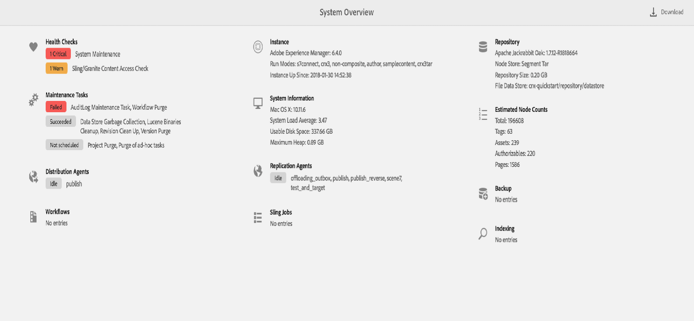

### System Overview Dashboard Explained {#system-overview-dashboard-explained}

The table below, describes all the information displayed in the System Overview Dashboard. When there is no relevant information to show (for example, backup is not in progress, there are no health checks that are critical) the respective section displays the "No Entries" message.

You can also download a `JSON` file summarizing the dashboard information by clicking the **Download** button in the upper right-hand corner of the dashboard. The `JSON` endpoint is `/libs/granite/operations/content/systemoverview/export.json` and it can be used in a `curl` script for external monitoring.

<table>
 <tbody>
  <tr>
   <td><strong>Section</strong></td>
   <td><strong>What information is displayed</strong></td>
   <td><strong>When is it critical</strong></td>
   <td><strong>Links To</strong></td>
  </tr>
  <tr>
   <td>Health Checks</td>
   <td>
    <ul>
     <li>a list of checks that are in Critical status</li>
     <li>a list of checks that are in Warn status</li>
    </ul> </td>
   <td>Indicated visually:<br />
    <ul>
     <li>a red tag for Critical checks</li>
     <li>an orange tag for Warn checks</li>
    </ul> </td>
   <td>
    <ul>
     <li>Health Reports page</li>
    </ul> </td>
  </tr>
  <tr>
   <td>Maintenance Tasks</td>
   <td>
    <ul>
     <li>a list of tasks that failed</li>
     <li>a list of tasks that are currently running</li>
     <li>a list of tasks that have succeeded in the last run</li>
     <li>a list of tasks that have never run</li>
     <li>a list of tasks that are not scheduled</li>
    </ul> </td>
   <td><p>Indicated visually:</p>
    <ul>
     <li>a red tag for failed tasks</li>
     <li>an orange tag for running tasks (as they might impact performance)</li>
     <li>gray tags for every other status</li>
    </ul> </td>
   <td>
    <ul>
     <li>Maintenance Tasks page</li>
    </ul> </td>
  </tr>
  <tr>
   <td>System</td>
   <td>
    <ul>
     <li>operating system and OS version (for example, macOS X)</li>
     <li>system load average, as retrieved from <a href="https://docs.oracle.com/javase/8/docs/api/java/lang/management/OperatingSystemMXBean.html#getSystemLoadAverage--">OperatingSystemMXBeanusable</a></li>
     <li>disk space (on the partition where the home directory is located)</li>
     <li>maximum heap, as returned by <a href="https://docs.oracle.com/javase/8/docs/api/java/lang/management/MemoryMXBean.html#getHeapMemoryUsage--">MemoryMXBean</a></li>
    </ul> </td>
   <td>N/A</td>
   <td>N/A</td>
  </tr>
  <tr>
   <td>Instance</td>
   <td>
    <ul>
     <li>the AEM version</li>
     <li>list of run modes</li>
     <li>the date when the instance was started</li>
    </ul> </td>
   <td>N/A</td>
   <td>N/A</td>
  </tr>
  <tr>
   <td>Repository</td>
   <td>
    <ul>
     <li>the Oak version</li>
     <li>type of node store (Segment Tar or Document)
      <ul>
       <li>if the type is document, the type of document store is displayed (RDB or Mongo)</li>
      </ul> </li>
     <li>if there is a custom data store:
      <ul>
       <li>for a File Data Store, the path is displayed</li>
       <li>for an S3 Data store, the name of the S3 bucket is displayed</li>
       <li>for a Shared S3 Data store, the name of the S3 bucket is displayed</li>
       <li>for an Azure Data Store, the container is displayed</li>
      </ul> </li>
     <li>if there is no custom external datastore, a message indicating this fact is displayed</li>
    </ul> </td>
   <td>N/A</td>
   <td>N/A</td>
  </tr>
  <tr>
   <td>Distribution Agents</td>
   <td>
    <ul>
     <li>a list of agents with blocked queues</li>
     <li>a list of misconfigured agents ("Configuration Error")</li>
     <li>a list of agents with queue processing paused</li>
     <li>a list of idle agents</li>
     <li>a list of running agents (that are currently processing entries)</li>
    </ul> </td>
   <td><p>Indicated visually:</p>
    <ul>
     <li>a red tag for blocked agents or configuration errors</li>
     <li>an orange tag for paused agents</li>
     <li>a gray tag for paused, idle, or running agents<br /> </li>
    </ul> </td>
   <td>Distribution page<br /> </td>
  </tr>
  <tr>
   <td>Replication Agents</td>
   <td>
    <ul>
     <li>a list of agents with blocked queues</li>
     <li>a list of idle agents</li>
     <li>a list of running agents (that are currently processing entries)</li>
    </ul> </td>
   <td><p>Indicated visually:<br /> </p>
    <ul>
     <li>a red tag for blocked agents</li>
     <li>a gray tag for paused agents</li>
    </ul> </td>
   <td>Replication page</td>
  </tr>
  <tr>
   <td>Workflows</td>
   <td>
    <ul>
     <li>Workflow Jobs:
      <ul>
       <li>number of failed workflow jobs (if any)</li>
       <li>number of canceled workflow jobs (if any)</li>
      </ul> </li>
    </ul>
    <ul>
     <li>Workflow Counts - number of workflows in a given status (if any):
      <ul>
       <li>running</li>
       <li>failed</li>
       <li>suspended</li>
       <li>aborted</li>
      </ul> </li>
    </ul> <p>For each of the statuses presented above a query is performed, with a limit of 400 milliseconds. At 400 milliseconds, the number of entries obtained up to that point is displayed.</p> </td>
   <td><p>Not interpreted:</p>
    <ul>
     <li>the user should investigate when there are workflows and jobs in unexpected statuses.</li>
    </ul> </td>
   <td>Workflow Failures page</td>
  </tr>
  <tr>
   <td>Sling Jobs</td>
   <td><p>Sling job counts - number of jobs in a given status (if any):</p>
    <ul>
     <li>failed</li>
     <li>queued</li>
     <li>canceled</li>
     <li>active</li>
    </ul> </td>
   <td><p>Not interpreted:</p>
    <ul>
     <li>the user should investigate when there are jobs in unexpected statuses or with high counts.</li>
    </ul> </td>
   <td>N/A</td>
  </tr>
  <tr>
   <td>Estimated Node Counts</td>
   <td><p>Estimated number of:</p>
    <ul>
     <li>pages</li>
     <li>assets</li>
     <li>tags</li>
     <li>authorizables</li>
     <li>total number of nodes<br /> </li>
    </ul> <p>The total number of nodes is obtained from the nodeCounterMBean, while the rest of the statistics are obtained from IndexInfoService.</p> </td>
   <td>N/A</td>
   <td>N/A</td>
  </tr>
  <tr>
   <td>Backup</td>
   <td>Displays "Online Backup in Progress" if so.</td>
   <td>N/A</td>
   <td>N/A</td>
  </tr>
  <tr>
   <td>Indexing</td>
   <td><p>Displays:</p>
    <ul>
     <li>"Indexing in progress"</li>
     <li>"Query in progress"</li>
    </ul> <p>If an indexing or query thread is present in the thread dump.</p> </td>
   <td>N/A</td>
   <td>N/A</td>
  </tr>
 </tbody>
</table>
