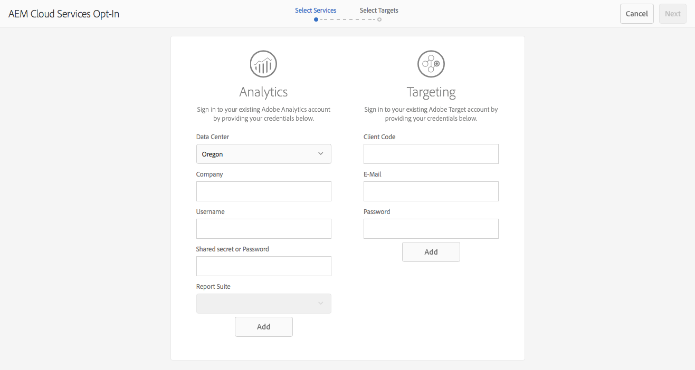
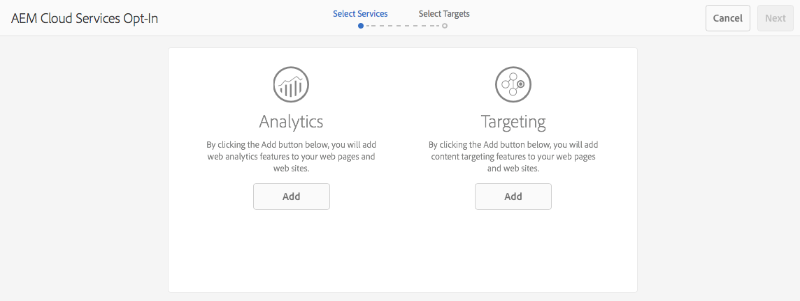

# Opting Into Adobe Analytics and Adobe Target{#opting-into-adobe-analytics-and-adobe-target}

AEM has an opt-in procedure to help you integrate with Adobe Analytics and Adobe Target. This is available out-of-the-box, as a pre-loaded task assigned to the administrator user group.

When you log in as an administrator this task (**Configuring Analytics & Targeting**) is available from the [Inbox](/help/sites-authoring/inbox.md#out-of-the-box-administrative-tasks). Based on the credentials you supply, it helps you configure and integrate these services.

You have the following options for configuring the integration:

* Configure the integration via the task.

  This can be done either immediately or later, the task will remain in the Inbox until some action is taken. In either case the configuration can be done directly in the UI, or with the use of a pre-defined `.properties` file.

* Opt out of the integration.

  Consider this option if you prefer to [manually configure the integration](/help/sites-administering/marketing-cloud.md). See also [Integrating AEM with Adobe Target and Adobe Analytics using DTM](https://helpx.adobe.com/experience-manager/using/integrate-digital-marketing-solutions.html).

* Configure the set up and provisioning by using a script.

## Configuring the Integration {#configuring-the-integration}

Opt into the integration with:

* Analytics to enable the use of their page tracking and analysis capabilities.
* Target to enable the use of their personalization capabilities.

For either option you need to provide the user account information and specify the pages that are tracked.

>[!NOTE]
>
>You can optionally provide Analytics and Target account information using a properties file that is read upon server startup. See [Providing Account Information Using a Properties File](/help/sites-administering/opt-in.md#providing-account-information-using-a-properties-file).

When you opt into the integration, AEM performs the following tasks:

* Creates the cloud configurations that enable the connection to Analytics and Target.
* Creates the frameworks that determine the data that is tracked.
* Configures the web pages to use these services.

>[!NOTE]
>
>AT.js is the default client library. This is configured under your [target cloud services configuration](/help/sites-administering/target-configuring.md#creating-a-target-cloud-configuration).
>
>Adobe recommends that you use AT.js as the client library.

To opt-in from the pre-loaded, out-of-the-box task:

1. From your [Inbox, select and **Open** the Configure Analytics & Targeting](/help/sites-authoring/inbox.md#taking-action-on-an-item) task.

   

1. For Analytics:

    1. Enter the user account information for Analytics, then click the corresponding **Add** button.
    1. The appropriate credentials are authenticated.
    1. When the Analytics account is authenticated, select the Analytics report suite to use. AEM retrieves those Analytics report suites. The status is updated to **Added**.

1. For Target:

    1. Enter the user account information for Target then click the corresponding **Add** button.
    1. The appropriate credentials are authenticated. The status is updated to **Added**.

1. Select **Next**.
1. Select the sites for which Analytics and/or Target should be used.

1. Select **Done** to complete.

   >[!CAUTION]
   >
   >After you opt into the configuration, you need to publish the affected site/pages to replicate these changes to your publish instance.

## Opting Out of the Integration {#opting-out-of-the-integration}

Opt out of the integration with Analytics and Target when you either:

* Do not want to integrate with these products.
* Prefer to configure the integrations manually.

  For information about configuring the integrations manually, see [Integrating with Adobe Analytics](/help/sites-administering/adobeanalytics.md) and [Integrating with Adobe Target](/help/sites-administering/target.md).

To opt out you need to complete the pre-loaded task:

* From your [Inbox, select and **Complete** the Configure Analytics & Targeting](/help/sites-authoring/inbox.md#taking-action-on-an-item) task.

## Providing Account Information Using a Properties File {#providing-account-information-using-a-properties-file}

Install a properties file that AEM reads on server startup to configure the account properties for the integration with Analytics and Target. When you use the properties file, the opt-in wizard automatically uses the properties from the file and the cloud configuration is created accordingly.

The properties file is a text file named marketingcloud.properties that you save in the working directory that the AEM process is using (typically the same directory as the JAR file). The file includes the following properties:

* analytics.server: The URL of the Analytics data center that you use.
* analytics.company: The company that is associated with your Analytics user account.
* analytics.username: Your Analytics user name.
* analytics.secret: The secret that is associated with your Analytics user name.
* analytics.reportsuite: The name of the Analytics report suite to use.
* target.clientcode: The client code that is associated with your Target account.
* target.email: The email address that you use to authenticate your Target account.
* target.password: The password that is associated with your email address.

Properties and values are separated with equal signs (=). The Analytics properties are prefixed with `analytics`, and the Target properties are prefixed with `target`. To configure a service, provide values for all the properties for that service. If you do not want to configure a service, provide no values for that service.

The following example `.properties` file includes the property values for creating a cloud configuration for Analytics:

```xml
analytics.server=https://test.omniture.com/login/
analytics.company=MyCompany
analytics.username=sbroders
analytics.secret=12345678
analytics.reportsuite=myreportsuite
target.clientcode=
target.email=
target.password=
```

The following procedure describes how to opt into the integration using the properties file.

1. Create the `marketingcloud.properties` file in the working directory that the AEM process is using (author instance).

   >[!NOTE]
   >
   >The working directory is usually the directory that holds the jar or `license.properties` file.
   >
   >However, it can also be defined as an absolute path by the system property:
   >
   >`mac.provisioning.file.container`

1. Add the property values according to your Analytics and/or Target accounts.
1. Start or restart the server, and then log in using an administrator account.
1. Open the Configure Analytics & Targeting task as described in [Configuring the Integration](/help/sites-administering/opt-in.md#configuring-the-integration). Instead of requesting your account information, the wizard uses the values from the `.properties` file.

   Select **Add** for the appropriate service, then continue with the wizard.

   

## About the Cloud Configurations {#about-the-cloud-configurations}

When you configure the integration with Analytics and Target, AEM automatically creates the required cloud configurations and frameworks. For example, the Analytics cloud configuration is called Provisioned Analytics Account.

You do not need to alter the cloud configurations. However, you can configure the frameworks as needed. (See [Mapping Component Data with Adobe Analytics Properties](/help/sites-administering/adobeanalytics-mapping.md) and [Add a Target Framework](/help/sites-administering/target.md).)

>[!NOTE]
>
>By default when you opt into the Adobe Target configuration wizard, Accurate Targeting is enabled.
>
>Accurate targeting means that the cloud service configuration waits for the context to load before loading content. As a result, in terms of performance, accurate targeting may create a few millisecond delay before loading content.
>
>Accurate targeting is always enabled on the author instance. However, on the publish instance you can opt to turn accurate targeting off globally by clearing the check mark next to Accurate Targeting in the cloud service configuration (**http://localhost:4502/etc/cloudservices.html**). You can also still turn accurate targeting on and off for individual components regardless of your setting in the cloud service configuration.
>
>If you have ***already*** created targeted components and you change this setting, your changes do not affect those components. Make any changes to those components directly.

>[!CAUTION]
>
>When you opt into the Analytics configuration and a specific `reportsuite` is selected, then the framework is restricted to the publish run mode. This means that tracking only works on the publish instance.
>
>If tracking is needed on an authoring instance as well the value should be changed to `all`.

## Configuring the Setup and Provisioning via Script {#configuring-the-setup-and-provisioning-via-script}

As an administrator, you may want to trigger setup and provisioning with a script rather than manually stepping through the wizard. You can do so by:

* Sending a POST request to **/libs/cq/cloudservicesprovisioning/content/autoprovisioning.json** with the required parameters.

Which parameters you send depends on the following:

* If you want to use the **marketingcloud.properties** file filled in with all the required credentials, then you must send the following parameters:

    * `automaticProvisioning`= `true`
    * `servicename`= `analytics|target`
    * `path`=path to an AEM page to attach the created cloud services configs

  For example, a curl request that creates both Analytics and Target configurations and attachs them to the we.retail page would be:

  ```shell
  curl -v -u admin:admin -X POST -d"automaticProvisioning=true&servicename=target&servicename=analytics&path=/content/we-retail" http://localhost:4502/libs/cq/cloudservicesprovisioning/content/autoprovisioning.json
  ```

* If you do not want to use the **marketingcloud.properties** file then you must send the credentials and parameters. For example:
    * automaticProvisioning= `true`
    * servicename= `analytics|target`
    * path=path to an AEM page to attach the created cloud services configs; multiple paths can be defined
    * analytics.server= `https://servername`
    * analytics.company= `Name of company`
    * analytics.username= `me`
    * analytics.secret= `secret`
    * analytics.reportsuite= `we-retail`
    * target.clientcode= `mycompany`
    * target.email= `me@adobe.com`
    * target.password= `password`

  In this case, the curl request that creates both Analytics and Target configurations and attachs them to the we-retail page would be:

  ```shell

  curl -v -u admin:admin -X POST -d"automaticProvisioning=false&servicename=target&servicename=analytics&path=/content/we-retail&analytics.server=https://servername/&analytics.company=Name of company&analytics.username=me&analytics.secret=secret&analytics.reportsuite=weretail&target.clientcode=mycompany&target.email=me@adobe.com&target.password=password" http://localhost:4502/libs/cq/cloudservicesprovisioning/content/autoprovisioning.json
  ```
