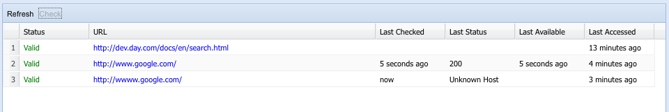
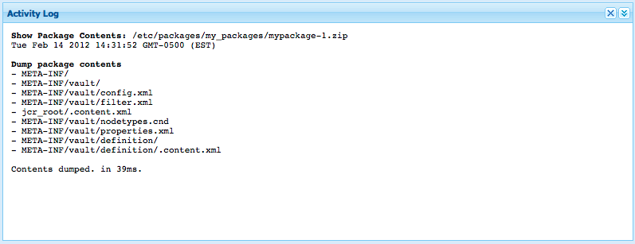
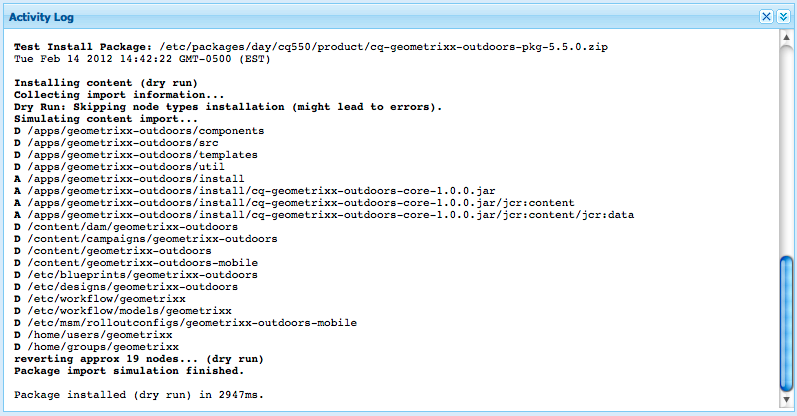
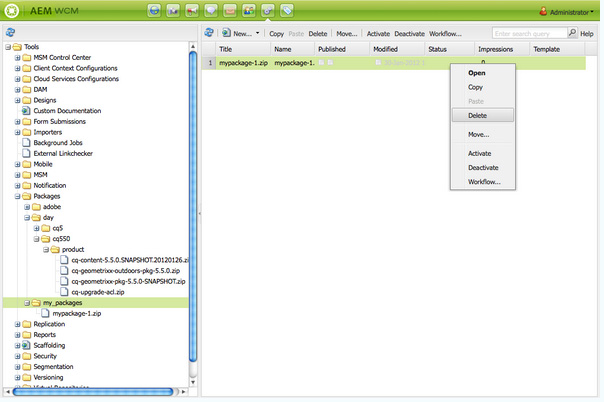

# How to Work With Packages{#how-to-work-with-packages}

Packages enable the importing and exporting of repository content. For example, you can use packages to install new functionality, transfer content between instances, and back up repository content.

Packages can be accessed and/or maintained from the following pages:

* [Package Manager](#package-manager), which you use to manage the packages in your local AEM instance.

* [Software Distribution](#software-distribution), a centralized server holding both publicly available packages and those private to your company. The public packages can contain hotfixes, new functionality, documentation, etc.

You can transfer packages between Package Manager, Software Distribution, and your file system.

## What are Packages? {#what-are-packages}

A package is a zip file holding repository content in the form of a file-system serialization (called "vault" serialization). This provides an easy-to-use-and-edit representation of files and folders.

Packages include content, both page-content and project-related content, selected using filters.

A package also contains vault meta information, including the filter definitions and import configuration information. Additional content properties (that are not used for package extraction) can be included in the package, such as a description, a visual image, or an icon; these properties are for the content package consumer and for informational purposes only.

>[!NOTE]
>
>Packages represent the current version of the content at the time the package is built. They do not include any previous versions of the content that AEM keeps in the repository.

You can perform the following actions on or with packages:

* Create new packages; defining package settings and filters as required
* Preview package contents (before build)
* Build packages
* View package information
* View package contents (after build)
* Modify the definition for existing packages
* Rebuild existing packages
* Rewrap packages
* Download packages from AEM to your file system
* Upload packages from your file system into your local AEM instance
* Validate package content before installation
* Perform a dry run installation
* Install packages (AEM does not automatically install packages after uploading)
* Delete packages
* Download packages, such as hotfixes, from the Software Distribution library
* Upload packages to the company-internal section of the Software Distribution library

## Package Information {#package-information}

A package definition is made up of various types of information:

* [Package Settings](#package-settings)
* [Package Filters](#package-filters)
* [Package Screenshots](#package-screenshots)
* [Package Icons](#package-icons)

### Package Settings {#package-settings}

You can edit a variety of Package Settings to define aspects such as the package description, related bugs, dependencies and provider information.

The **Package Settings** dialog is available via the **Edit** button when [creating](#creating-a-new-package) or [editing](#viewing-and-editing-package-information) a package and provides three tabs for configuration. After any changes are made click **OK** to save these.


| **Field** |**Description** |
|---|---|
| Name |The name of the package. |
| Group |The name of the group to add the package to, for organizing packages. Type the name of a new group, or select an existing group. |
| Version |Text to use for the custom version. |
| Description |A brief description of the package. HTML markup can be used for formatting. |
| Thumbnail |The icon that appears with the package listing. Click Browse to select a local file. |


<table>
 <tbody>
  <tr>
   <th><strong>Field</strong></th>
   <th><strong>Description</strong></th>
   <th><strong>Format/Example</strong></th>
  </tr>
  <tr>
   <td>Name</td>
   <td>The name of the provider.</td>
   <td><em>AEM Geometrixx<br /> </em></td>
  </tr>
  <tr>
   <td>URL</td>
   <td>URL of the provider.</td>
   <td><em>https://www.aem-geometrixx.com</em></td>
  </tr>
  <tr>
   <td>Link</td>
   <td>Package-specific link to a provider page.</td>
   <td><em>https://www.aem-geometrixx.com/mypackage.html</em></td>
  </tr>
  <tr>
   <td>Requires<br /> </td>
   <td>
    <ul>
     <li>Admin: Select when the package can only be installed by an account with admin privileges.</li>
     <li>Restart: Select when the server needs to be restarted after the package is installed.</li>
    </ul> </td>
   <td> </td>
  </tr>
  <tr>
   <td>AC Handling</td>
   <td><p>Specify how the access control information defined in the package is handled when the package is imported:</p>
    <ul>
     <li><strong>Ignore</strong></li>
     <li><strong>Overwrite</strong></li>
     <li><strong>Merge</strong></li>
     <li><strong>Clear</strong></li>
     <li><strong>MergePreserve</strong></li>
    </ul> <p>The default value is <strong>Ignore</strong>.</p> </td>
   <td>
    <ul>
     <li><strong>Ignore</strong> - preserve ACLs in the repository</li>
     <li><strong>Overwrite</strong> - overwrite ACLs in the repository</li>
     <li><strong>Merge</strong> - merge both sets of ACLs</li>
     <li><strong>Clear</strong> - clear ACLs</li>
     <li><strong>MergePreserve</strong> - merge access control in the content with the one provided with the package by adding the access control entries of principals not present in the content</li>
    </ul> </td>
  </tr>
 </tbody>
</table>


| **Field** |**Description** |**Format/Example** |
|---|---|---|
| Tested With |The product name and version this package is targeted to or is compatible with. |*AEM6* |
| Fixed Bugs/Issues |A text field allowing you to list details of bugs fixed with this package. Please list each bug on a separate line. |bug-nr summary |
| Depends on |Lists dependency information that needs to be respected whenever other packages are necessary to let the current package run as expected. This field is important when using hotfixes. |groupId:name:version |
| Replaces |A list of deprecated packages that this package replaces. Before installing, check that this package includes all necessary content from the obsolete packages so no content is overwritten. |groupId:name:version |

### Package Filters {#package-filters}

Filters identify the repository nodes to include in the package. A **Filter Definition** specifies the following information:

* The **Root Path** of the content to include.
* **Rules** that include or exclude specific nodes below the root path.

Filters can include zero or more rules. When no rules are defined, the package contains all content below the root path.

You can define one or more filter definitions for a package. Use more than one filter to include content from multiple root paths.



The following table describes these rules and provides examples:

<table>
 <tbody>
  <tr>
   <th> Rule type</th>
   <th>Description </th>
   <th>Example </th>
  </tr>
  <tr>
   <td> include</td>
   <td>You can define a path, or use a regular expression to specify all the nodes that you want to include.<br /> <br /> Including a directory will:
    <ul>
     <li>include that directory <i>and</i> all the files and folders in that directory (i.e. the entire subtree)</li>
     <li><strong>not</strong> include other files or folders from under the specified root path</li>
    </ul> </td>
   <td>/libs/sling/install(/.*)? </td>
  </tr>
  <tr>
   <td> exclude</td>
   <td>You can specify a path or use a regular expression to specify all the nodes that you want to exclude.<br /> <br /> Excluding a directory will exclude that directory <i>and</i> all files and folders in that directory (i.e. the entire subtree).<br /> </td>
   <td>/libs/wcm/foundation/components(/.*)?</td>
  </tr>
 </tbody>
</table>

>[!NOTE]
>
>One package can contain multiple filter definitions, so that nodes from different locations can easily be combined into one package.

Package filters are most often defined when you first [create the package](#creating-a-new-package), but they can be edited at a later time as well (after which the package should be rebuilt).

### Package Screenshots {#package-screenshots}

You can attach screenshots to your package to provide a visual representation of what the content looks like; for example, by providing screenshots of new functionality.

### Package Icons {#package-icons}

You can also attach an icon to your package to provide a quick-reference visual representation of what the package contains. This is then shown in the package list and can help you easily identify the package, or the class of package.

As a package can contain an icon, the following conventions are used for official packages:

>[!NOTE]
>
>To avoid confusion, use a descriptive icon for your package and do not use one of the official icons.

Official Hotfix package:


Official AEM Installation or Extension package:

Official Feature packs:


## Package Manager {#package-manager}

The Package Manager manages the packages on your local AEM installation. After you have [assigned the necessary permissions](#permissions-needed-for-using-the-package-manager) you can use the Package Manager for various actions, including configuring, building, downloading and installing your packages. The key elements to be configured are:

* [Package Settings](#package-settings)
* [Package Filters](#package-filters)

### Permissions needed for using the Package Manager {#permissions-needed-for-using-the-package-manager}

To grant users the right to create, modify, upload, and install packages, you must give them the appropriate permissions at the following locations:

* **/etc/packages** (full rights excluding delete)
* the node that contains the package contents

>[!CAUTION]
>
>Granting permissions on packages may lead to sensitive information disclosure and data loss.
>
>To limit these risks, it is highly recommended to grant specific group permissions over dedicated subtrees only, for example `/etc/packages/site-content`.

See [Setting permissions](/help/sites-administering/security.md#setting-page-permissions) for instructions on changing permissions.

### Creating a New Package {#creating-a-new-package}

To create a new package definition:

1. On the AEM Welcome screen, click **Packages** (or from the **Tools** console double-click on **Packages**).

1. Then select **Package Manager**.
1. Click **Create Package**.

   >[!NOTE]
   >
   >If your instance has a lot of packages there might be a folder structure in place, so you can navigate to the required target folder before creating the new package.

1. In the dialog:

   

   Enter the:

    * **Group Name**

      The target group (or folder) name. Groups are intended to be used to help you organize your packages.

      A folder will be created for the group if it does not already exist. If you leave the group name blank, it will create the package in the main package list (Home &gt; Packages).

    * **Package Name**

      The name of your new package. Select a descriptive name to help you (and others) easily identify the contents of the package.

    * **Version**

      A textual field for you to indicate a version. This will be appended to the package name to form the name of the zip file.

   Click **OK** to create the package.

1. AEM lists the new package in the appropriate group folder.

   

   Click on the icon or package name to open.

   

   >[!NOTE]
   >
   >You can return to this page at a later stage if required.

1. Click **Edit** to edit the [package settings](#package-settings).

   Here, you can add information and/or define certain settings; for example these include a description, the [icon](#package-icons), related bugs and add provider details.

   Click **OK** after you are finished editing the settings.

1. Add **[Screenshots](#package-screenshots)** to the package as required. One instance is available when the package is created, add more if required by using **Package Screenshot** from sidekick.

   Add the actual image by double-clicking the image component in the **Screenshots** area, adding an image, and clicking **OK**.

1. Define the **[Package Filters](#package-filters)** by dragging instances of the **Filter Definition** from the sidekick, then double-clicking to open for editing:

   

   Specify:

    * **Root Path**
      The content to be packaged; this can be the root of a subtree.
    * **Rules**
      Rules are optional; for simple package definitions, it is not necessary to specify include or exclude rules.

      If needed, you can define either [**Include** or **Exclude** rules](#package-filters) to exactly define the package contents.

      Add rules using the **+** symbol, alternatively remove rules using the **-** symbol. Rules are applied according to their order so position them as required using the **Up** and **Down** buttons.

   Then click **OK** to save the filter.

   >[!NOTE]
   >
   >You can use as many filter definitions as you need, though care must be taken to ensure they do not conflict. Use **Preview** to confirm what the package contents will be.

1. To confirm what the package will hold you can use **Preview**. This performs a dry run of the build process and lists everything that will be added to the package when it is actually built.
1. You can now [Build](#building-a-package) your package.

   >[!NOTE]
   >
   >It is not compulsory to build the package at this point, it can be done at a later point in time.

### Building a Package {#building-a-package}

A package is often built at the same time as you [create the package definition](#creating-a-new-package), but you can return at a later point in time to either build, or rebuild the package. This can be useful if the content within the repository has changed.

>[!NOTE]
>
>Before building the package it can be useful to preview the contents of the package. To do this click **Preview**.

1. Open the package definition from **Package Manager** (click on the package icon or name).

1. Click **Build**. A dialog asks for confirmation that you do want to build the package.

   >[!NOTE]
   >
   >This is of particular significance when you are rebuilding a package as the package contents will be overwritten.

1. Click **OK**. AEM will build the package, listing all content added to the package as it does so. When complete AEM displays a confirmation that the package was built and (when you close the dialog) updates the package list information.

### Rewrapping a Package {#rewrapping-a-package}

Once a package has been built it can be rewrapped, if required.

Rewrapping changes the package information - *without* changing the package content. Package information is the thumbnail, description, etc., in other words everything you can edit with the **Package Settings** dialog (to open this click **Edit**).

A major use case for rewrap is when preparing a package. For example, you might have an existing package and decide to share it with others. For that you want to add a thumbnail and add a description. Instead of recreating the entire package with all its functionality (which might take some time and bears the risk that the package is no longer identical to the original) you can rewrap it and just add the thumbnail and description.

1. Open the package definition from **Package Manager** (click on the package icon or name).

1. Click **Edit** and update the **[Package Settings](#package-settings)** as required. Click **OK** to save.

1. Click **Rewrap**, a dialog will ask for confirmation.

### Viewing and Editing Package Information {#viewing-and-editing-package-information}

To view, or edit, information about a package definition:

1. In the Package Manager navigate to the package you want to view.
1. Click the package icon of the package you want to view. This will open the package page listing information about the package definition:

   

   >[!NOTE]
   >
   >You can also edit and perform certain actions on the package from this page.
   >
   >The buttons available will depend on whether the package has already been built or not.

1. If the package has already been built click **Contents**, a window will open and list the entire contents of the package:

### Viewing Package Contents and Testing Installation {#viewing-package-contents-and-testing-installation}

After a package has been built you can view the contents:

1. In the Package Manager navigate to the package you want to view.
1. Click the package icon of the package you want to view. This will open the package page listing information about the package definition.

1. To view the contents click **Contents**, a window will open and list the entire contents of the package:

   

1. To perform a dry run of the installation click **Test Installation**. After you confirm the action, a window will open and list the results as if installation was performed:

   

### Downloading Packages to Your File System {#downloading-packages-to-your-file-system}

This section describes how to download a package from AEM to your file system by using **Package Manager**.

1. On the AEM Welcome screen, click **Packages**, then select **Package Manager**.
1. Navigate to the package you want to download.

   

1. Click the link formed by the name of the zip file (underlined) for the package you want to download; for example `export-for-offline.zip`.

   AEM downloads the package to your computer (using a standard browser download dialog).

### Uploading Packages from Your File System {#uploading-packages-from-your-file-system}

A package upload allows you to upload a package from your file system into the AEM Package Manager.
To upload a package:

1. Navigate to the **Package Manager**. Then to the group folder into which you want the package to uploaded.

   

1. Click **Upload Package**.

   

    * **File**

      You can either type the file name directly, or use the **Browse...** dialog to select the required package from your local file system (after selection click **OK**).

    * **Force Upload**

      If a package with this name already exists you can click this to force upload (and overwrite the existing package).

   Click **OK** so that the new package is uploaded and listed in the Package Manager list.

   >[!NOTE]
   >
   >To make the content available to AEM, be sure to [install the package](#installing-packages).

### Validating Packages {#validating-packages}

Before installing a package, you may wish to verify its content. Because packages can modify overlaid files under `/apps` and/or add, modify, and remove ACLs, it is often useful to validate these changes before installing.

#### Validation Options {#validation-options}

The validation mechanism can check the following characteristics of the package:

* OSGi Package Imports
* Overlays
* ACLs

These options are detailed below.

* **Validate OSGi Package Imports**

  **What's Checked**

  This validation inspects the package for all JAR files (OSGi bundles), extracts their `manifest.xml` (which contains the versioned dependencies on which said OSGi bundle relies) and verifies the AEM instance exports said dependencies with the correct versions.

  **How It's Reported**

  Any versioned dependencies that cannot be satisfied by the AEM instance are listed in the **Activity Log** of the Package Manager.

  **Error States**

  If dependencies are unsatisfied, then the OSGi bundles in the package with those dependencies will not start. This results in a broken application deployment as anything relying on the un-started OSGi bundle will in turn not function properly.

  **Error Resolution**

  To resolve errors due to unsatisfied OSGi bundles, the dependency version in the bundle with unsatisfied imports needs to be adjusted.

* **Validate Overlays**

  **What's Checked**

  This validation determines if the package being installed contains a file that is already overlaid in the destination AEM instance.

  For example, given an existing overlay at `/apps/sling/servlet/errorhandler/404.jsp`, a package that contains `/libs/sling/servlet/errorhandler/404.jsp`, such that it will change the existing file at `/libs/sling/servlet/errorhandler/404.jsp`.

  **How It's Reported**

  Any such overlays are described in the **Activity Log** of the Package Manager.

  **Error States**

  An error state means that the package is attempting to deploy a file that is already overlaid, thus the changes in the package will be overridden (and thus "hidden") by the overlay and not take effect.

  **Error Resolution**

  To resolve this issue, the maintainer of the of the overlay file in `/apps` must review the changes to the overlaid file in `/libs` and incorporate the changes as needed into the overlay ( `/apps`), and redeploy the overlaid file.

  >[!NOTE]
  >
  >Note that the validation mechanism has no way to reconcile if the overlaid content has been properly incorporated into the overlay file. Therefore this validation will continue to report over conflicts even after the necessary changes have been made.

* **Validate ACLs**

  **What's Checked**

  This validation checks which permissions are being added, how they will be handled (merge/replace), and if the current permissions will be impacted.

  **How It's Reported**

  The permissions are described in the **Activity Log** of the Package Manager.

  **Error States**

  No explicit errors can be provided. The validation simply indicates whether any new ACL permissions will be added or impacted by installing the package.

  **Error Resolution**

  Using the information provided by the validation, the impacted nodes can be reviewed in CRXDE and the ACLs can be adjusting in the package as needed.

  >[!CAUTION]
  >
  >As best practice it is recommended that packages should not affect AEM-provided ACLs as this may result in unexpected product behavior.

#### Performing Validation {#performing-validation}

Validation of packages can be done in two different ways:

* Via the Package Manager UI
* Via HTTP POST request such as with cURL

>[!NOTE]
>
>Validation should always occur after uploading the package but before installing it.

**Package Validation Via the Package Manager**

1. Open the Package Manager at `https://<server>:<port>/crx/packmgr`
1. Select the package in the list and then select **More** dropdown from the heading and then **Validate** from the drop-down menu.

   >[!NOTE]
   >
   >This should be done after uploading the content package, but before installing the package.

1. In the modal dialog box that then appears, use the checkboxes to select the type(s) of validation and begin the validation by clicking **Validate**. Alternatively click **Cancel**.

1. The chosen validation(s) is/are then run. Results are displayed in the activity log of the Package Manager.

**Package Validation Via HTTP POST Request**

The POST request takes the following form.

```
https://<host>:<port>/crx/packmgr/service.jsp?cmd=validate&type=osgiPackageImports,overlays,acls
```

>[!NOTE]
>
>The `type` parameter can be any comma separated unordered list consisting of:
>
>* `osgiPackageImports`
>* `overlays`
>* `acls`
>
>The value of `type` defaults to `osgiPackageImports` if not passed.

The following is an example of using cURL to execute a package validation.

1. If using cURL execute a statement similar to the following:

   ```shell
   curl -v -X POST --user admin:admin -F file=@/Users/SomeGuy/Desktop/core.wcm.components.all-1.1.0.zip 'http://localhost:4502/crx/packmgr/service.jsp?cmd=validate&type=osgiPackageImports,overlays,acls'
   ```

1. The requested validation is run and the response is sent back as a JSON object.

>[!NOTE]
>
>The response to a validation HTTP POST request will be a JSON object with the results of the validation.

### Installing Packages {#installing-packages}

After you upload a package, you need to install the content. To have the package content installed and functional, it needs to be both:

* loaded into AEM (either [uploaded from your filesystem](#uploading-packages-from-your-file-system) or downloaded from [Software Distribution](#software-distribution))

* installed

>[!CAUTION]
>
>Installing a package can overwrite or delete existing content. Only upload a package if you are sure that it does not delete or overwrite content that you need.
>
>To see the contents, or impact, of a package you can:
>
>* Perform a test installation of the package without modifying any of the contents:
>  Open the package (click on the package icon or name) and click **Test Install**.
>
>* See a list of package contents:
>  Open the package and click **Contents**.
>

>[!NOTE]
>
>Immediately prior to installation of your package, a snapshot package is created to contain the content that will be overwritten.
>
>This snapshot will be re-installed if/when you uninstall your package.

>[!CAUTION]
>
>If you are installing digital assets, you must:
>
>* First, deactivate the WorkflowLauncher.
>  Use the Components menu option of the OSGi console to deactivate `com.day.cq.workflow.launcher.impl.WorkflowLauncherImpl`.
>
>* Next, when installation is complete, reactivate the WorkflowLauncher.
>
>Deactivating the WorkflowLauncher ensures that the Assets importer framework does not (unintentionally) manipulate the assets upon installation.

1. In the Package Manager navigate to the package you want to install.

   An **Install** button is shown at the side of Packages that have not yet been installed.

   >[!NOTE]
   >
   >Alternatively, you can open the package by clicking on its icon to access the **Install** button there.

1. Click **Install** to start the installation. A dialog will request confirmation and list all changes being made. When finished click **Close** on the dialog.

   The word **Installed** appears next to the package after it has been installed.

### File System Based Upload and Installation {#file-system-based-upload-and-installation}

There is an alternative way to upload and install packages to your instance. In your file system, you have a `crx-quicksart` folder alongside with your jar and `license.properties` file. You need to create a folder named `install` under `crx-quickstart`. You will then have something like this: `<aem_home>/crx-quickstart/install`

In this install, folder, you can add directly your packages. They will automatically be uploaded and installed on your instance. When it's done, you can see the packages in the Package Manager.

If your instance is running, adding a package to the `install` folder will launch directly the upload and the installation on the instance. If your instance is not running, the packages you put in the `install` folder will be installed at startup in the alphabetical order.

>[!NOTE]
>
>You can also do this before even starting the instance for the first time. To do that, you need to create the `crx-quickstart` folder manually, create the `install` folder under it and put your pacakges there. Then when you launch your instance for the first time, the packages will be installed in the alphabetical order.

### Uninstalling Packages {#uninstalling-packages}

AEM lets you uninstall packages. This action reverts the contents of the repository that are impacted to the snapshot made immediately prior to the package installation.

>[!NOTE]
>
>Upon installation, a snapshot package is created containing the content that will be overwritten.
>
>This package will be re-installed when you uninstall the package.

1. In the Package Manager navigate to the package you want to uninstall.
1. Click the package icon of the package you want to uninstall.
1. Click **Uninstall** to remove the contents of this package from the repository. A dialog will request confirmation and list all changes being made. When finished click **Close** on the dialog.

### Deleting packages {#deleting-packages}

To delete a package from the Package Manager list(s):

>[!NOTE]
>
>The installed files/nodes from the package are **not** deleted.

1. In the **Tools** console, expand the **Packages** folder to show your package in the right-hand pane.

1. Click the package you want to delete so that it is highlighted and then either:

    * Click **Delete** in the toolbar menu.
    * Right-click and select **Delete**.

   

1. AEM asks for confirmation that you want to delete the package. Click **OK** to confirm the deletion.

>[!CAUTION]
>
>If this package has already been installed, then the *installed* content will **not** be deleted.

### Replicating Packages {#replicating-packages}

Replicate the contents of a package to install it to the publish instance:

1. In the **Package Manager**, navigate to the package that you want to replicate.

1. Click the icon or the name of the package you want to replicate to expand it.
1. In the **More** drop-down menu on the toolbar, select **Replicate**.

## Package Share {#package-share}

The Package Share was a centralized server made publicly available to share Content-Packages.

It has been replaced by [Software Distribution](#software-distribution).

## Software Distribution {#software-distribution}

[Software Distribution](https://downloads.experiencecloud.adobe.com) is the new user interface designed to simplify the search and download of AEM Packages.

For more information, have a look at the [Software Distribution documentation](https://experienceleague.adobe.com/docs/experience-cloud/software-distribution/home.html).

>[!CAUTION]
>
>AEM package manager is not usable with Software Distribution for the moment, you download your packages to your local disk.
