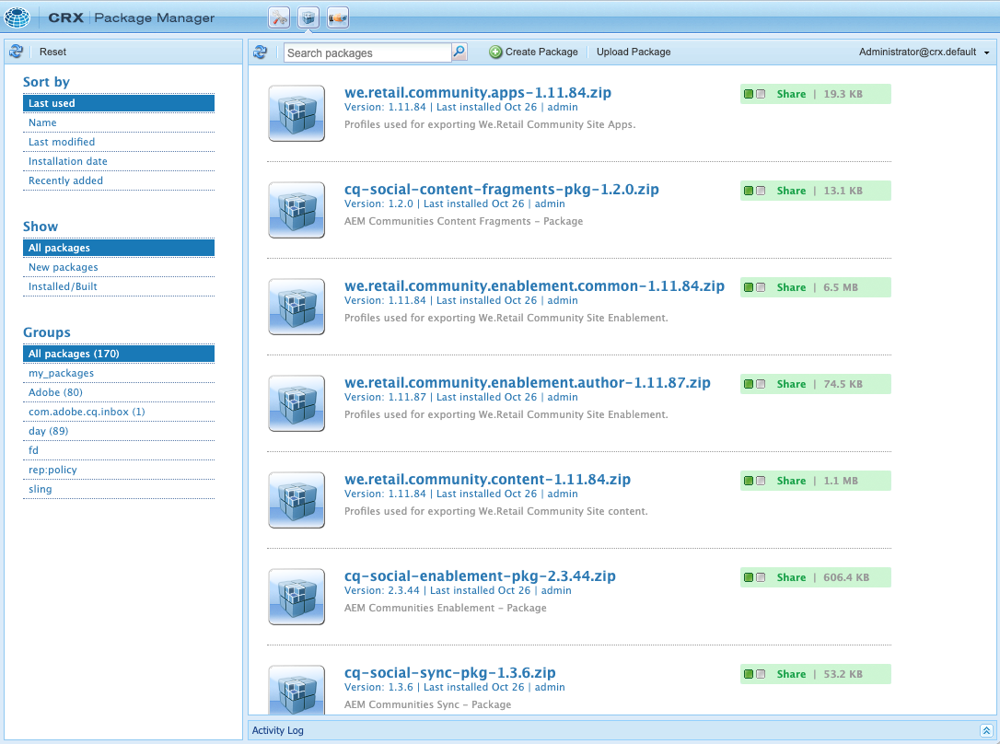

# Package Manager {#working-with-packages}

Packages enable the importing and exporting of repository content. You can use packages to install new content, install new functionality, transfer content between instances, and back up repository content.

Using Package Manager, you can transfer packages between your AEM instance and your local file system for development purposes.

## What are Packages? {#what-are-packages}

A package is a zip file holding repository content in file-system serialization form, called vault serialization, providing an easy-to-use and easy-to-edit representation of files and folders. Content included in the package is defined by using filters.

A package also contains vault meta information, including the filter definitions and import configuration information. Additional content properties, which are not used for package extraction, can be included in the package, such as a description, a visual image, or an icon. These additional content properties are for the content package consumer and for informational purposes only.

>[!NOTE]
>
>Packages represent the current version of the content at the time the package is built. They do not include any previous versions of the content that AEM keeps in the repository.

## Package Manager {#package-manager}

Package Manager manages the packages on your AEM installation. After you have [assigned the necessary permissions](#permissions-needed-for-using-the-package-manager) you can use Package Manager for various actions, including configuring, building, downloading, and installing your packages.

### Required Permissions {#required-permissions}

To create, modify, upload, and install packages, users must have the appropriate permissions on the following nodes:

* Full rights excluding delete on `/etc/packages`
* The node that contains the package contents

>[!CAUTION]
>
>Granting permissions for packages may lead to sensitive information disclosure and data loss.
>
>To limit these risks, it is highly recommended to grant specific group permissions over dedicated subtrees only.

### Accessing Package Manager {#accessing}

You can access Package Manager in three ways:

1. From the AEM main menu > **Tools** > **Deployment** > **Packages**
1. From [CRXDE Lite](/help/sites-developing/developing-with-crxde-lite.md) using the top switcher bar
1. Directly by accessing `http://<host>:<port>/crx/packmgr/`

### Package Manager UI {#ui}

Package Manager is divided into four main functional areas:

* **Left Navigation Panel** - This panel lets you filter and sort the list of packages.
* **Package List** - This is the list of packages on your instance filtered and sorted per selections in the Left Navigation Panel.
* **Activity Log** - This panel is minimized at first and expands to detail the activity of Package Manager such as when a package is built or installed. There are additional buttons in the Activity Log tab to:
  * **Clear Log**
  * **Show/Hide**
* **Toolbar** - The toolbar contains refresh buttons for the Left Navigation Panel and Package list and buttons for searching, creating, and uploading packages.



Clicking an option in the Left Navigation Panel immediately filters the Package List.

Clicking a package name expands the entry in the Package List to show more detail about the package.


There are number of actions that can be taken on a package via the toolbar buttons available when the package detail is expanded.

* [Edit](#edit-package)
* [Build](#building-a-package)
* [Reinstall](#reinstalling-packages)
* [Download](#downloading-packages-to-your-file-system)
* [Share](#share)

Further actions are available beneath the **More** button.

* [Delete](#deleting-packages)
* [Coverage](#package-coverage)
* [Contents](#viewing-package-contents-and-testing-installation)
* [Rewrap](#rewrapping-a-package)
* [Other Versions](#other-versions)
* [Uninstall](#uninstalling-packages)
* [Test Install](#viewing-package-contents-and-testing-installation)
* [Validate](#validating-packages)
* [Replicate](#replicating-packages)

### Package Status {#package-status}

Each entry in the package list has a status indicator to let you know at a glance the status of the package. Hovering over the status reveals tooltip with the detail of the status.


If the package has been changed or was never built, the status is presented as a link to take quick action to rebuild or install the package.

## Package Settings {#package-settings}

A package is essentially a set of filters and the repository data based on those filters. Using the Package Manager UI, you can click a package and then the **Edit** button to view the details of a package including the following settings.

* [General Settings](#general-settings)
* [Package Filters](#package-filters)
* [Package Dependencies](#package-dependencies)
* [Advanced Settings](#advanced-settings)
* [Package Screenshots](#package-screenshots)

### General Settings {#general-settings}

You can edit a variety of package settings to define information such as the package description, dependencies, and provider details.

The **Package Settings** dialog is available via the **Edit** button when [creating](#creating-a-new-package) or [editing](#viewing-and-editing-package-information) a package. After any changes are made, click **Save**.


|Field|Description|
|---|---|
| Name |The name of the package|
| Group |For organizing packages, you can type the name of a new group or select an existing group|
| Version |Text to use for the version|
| Description |A brief description of the package allowing HTML markup for formatting|
| Thumbnail |The icon that appears with the package listing|

#### Package Thumbnails {#thumbnails}

A thumbnail provides a quick-reference visual representation of what the package contains. This is then shown in the package list and can help easily identify the package, or the class of package.

The following are examples of conventions are used for official packages:

Official Hotfix


Official AEM Installation of Extension


Official Service Pack


Use a unique icon for your package. Do not reuse an icon used by Adobe.

### Package Filters {#package-filters}

Filters identify the repository nodes to include in the package. A **Filter Definition** specifies the following information:

* The **Root path** of the content to include
* **Rules** that include or exclude specific nodes below the root path

Add rules using the **+** button. Remove rules using the **-** button.

Rules are applied according to their order so position them as required using the **Up** and **Down** arrow buttons.

Filters can include zero or more rules. When no rules are defined, the package contains all content below the root path.

You can define one or more filter definitions for a package. Use more than one filter to include content from multiple root paths.


When creating rules, you define a regular expression (also known as regex, regexp or rational expression) to specify all the nodes that you want to include or exclude.

|Rule Type|Description|
|---|---|
|include|Include will include all the files and folders in the specified directory that match the regular expression. Include **will not** include other files or folders from under the specified root path.|
|exclude|Exclude will exclude all the files and folders that match the regular expression.|

Package filters are most often defined when you first [create the package.](#creating-a-new-package) However they can also be edited later, after which the package should be rebuilt to update its content based on the new filter definitions.

>[!TIP]
>
>One package can contain multiple filter definitions so that nodes from different locations can easily be combined into one package.

>[!TIP]
>
>For background information see the [Apache Jackrabbit - Workspace Filter](https://jackrabbit.apache.org/filevault/filter.html) documentation.

### Dependencies {#dependencies}


|Field|Description|Example/Details|
|---|---|---|
|Tested with|The product name and version this package is targeted to or is compatible with.|`6.5`|
|Fixed issues |A text field allowing for listing details of bugs fixed with this package, one bug per line |-|
|Depends on|Lists other packages necessary so that the current package runs as expected when installed|`groupId:name:version`|
|Replaces|A list of deprecated packages that this package replaces|`groupId:name:version`|

### Advanced Settings {#advanced-settings}


|Field|Description|Example/Details|
|---|---|---|
|Name|The name of the provider of the package|`WKND Media Group`|
|URL|URL of the provider|`https://wknd.site`|
|Link|Package-specific link to a provider page|`https://wknd.site/package/`|
|Requires|Defines if there are any restrictions when installing the package|**Admin** - The package must only be installed with admin privileges<br>**Restart** - AEM must be restarted after installing the package|
|AC Handling|Specifies how the access control information defined in the package is handled when the package is imported|**Ignore** - Preserve ACLs in the repository<br>**Overwrite** - Overwrite ACLs in the repository<br>**Merge** - Merge both sets of ACLs<br>**MergePreserve** - Merge access control in the content with the one provided with the package by adding the access control entries of principals not present in the content<br>**Clear** - Clear ACLs|

### Package Screenshots {#package-screenshots}

You can attach multiple screenshots to your package to provide a visual representation of how the content appears.


## Package Actions {#package-actions}

There are many actions that can be taken on a package.

### Creating a Package {#creating-a-new-package}

1. [Access Package Manager.](#accessing)

1. Click **Create Package**.

   >[!TIP]
   >
   >If your instance has many packages, there might be a folder structure in place. In such cases, it is easier to navigate to the required target folder before creating the new package.

1. In the **New Package** dialog, enter the following fields:

   

    * **Package Name** - Select a descriptive name to help you (and others) easily identify the contents of the package.

    * **Version** - This is a textual field for you to indicate a version. This is appended to the package name to form the name of the zip file.

    * **Group** - This is the target group (or folder) name. Groups help you organize your packages. A folder is created for the group if it does not already exist. If you leave the group name blank, it will create the package in the main package list.

1. Click **OK** to create the package.

1. AEM lists the new package at the top of the list of packages.

   

1. Click **Edit** to define the [package contents.](#package-contents) Click **Save** after you are finished editing the settings.

1. You can now [Build](#building-a-package) your package.

It is not compulsory to immediately build the package after creating it. An unbuilt package contains no content and consists of only the filter data and other metadata of the package.

### Building a Package {#building-a-package}

A package is often built at the same time as you [create the package](#creating-a-new-package), but you can return at a later point to either build or rebuild the package. This can be useful if the content within the repository has changed or the package filters have changed.

1. [Access Package Manager.](#accessing)

1. Open the package details from the package list by clicking the package name.

1. Click **Build**. A dialog asks for confirmation that you do want to build the package since any existing package contents will be overwritten.

1. Click **OK**. AEM builds the package, listing all content added to the package as it does so in the activity list. When complete AEM displays a confirmation that the package was built and (when you close the dialog) updates the package list information.

### Editing a Package {#edit-package}

Once a package is uploaded to AEM, you can modify its settings.

1. [Access Package Manager.](#accessing)

1. Open the package details from the package list by clicking the package name.

1. Click **Edit** and update the **[Package Settings](#package-settings)** as required.

1. Click **Save** to save.

You may need to [rebuild the package](#building-a-package) to update its contents based on the changes you made.

### Rewrapping a Package {#rewrapping-a-package}

Once a package has been built, it can be rewrapped. Rewrapping changes the package information without such as thumbnail, description, and so on, without changing the package content.

1. [Access Package Manager.](#accessing)

1. Open the package details from the package list by clicking the package name.

1. Click **Edit** and update the **[Package Settings](#package-settings)** as required. 

1. Click **Save** to save.

1. Click **More** > **Rewrap** and a dialog will ask for confirmation.

### Viewing Other Package Versions {#other-versions}

Because every version of a package appears in the list as any other package, Package Manager can find other versions of a selected package.

1. [Access Package Manager.](#accessing)

1. Open the package details from the package list by clicking the package name.

1. Click **More** > **Other Versions** and a dialog opens with a list of other versions of the same package with status information.

### Viewing Package Contents and Testing Installation {#viewing-package-contents-and-testing-installation}

After a package has been built, you can view the contents.

1. [Access Package Manager.](#accessing)

1. Open the package details from the package list by clicking the package name.

1. To view the contents, click **More** > **Contents**, and Package Manager lists the entire contents of the package in the activity log.

   

1. To perform a dry run of the installation click **More** > **Test Install** and Package Manager reports in the activity log the results as if installation were performed.

   

### Downloading Packages to Your File System {#downloading-packages-to-your-file-system}

1. [Access Package Manager.](#accessing)

1. Open the package details from the package list by clicking the package name.

1. Click the **Download** button or the linked file name of the package in the package details area.

1. AEM downloads the package to your computer.

### Sharing a Package {#share}

Package Share was a centralized public service to distribute content packages. Package Share has ben superseded by [Software Distribution](#software-distribution) and this button no longer works.

### Uploading Packages from Your File System {#uploading-packages-from-your-file-system}

1. [Access Package Manager.](#accessing)

1. Select the group folder into which you want the package to be uploaded.

1. Click the **Upload Package** button.

1. Provide the necessary information about the uploaded package.

   

    * **Package** - Use the **Browse...** button to select the required package from your local file system.
    * **Force Upload** - If a package with this name already exists, this option forces the upload and overwrites the existing package.

1. Click **OK** and the selected package is uploaded and the package list is updated accordingly.

The package content now exists on AEM, but o make the content available for use, be sure to [install the package](#installing-packages).

### Validating Packages {#validating-packages}

Because packages can modify existing content, it is often useful to validate these changes before installing.

#### Validation Options {#validation-options}

Package Manager can perform the following validations:

* [OSGi Package Imports](#osgi-package-imports)
* [Overlays](#overlays)
* [ACLs](#acls)

##### Validate OSGi Package Imports {#osgi-package-imports}

**What is checked**

This validation inspects the package for all JAR files (OSGi bundles), extracts their `manifest.xml` (which contains the versioned dependencies on which said OSGi bundle relies), and verifies the AEM instance exports said dependencies with the correct versions.

**How it is reported**

Any versioned dependencies that cannot be satisfied by the AEM instance are listed in the Activity Log of Package Manager.

**Error States**

If dependencies are unsatisfied, then the OSGi bundles in the package with those dependencies will not start. This results in a broken application deployment as anything relying on the unstarted OSGi bundle will in turn not function properly.

**Error Resolution**

To resolve errors due to unsatisfied OSGi bundles, the dependency version in the bundle with unsatisfied imports must be adjusted.

##### Validate Overlays {#overlays}

**What is checked**

This validation determines if the package being installed contains a file that is already overlaid in the destination AEM instance.

For example, given an existing overlay at `/apps/sling/servlet/errorhandler/404.jsp`, a package that contains `/libs/sling/servlet/errorhandler/404.jsp`, such that it will change the existing file at `/libs/sling/servlet/errorhandler/404.jsp`.

**How it is eported**

Any such overlays are described in the Activity Log of Package Manager.

**Error States**

An error state means that the package is attempting to deploy a file that is already overlaid, thus the changes in the package will be overridden (and thus "hidden") by the overlay and not take effect.

**Error Resolution**

To resolve this issue, the maintainer of the overlay file in `/apps` must review the changes to the overlaid file in `/libs` and incorporate the changes as needed into the overlay ( `/apps`), and redeploy the overlaid file.

>[!NOTE]
>
>The validation mechanism has no way to reconcile if the overlaid content has been properly incorporated into the overlay file. Therefore this validation will continue to report over conflicts even after the necessary changes have been made.

##### Validate ACLs {#acls}

**What is checked**

This validation checks which permissions are being added, how they will be handled (merge/replace), and if the current permissions will be impacted.

**How it is reported**

The permissions are described in the Activity Log of Package Manager.

**Error States**

No explicit errors can be provided. The validation simply indicates whether any new ACL permissions will be added or impacted by installing the package.

**Error Resolution**

Using the information provided by the validation, the impacted nodes can be reviewed in CRXDE and the ACLs can be adjusting in the package as needed.

>[!CAUTION]
>
>As best practice it is recommended that packages should not affect AEM-provided ACLs as this may result in unexpected behavior.

#### Performing Validation {#performing-validation}

Validation of packages can be done in two different ways:

* [Via the Package Manager UI](#via-package-manager)
* [Via HTTP POST request such as with cURL](#via-post-request)

Validation should always occur after uploading the package but before installing it.

##### Package Validation Via Package Manager {#via-package-manager}

1. [Access Package Manager.](#accessing)

1. Open the package details from the package list by clicking the package name.

1. To validate the package, click **More** > **Validate**, 

1. In the modal dialog box that then appears, use the checkboxes to select the type(s) of validation and begin the validation by clicking **Validate**.

1. The chosen validation(s) is/are then run and the results are displayed in the Activity Log of Package Manager.

##### Package Validation Via HTTP POST Request {#via-post-request}

The POST request takes the following form.

```
https://<host>:<port>/crx/packmgr/service.jsp?cmd=validate&type=osgiPackageImports,overlays,acls
```

The `type` parameter can be any comma-separated, unordered list consisting of:

* `osgiPackageImports`
* `overlays`
* `acls`

The value of `type` defaults to `osgiPackageImports` if not explicitly passed.

When using cURL, execute a statement similar to the following:

```shell
curl -v -X POST --user admin:admin -F file=@/Users/SomeGuy/Desktop/core.wcm.components.all-1.1.0.zip 'http://localhost:4502/crx/packmgr/service.jsp?cmd=validate&type=osgiPackageImports,overlays,acls'
```

When validating via POST request, the response is sent back as a JSON object.

### Viewing Package Coverage {#package-coverage}

Packages are defined by their filters. You can have Package Manager apply filters of a package to your existing repository content to show what content of the repository is covered by the filter definition of the package.

1. [Access Package Manager.](#accessing)

1. Open the package details from the package list by clicking the package name.

1. Click **More** > **Coverage**.

1. The coverage details are listed in the Activity Log.

### Installing Packages {#installing-packages}

Uploading a package only adds the package content to the repository, but it is not accessible. Install the uploaded package to use the package's content.

>[!CAUTION]
>
>Installing a package can overwrite or delete existing content. Only upload a package if you are sure that it does not delete or overwrite content that you need.

Prior to installation of your package, Package Manager automatically creates a snapshot package that contains the content that will be overwritten. This snapshot will be reinstalled if you uninstall your package.

>[!CAUTION]
>
>* If you are installing digital assets, you must:
>  First, deactivate the WorkflowLauncher.
>  Use the Components menu option of the OSGi console to deactivate 
>  `com.day.cq.workflow.launcher.impl.WorkflowLauncherImpl.`
>* Next, when installation is complete, reactivate the WorkflowLauncher.
>
>Deactivating the WorkflowLauncher ensures that the Assets importer framework does not (unintentionally) manipulate the assets upon installation.

1. [Access Package Manager.](#accessing)

1. Open the package details of the package you wish to install from the package list by clicking the package name.

1. Either click the **Install** button in the item details or the **Install** link in the package status.

1. A dialog will request confirmation and allow for additional options to be specified.

   * **Extract Only** - Extract the package only so that no snapshot is created and therefore uninstall will not be possible
   * **Save Threshold** - Number of transient nodes until automatic saving is triggered (increase if you encounter concurrent modification exceptions)
   * **Extract Subpackages** - Enable automatic extraction of sub packages
   * **Access Control Handling** - Specifies how the access control information defined in the package is handled when the package is installed (options are the same as the [advanced package settings](#advanced-settings))
   * **Dependencies Handling** - Specify how dependencies are handled during installation

1. Click **Install**.

1. The Activity Log details the progress of the installation.

Once the installation is complete and successful, the package list is updated and the word **Installed** appears in the package status.

### Reinstalling Packages {#reinstalling-packages}

Reinstalling packages performs the same steps on an already installed package that are processed when [initially installing the package.](#installing-packages)

### File System Based Upload and Installation {#file-system-based-upload-and-installation}

You can forego Package Manager altogether when installing packages. AEM can detect packages placed in a specific location on the local filesystem of the host machine and upload and install them automatically.

1. Under the AEM installation folder, there is a `crx-quicksart` folder alongside the jar and `license.properties` file. Create a folder named `install` under `crx-quickstart` resulting in the path `<aem-home>/crx-quickstart/install`.

1. In this folder, add your packages. They will automatically be uploaded and installed on your instance.

1. Once upload and installation is complete, you can see the packages in Package Manager as if you had used the Package Manager UI to install them.

If the instance is running, the upload and the installation begins immediately when you add it to the package to the `install` folder

If the instance is not running, packages placed in the `install` folder are installed at startup in alphabetical order.

### Uninstalling Packages {#uninstalling-packages}

Uninstalling package reverts the contents of the repository to the snapshot made automatically by Package Manager prior to installation.

1. [Access Package Manager.](#accessing)

1. Open the package details of the package you wish to uninstall from the package list by clicking the package name.

1. Click **More** > **Uninstall**, to remove the contents of this package from the repository.

1. A dialog will request confirmation and list all changes being made. 

1. The package is removed and the snapshot is applied. Progress of the process is shown in the Activity Log.

### Deleting Packages {#deleting-packages}

Deleting a package only deletes its details from Package Manager. If this package was already installed, then the installed content will not be deleted.

1. [Access Package Manager.](#accessing)

1. Open the package details of the package you wish to delete from the package list by clicking the package name.

1. Package Manager asks for confirmation that you want to delete the package. Click **OK** to confirm the deletion.

1. The package information is deleted and details are reported in the Activity Log.

### Replicating Packages {#replicating-packages}

Replicate the contents of a package to install it on the publish instance.

1. [Access Package Manager.](#accessing)

1. Open the package details of the package you wish to replicate from the package list by clicking the package name.

1. Click **More** > **Replicate**.

1. The package is replicated and details are reported in the Activity Log.

## Software Distribution {#software-distribution}

AEM Packages can be used to create and share content across AEM environments.

[Software Distribution](https://downloads.experiencecloud.adobe.com) is a centralized service  designed to simplify the search and download of AEM packages.

For more information, see the [Software Distribution documentation.](https://experienceleague.adobe.com/docs/experience-cloud/software-distribution/home.html)

>[!NOTE]
>
>Package Manager is not currently integrated with Software Distribution as it was with the former Package Share service. Therefore the share buttons and other links to Package Share within Package Manager no longer work. The solution is to download packages to your local disk.
