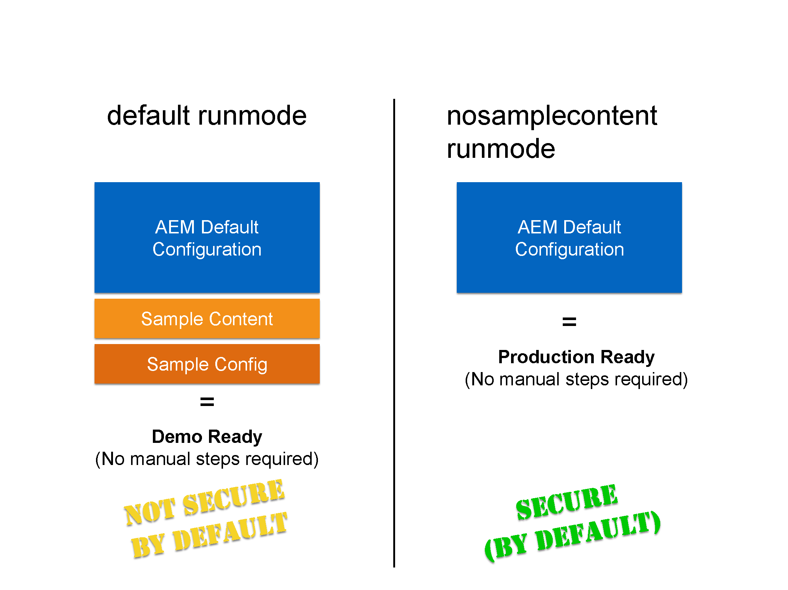

# Running AEM in Production Ready Mode{#running-aem-in-production-ready-mode}

With AEM 6.1, Adobe introduces the new `"nosamplecontent"` run mode aimed at automating the steps required to prepare an AEM instance for deployment in a production environment.

The new run mode will not only automatically configure the instance to adhere to the security best practices described in the security checklist, but will also remove all the sample Geometrixx applications and configurations in the process.

>[!NOTE]
>
>Since, due to practical reasons, the AEM Production Ready Mode will only cover most tasks needed to secure an instance, it is highly recommended you consult the [Security Checklist](/help/sites-administering/security-checklist.md) before going live with your production environment.
>
>Also, note that running AEM in Production Ready Mode will effectively disable access to CRXDE Lite. If you need it for debugging purposes, see [Enabling CRXDE Lite in AEM](/help/sites-administering/enabling-crxde-lite.md).



To run AEM in production ready mode all you must do is add the `nosamplecontent` via the `-r` run mode switch to your existing startup arguments:

```shell
java -jar aem-quickstart.jar -r nosamplecontent
```

For example, you can use the production ready to launch an author instance with MongoDB persistence like this:

```shell
java -jar aem-quickstart.jar -r author,crx3,crx3mongo,nosamplecontent -Doak.mongo.uri=mongodb://remoteserver:27017 -Doak.mongo.db=aem-author
```

## Changes part of the Production Ready Mode {#changes-part-of-the-production-ready-mode}

More specifically, the following configuration changes are performed when AEM is run in production ready mode:

1. The **CRXDE Support bundle** ( `com.adobe.granite.crxde-support`) is disabled by default in production ready mode. It can be installed at any time from the Adobe public Maven repository. Version 3.0.0 is required for AEM 6.1.

1. The **Apache Sling Simple WebDAV Access to repositories** ( `org.apache.sling.jcr.webdav`) bundle will only be available on **author** instances.

1. Newly created users are required to change the password on the first login. This does not apply to the admin user.
1. **Generate debug info** is disabled for the **Apache Sling JavaScript Handler**.

1. **Mapped content** and **Generate debug info** are disabled for the **Apache Sling JSP Script Handler**.

1. The **Day CQ WCM Filter** is set to `edit` on **author** and `disabled` on **publish** instances.

1. The **Adobe Granite HTML Library Manager** is configured with the following settings:

    1. **Minify:** `enabled`
    1. **Debug:** `disabled`
    1. **Gzip:** `enabled`
    1. **Timing:** `disabled`

1. The **Apache Sling GET Servlet** is set to support secure configurations by default, as follows:

| **Configuration** |**Author** |**Publish** |
|---|---|---|
| TXT rendition |disabled |disabled |
| HTML rendition |disabled |disabled |
| JSON rendition |enabled |enabled |
| XML rendition |disabled |disabled |
| json.maximumresults |1000 |100 |
| Auto Index |disabled |disabled |
