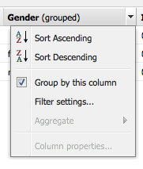
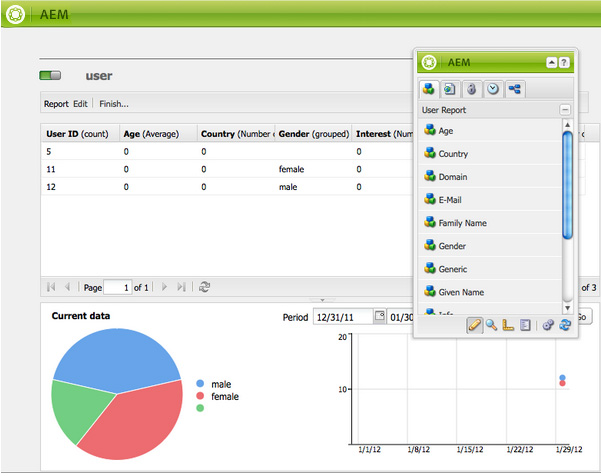
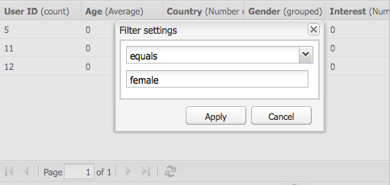
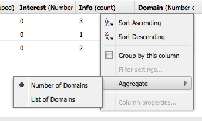
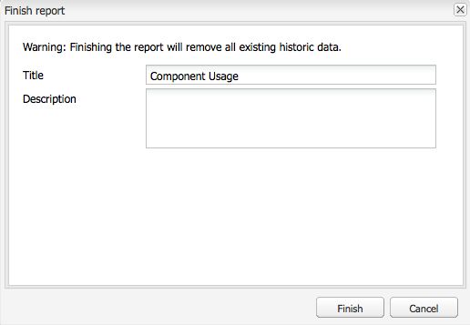
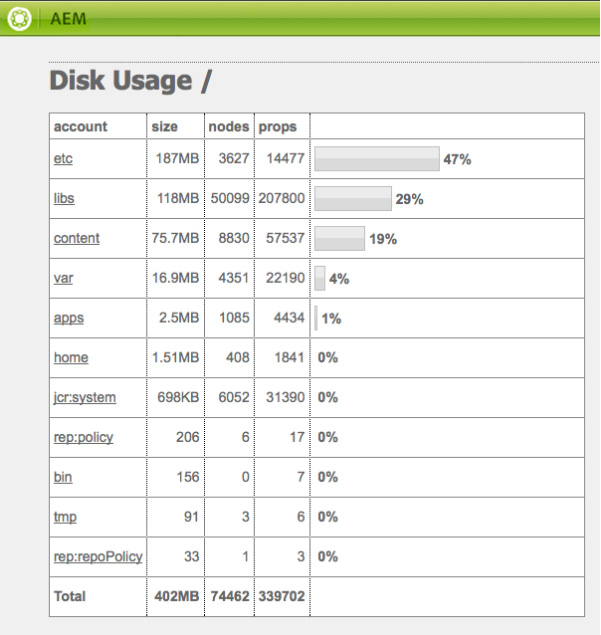
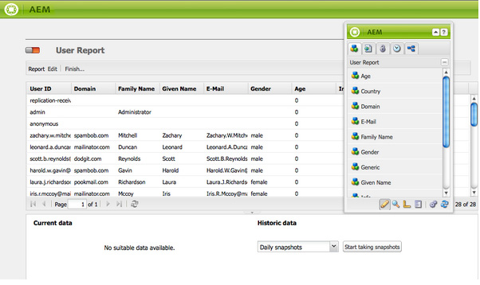

# Reporting {#reporting}

To help you monitor and analyze the state of your instance, Adobe Experience Manager (AEM) provides a selection of default reports, which can be configured for your individual requirements:

* [Component Report](#component-report)
* [Disk Usage](#disk-usage)
* [Health Check](#health-check)
* [Page Activity Report](#page-activity-report)
* [User-Generated Content Report](#user-generated-content-report)
* [User Report](#user-report)
* [Workflow Instance Report](#workflow-instance-report)
* [Workflow Report](#workflow-report)

>[!NOTE]
>
>These reports are only available in the Classic UI. For system monitoring and reporting in the modern UI, see the [Operations Dashboard.](/help/sites-administering/operations-dashboard.md)

All reports can be accessed from the **Tools** console. Select **Reports** in the left-hand pane, then double-click the required report in the right-hand pane so you can open it for viewing, or configuration, or both.

New instances of a report can also be created from the **Tools** console. Select **Reports** in the left-hand pane, then **New...** from the toolbar. Define a **Title** and **Name**, select the report type you require, then click **Create**. Your new report instance appears in the list. Double-click this to open, then drag a component from the sidekick so you can create the first column and start the report definition.

>[!NOTE]
>
>In addition to the standard AEM reports that are available out of the box, you can [develop your own (new) reports](/help/sites-developing/dev-reports.md).

## The Basics of Report Customization {#the-basics-of-report-customization}

There are various formats of reports available. The following reports all use columns that can be customized as detailed in the following sections:

* [Component Report](#component-report)
* [Page Activity Report](#page-activity-report)
* [User-Generated Content Report](#user-generated-content-report)
* [User Report](#user-report)
* [Workflow Instance Report](#workflow-instance-report)

>[!NOTE]
>
>The following reports each have their own format and customization:
>
>
>* [Health Check](#health-check) uses selection fields to specify the data you want to report on.
>* [Disk Usage](#disk-usage) uses links to drill down through the repository structure.
>* [Workflow](/help/sites-administering/reporting.md#workflow-report) gives an overview of the workflows running on your instance.
>
>So the following procedures for column configuration are not appropriate. See the descriptions of the individual reports for their details.

### Selecting and Positioning the Data Columns {#selecting-and-positioning-the-data-columns}

Columns can be added to, repositioned on, or removed from any of the reports, either standard or customized.

The **Components** tab of the sidekick (available on the report page) lists all categories of data that can be selected as columns.

To change the data selection:

* to add a column, drag the required component from the sidekick and drop in the position you want

    * a green tick indicates when the position is valid and a pair of arrows indicates exactly where it is placed
    * a red no-go symbol indicates when the position is invalid

* to move a column, click the header, hold, and drag to the new position
* to remove a column, click the column title, hold, and drag up into the report header area (a red minus symbol indicates that the position is not valid). Release the mouse button and the Delete Components dialog box requests confirmation that you do really want to delete the column.

### Column Drop-down Menu {#column-drop-down-menu}

Each column in the report has a drop-down menu. This becomes visible when your mouse cursor moves over the column title cell.

An arrow head appears at the far right of the title cell (not to be confused with the arrow head immediately to the right of the title text that indicates the [current sort mechanism](#sorting-the-data)).

The options available on the menu depend on the configuration of the column (as made during project development), any invalid options are dimmed (grayed out).

### Sorting the Data {#sorting-the-data}

The data can be sorted according to a specific column by either:

* clicking the appropriate column header; the sort toggles between ascending and descending, indicated by an arrow head immediately next to the title text
* use the [column's drop-down menu](#column-drop-down-menu) to specifically select either **Sort Ascending** or **Sort Descending**; again this is indicated by an arrow head immediately next to the title text

### Groups and the Current data Chart {#groups-and-the-current-data-chart}

On appropriate columns, you can select **Group by this column** from the [column's drop-down menu](#column-drop-down-menu). This groups the data according to each distinct value within that column. You can select more than one column to be grouped. The option is dimmed (grayed out) when the data in the column is inappropriate. That is, every entry is distinct and unique so no groups can be formed. For example, the User ID column of the user report.

After at least one column is grouped, a pie-chart of **Current data** is generated, based on this grouping. If multiple columns are grouped, then this is indicated on the chart.

Moving your cursor over the pie-chart shows the aggregated value for the appropriate segment. This uses the aggregate currently defined for the column; for example, count, minimum, average, among others.

### Filters and Aggregates {#filters-and-aggregates}

On appropriate columns, you can also configure **Filter Settings** and/or **Aggregates** from the [column's drop-down menu](#column-drop-down-menu).

#### Filters {#filters}

Filter Settings let you specify the criteria for entries to be displayed. The operators available are:

* `contains`
* `equals`

To set a filter:

1. Select the operator that you want from the drop-down list.
1. Enter the text to be filtered on.
1. Click **Apply**.

To deactivate the filter:

1. Remove the filter text.
1. Click **Apply**.

#### Aggregates {#aggregates}

You can also select an aggregation method (these may vary depending on the column selected):

### Column Properties {#column-properties}

This option is only available when the [Generic column](#generic-column) has been used in the [User Report](#user-report).

### Historic data {#historic-data}

A chart of the change in your data over time can be seen under **Historic data**. This is derived from snapshots taken at regular intervals.

Data is:

* Collected by, if available, the first sorted column, otherwise the first (non-grouped) column
* Grouped by the appropriate column

The report can be generated:

1. Set **Grouping** on the required column.
1. **Edit** the configuration so you can define hourly or daily snapshots.
1. **Finish...** the definition to start the collection of snapshots.

   The red/green slider button at top left indicates when snapshots are being collected.

The resulting chart is shown at the bottom right:

When data collection starts, you can select:

* **Period**

  You can select from and to dates for the report data to be shown.

* **Interval**

  Month, Week, Day, Hour can be selected for the scale and aggregation of the report.

  For example, if daily snapshots are available for February 2011:

    * If the interval is set to `Day`, each snapshot is shown as a single value in the chart.
    * If the interval is set to `Month`, all snapshots for February are aggregated into a single value (displayed as a single "dot" in the chart).

Select your requirements, then click **Go** to apply them to the report. To update the display after further snapshots have been made, click **Go** again.

When snapshots are being collected, you can:

* Use **Finish...** again to reinitialize the collection.

  **Finish** "freezes" the report's structure (that is, the columns assigned to the report and which are grouped, sorted, filtered, and so on) and starts taking snapshots.

* Open the **Edit** dialog box so you can select **No data snapshots** to terminate the collection until required.

  **Edit** only switches the taking of snapshots on or off. If taking snapshots is switched on again, it uses the state of the report when it was last finished for taking further snapshots.

>[!NOTE]
>
>Snapshots are stored under `/var/reports/...` where the remainder of the path mirrors the path of the respective report and ID created when the report was finished.
>
>
>Old snapshots can be manually purged, if you are sure that you no longer require those instances.

>[!NOTE]
>
>The pre-configured reports are not performance intensive, but it is still recommended to use daily snapshots on a production environment. If possible, run these daily snapshots at a time of day when there is not much activity on your website. This can be defined with the `Daily snapshots (repconf.hourofday)` parameter for **Day CQ Reporting Configuration**. See [OSGI Configuration](/help/sites-deploying/configuring-osgi.md) for more details on how to configure this.

#### Display Limits {#display-limits}

The historical data report can also change slightly in appearance due to limits that can be set, according to the number of results for the period selected.

Each horizontal line is known as a series (and corresponds to an entry in the chart legend), each vertical column of dots represents the aggregated snapshots.

To keep the chart clean over longer periods of time, there are limits which can be set. For the standard reports these are:

* horizontal series - both default and system maximum is `9`

* vertical aggregated snapshots - default is `35` (per horizontal series)

So when the (appropriate) limits are exceeded the:

* the dots are not displayed
* the legend for the historical data chart might show a different number of entries to that of the current data chart

Customized reports can also show the **Total** value for all series. This is shown as a series (horizontal line and entry in the legend).

>[!NOTE]
>
>For customized reports, the limits can be set differently.

### Edit (Report) {#edit-report}

The **Edit** button opens the **Edit Report** Dialog.

This is one location where the period for collecting snapshots for [Historic data](#historic-data) is defined, but various other settings can also be defined:

* **Title**

  You can define your own title.

* **Description**

  You can define your own description.

* **Root path** (*only active for certain reports*)

  Use this to limit the report to a (sub-) section of the repository.

* **Report Processing**

    * **automatically refresh data**

      The report data is refreshed every time you update the report definition.

    * **manually refresh data**

      This option can be used to prevent delays caused by automatic refresh operations when there is a large volume of data.

      Selecting this indicates that the report data must be manually refreshed when any aspect of the report configuration has changed. It also means that when you change any aspect of the configuration, the report table is blanked out.

      When this is selected, the **[Load data](#load-data)** button is displayed (next to **Edit** on the report). **Load data** loads the data and refresh the report data shown.

* **Snapshots**
  You can define how often snapshots are to be made; daily, hourly or not at all.

### Load data {#load-data}

The **Load data** button is only visible when **manually refresh data** has been selected from **[Edit](#edit-report)**.

Clicking **Load data** reloads the data and updates the report being shown.

Selecting to manually refresh data means that:

1. When you change the report configuration, the table of report data is blanked out.

   For example, if you change the sort mechanism for a column, the data is not shown.

1. If you want the report data to be shown again, you must click **Load data** to reload the data.

### Finish (report) {#finish-report}

When you **Finish** the report:

* The report definition *as of that point in time* is used for taking the snapshots. Afterwards, you can continue working on a report definition because it is separate from the snapshots.
* Any existing snapshots are removed.
* New snapshots are collected for the [Historic data](#historic-data).

With this dialog box, you can define or update your own title and description for the resulting report.

## Report Types {#report-types}

### Component Report {#component-report}

The component report delivers information about how your website uses the components.

[Columns of information](#selecting-and-positioning-the-data-columns) about:

* Author
* Component Path
* Component Type
* Last Modified
* Page

It means that you can see the following:

* Which components are used and where they are used.

  Useful, for example, when testing.

* How instances of a specific component are distributed.

  This can be interesting if specific pages (that is, "heavy pages") are experiencing performance issues.

* Identify parts of the site with frequent/less frequent changes.
* See how page content develops over time.

All components are included, product-standard, and project-specific. Using the **Edit** dialog the user can also set a **Root path** that defines the startpoint of the report - all components under that root are considered for the report.

 

### Disk Usage {#disk-usage}

The disk usage report shows information about the data stored within your repository.

The report starts in the root ( / ) of the repository; by clicking a particular branch that you can drill down inside the repository (the current path is reflected in the report title).

### Health Check {#health-check}

This report analyzes the current request log:

`<cq-installation-dir>/crx-quickstart/logs/request.log`

To help you identify the most expensive requests within a given period.

To generate the report, you can specify the following:

* **Period (hours)**

  The number of hours (past) to be analyzed.

  Default: `24`

* **max. Results**

  Maximum number of output lines.

  Default: `50`

* **max. Requests**

  Maximum number of requests to be analyzed.

  Default: `-1` (all)

* **Email address**

  Send results to an email address.

  Optional; Default: blank

* **Run daily at (hh:mm)**

  Specify a time for the report to be automatically run daily.

  Optional; Default: blank

### Page Activity Report {#page-activity-report}

The page activity report lists pages and the actions made on them.

[Columns of information](#selecting-and-positioning-the-data-columns) about:

* Page
* Time
* Type
* User

Mean that you can monitor:

* The latest modifications.
* Authors working on specific pages.
* Pages that have not been modified recently, so might be in need of action.
* Pages that are most / least frequently changed.
* Most / least active users.

The page activity report takes all its information from the audit log. By default the root path is configured to the audit log at `/var/audit/com.day.cq.wcm.core.page`.

### User-Generated Content Report {#user-generated-content-report}

This report provides information about user-generated content; be that comments, ratings, or forums.

[Columns of information](#selecting-and-positioning-the-data-columns) on:

* Date
* IP Address
* Page
* Referrer
* Type
* User Identifier

Lets you:

* See which pages are receiving the most comments.
* Get an overview of all comments that specific site visitors are leaving, maybe the issues are related.
* Judge whether new content is provoking comments by monitoring when comments are being made on a page.

### User Report {#user-report}

This report gives information about all users that have registered an account and/or profile; this can include both authors within your organization and external visitors.

[Columns of information](#selecting-and-positioning-the-data-columns) (where available) about:

* Age
* Country
* Domain
* E-Mail
* Family Name
* Gender
* [Generic](#generic-column)
* Given Name
* Info
* Interest
* Language
* NTLM Hashcode
* User ID

Lets you:

* See the demographic spread of your users.
* Report on customized fields that you have added to the profiles.

#### Generic Column {#generic-column}

The **Generic** column is available in the User Report so that you can access customized information, usually from the [user profiles](/help/sites-administering/identity-management.md#profiles-and-user-accounts); for example, [Favorite Color as detailed under Adding Fields to the Profile Definition](/help/sites-administering/identity-management.md#adding-fields-to-the-profile-definition).

The Generic column dialog box is opened when you do either of the following:

* Drag the Generic component from the sidekick to the report.
* Select the Column Properties for an existing Generic column.

From the **Definitions** tab you can define:

* **Title**

  Your own title for the generic column.

* **Property**

  The property name as stored in the repository, usually within the user's profile.

* **Path**

  Usually the property is taken from the `profile`.

* **Type**

  Select the field type from `String`, `Number`, `Integer`, `Date`.

* **Default Aggregate**

  This defines the aggregate used by default if the column is ungrouped in a report with at least one grouped column. Select the required aggregate from `Count`, `Minimum`, `Average`, `Maximum`, `Sum`.

  For example, *Count* for a `String` field means that the number of distinct `String` values is displayed for the column in the aggregated state.

In the **Extended** tab, you can also define the aggregates and filters available:

### Workflow Instance Report {#workflow-instance-report}

This gives you a concise overview, providing information about the individual instances of workflows, both running and completed.

[Columns of information](#selecting-and-positioning-the-data-columns) about:

* Completed
* Duration
* Initiator
* Model
* Payload
* Started
* Status

It means that you can:

* Monitor the mean duration of workflows; if this happens regularly it can highlight issues with the workflow.

### Workflow Report {#workflow-report}

This provides key statistics about the workflows running on your instance.

## Using Reports in a Publish Environment {#using-reports-in-a-publish-environment}

Once you have configured the reports to your specific requirements, you can activate it to transfer the configuration to the publish environment.

>[!CAUTION]
>
>If you want **Historic data** for the Publish environment, then **Finish** the report on the Author environment before activating the page.

The appropriate report is then accessible under

`/etc/reports`

For example, the User-Generated Content report can be found under:

`http://localhost:4503/etc/reports/ugcreport.html`

This now reports on data collected from the Publish environment.

As no report configuration is allowed in the Publish environment, the **Edit** and **Finish** buttons are not available. However, you can select the **Period** and **Interval** for the **Historic data** reports if snapshots are being collected.

>[!CAUTION]
>
>Access to these reports may be a security issue; therefore Adobe recommends that you configure the Dispatcher so that `/etc/reports` is not available to external visitors. See the [Security Checklist](security-checklist.md) for more details.

## Permissions Needed for Running Reports {#permissions-needed-for-running-reports}

The permissions needed depend on the action:

* Report data is collected using the privileges of the current user.
* Historic data is collected using the privileges of the user that finished the report.

In a standard AEM installation the following permissions are preset for the reports:

* **User Report**

  `user administrators` - read and write

* **Page Activity Report**

  `contributors` - read and write

* **Component Report**

  `contributors` - read and write

* **User-Generated Content Report**

  `contributors` - read and write

* **Workflow Instance Report**

  `workflow-users` - read and write

All members of the `administrators` group have the necessary rights to create reports.
