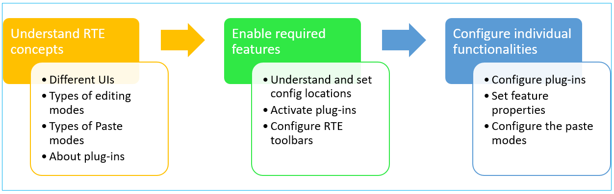
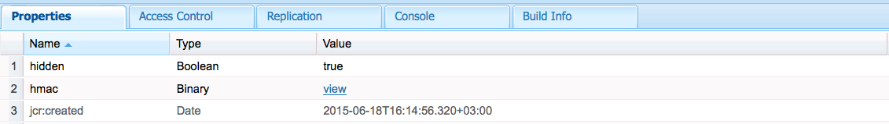
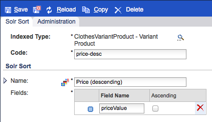
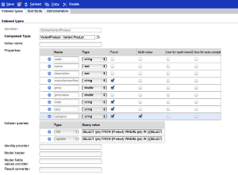

# Configure the Rich Text Editor {#configure-the-rich-text-editor}

The Rich Text Editor (RTE) provides authors with a wide range of functionality for editing their text content. Icons, selection boxes, toolbar, and menus are provided for a WYSIWYG text-editing experience.

To know how to use RTE features for authoring, see [Use Rich Text Editor for authoring](/help/sites-authoring/rich-text-editor.md). RTE can be configured to enable, disable, and extend the features available in the authoring components. The following workflow illustrates a recommended order of completing the RTE configuration tasks in Experience Manager.



*Figure: Sequence of steps to learn how to configure RTE*

## Understand Touch-enabled UI and Classic UI {#understand-touch-enabled-ui-and-classic-ui}

The Touch-enabled UI is the standard user interface for Experience Manager. Adobe introduced Touch-enabled UI with [responsive design](/help/sites-authoring/responsive-layout.md) for authoring environment. The Touch-enabled UI is designed for touch and desktop devices. The interface differs considerably from the original Classic UI.



*Figure: Rich Text Editor toolbar in Touch-enabled UI*


*Figure: Rich Text Editor toolbar in Classic UI*

>[!MORELIKETHIS]
>
>* [UI recommendations](/help/sites-deploying/ui-recommendations.md)
>* About deprecating the Classic UI, see [Experience Manager 6.5 release notes](/help/release-notes/deprecated-removed-features.md)
>* For difference between the UIs, see [Touch UI and Classic UI](https://aemcq5pedia.wordpress.com/2018/01/05/touch-enabled-ui-aem6-3/)
>* To understand the Touch-enabled UI in detail, see [Concepts of Experience Manager Touch UI](/help/sites-developing/touch-ui-concepts.md)

## Various modes of editing {#editingmodes}

Authors can create and edit textual content in Experience Manager using the different modes of components. The toolbar options for authoring and formatting content and the user experience of RTE-enabled components in different editing mode varies based on RTE configurations.

|Editing mode|Editing area|Recommended features to be enabled|Touch UI|Classic UI|
|--- |--- |--- |--- |--- |
|Inline|In-place editing for quick, minor edits; Format without opening a dialog box|Minimal RTE features|Y|Y|
|RTE full screen|Covers entire page|All the required RTE features|Y|N|
|Dialog|Dialog box on top of the page content but does not cover the entire page|All the required RTE features in Classic UI; judiciously enable features in Touch UI|Y|Y|
|Dialog full screen|Same as Full screen mode; contains fields of the dialog alongside RTE|All the required RTE features|Y|N|

>[!NOTE]
>
>The source-edit feature is not available in inline editing mode in Touch-enabled UI. You cannot drag images in the full screen mode. All other features work in all the modes.

### Inline editing {#inline-editing}

When opened (with a slow double-tap/click) the content can be edited within the page. A compact toolbar with very basic options is presented.



*Figure: Inline editing with basic toolbar in Touch-enabled UI*

In Classic UI, a slow double-click on the component allows inline editing and an orange outline highlights the content. If the Content Finder is open, a toolbar with the available RTE formatting options is displayed at the top of the window. If the Content Finder is not open, the formatting options are not displayed and you can do basic text edits only.

### Full screen editing {#full-screen-editing}

Experience Manager components can be opened in full screen view that hides the page content and occupies the available screen. Consider full screen editing a detailed version of the inline editing as it offers the most editing options. It can be opened by clicking , from the compact toolbar when using the inline editing mode.

In the dialog full screen mode, along with a detailed RTE toolbar, the options and components available in a dialog are also available. It is applicable only for a dialog that contains RTE alongside other components.



*Figure: The detailed RTE toolbar when editing in full screen mode in Touch-enabled UI*

### Dialog editing {#dialog-editing}

When a component is double-clicked a dialog box opens for editing the contents. The dialog box opens on top of the existing page. In some specific scenarios, the dialog opens as a pop-up window. For example, when a Text component is part of a column in a multi-column page layout and the area available for the dialog is less.


*Figure: Dialog editing mode in Touch-enabled UI*


*Figure: Dialog box in Classic UI that contains detailed toolbar for editing*

## About RTE plug-ins and the associated features {#aboutplugins}

The functionality is made available via a series of plug-ins, each with:

* A `features` property:

  * Used to activate, or deactivate, basic functionality for that plug-in
  * That can be configured using a standardized procedure

* Where appropriate, additional properties and options requiring specialized configuration.

Basic features of the RTE are activated, or deactivated, by the value of the `features` property on a node specific to the appropriate plug-in.

The following table lists the current plug-ins, showing:

* Plug-in IDs with a link to API documentation. ID is used as the node name when [activating a plug-in](/help/sites-administering/configure-rich-text-editor-plug-ins.md#activateplugin).
* Permitted values for the `features` property.
* A description of the functionality provided by the plug-in.

|Plug-in ID|features|Description|
|--- |--- |--- |
|edit|cut copy paste-default paste-plaintext paste-wordhtml| [Cut, copy and, the three paste modes](/help/sites-administering/configure-rich-text-editor-plug-ins.md#textstyles).|
|findreplace|find replace| Find and replace.|
|format|bold italic underline| [Basic text formatting](/help/sites-administering/configure-rich-text-editor-plug-ins.md#textstyles).|
|image|image|Basic image support (drag from content or Content Finder). Depending on the browser, the support has different behaviors for authors|
|keys||To define this value, see [tab size](/help/sites-administering/configure-rich-text-editor-plug-ins.md#tabsize).|
|justify|justifyleft justifycenter justifyright|Paragraph alignment.|
|links|modifylink unlink anchor|[Hyperlinks and anchors](/help/sites-administering/configure-rich-text-editor-plug-ins.md#linkstyles).|
|lists|ordered unordered indent outdent|This plug-in controls both [indentation and lists](/help/sites-administering/configure-rich-text-editor-plug-ins.md#indentmargin); including nested lists.|
|misctools|specialchars sourceedit|Miscellaneous tools allow authors to enter [special characters](/help/sites-administering/configure-rich-text-editor-plug-ins.md#spchar) or edit the HTML source. Also, you can add a whole [range of special characters](/help/sites-administering/configure-rich-text-editor-plug-ins.md#definerangechar) if you want to define your own list.|
|Paraformat|paraformat|The default paragraph formats are Paragraph, Heading 1, Heading 2, and Heading 3 (`<p>`, `<h1>`, `<h2>`, and `<h3>`). You can [add more paragraph formats](/help/sites-administering/configure-rich-text-editor-plug-ins.md#paraformats) or extend the list.|
|spellcheck|checktext|[Language aware spell checker](/help/sites-administering/configure-rich-text-editor-plug-ins.md#adddict).|
|styles|styles|Support for styling using a CSS class. [Add new text styles](/help/sites-administering/configure-rich-text-editor-plug-ins.md#textstyles) if you want to add (or extend) your own range of styles for use with text.|
|subsuperscript|subscript superscript|Extensions to the basic formats, adding sub- and super-script.|
|table|table removetable insertrow removerow insertcolumn removecolumn cellprops mergecells splitcell selectrow selectcolumns|See [configure table styles](/help/sites-administering/configure-rich-text-editor-plug-ins.md#tablestyles), if you want to add your own styles for either entire tables or individual cells.|
|undo|undo redo|History size of [undo and redo](/help/sites-administering/configure-rich-text-editor-plug-ins.md#undohistory) operations.|

>[!NOTE]
>
>The full screen plug-in is not supported in dialog mode. Use of the `dialogFullScreen` setting to configure the toolbar for full screen mode.

## Understand the configuration paths and locations {#understand-the-configuration-paths-and-locations}

The [mode of RTE editing (and the UI)](#editingmodes) that you provide for your authors decide the location for the configuration details when you are [activating the RTE plug-ins](/help/sites-administering/configure-rich-text-editor-plug-ins.md#activateplugin):

| Editing mode |Location for Touch UI |Location for Classic UI |
|---|---|---|
| Inline | `cq:editConfig/cq:inplaceEditing`| `cq:editConfig/cq:inplaceEditing` |
| Full screen | `cq:editConfig/cq:inplaceEditing` |Not applicable |
| Dialog | `cq:dialog` | `dialog` |
| Full screen dialog | `cq:dialog` |Not applicable |

>[!NOTE]
>
>Do not name the node under `cq:inplaceEditing` as `config`. On `cq:inplaceEditing` node, define the following properties:
>* **Name**: `configPath`
>* **Type**: `String`
>* **Value**: path of the node containing the actual configuration
>
>Do not name the RTE configuration node as `config`. Otherwise, the RTE configurations take effect for only the administrators and not for the users in the group `content-author`.

Configure the following properties that apply in Dialog editing mode in Touch UI only:

* `useFixedInlineToolbar`: Set this Boolean property defined on the RTE node (one with sling:resourceType= `cq/gui/components/authoring/dialog/richtext`) to `True`, to make RTE toolbar fixed instead of floating.

  When this property is true, Richtext editing is, by default, started on the "foundation-contentloaded" event.

  To prevent this, set the property `customStart` to `True`and trigger the 'rte-start' event to start RTE editing. When this property is 'true', the default behavior, rte start on click, does not work.

* `customStart`: Set this Boolean property defined on the RTE node to `True`, to control when to start RTE by triggering the event `rte-start`.

* `rte-start`: Trigger this event on the `contenteditable-div` of RTE, when to start editing RTE. This works only if `customStart` has been set to true.

When RTE is used in the touch-enabled dialog, setting the property `useFixedInlineToolbar` to true is mandatory to avoid issues.

## Customizing in place editing {#customizing-in-place-editing}

You can define on which HTML selector the text editor starts by configuring the following properties:

* **`editElementQuery`** - Defined on `cq:InplaceEditingConfig`, this property is used to specify a selector of the HTML element on which the inline-editing for the Text Component will be started. If not specified, the inline-editing is directly started on the Text Component HTML.
* **`textPropertyName`** - Defined on `cq:InplaceEditingConfig`, this property is used to specify the name of the property that will be saved on the content node where the HTML value of the text component will be persisted after inline-editing.

The corresponding property for dialog mode is `name`.

## Enable RTE functionalities by activating plug-ins {#enable-rte-functionalities-by-activating-plug-ins}

RTE functionalities are made available via a series of plug-ins, each with features property. You can configure the features property to enable or disable the various features of each plug-in.

For detailed configurations of the RTE plug-ins, see [how to activate and configure the RTE plug-ins](/help/sites-administering/configure-rich-text-editor-plug-ins.md).

**Sample**: Download [this sample configuration](/help/sites-administering/assets/rte-sample-all-features-enabled-10.zip) that illustrates how to configure RTE. In this package all the features are enabled.

>[!NOTE]
>
>The [Core Components text component](https://experienceleague.adobe.com/docs/experience-manager-core-components/using/components/text.html?lang=en#the-text-component-and-the-rich-text-editor) allows template editors to configure many RTE plugins in a GUI as content policies, eliminating the need for technical configuration. Content policies can work with RTE UI configurations as described in this document.
>
>For more information, see the [RTE UI settings and content polices](/help/sites-administering/rich-text-editor.md) section of this document as well as [Creating Page Templates](/help/sites-authoring/templates.md) and the [Core Components developer documentation](https://experienceleague.adobe.com/docs/experience-manager-core-components/using/developing/developing.html).

>[!NOTE]
>
>For reference purposes, the default Text components (delivered as part of a standard installation) can be found at:
>
>* `/libs/wcm/foundation/components/text`
>* `/libs/foundation/components/text`
>
>To create your own text component, copy the above component instead of editing these components.

## Configure RTE toolbar {#dialogfullscreen}

AEM allows you to configure the interface for the Rich Text Editor differently for the different editing modes. The default settings are provided below. You can override these defaults based on your requirements. You customize only the toolbar features that you want to provide to your authors. You need not specify all the toolbar configurations.

To configure the toolbar for `dialogFullScreen`, use the following sample configuration.

```java
<uiSettings jcr:primaryType="nt:unstructured">
  <cui jcr:primaryType="nt:unstructured">
    <inline
      jcr:primaryType="nt:unstructured"
      toolbar="[format#bold,format#italic,format#underline,#justify,#lists,links#modifylink,links#unlink,#paraformat]">
      <popovers jcr:primaryType="nt:unstructured">
        <justify
          jcr:primaryType="nt:unstructured"
          items="[justify#justifyleft,justify#justifycenter,justify#justifyright,justify#justifyjustify]"
          ref="justify"/>
        <lists
          jcr:primaryType="nt:unstructured"
          items="[lists#unordered,lists#ordered,lists#outdent,lists#indent]"
          ref="lists"/>
        <paraformat
          jcr:primaryType="nt:unstructured"
          items="paraformat:getFormats:paraformat-pulldown"
          ref="paraformat"/>
      </popovers>
    </inline>
    <dialogFullScreen
      jcr:primaryType="nt:unstructured"
      toolbar="[format#bold,format#italic,format#underline,justify#justifyleft,justify#justifycenter,justify#justifyright,justify#justifyjustify,lists#unordered,lists#ordered,lists#outdent,lists#indent,links#modifylink,links#unlink,table#createoredit,#paraformat,image#imageProps]">
      <popovers jcr:primaryType="nt:unstructured">
        <paraformat
          jcr:primaryType="nt:unstructured"
          items="paraformat:getFormats:paraformat-pulldown"
          ref="paraformat"/>
      </popovers>
    </dialogFullScreen>
    <tableEditOptions
      jcr:primaryType="nt:unstructured"
      toolbar="[table#insertcolumn-before,table#insertcolumn-after,table#removecolumn,-,table#insertrow-before,table#insertrow-after,table#removerow,-,table#mergecells-right,table#mergecells-down,table#mergecells,table#splitcell-horizontal,table#splitcell-vertical,-,table#selectrow,table#selectcolumn,-,table#ensureparagraph,-,table#modifytableandcell,table#removetable,-,undo#undo,undo#redo,-,table#exitTableEditing,-]">
    </tableEditOptions>
  </cui>
</uiSettings>
```

Different UI settings are used for the inline mode and full screen mode. The toolbar property is used to specify the buttons of the toolbar.

For example, if the button is itself a feature (for example, `Bold`), it is specified as `PluginName#FeatureName` (for example, `links#modifylink`).

If the button is a popover (containing some features of a plug-in), it is specified as `#PluginName` (for example, `#format`).

Separators (`|`) between a group of buttons can be specified with `-`.

The pop-up node under inline or full-screen mode contains a list of the popovers being used. Each child node under the 'popovers' node is named after the plug-in (for example, format). It has a property 'items' containing a list of features of the plug-in (for example, format#bold).

## RTE user interface settings and content policies {#rtecontentpolicies}

Administrators can control the RTE options using content policies, say instead of doing the configuration as described above. Content policies define the design properties of a component when used as part of an [editable template](/help/sites-authoring/templates.md). For example, if a text component that uses the RTE is used with an editable template, the content policy can define that the bold option be available and a few paragraph formatting options be available. Content policies are reusable and can be applied across multiple templates.

The available options in the RTE flow downstream from the user interface configurations to the content policies.

* User interface configuration settings define which options are available to the content policies.
* If the user interface configuration of the RTE removed or doesn't enable an item, the content policy cannot configure it.
* An author has access to only such functionality as is made available by the user interface configurations and the content policies.

As an example, you can see the [Text Core Component documentation](https://experienceleague.adobe.com/docs/experience-manager-core-components/using/wcm-components/text.html?lang=en#the-text-component-and-the-rich-text-editor).

## Customize mapping between toolbar icons and commands {#iconstoolbar}

You can customize the mapping between Coral icons displayed on the RTE toolbar and the available commands. You cannot use any other icons besides Coral icons.

1. Create a node named `icons` under `uiSettings/cui`.

1. Create nodes for individual icons under it.
1. On each of the individual icon nodes, specify a Coral icon and a command to map to the icon.

Below is a sample snippet to map the command Bold to the Coral icon named `textItalic`.

```java
<text jcr:primaryType="nt:unstructured" sling:resourceType="cq/gui/components/authoring/dialog/richtext" name="./text" useFixedInlineToolbar="{Boolean}true">
    <rtePlugins jcr:primaryType="nt:unstructured">
        <format jcr:primaryType="nt:unstructured" features="bold,italic"/>
    </rtePlugins>
    <uiSettings jcr:primaryType="nt:unstructured">
        <cui jcr:primaryType="nt:unstructured">
            <inline jcr:primaryType="nt:unstructured"
                toolbar="[format#bold,format#italic,format#underline,links#modifylink,links#unlink]">
            </inline>
            <icons jcr:primaryType="nt:unstructured">
                <bold jcr:primaryType="nt:unstructured"
                    command="format#bold"
                    icon="textItalic"/>
            </icons>
        </cui>
    </uiSettings>
</text>
```

## Switch to CoralUI 2 Rich Text Editor {#switch-to-coralui-rich-text-editor}

On a page, you can either include CoralUI 2 RTE clientlib or the CoralUI 3 RTE clientlib. By default, Rich Text Editor includes the CoralUI 3 RTE clientlib. To switch to CoralUI 2 RTE, perform the following steps.

>[!NOTE]
>
>Adobe does not recommend it as a best practice. Switch to CoralUI 2 RTE as a last resort. Custom plugins for CoralUI 2 RTE work with CoralUI 3 RTE if the plugins do not depend on RTE internals, such as classes.
>
>If you are using custom plugins for CoralUI3 RTE, use `rte.coralui3` library.


1. Overlay the node `/libs/cq/gui/components/authoring/editors/clientlibs/core` under `/apps`, and do the following:

    * Replace `rte.coralui3` with `rte.coralui2` for the dependencies property.
    * Replace `cq.authoring.editor.core.inlineediting.rte.coralui3` with `cq.authoring.editor.core.inlineediting.rte.coralui2` for the embed property.
    * Replace `cq.authoring.rte.coralui3` with `cq.authoring.rte.coralui2` for the embed property.

1. Overlay the nodes `/libs/cq/gui/components/authoring/dialog/richtext/clientlibs/rte/coralui3` and `/libs/cq/gui/components/authoring/dialog/richtext/clientlibs/rte/coralui2` under `/apps`.

   Remove category `cq.authoring.dialog` from `/apps/cq/gui/components/authoring/dialog/richtext/clientlibs/rte/coralui3` and add it to `/apps/cq/gui/components/authoring/dialog/richtext/clientlibs/rte/coralui2`.

1. Change any other dependency that is getting included on the page from `rte.coralui3` to `rte.coralui2`. For example, after overlaying the node `/libs/mcm/campaign/components/touch-ui/clientlibs/rte` under `/apps`, change any dependency on it from `rte.coralui3` to `rte.coralui2`.

1. Overlay the node `cq/ui/widgets` under `/apps`. Replace the dependency `cq.rte` at the node `/apps/cq/ui/widgets` with `cq.coralui2.rte`.

>[!NOTE]
>
>CoralUI 2 RTE uses handlebars templates for plug-in dialogs. Therefore, the CoralUI 2 RTE clientlib had a dependency on the handlebars clientlib. CoralUI 3 RTE does not use handlebars templates and doesn't have any associated dependency. If your custom plug-ins use handlebars templates, include the handlebars clientlib in your web page.

## Further Information {#further-information}

For more information about configuring the RTE, see the [AEM Widget API](https://developer.adobe.com/experience-manager/reference-materials/6-5/widgets-api/index.html?class=CQ.form.RichText) reference.

In particular, to see the plug-ins and related options available:

* The [CQ.form.RichText](https://developer.adobe.com/experience-manager/reference-materials/6-5/widgets-api/index.html?class=CQ.form.RichText) component provides a form field for editing styled text information (rich text). To know all the parameters available for the rich text form, see the Config Options.
* The RichText component provides a wide range of functionality using plug-ins listed under [CQ.form.rte.plugins.Plugin](https://developer.adobe.com/experience-manager/reference-materials/6-5/widgets-api/index.html?class=CQ.form.rte.plugins.Plugin). For each plug-in:

    * see the Features for details of functionality that can be enabled (or disabled)
    * See the Config Options for all parameters available for detailed configuration of the appropriate plug-in

* More information about HTML Rules for links is also available.

These can be used to extend and customize your own RTE. For example, to list the anchors available in the page when creating a link you can provide your own implementation of the `LinkPlugin`.

## Known limitations {#known-limitations}

AEM RTE capability has the following limitations:

* RTE capabilities are supported only in AEM component dialogs. RTE is not supported on wizards or Foundation-forms like [Page Properties](/help/sites-developing/page-properties-views.md) and [Scaffolding](/help/sites-authoring/scaffolding.md) on Touch-enabled UI.

* AEM does not work on [Hybrid devices](/help/release-notes/release-notes.md).

* Do not name the RTE configuration node `config`. Otherwise, the RTE configuration takes effect for only the administrators and not for the users in the group `content-author`.

* RTE does not support inline frame or iframe to embed content.

## Best practices and tips {#best-practices-and-tips}

* Enable only the plug-ins without pop-up for a floating dialog. Plug-ins without pop-up are smaller in size and are most suitable for a floating dialog.
* Enable the plug-ins with larger pop-up, such as the `Paste` plug-in, only in the full-screen dialog mode or in full-screen mode. Plug-ins with large pop-up need more screen real-estate to provide a good authoring experience.
* If you are using custom plugins for CoralUI3 RTE, use `rte.coralui3` library.

## Troubleshoot frequent issues with RTE {#troubleshoot-issues-with-aem-rich-text-editor}

**How to select multiple table cells?**

To select multiple cells in a table, press `Ctrl` or `Cmd` key and then click the table cells one-by-one.

Now perform operation on the selection, say set the properties of the selected cells.

**Hyperlinks are lost when editing a component using Configure button**

Add a hyperlink in a text component by editing it using the Configure button. You may lose the hyperlink when editing it again and validating the hyperlink for the second time.

A workaround is to click in the text component when the edit dialog is displayed the second time and then run the link validation.

This issue is resolved in AEM 6.3 and later.

**HTML content added in source-edit mode is lost**

Do not add a XSS-prone HTML. AEM, and not RTE, may remove some HTML content to adhere to the XSS antisamy rules.

To verify that the pasted HTML is saved, check the saved content in CRXDE (in the content node).

If not saved, the HTML must have been removed by RTE as it did not adhere to the RTE's rules.

If saved in CRXDE but not rendered on the Page (to check rendering, see page's [preview](/help/sites-authoring/editing-content.md#preview-mode), it is removed by AEM XSS rules.

**Multifield component is not working as expected**

To create multifield component, use CoralUI 3 exclusively. Do not use CoralUI 2 component dialogs.

Also, verify that your multifield implementation code and node structure are correct.

**Configuration available to administrators are not available to authors**

If the interface configurations updates are reflected for administrators but not for author accounts, ensure that the configuration node is not named `config`. Use the [`configPath` property](/help/sites-developing/components-basics.md#cq-inplaceediting).

>[!MORELIKETHIS]
>
>* [Configure RTE plug-ins](configure-rich-text-editor-plug-ins.md)
>* [Use Rich Text Editor for authoring](../sites-authoring/rich-text-editor.md)
>* [Configure RTE for accessible sites](rte-accessible-content.md)
>* [Touch UI and Classic UI feature parity](../release-notes/touch-ui-features-status.md)
>* [Tutorial sample to create composite multifield component](https://experience-aem.blogspot.com/2019/05/aem-65-touchui-composite-multifield-with-coral3-rte-rich-text.html)
