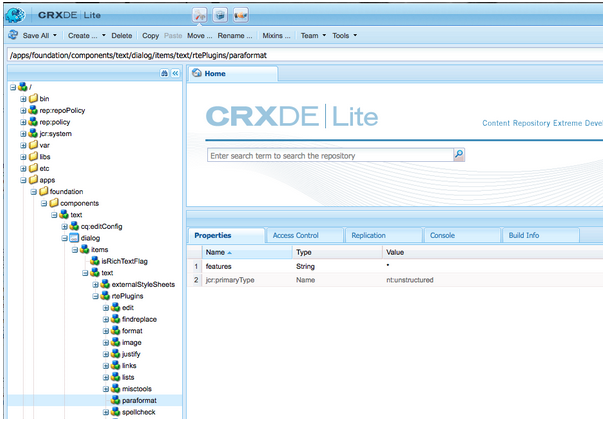

# Configure RTE to create accessible webpages and sites {#configure-rte-for-accessibility}

Adobe Experience Manager supports man standard accessibility features in accordance with various accessibility standards. In addition, developers can customize or extend to provide features that help create accessible content using Experience Manager components that use the Rich Text Editor (RTE).

When designing web pages and adding content to the pages, the content developers and authors can use features of the RTE to provide accessibility-related information. For example, add structural information through headings and paragraph elements.

To configure and customize these features, [configure the RTE plugins](#configure-the-plugin-features) for the component. For example, the `paraformat` plugin lets you add additional block level semantic elements, including extending the number of heading levels supported beyond the basic `H1`, `H2`, and `H3` provided by default.

The RTE is available in a variety of components for Touch-enabled user interface and the Classic user interface. However, the primary component to use the RTE is the **Text** component that is available for both the interfaces. The following images show the RTE with a range of plugins enabled, including `paraformat`:


*Figure: The Text component in the Touch-enabled user interface.*


*Figure: The Text component in the Classic user interface.*

For the differences between the RTE features available in the various interfaces, see [Plugins and their features](/help/sites-administering/rich-text-editor.md#aboutplugins).

## Configure the plugin features {#configure-the-plugin-features}

For the complete instructions to configure the RTE, see [configure the Rich Text Editor](/help/sites-administering/rich-text-editor.md) page. This covers all issues, including the key steps:

* [Plugins and the features](/help/sites-administering/rich-text-editor.md#aboutplugins).
* [Configuration locations](/help/sites-administering/rich-text-editor.md#understand-the-configuration-paths-and-locations).
* [Activate a plugin and configure the features property](/help/sites-administering/rich-text-editor.md#enable-rte-functionalities-by-activating-plug-ins).
* [Configure other functionalities of the RTE](/help/sites-administering/rich-text-editor.md#enable-rte-functionalities-by-activating-plug-ins).

By configuring a plugin within the appropriate `rtePlugins` sub-branch in CRXDE Lite, you can activate either all or specific features for that plugin.



### Example - specify paragraph formats available in RTE selection field {#example-specifying-paragraph-formats-available-in-rte-selection-field}

New semantic block formats may be made available for selection by:

1. Depending on your RTE, determine and navigate to the [configuration location](/help/sites-administering/rich-text-editor.md#understand-the-configuration-paths-and-locations).
1. [Enable the Paragraphs selection field](/help/sites-administering/rich-text-editor.md); by [activating the plugin](/help/sites-administering/rich-text-editor.md#enable-rte-functionalities-by-activating-plug-ins).
1. [Specify the formats you want to have available in the Paragraphs selection field](/help/sites-administering/rich-text-editor.md).
1. The paragraph formats are then available to the content author from the selection fields in the RTE. They can be accessed:

    * Using the paragraph pilcrow icon in the Touch-enabled UI.
    * Using the **Format** field (pop-up selector) in the Classic UI.

With structural elements available in the RTE via the paragraph format options, AEM provides a good basis for the development of accessible content. Content authors cannot use the RTE to format font size or colors or other related attributes, preventing the creation of inline formatting. Instead they must select the appropriate structural elements, such as headings and use global styles chosen from the Styles option. This ensures clean markup, greater options for users who browse with their own style sheets and correctly structured content.

## Use of the source edit feature {#use-of-the-source-edit-feature}

In some cases, content authors will find it necessary to examine and adjust the HTML source code created using the RTE. For example, a piece of content created within the RTE may require additional markup to ensure compliance with WCAG 2.0. This can be done with the [source edit](/help/sites-administering/rich-text-editor.md#aboutplugins) option of the RTE. You can specify the [ `sourceedit` feature on the `misctools` plugin](/help/sites-administering/rich-text-editor.md#aboutplugins).

>[!CAUTION]
>
>Use the `sourceedit` feature carefully. Typing errors and/or unsupported features can introduce more problems.

## Add support for more HTML elements and attributes {#add-support-for-more-html-elements-and-attributes}

To further extend the accessibility features of AEM, it is possible to extend the existing components based on the RTE (such as the **Text** and **Table** components) with additional elements and attributes.

The following procedure illustrates how to extend the **Table** component with a **Caption** element that provides information about a data table to assistive technology users:

### Example - add the caption to the Table Properties dialog {#example-adding-the-caption-to-the-table-properties-dialog}

In the constructor of the `TablePropertiesDialog`, add an additional text input field that is used for editing the caption. Note that `itemId` must be set to `caption` (that is, the DOM attribute’s name) to automatically handle its content.

In **Table**, set explicitly set or remove the attribute to/from the DOM element. The value is passed by the dialog in the `config` object. Note that DOM attributes should be set/removed using the corresponding `CQ.form.rte.Common` methods ( `com` is a shortcut for `CQ.form.rte.Common`) to avoid common pitfalls with browser implementations.

>[!NOTE]
>
>This procedure is only suitable for the Classic user interface.

### Example - create accessible HTML when using emphasis in text {#create-accessible-html-for-text}

RTE can use `strong` and `em` tags in place of `b` and `i`. Add the following node as a sibling to the `uiSettings` and `rtePlugins` nodes in the dialog.

```HTML
<htmlRules jcr:primaryType="nt:unstructured">
    <docType jcr:primaryType="nt:unstructured">
        <typeConfig jcr:primaryType="nt:unstructured"
                useSemanticMarkup="{Boolean}true">
            <semanticMarkupMap
                    b="strong"
                    i="em"/>
        </typeConfig>
    </docType>
</htmlRules>
```

### Step-by-step instructions {#step-by-step-instructions}

1. Start CRXDE Lite. For example: [http://localhost:4502/crx/de/](http://localhost:4502/crx/de/)
1. Copy:

   `/libs/cq/ui/widgets/source/widgets/form/rte/commands/Table.js`

   to:

   `/apps/cq/ui/widgets/source/widgets/form/rte/commands/Table.js`

   >[!NOTE]
   >
   >You may need to create intermediate folders if they do not already exist.

1. Copy:

   `/libs/cq/ui/widgets/source/widgets/form/rte/plugins/TablePropertiesDialog.js`

   to:

   `/apps/cq/ui/widgets/source/widgets/form/rte/plugins/TablePropertiesDialog.js`.

1. Open the following file for editing (open with double-click):

   `/apps/cq/ui/widgets/source/widgets/form/rte/plugins/TablePropertiesDialog.js`

1. In the `constructor` method, before the line reading:

   ```
   var dialogRef = this;
   ```

   Add the following code:

   ```
   editItems.push({
       "itemId": "caption",
       "name": "caption",
       "xtype": "textfield",
       "fieldLabel": CQ.I18n.getMessage("Caption"),
       "value": (this.table && this.table.caption ? this.table.caption.textContent : "")
   });
   ```

1. Open the following file:

   `/apps/cq/ui/widgets/source/widgets/form/rte/commands/Table.js`.

1. Add the following code at the end of the `transferConfigToTable` method:

   ```
   /**
    * Adds Caption Element
   */
   var captionElement;
   if (dom.firstChild && dom.firstChild.tagName.toLowerCase() == "caption")
   {
      captionElement = dom.firstChild;
   }
   if (config.caption)
   {
       var captionTextNode = document.createTextNode(config.caption)
       if (captionElement)
       {
          dom.replaceNode(captionElement.firstChild,captionTextNode);
       } else
       {
           captionElement = document.createElement("caption");
           captionElement.appendChild(captionTextNode);
           if (dom.childNodes.length>0)
           {
              dom.insertBefore(captionElement, dom.firstChild);
           } else
           {
              dom.appendChild(captionElement);
           }
       }
   } else if (captionElement)
   {
     dom.removeChild(captionElement);
   }
   ```

1. Save your changes using **Save All…**

>[!NOTE]
>
>A plain text field is not the only type of input allowed for the value of the caption element. You can use any ExtJS widget, that provides the caption’s value through its `getValue()` method.
>
>To add editing capabilities for further additional elements and attributes, ensure that both:
>
>* The `itemId` property for each corresponding field is set to the name of the appropriate DOM attribute (`TablePropertiesDialog`).
>* The attribute is set and/or removed on the DOM element explicitly (`Table`).

>[!MORELIKETHIS]
>
>* [Quick Guide to WCAG 2.0](/help/managing/qg-wcag.md)
>* [Create accessible content (WCAG 2.0 conformance)](/help/sites-authoring/creating-accessible-content.md)
