# Integrating with Salesforce {#integrating-with-salesforce}

Integrating Salesforce with Adobe Experience Manager (AEM) provides lead management capabilities and uses the existing capabilities provided out of the box by Salesforce. You can configure AEM to post leads to Salesforce and create components that access data directly from Salesforce.

The bidirectional and extensible integration between AEM and Salesforce enables:

* Organizations to fully use and amend data to enhance the customer experience.
* Engagement from marketing to sales activities.
* Organizations to automatically transmit and receive data from a Salesforce datastore.

This document describes the following:

* how to configure Salesforce Cloud Services (configure AEM to integrate with Salesforce).
* how to use Salesforce Lead/Contact information in Client Context and for Personalization.
* how to use the Salesforce workflow model to post AEM users as leads to Salesforce.
* how to create a component that shows data from Salesforce.

## Configuring AEM to integrate with Salesforce {#configuring-aem-to-integrate-with-salesforce}

To configure AEM to integrate with Salesforce, you first configure a remote access application in Salesforce. Then you configure the Salesforce cloud service to point to this remote access application.

>[!NOTE]
>
>You can create a free developer account in Salesforce.

To configure AEM to integrate with Salesforce:

>[!CAUTION]
>
>Install the [Salesforce Force API](https://experience.adobe.com/#/downloads/content/software-distribution/en/aem.html?fulltext=salesforce*&orderby=%40jcr%3Acontent%2Fjcr%3AlastModified&orderby.sort=desc&layout=list&p.offset=0&p.limit=2&package=%2Fcontent%2Fsoftware-distribution%2Fen%2Fdetails.html%2Fcontent%2Fdam%2Faem%2Fpublic%2Fadobe%2Fpackages%2Fcq650%2Ffeaturepack%2Fcom.adobe.cq.mcm.salesforce.content-1.0.4.zip) integration package before you continue with the procedure. For more details on how to work with packages see the [How to Work with Packages](/help/sites-administering/package-manager.md#package-share) page.

1. In AEM, navigate to **Cloud Services**. In Third-Party Services, click **Configure Now** in **Salesforce**.

   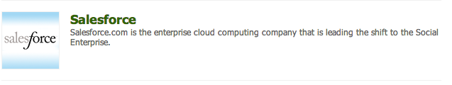

1. Create a configuration, for example, **developer**.

   >[!NOTE]
   >
   >The new configuration redirects to a new page: **http://localhost:4502/etc/cloudservices/salesforce/developer.html**. This is the exact same value that you must specify in the Callback URL while creating the remote access application in Salesforce. These values must match.

1. Log in to your Salesforce account (or if you do not have one, create one at [https://developer.salesforce.com](https://developer.salesforce.com).)
1. In Salesforce, navigate to **Create** &gt; **Apps** to get to **Connected Apps** (in former versions of Salesforce, the workflow was **Deploy** &gt; **Remote Access**).
1. Click **New** so you can connect AEM with Salesforce.

   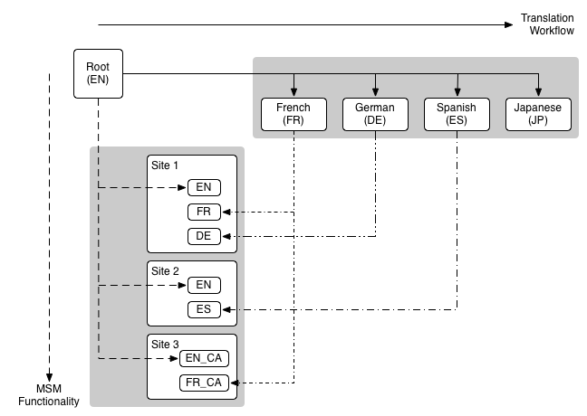

1. Enter the **Connected App Name**, **API Name**, and **Contact Email**. Select the **Enable OAuth Settings** check box and enter the **Callback URL** and add an OAuth scope (for example, full access). The callback URL looks similar to this: `http://localhost:4502/etc/cloudservices/salesforce/developer.html`

   Change the server name/port number and page name to match your configuration.

   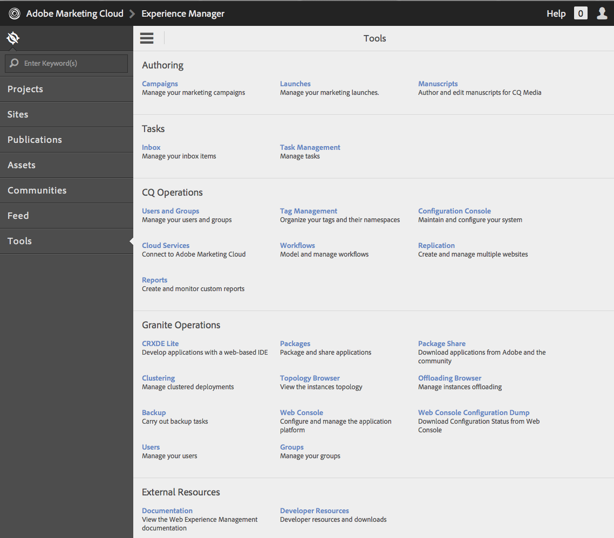

1. Click **Save** to save the Salesforce configuration. Salesforce creates a **consumer key** and **consumer secret**, which you need for AEM configuration.

   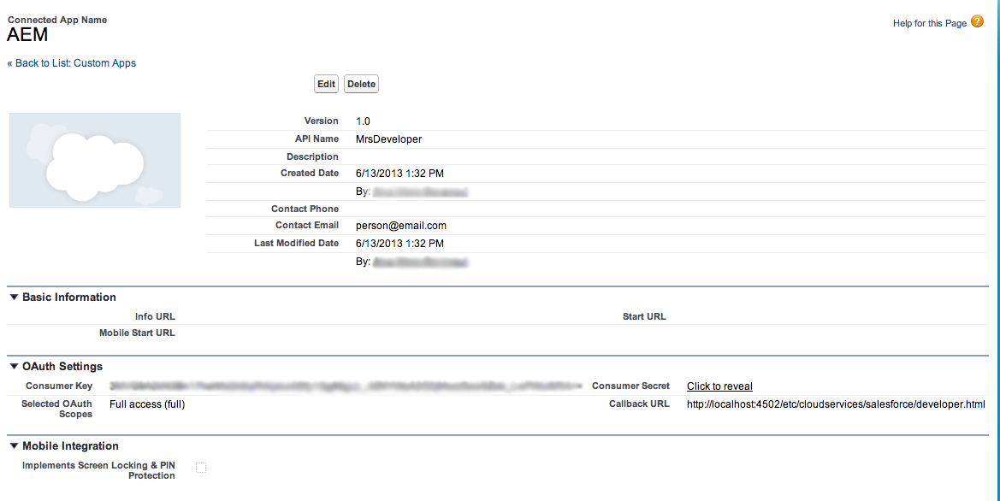

   >[!NOTE]
   >
   >Wait several minutes (up to 15 minutes) for the remote access application in Salesforce to get activated.

1. In AEM, navigate to **Cloud Services** and navigate to the Salesforce configuration you created earlier (for example, **developer**). Click **Edit** and enter the customer key and customer secret from salesforce.com.

   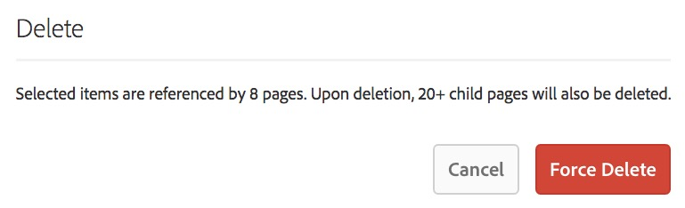

   | Login Url |This is the Salesforce Authorization Endpoint. Its value is pre-filled and serves most cases. |
   |---|---|
   | Customer Key |Enter the value obtained from the Remote Access Application Registration page in salesforce.com |
   | Customer Secret |Enter the value obtained from the Remote Access Application Registration page in salesforce.com |

1. Click **Connect to Salesforce** to connect. Salesforce requests that you allow your configuration to connect to Salesforce.

   

   In AEM, a confirmation dialog opens telling you that you connected successfully.

1. Navigate to the root page of your website and click **Page Properties**. Then select **Cloud Services** and add **Salesforce** and select the correct configuration (for example, **developer**).

   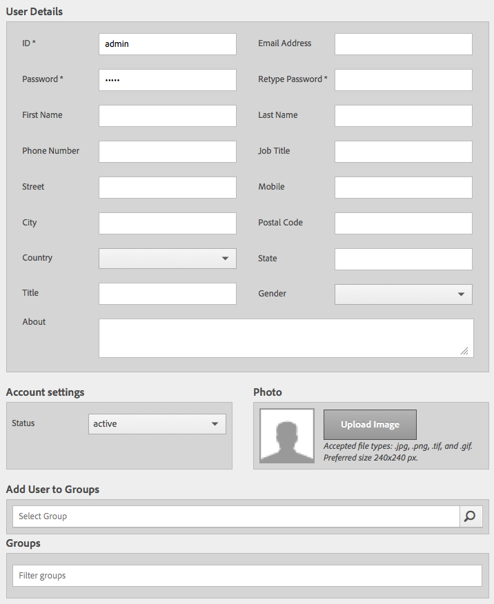

   Now you can use the workflow model to post leads to Salesforce and create components that access data from Salesforce.

## Exporting AEM users as Salesforce Leads {#exporting-aem-users-as-salesforce-leads}

If you want to export an AEM user as a Salesforce lead, configure the workflow to post leads to Salesforce.

To export AEM users as Salesforce leads:

1. Navigate to the Salesforce workflow at `http://localhost:4502/workflow` by right-clicking the workflow **Salesforce.com Export** and clicking **Start**.

   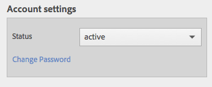

1. Select the AEM user that you want to create as a lead as the **Payload** for this workflow (home > users). Be sure to select the profile node of the user as it contains information like **givenName**, and  **familyName**, which are mapped to Salesforce lead's **FirstName** and **LastName** fields.

   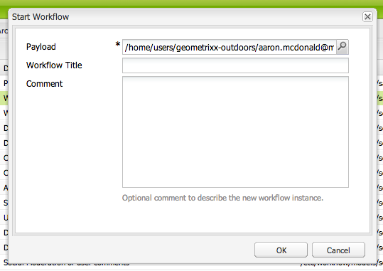

   >[!NOTE]
   >
   >Before starting this workflow, there are certain mandatory fields that a lead node in AEM must have before getting published to Salesforce. These are **givenName**, **familyName**, **company**, and **email**. To see a complete list of mappings between AEM user and Salesforce lead, see [Mapping Configuration between AEM user and Salesforce lead.](#mapping-configuration-between-aem-user-and-salesforce-lead)

1. Click **OK**. The user information is exported to salesforce.com. You can verify it at salesforce.com.

   >[!NOTE]
   >
   >The error logs show you whether a lead is imported. Check the error log for more information.

### Configuring the Salesforce.com Export workflow {#configuring-the-salesforce-com-export-workflow}

If necessary, configure the Salesforce.com Export workflow to match it to the correct Salesforce.com configuration, or to make other changes.

To configure the Salesforce.com export workflow:

1. Navigate to `http://localhost:4502/cf#/etc/workflow/models/salesforce-com-export.html.`

   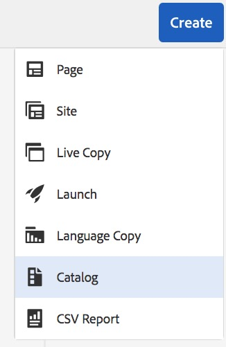

1. Open the Salesforce.com Export step, select the **Arguments** tab, and select the correct configuration is selected and click **OK**. In addition if you want the workflow to re-create a lead that was deleted in Salesforce, select the check box.

   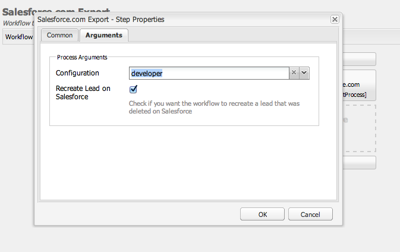

1. Click **Save** to save your changes.

   

### Mapping configuration between AEM user and Salesforce Lead {#mapping-configuration-between-aem-user-and-salesforce-lead}

To view or edit the current mapping configuration between an AEM user and a Salesforce lead, open the Configuration Manager: `https://<hostname>:<port>/system/console/configMgr` and search for **Salesforce Lead Mapping Configuration**.

1. Open the Configuration Manager by clicking **Web Console** or going directly to `https://<hostname>:<port>/system/console/configMgr.`
1. Search for **Salesforce Lead Mapping Configuration**.

   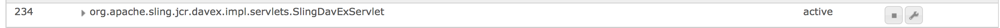

1. Change mappings, as required. The default mapping follows the pattern **aemUserAttribute=sfLeadAttribute**. Click **Save** to save your changes.

## Configuring Salesforce Client Context Store {#configuring-salesforce-client-context-store}

The Salesforce client context store shows additional information about the currently logged in user than what is already available within AEM. It pulls this additional information from Salesforce depending upon the user's connection with Salesforce.

To do this, configure the following:

1. Link an AEM user with a Salesforce ID via the Salesforce Connect component.
1. Add the Salesforce Profile Data into the client context page so you can configure what properties you want to see.
1. (Optional) Build a segment that uses the data from the Salesforce Client Context Store.

### Linking an AEM user with a Salesforce ID {#linking-an-aem-user-with-a-salesforce-id}

Map an AEM user with a Salesforce ID so you can load it in the client context. In a real-world scenario, you would be linking based on known user data with validation. For demonstration purposes, in this procedure, you use the **Salesforce Connect** component.

1. Navigate to a web site in AEM, sign in, and drag and drop the **Salesforce Connect** component from the sidekick.

   >[!NOTE]
   >
   >If the **Salesforce Connect** component is not available, go to the **Design** view and select it to make it available in the **Edit** view.

   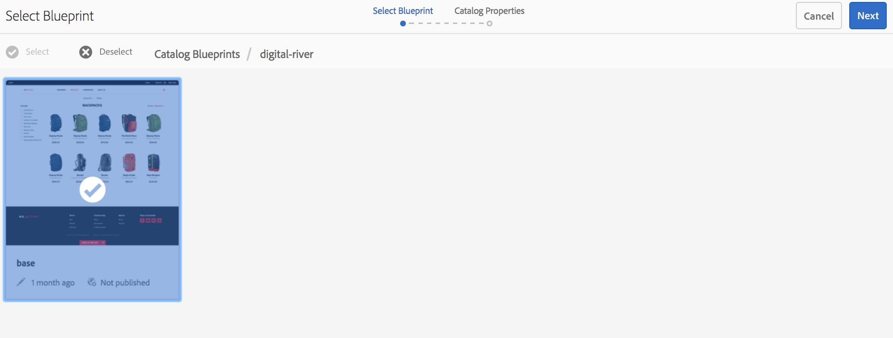

   When you drag the component to the page, it displays **Link to Salesforce=Off**.

   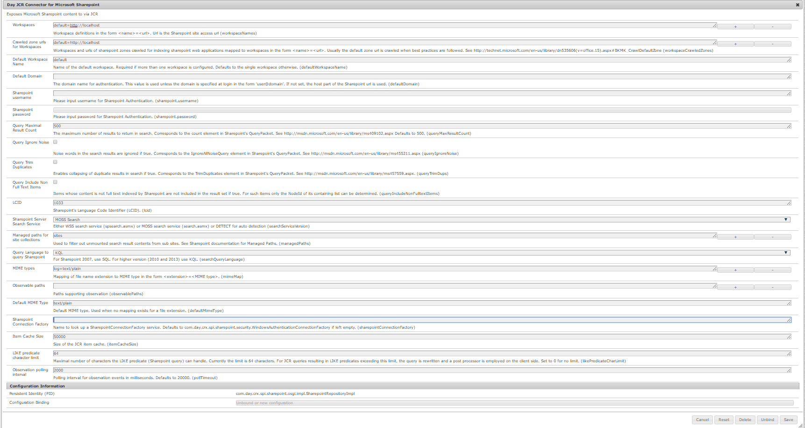

   >[!NOTE]
   >
   >This component is for demonstration purposes only. For real-world scenarios, there would be another process to link/match users with leads.

1. After you drag the component on the page, open it to configure it. Select the configuration, type of contact, and the Salesforce lead or contact, and click **OK**.

   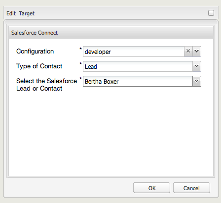

   AEM links the user with the Salesforce contact or lead.

   

### Adding Salesforce Data to Client Context {#adding-salesforce-data-to-client-context}

You can load user data from Salesforce in the Client Context to use for personalization:

1. Open the client context that you want to extend by navigating there, for example, `http://localhost:4502/etc/clientcontext/default/content.html.`

   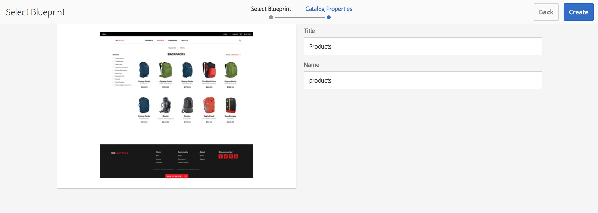

1. Drag the **Salesforce Profile Data** component to the client context.

   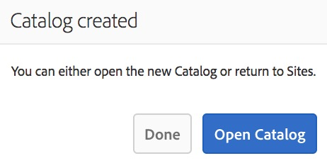

1. Open the component by double-clicking it. Select **Add Item** and select a property from the drop-down list. Add as many properties as you want and select **OK**.

   

1. Now, you see Salesforce-specific properties from Salesforce displayed in the client context.

   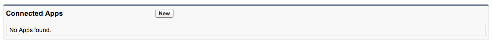

### Building a segment using data from Salesforce Client Context Store {#building-a-segment-using-data-from-salesforce-client-context-store}

You can build a segment that uses data from the Salesforce Client Context Store. To do this:

1. Navigate to segmentation in AEM either by going to **Tools** &gt; **Segmentation** or going to [http://localhost:4502/miscadmin#/etc/segmentation](http://localhost:4502/miscadmin#/etc/segmentation).
1. Create or update a segment to include data from Salesforce. For more information, see [Segmentation](/help/sites-administering/campaign-segmentation.md).

## Searching Leads {#searching-leads}

AEM ships with a sample Search component that searches leads in Salesforce according to the given criteria. This component shows you how to use the Salesforce REST API to search for Salesforce objects. To trigger a call to salesforce.com, link a page with a Salesforce configuration.

>[!NOTE]
>
>This is a sample component that shows you how to use the Salesforce REST API to query Salesforce objects. Use it as an example to create more complex component's based on your needs.

To use this component:

1. Navigate to the page where you want to use this configuration. Open the page properties and select **Cloud Services.** Click **Add Services** and select **Salesforce** and the appropriate configuration and click **OK**.

   

1. Drag the Salesforce search component to the page (provided it has been enabled. To enable it, go to Design mode and add it to the appropriate area).

   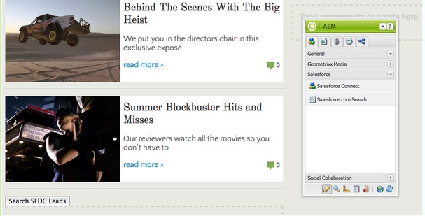

1. Open the Search component and specify the search parameters and click **OK.**

   

1. AEM displays the leads specified in your search component that match the criteria specified.

   
