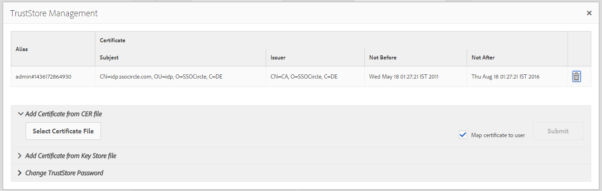
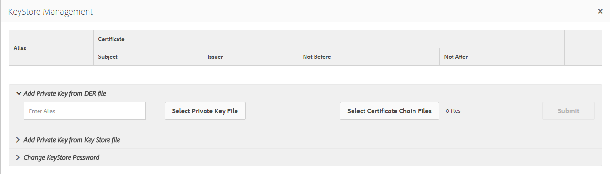

# SAML 2.0 Authentication Handler{#saml-authentication-handler}

AEM ships with a [SAML](https://saml.xml.org/saml-specifications) authentication handler. This handler supports the [SAML](https://saml.xml.org/saml-specifications) 2.0 Authentication Request Protocol (Web-SSO profile) using the `HTTP POST` binding.

It supports:

* signing and encryption of messages
* automatic creation of users
* synching groups to existing ones in AEM
* Service Provider and Identity Provider initiated authentication

This handler stores the encrypted SAML response message in the user-node ( `usernode/samlResponse`) to facilitate communication with a third-party Service Provider.

>[!NOTE]
>
>See [a demonstration of AEM and SAML integration](https://experienceleague.adobe.com/docs/experience-cloud-kcs/kbarticles/KA-17481.html).

## Configuring The SAML 2.0 Authentication Handler {#configuring-the-saml-authentication-handler}

The [Web console](/help/sites-deploying/configuring-osgi.md) provides access to the [SAML](https://saml.xml.org/saml-specifications) 2.0 Authentication Handler configuration called **Adobe Granite SAML 2.0 Authentication Handler**. The following properties can be set.

>[!NOTE]
>
>The SAML 2.0 Authentication Handler is disabled by default. Set at least one of the following properties to enable the handler:
>
>* The Identity Provider POST URL, or IDP URL.
>* The Service Provider Entity ID.
>

>[!NOTE]
>
>SAML assertions are signed and may optionally be encrypted. In order for this to work you have to provide at least the public certificate of the Identity Provider in the TrustStore. See [Adding the IdP certificate to the TrustStore](/help/sites-administering/saml-2-0-authenticationhandler.md#add-the-idp-certificate-to-the-aem-truststore) section for more information.

**Path** Repository path for which this authentication handler should be used by Sling. If this is empty, the authentication handler will be disabled.

**Service Ranking** OSGi Framework Service Ranking value to indicate the order in which to call this service. This is an integer value where higher values designate higher precedence.

**IDP Certificate Alias** The alias of the IdP's certificate in the global truststore. If this property is empty the authentication handler is disabled. See the "Add the IdP Certificate to the AEM TrustStore" chapter below on how to set it up.

**IDP URL** URL of the IDP where the SAML Authentication Request should be sent to. If this property is empty the authentication handler is disabled.

>[!CAUTION]
>
>The Identity Provider hostname must be added to the **Apache Sling Referrer Filter** OSGi configuration. See the [Web console](/help/sites-deploying/configuring-osgi.md) section for more information.

**Service Provider Entity ID** ID which uniquely identifies this service provider with the identity provider. If this property is empty the authentication handler is disabled.

**Default Redirect** The default location to redirect to after successful authentication.

>[!NOTE]
>
>This location is only used if the `request-path` cookie is not set. If you request any page below the configured path without a valid login-token, the requested path is stored in a cookie
>and the browser will be redirected to this location again after successful authentication.

**User-ID Attribute** The name of the attribute containing the user ID used to authenticate and create the user in the CRX repository.

>[!NOTE]
>
>The user ID will not be taken from the `saml:Subject` node of the SAML assertion but from this `saml:Attribute`.

**Use Encryption** Whether or not this authentication handler expects encrypted SAML assertions.

**Autocreate CRX Users** Whether or not to automatically create non-existing users in the repository after successful authentication.

>[!CAUTION]
>
>If the automatic creation of CRX users is disabled, the users will have to be created manually.

**Add to Groups** Whether or not a user should be automatically added to CRX groups after successful authentication.

**Group Membership** The name of the saml:Attribute containing a list of CRX groups this user should be added to.

## Add the IdP Certificate to the AEM TrustStore {#add-the-idp-certificate-to-the-aem-truststore}

SAML assertions are signed and may optionally be encrypted. In order for this to work you have to provide at least the public certificate of the IdP in the repository. To do this you need to:

1. Go to *http:/serveraddress:serverport/libs/granite/security/content/truststore.html*
1. Press the **[!UICONTROL Create TrustStore link]**
1. Enter the password for the TrustStore and press **[!UICONTROL Save]**.
1. Click on **[!UICONTROL Manage TrustStore]**.
1. Upload the IdP certificate.
1. Take note of the certificate Alias. The alias is **[!UICONTROL admin#1436172864930]** in the example below.

   

## Add the Service Provider key and certificate chain to the AEM keystore {#add-the-service-provider-key-and-certificate-chain-to-the-aem-keystore}

>[!NOTE]
>
>The below steps are mandatory, otherwise the following exception will be thrown: `com.adobe.granite.keystore.KeyStoreNotInitialisedException: Uninitialised system trust store`

1. Go to: [http://localhost:4502/libs/granite/security/content/useradmin.html](http://localhost:4502/libs/granite/security/content/useradmin.html)
1. Edit the `authentication-service` user.
1. Create a KeyStore by clicking **Create KeyStore** under **Account Settings**.

>[!NOTE]
>
>The below steps are required only if handler should be able to sign or decrypt messages.

1. Create the certificate/keypair for AEM. The command to generate it via openssl should resemble the example below:

   `openssl req -newkey rsa:2048 -new -x509 -days 3652 -nodes -out certificate.crt -keyout key.pem`

1. Convert the key to PKCS#8 format with DER encoding. This is the format required by the AEM keystore.

   `openssl pkcs8 -topk8 -inform PEM -outform DER -in key.pem -out key.der -nocrypt`

1. Upload the Private key file by clicking **Select Private Key File**.
1. Upload the certificate file by clicking **Select Certificate Chain Files**.
1. Assign an Alias, as shown below:

   

## Configure a Logger for SAML {#configure-a-logger-for-saml}

You can set up a Logger to debug any issues that might arise from misconfiguring SAML. You can do this by:

1. Going to the Web Console, at *http://localhost:4502/system/console/configMgr*
1. Search for and click the entry called **Apache Sling Logging Logger Configuration**
1. Create a logger with the following configuration:

    * **Log Level:** Debug
    * **Log File:** logs/saml.log
    * **Logger:** com.adobe.granite.auth.saml
