# Integrating with Dynamic Media Classic (Scene7){#integrating-with-dynamic-media-classic-scene}

[Adobe Dynamic Media Classic](https://help.adobe.com/en_US/scene7/using/WS26AB0D9A-F51C-464e-88C8-580A5A82F810.html) is a hosted solution for managing, enhancing, publishing, and delivering rich media assets to Web, mobile, email, and Internet-connected displays and print.

To use Dynamic Media Classic, you need to configure the cloud configuration so that Dynamic Media Classic and AEM Assets can interact with one another. This document describes how to configure AEM and Dynamic Media Classic.

For information on using all the Dynamic Media Classic components on a page and working with video, see [Using Dynamic Media Classic](../assets/scene7.md).

>[!NOTE]
>
>* Dynamic Media Classic's DHTML viewer platform officially reached end-of-life on January 31, 2014. For more information see the [DHTML viewer end-of-life FAQ](../sites-administering/dhtml-viewer-endoflifefaqs.md).
>* Before configuring Dynamic Media Classic to work with AEM, see [Best Practices](#best-practices-for-integrating-scene-with-aem) for integrating Dynamic Media Classic with AEM.
>* If you are using Dynamic Media Classic with a custom proxy configuration, you need to configure both HTTP Client proxy configurations as some functionalities of AEM are using the 3.x APIs and some others the 4.x APIs. 3.x is configured with [http://localhost:4502/system/console/configMgr/com.day.commons.httpclient](http://localhost:4502/system/console/configMgr/com.day.commons.httpclient) and 4.x is configured with [http://localhost:4502/system/console/configMgr/org.apache.http.proxyconfigurator](http://localhost:4502/system/console/configMgr/org.apache.http.proxyconfigurator).
>

## AEM/Dynamic Media Classic integration versus Dynamic Media {#aem-scene-integration-versus-dynamic-media}

AEM users have a choice between two solutions to work with dynamic media: Either integrating their instance of AEM with Dynamic Media Classic or using the Dynamic Media solution that is integrated into AEM.

Use the following criteria to determine which solution to choose:

* If you are an **existing** Dynamic Media Classic customer whose rich media assets reside in Dynamic Media Classic for publishing and delivery, but you want to integrate those assets with Sites (WCM) authoring and/or AEM Assets for management, then use the [AEM/Dynamic Media Classic point-to-point integration](#aem-scene-point-to-point-integration) described in this document.

* If you are a **new** AEM customer who has rich media delivery needs, select the [Dynamic Media option](#aem-dynamic-media). This option makes the most sense if you do not have an existing S7 account and many assets stored in that system.

* In certain cases, you may want to use both solutions. The [dual-use scenario](/help/sites-administering/scene7.md#dual-use-scenario) describes that scenario.

### AEM/Dynamic Media Classic point-to-point integration {#aem-scene-point-to-point-integration}

When you work with assets in this solution, you do one of the following:

* Upload assets directly to Dynamic Media Classic and then access by way of the **Dynamic Media Classic** content browser for page authoring or
* Upload to AEM Assets and then enable automatic publishing to Dynamic Media Classic; you access via **Assets** content browser for page authoring

The components you use for this integration are found in the **Dynamic Media Classic** component area in [Design mode.](/help/sites-authoring/author-environment-tools.md#page-modes)  

### AEM Dynamic Media {#aem-dynamic-media}

AEM Dynamic Media is the unification of Dynamic Media Classic features directly within the AEM platform.

When you work with assets in this solution, you follow this workflow:

1. Upload single image and video assets directly to AEM.
1. Encode videos directly within AEM.
1. Build image-based sets directly within AEM.
1. If applicable, add interactivity to images or videos.

The components you use for Dynamic Media are found in the **[!UICONTROL Dynamic Media]** component area in [Design mode](/help/sites-authoring/author-environment-tools.md#page-modes). They include the following:

* **[!UICONTROL Dynamic Media]** - The **[!UICONTROL Dynamic Media]** component is smart - depending on whether you add an image or a video, you have various options. The component supports image presets, image-based viewers such as image sets, spin sets, mixed media sets, and video. In addition, the viewer is responsive - the size of the screen changes automatically based on screen size. All viewers are HTML5 viewers.

* **[!UICONTROL Interactive Media]** - The **[!UICONTROL Interactive Media]** component is for those assets, such as carousel banners, interactive images, and interactive video, that have interactivity on them such hotspots or image maps. This component is smart - depending on whether you add an image or a video, you have various options. In addition, the viewer is responsive - the size of the screen changes automatically based on screen size. All viewers are HTML5 viewers.

### Dual-Use Scenario {#dual-use-scenario}

Out of the box, you can use both Dynamic Media and Dynamic Media Classic integration features of AEM simultaneously. The following use cases table describes when you turn certain areas on and off.

To use Dynamic Media and Dynamic Media Classic simultaneously:

1. Configure [Dynamic Media Classic](#creating-a-cloud-configuration-for-scene) in cloud services.
1. Follow the specific instructions particular to your use case:

    <table> 
    <tbody> 
    <tr> 
    <td> </td> 
    <td> </td> 
    <td><strong>Dynamic Media</strong></td> 
    <td> </td> 
    <td><strong>Dynamic Media Classic Integration</strong></td> 
    <td> </td> 
    </tr> 
    <tr> 
    <td><strong>If you are ...</strong></td> 
    <td><strong>Use Case Workflow</strong></td> 
    <td><strong>Imaging/Video</strong></td> 
    <td><strong>Dynamic Media Component</strong></td> 
    <td><strong>S7 Content Browser and Components</strong></td> 
    <td><strong>Automatic Upload from Assets to S7</strong></td> 
    </tr> 
    <tr> 
    <td>New to Sites and Dynamic Media</td> 
    <td>Upload assets to AEM and use AEM Dynamic Media component to author assets on Sites pages</td> 
    <td>
On
 
(See step 3)
 </td> 
    <td><a href="/help/assets/adding-dynamic-media-assets-to-pages.md">On</a></td> 
    <td>Off</td> 
    <td>Off</td> 
    </tr> 
    <tr> 
    <td>In retail and are new to Sites and Dynamic Media</td> 
    <td>Upload NON-product assets to AEM for management and delivery. Upload PRODUCT assets to Dynamic Media Classic and use Dynamic Media Classic content browser in AEM and component to author Product Detail Pages on Sites.</td> 
    <td>
On
 
(See step 3)
 </td> 
    <td><a href="/help/assets/adding-dynamic-media-assets-to-pages.md">On</a></td> 
    <td><a href="/help/assets/scene7.md#scene-content-browser">On</a></td> 
    <td>Off</td> 
    </tr> 
    <tr> 
    <td>New to Assets and Dynamic Media</td> 
    <td>Upload assets to AEM Assets and use published URL/embed code from Dynamic Media</td> 
    <td>
On
 
(See step 3)
 </td> 
    <td>Off</td> 
    <td>Off</td> 
    <td>Off</td> 
    </tr> 
    <tr> 
    <td>New to Dynamic Media and Templating</td> 
    <td>Use Dynamic Media for imaging and video. Author image templates in Dynamic Media Classic and use Dynamic Media Classic content finder to include templates in Sites pages.</td> 
    <td>
On
 
(See step 3)
 </td> 
    <td><a href="/help/assets/adding-dynamic-media-assets-to-pages.md">On</a></td> 
    <td><a href="/help/assets/scene7.md#scene-content-browser">On</a></td> 
    <td>Off</td> 
    </tr> 
    <tr> 
    <td>An existing Dynamic Media Classic customer and are new to Sites</td> 
    <td>Upload assets to Dynamic Media Classic and use AEM Dynamic Media Classic content browser to search and author assets on Sites pages</td> 
    <td>Off</td> 
    <td>Off</td> 
    <td><a href="/help/assets/scene7.md#scene-content-browser">On</a></td> 
    <td>Off</td> 
    </tr> 
    <tr> 
    <td>An existing Dynamic Media Classic customer and are new to Sites and Assets</td> 
    <td>Upload assets to DAM and automatically publish to Dynamic Media Classic for delivery. Use AEM Dynamic Media Classic content browser to search and author assets on Sites pages.</td> 
    <td>Off</td> 
    <td>Off</td> 
    <td><a href="/help/assets/scene7.md#scene-content-browser">On</a></td> 
    <td>
<a href="#configuringautouploadingfromaemassets">On</a>
 
(See step 4)
 </td> 
    </tr> 
    <tr> 
    <td>Existing Dynamic Media Classic customer and new to Assets</td> 
    <td>
Upload assets to AEM and use Dynamic Media to generate renditions for download/share. Automatically publish AEM assets to Dynamic Media Classic for delivery.
 
<strong>Important:</strong> Incurs duplicate processing and renditions generated in AEM will not be synchronized to Dynamic Media Classic
 </td> 
    <td>
On
 
(See step 3)
 </td> 
    <td>Off</td> 
    <td>Off</td> 
    <td>
<a href="#configuringautouploadingfromaemassets">On</a>
 
(See step 4)
 </td> 
    </tr> 
    </tbody> 
    </table>

1. (Optional; see use case table) - Set up the [Dynamic Media cloud configuration](/help/assets/config-dynamic.md) and [enable the Dynamic Media server](/help/assets/config-dynamic.md).
1. (Optional; see use case table) - If you choose to enable Automatic Upload from Assets to Dynamic Media Classic, then you need to add the following:

    1. Set up automatic upload to Dynamic Media Classic.
    1.  Add the **Dynamic Media Classic upload** step after all the Dynamic Media workflow steps *at the end of* **Dam Update Asset** workflow ( `https://<server>:<host>/cf#/etc/workflow/models/dam/update_asset.html)`
    1.  (Optional) Restrict Dynamic Media Classic asset upload by MIME type in [https://&lt;server&gt;:&lt;port&gt;/system/console/configMgr/com.day.cq.dam.scene7.impl.Scene7AssetMimeTypeServiceImpl](http://localhost:4502/system/console/configMgr/com.day.cq.dam.scene7.impl.Scene7AssetMimeTypeServiceImpl). Asset MIME types not in this list will not be uploaded to Dynamic Media Classic server.
    1.  (Optional) Set up video in Dynamic Media Classic configuration. You can enable video encoding for either or both Dynamic Media and Dynamic Media Classic simultaneously. Dynamic renditions are used for preview and playback locally in AEM instance, whereas Dynamic Media Classic video renditions are generated and stored on Dynamic Media Classic servers. When setting up video encoding services for both Dynamic Media and Dynamic Media Classic, apply a [video processing profile](/help/assets/video-profiles.md) to the Dynamic Media Classic asset folder.
    1. (Optional) [Configure Secure preview in Dynamic Media Classic](/help/sites-administering/scene7.md#configuring-the-state-published-unpublished-of-assets-pushed-to-scene).

#### Limitations {#limitations}

When you have both Dynamic Media Classic and Dynamic Media enabled, there are the following limitations:

* Manually uploading to Dynamic Media Classic by selecting an asset and dragging it to a Dynamic Media Classic component on an AEM page does not work.
* Even though AEM-Dynamic Media Classic synced assets are updated to Dynamic Media Classic automatically when the asset is edited in Assets, a rollback action does not trigger a new upload, hence Dynamic Media Classic would not get the latest version immediately after a rollback. The workaround is to edit again once rollback is complete.
* If you need to use Dynamic Media for one use case and Dynamic Media Classic integration for another use case, so that the Dynamic Media assets do not interact with the Dynamic Media Classic system, then do not to apply the Dynamic Media Classic configuration to the Dynamic Media folder, or the Dynamic Media configuration (processing profile) to a Dynamic Media Classic folder.

## Best practices for integrating Dynamic Media Classic with AEM {#best-practices-for-integrating-scene-with-aem}

When integrating Dynamic Media Classic with AEM, there are some important best practices that need to be observed in the following areas:

* Test-driving your integration
* Uploading assets directly from Dynamic Media Classic recommended for certain scenarios

See [known limitations](#known-limitations-and-design-implications).

### Test-driving your integration {#test-driving-your-integration}

Adobe recommends that you test-drive your integration by having your root folder pointing to a subfolder only rather than an entire company.

>[!CAUTION]
>
>Importing assets from an existing Dynamic Media Classic company account may take a long time to show in AEM. Ensure that you designate a folder in Dynamic Media Classic that does not have too many assets (for example, the root folder will often have too many assets and may crash your system).

### Uploading assets from AEM Assets versus from Dynamic Media Classic {#uploading-assets-from-aem-assets-versus-from-scene}

You can upload assets either by using the Assets (digital asset management) functionality or by accessing Dynamic Media Classic directly in AEM by way of the Dynamic Media Classic content browser. Which one you choose depends on the following factors:

* Dynamic Media Classic asset types that AEM Assets does not yet support have to be added to an AEM website from Dynamic Media Classic directly, by way of the Dynamic Media Classic content browser, for example, image templates.
* For asset types that are supported by both AEM Assets and Dynamic Media Classic, deciding how to upload them depends on the following:

    * Where the assets are today AND
    * How important managing them in a common repository is

If the assets are already in Dynamic Media Classic and managing them in a common repository is not as important, then exporting them to AEM Assets only to sync them back to Dynamic Media Classic for delivery would be an unnecessary roundtrip. Otherwise, keeping assets in a single repository and syncing to Dynamic Media Classic only for delivery may be preferable.

## Configuring Dynamic Media Classic integration {#configuring-scene-integration}

You can configure AEM to upload assets to Dynamic Media Classic. Assets from a CQ target folder can be uploaded (automatically or manually) from AEM to a Dynamic Media Classic company account.

>[!NOTE]
>
>Adobe recommends that you use only the designated target folder for importing Dynamic Media Classic assets. Digital assets that reside outside of the target folder can only be used in Dynamic Media Classic components on pages where the Dynamic Media Classic configuration has been enabled. In addition, they are placed in an ad hoc folder in Dynamic Media Classic. The adhoc folder is not synchronized with AEM (but assets are discoverable in the Dynamic Media Classic content browser).

To configure Dynamic Media Classic to integrate with AEM, you need to complete the following steps:

1. [Define a cloud configuration](#creating-a-cloud-configuration-for-scene) - Defines the mapping between a Dynamic Media Classic folder and an Assets folder. You need to complete this step even if you only want one-way (AEM Assets to Dynamic Media Classic) synchronization.
1. [Enable the **Adobe CQ s7dam Dam Listener**](#enabling-the-adobe-cq-scene-dam-listener) - Done in the [!UICONTROL OSGi] console.
1. If you want AEM assets to automatically upload to Dynamic Media Classic, you need to turn that option on and add Dynamic Media Classic to the DAM update asset workflow. You can also manually upload assets.
1. Adding Dynamic Media Classic components to the sidekick. This allows the users to use Dynamic Media Classic components on their AEM pages.
1. [Map the configuration to the page in AEM](#enabling-scene-for-wcm) - This step is required to view any video presets that you have created in Dynamic Media Classic. It is also required if you need to perform a publish an asset from outside the CQ target folder to Dynamic Media Classic.

This section covers how to perform all of these steps and lists important limitations.

### How synchronization between Dynamic Media Classic and AEM Assets works {#how-synchronization-between-scene-and-aem-assets-works}

When setting up AEM Assets and Dynamic Media Classic synchronization, it is important to understand the following:

#### Uploading to Dynamic Media Classic from AEM Assets {#uploading-to-scene-from-aem-assets}

* There is a designated synchronization folder in AEM for Dynamic Media Classic uploads. 
* Uploads to Dynamic Media Classic can be automated if the digital assets are placed in the designated synchronization folder.
* The folder and subfolder structure in AEM is replicated in Dynamic Media Classic.

>[!NOTE]
>
>AEM embeds all the metadata as XMP before uploading it to Dynamic Media Classic, so all properties on the metadata node are available in Dynamic Media Classic as XMP.

#### Known limitations and design implications {#known-limitations-and-design-implications}

With the synchronization between AEM Assets and Dynamic Media Classic, there are currently the following limitations/design implications:

<table> 
 <tbody> 
  <tr> 
   <td><strong>Limitation/design implication</strong></td> 
   <td><strong>Description</strong></td> 
  </tr> 
  <tr> 
   <td>One designated synchronization (target) folder</td> 
   <td>You can only have one designated folder per company in AEM for Dynamic Media Classic uploads. You can create multiple configurations if you need to have access to more than one company account in Dynamic Media Classic.</td> 
  </tr> 
  <tr> 
   <td>Folder structure</td> 
   <td>If you delete a synced folder with assets, all Dynamic Media Classic remote assets are deleted but the folder remains.</td> 
  </tr> 
  <tr> 
   <td>Ad-hoc folder</td> 
   <td>Assets that reside outside the target folder that are manually uploaded to Dynamic Media Classic in WCM are automatically placed in a separate ad-hoc folder on Dynamic Media Classic. You configure this in the cloud configuration in AEM.</td> 
  </tr> 
  <tr> 
   <td>Mixed media</td> 
   <td>Mixed media sets appear in AEM although they are not supported in AEM.</td> 
  </tr> 
  <tr> 
   <td>PDFs</td> 
   <td>Generated PDFs from eCatalogs in Dynamic Media Classic get imported into the CQ target folder.</td> 
  </tr> 
  <tr> 
   <td>UI refreshing</td> 
   <td>When synchronizing between AEM and Dynamic Media Classic, be sure to refresh the user interface to view changes. </td> 
  </tr> 
  <tr> 
   <td>Video thumbnails</td> 
   <td>If uploading a video to AEM Assets for encoding via Dynamic Media Classic, the video thumbnails and encoded videos may take some time to be available in AEM Assets, depending on video processing time.</td> 
  </tr> 
  <tr> 
   <td>Target subfolders</td> 
   <td>
If you are using subfolders within the target folder, ensure that you either use unique names for each asset (regardless of location) or you configure Dynamic Media Classic (in the Setup area) to not overwrite assets regardless of location.
 
Otherwise, assets with the same name that are uploaded to a Dynamic Media Classic target subfolder are uploaded, but the same-named asset in the target folder is deleted. 
 </td> 
  </tr> 
 </tbody> 
</table>

### Configuring Dynamic Media Classic servers {#configuring-scene-servers}

If you run AEM behind a proxy or have special firewall settings, you may need to explicitly enable the hosts of the different regions. Servers are managed in content in `/etc/cloudservices/scene7/endpoints` and can be customized as required. Tap a URL and then edit to change the URL, if necessary. In previous versions of AEM, these values were hard-coded.

If you navigate to `/etc/cloudservices/scene7/endpoints.html`, you see the servers listed (and can edit them by clicking on the URL):

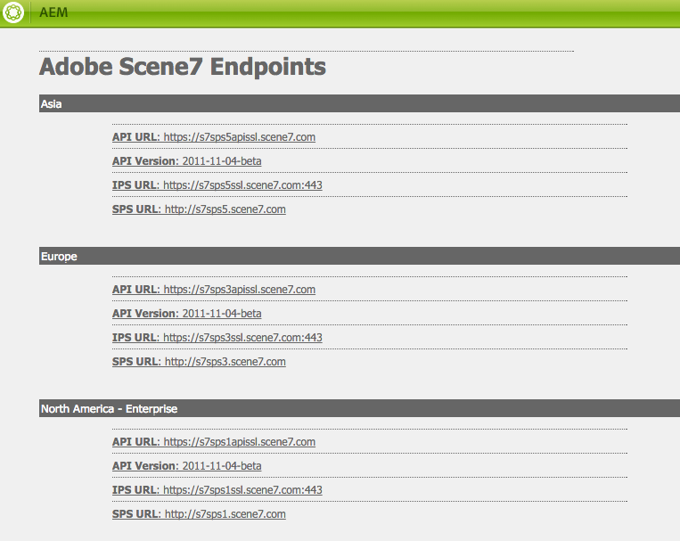 

### Creating a cloud configuration for Dynamic Media Classic {#creating-a-cloud-configuration-for-scene}

A cloud configuration defines the mapping between a Dynamic Media Classic folder and an AEM Assets folder. It needs to be configured to synchronize AEM Assets with Dynamic Media Classic. See How Synchronization Works for more information.

>[!CAUTION]
>
>Importing assets from an existing Dynamic Media Classic company account may take a long time to show in AEM. Ensure that you designate a folder in Dynamic Media Classic that does not have too many assets (for example, the root folder will often have too many assets).
>
>If you would like to test drive the integration, you may want to have the root folder point to a subfolder only, instead of the entire company.

>[!NOTE]
>
>You can have multiple configurations: one cloud configuration represents one user at a Dynamic Media Classic company. If you want to access other Dynamic Media Classic companies or users, you need to create multiple configurations.

To configure AEM to be able to publish assets to Dynamic Media Classic:

1. Tap the AEM icon and navigate to **[!UICONTROL Deployment > Cloud Services]** to access Adobe Dynamic Media Classic.  

1. Tap **[!UICONTROL Configure now]**.

   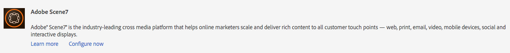

1. In the **[!UICONTROL Title]** field, and optionally in the **[!UICONTROL Name]** field, enter the appropriate information. Tap **[!UICONTROL Create]**.

   >[!NOTE]
   >
   >When creating additional configurations, the **[!UICONTROL parent configuration]** field displays. 
   >
   >Do **not** change the parent configuration. Changing the parent configuration can break the integration.

1. Enter the email address, password, and region of your Dynamic Media Classic account and tap **[!UICONTROL Connect to Dynamic Media Classic]**. You are connected to the Dynamic Media Classic server and the dialog expands with more options.  

1. Enter the **[!UICONTROL Company]** name and **[!UICONTROL Root Path]** (this is the published server name together with any path you want to specify; if you do not know the published server name, in Dynamic Media Classic, go to **[!UICONTROL Setup > Application Setup]**.)

   >[!NOTE]
   >
   >The Dynamic Media Classic root path is the Dynamic Media Classic folder AEM connects to. It can be narrowed down to a specific folder.

   >[!CAUTION]
   >
   >Depending on the size of the Dynamic Media Classic folder, importing a root folder can take a long time. In addition, Dynamic Media Classic data could exceed the AEM storage. Ensure you are importing the correct folder. Importing too much data can stop your system.

   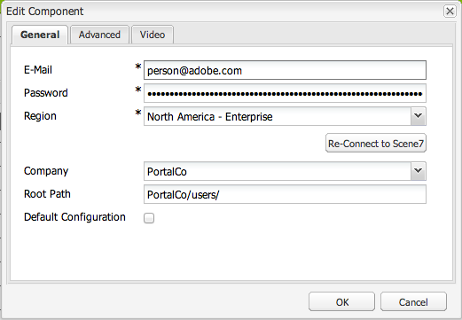

1. Click **[!UICONTROL OK]**. AEM saves your configuration.

>[!NOTE]
>
>If you are reconnecting:
>
>* When reconnecting to Dynamic Media Classic on publish, you may need to reset the password on publish or reconnecting will not work. This is not an issue on the author instance.
>* If you modify values such as your region, company name, you must reconnect to Dynamic Media Classic. If configuration options have been modified but not saved, AEM erroneously still indicates that the configuration is valid. Be sure to reconnect.
>

### Enabling the Adobe CQ Dynamic Media Classic Dam Listener {#enabling-the-adobe-cq-scene-dam-listener}

You must enable the Adobe CQ Dynamic Media Classic Dam Listener, which is disabled by default.

To enable it:

1. Tap the [!UICONTROL Tools] icon, then navigate to **[!UICONTROL Operations > Web Console]**. The Web console opens.
1. Navigate to **[!UICONTROL Adobe CQ Dynamic Media Classic Dam Listener]** and select the **[!UICONTROL Enabled]** check box. 

   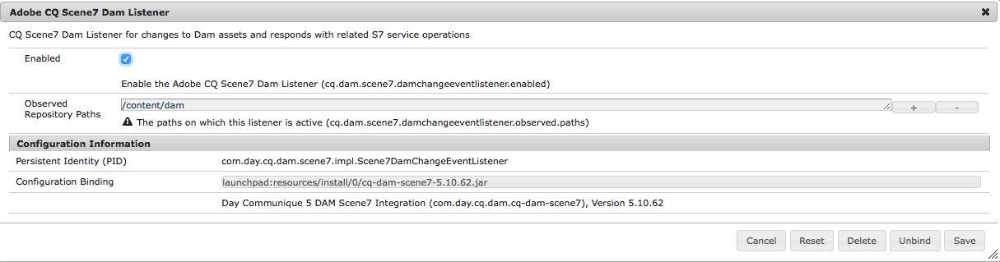

1. Tap  **[!UICONTROL Save]**.

### Adding configurable timeout to Dynamic Media Classic Upload workflow {#adding-configurable-timeout-to-scene-upload-workflow}

When an AEM instance is configured to handle video encoding through Dynamic Media Classic (Scene7), by default, there is a 35-minute timeout on any upload job. To accommodate potentailly longer-running video encoding jobs, you can configure this setting:

1. Navigate to **http://localhost:4502/system/console/configMgr/com.day.cq.dam.scene7.impl.Scene7UploadServiceImpl**.

   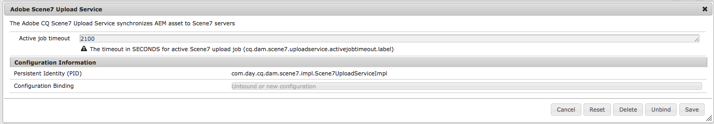

1. Change the number as desired in the **[!UICONTROL Active job timeout]** field. Any non-negative number is accepted with the unit of measure in seconds. By default, this is set to 2100.

   >[!NOTE]
   >
   >Best practice: Most assets are ingested within minutes at most (for example, images). But in certain instances - larger videos for example - the timeout value should be increased to 7200 seconds (2 hours) to accommodate long processing time. Otherwise, this Dynamic Media Classic upload job is marked as **[!UICONTROL UploadFailed]** in the JCR metadata.

1. Tap **[!UICONTROL Save]**.

### Autouploading from AEM Assets {#autouploading-from-aem-assets}

Beginning with AEM 6.3.2, AEM Assets is now configured for you so that any digital assets that you upload to the digital asset manager are automatically updated to Dynamic Media Classic if the assets are in a CQ target folder.

When an asset is added into AEM Assets, it is automatically uploaded and published to Dynamic Media Classic.

>[!NOTE]
>
>The maximum file size for automatic uploading from AEM Assets to Dynamic Media Classic is 500 MB.

To configure autouploading from AEM Assets:

1. Tap the AEM icon and navigate to **[!UICONTROL Deployment > Cloud Services]** then, under the Dynamic Media heading, under Available Configurations, tap **[!UICONTROL dms7 (Dynamic Media]**)
1. Tap the **[!UICONTROL Advanced]** tab, select the **[!UICONTROL Enable Automatic Upload]** check box, then tap **[!UICONTROL OK]**. You now need to configure the DAM Asset workflow to include uploading to Dynamic Media Classic.

   >[!NOTE]
   >
   >See [Configuring the state (published/unpublished) of assets pushed to Dynamic Media Classic](#configuring-the-state-published-unpublished-of-assets-pushed-to-scene) for information on pushing assets to Dynamic Media Classic in an unpublished state.

   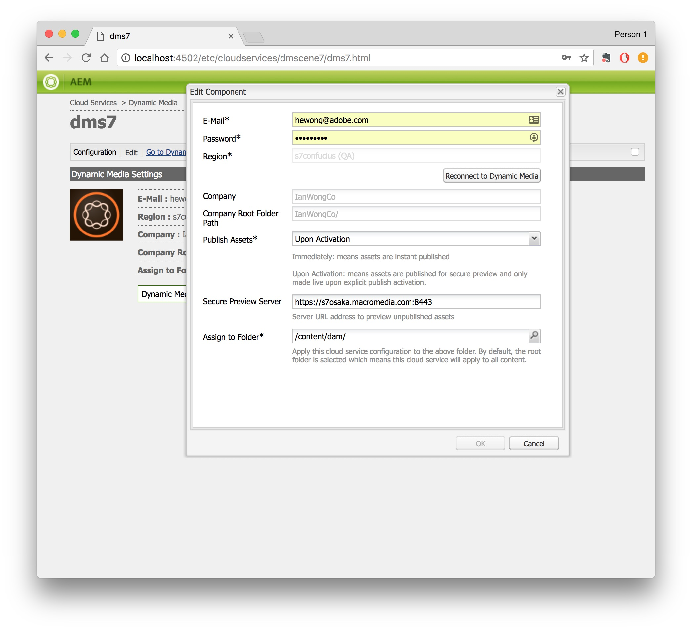

1. Navigate back to the AEM welcome page and tap **[!UICONTROL Workflows]**. Double-click the **DAM Update Asset** workflow to open it.
1. In the sidekick, navigate to the **[!UICONTROL Workflow]** components, and select **[!UICONTROL Dynamic Media Classic]**. Drag **[!UICONTROL Dynamic Media Classic]** to the workflow and tap **[!UICONTROL Save]**. Assets added to AEM Assets in the target folder will automatically be uploaded to Dynamic Media Classic.

   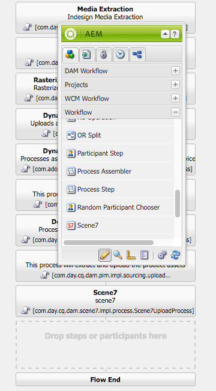

   >[!NOTE]
   >
   >* When adding assets after automating, if they are not placed in the CQ target folder, they are not uploaded to Dynamic Media Classic.
   >* AEM embeds all the metadata as XMP before uploading it to Dynamic Media Classic, so all properties on the metadata node are available in Dynamic Media Classic as XMP.

### Configuring the state (published/unpublished) of assets pushed to Dynamic Media Classic {#configuring-the-state-published-unpublished-of-assets-pushed-to-scene}

If you are pushing assets from AEM Assets to Dynamic Media Classic, you can either publish them automatically (default behavior) or push them to Dynamic Media Classic in an unpublished state.

You may not want to publish assets immediately on Dynamic Media Classic if you want to test them in a staging environment before going live. You can use AEM with Dynamic Media Classic's Secure Test environment to push assets directly from Assets into Dynamic Media Classic in an unpublished state.

Dynamic Media Classic assets remain available via secure preview. Only when assets are published within AEM do the Dynamic Media Classic assets also go live in production.

If you want to publish assets immediately when pushing them to Dynamic Media Classic, you do not need to configure any options. This is the default behavior.

However, if you do not want assets pushed to Dynamic Media Classic to publish automatically, this section describes how to configure AEM and Dynamic Media Classic to do this.

#### Prerequisites to push assets to Dynamic Media Classic unpublished {#prerequisites-to-push-assets-to-scene-unpublished}

Before you can push assets to Dynamic Media Classic without publishing them, you must set up the following:

1. Contact Dynamic Media Classic Customer Care (s7support@adobe.com) to enable secure preview for your Dynamic Media Classic account. 
1. Follow directions to [setup secure preview for your Dynamic Media Classic account.](https://help.adobe.com/en_US/scene7/using/WSd968ca97bf00cf72-5eeee3a113268dc80f5-8000.html)

These are the same steps you would follow to create any secure test setup in Dynamic Media Classic.

>[!NOTE]
>
>If your installation environment is a Unix 64-bit operating system, see [https://helpx.adobe.com/experience-manager/kb/enable-xmp-write-back-64-bit-redhat.html](https://helpx.adobe.com/experience-manager/kb/enable-xmp-write-back-64-bit-redhat.html) regarding additional configuration options you need to set.

#### Known Limitations for pushing assets in unpublished state  {#known-limitations-for-pushing-assets-in-unpublished-state}

If you use this feature, please note the following limitations:

* There is no support for version control.
* If an asset is already published in AEM and a subsequent version is created, that new version will be immediately published live to production. Publish upon activation only works with the initial publish of an asset.

>[!NOTE]
>
>If you want to publish assets instantly, best practice is to keep **[!UICONTROL Enable Secure Preview]** set to **[!UICONTROL Immediately]** and use the **[!UICONTROL Enable Automatic Upload]** feature.

### Setting the state of assets pushed to Dynamic Media Classic as unpublished {#setting-the-state-of-assets-pushed-to-scene-as-unpublished}

>[!NOTE]
>
>If a user publishes the asset in AEM, it automatically triggers the S7 asset to the production/live asset (the asset will no longer be in secure preview/unpublished).

To set the state of assets pushed to Dynamic Media Classic as unpublished:

1. Tap the AEM icon and navigate to **[!UICONTROL Deployment > Cloud Services]**, tap **[!UICONTROL Dynamic Media Classic]**, and select your configuration in Dynamic Media Classic.
1. Tap the **[!UICONTROL Advanced]** tab. In the **[!UICONTROL Enable Secure View]** drop-down menu, select **[!UICONTROL Upon AEM Publish Activation]** to push assets to Dynamic Media Classic without publishing. (By default, this value is set to **[!UICONTROL Immediately]**, where Dynamic Media Classic assets are published immediately.)

   See [Dynamic Media Classic documentation](https://help.adobe.com/en_US/scene7/using/WSd968ca97bf00cf72-5eeee3a113268dc80f5-8000.html) for more information on testing assets before making them public.

   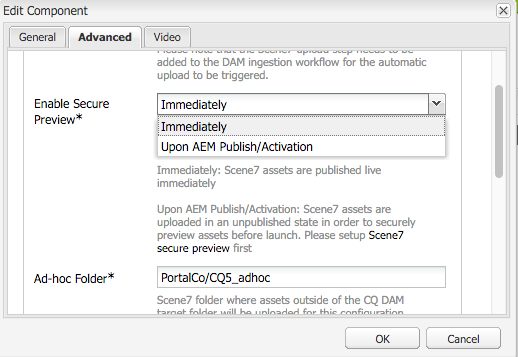

1. Tap **[!UICONTROL OK]**.

Enabling Secure View means that your assets are pushed to the secure preview server unpublished.

You can check this by navigating to a Dynamic Media Classic component on a page in AEM and tapping **[!UICONTROL Edit]**. The asset will have the secure preview server listed in the URL. After publishing in AEM, the server domain in the file reference gets updated from the preview URL to the production URL.

### Enabling Dynamic Media Classic for WCM {#enabling-scene-for-wcm}

Enabling Dynamic Media Classic for WCM is required for two reasons:

* To enable the drop-down list of universal video profiles for page authoring. Without this, the **[!UICONTROL Universal Video Preset]** drop-down is empty and cannot be set.
* If a digital asset is not in the target folder, you can upload the asset to Dynamic Media Classic if you enable Dynamic Media Classic for that page in the page properties and drag and drop the asset on a Dynamic Media Classic component. Normal inheritance rules apply (meaning that child pages will inherit the configuration from the parent page).

When enabling Dynamic Media Classic for the WCM, note that as with other configurations, inheritance rules apply. You can enable Dynamic Media Classic for WCM in either the touch-optimized or classic user interface.

#### Enabling Dynamic Media Classic for WCM in the Touch-Optimized User Interface {#enabling-scene-for-wcm-in-the-touch-optimized-user-interface}

To enable Dynamic Media Classic for WCM in the touch-optimized UI:

1. Tap the AEM icon and navigate to **[!UICONTROL Sites]** and then the root page of your web site (not language specific).  

1. In the toolbar, select the [!UICONTROL settings] icon and tap **[!UICONTROL Open Properties]**.   

1. Tap **[!UICONTROL Cloud Services]** and tap **[!UICONTROL Add Configuration]** and select **[!UICONTROL Dynamic Media Classic]**.
1. In the **[!UICONTROL Adobe Dynamic Media Classic]** drop-down list, select the desired configuration and tap **[!UICONTROL OK]**.

   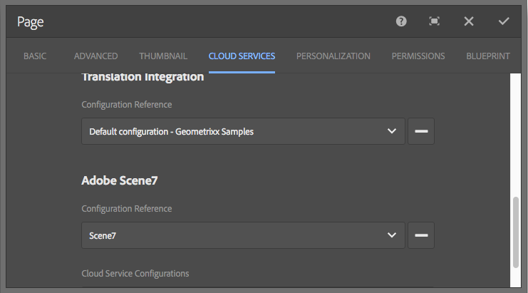

   Video presets from that configuration of Dynamic Media Classic are available for use in AEM with the Dynamic Media Classic video component on that page and child pages.

#### Enabling Dynamic Media Classic for WCM in the Classic User Interface {#enabling-scene-for-wcm-in-the-classic-user-interface}

To enable Dynamic Media Classic for WCM in the classic UI:

1. In AEM, tap **[!UICONTROL Websites]** and navigate to the root page of your web site (not language specific).  

1. In the sidekick, tap the **[!UICONTROL Page]** icon and tap **[!UICONTROL Page Properties]**.  

1. Tap **[!UICONTROL Cloud Services > Add services > Dynamic Media Classic]**.
1. In the **[!UICONTROL Adobe Dynamic Media Classic]** drop-down list, select the desired configuration and tap **[!UICONTROL OK]**.

   Video presets from that configuration of Dynamic Media Classic are available for use in AEM with the Dynamic Media Classic video component on that page and child pages.

### Configuring a default configuration {#configuring-a-default-configuration}

If you have multiple Dynamic Media Classic configurations, you can specify one of them as the default for the Dynamic Media Classic content browser.

Only one Dynamic Media Classic configuration can be marked as default at a given moment. The default configuration is the company assets that display by default in the Dynamic Media Classic Content Browser.

To configure the default configuration:

1. Tap the AEM icon and navigate to **[!UICONTROL Deployment > Cloud Services]**, tap **[!UICONTROL Dynamic Media Classic]**, and select your configuration in Dynamic Media Classic.
1. Tap **[!UICONTROL Edit]** to open the configuration.  

1. In the **[!UICONTROL General]** tab, select the **[!UICONTROL Default Configuration]** check box to make this the default company and root path that appears in the Dynamic Media Classic content browser.

   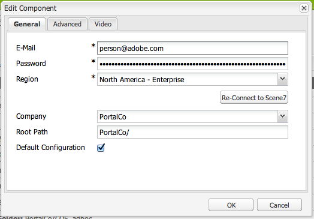

   >[!NOTE]
   >
   >If there is only one configuration, selecting the **[!UICONTROL Default Configuration]** check box has no effect.

### Configuring the Ad-hoc folder {#configuring-the-ad-hoc-folder}

You can configure the folder that assets are uploaded to in Dynamic Media Classic when the asset is not located in the CQ target folder. See Publishing assets from outside the CQ target folder.

To configure the adhoc folder:

1. Tap the AEM icon and navigate to **[!UICONTROL Deployment > Cloud Services]**, tap **[!UICONTROL Dynamic Media Classic]**, and select your configuration in Dynamic Media Classic.
1. Tap **[!UICONTROL Edit]** to open the configuration.  

1. Tap the **[!UICONTROL Advanced]** tab. In the **[!UICONTROL Ad-hoc Folder]** field, you can modify the **Ad-hoc** folder. By default, it is the **name_of_the_company/CQ5_adhoc**.

   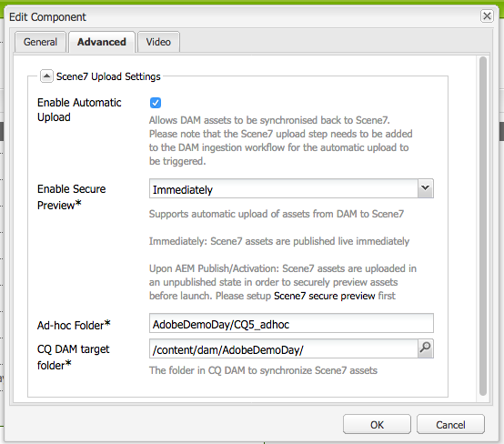

### Configuring universal presets {#configuring-universal-presets}

To configure Universal Presets for the video component, see [Video](/help/assets/s7-video.md).

## Enabling MIME type-based Assets/Dynamic Media Classic upload job parameter support {#enabling-mime-type-based-assets-scene-upload-job-parameter-support}

You can enable configurable Dynamic Media Classic upload jobs parameters that are triggered by the synchronization of Digital Asset Manager/Dynamic Media Classic assets.

Specifically, you configure the accepted file format by MIME type in the OSGi (Open Service Gateway initiative) area of the AEM Web Console Configuration panel. Then, you can customize the individual upload job parameters that are used for each MIME type in the JCR (Java Content Repository).

**To enable MIME type-based assets:**

1. Tap the AEM icon and navigate to **[!UICONTROL Tools > Operations > Web Console]**.
1. In the Adobe Experience Manager Web Console Configuration panel, on the **[!UICONTROL OSGi]** menu, tap **[!UICONTROL Configuration]**.
1. Under the Name column, find and tap **[!UICONTROL Adobe CQ Dynamic Media Classic Asset MIME type Service]** to edit the configuration.
1. In the Mime Type Mapping area, tap any plus sign (+) to add a MIME type.

   See [Supported MIME types](/help/assets/assets-formats.md#supported-mime-types).

1. In the text field, type the new MIME type name.

   For example, you would type a `<file_extension>=<mime_type>` as in `EPS=application/postscript` OR `PSD=image/vnd.adobe.photoshop`.

1. In the lower-right corner of the configuration window, tap **[!UICONTROL Save]**.
1. Return to AEM and in the left rail, tap CRXDE Lite.
1. On the CRXDE Lite page, in the left rail, navigate to `/etc/cloudservices/scene7/<environment>` (substitute `<environment>` for the actual name).
1. Expand `<environment>` (substitute `<environment>` for the actual name) to reveal the `mimeTypes` node.
1. Tap the mimeType that you just added.

   For example, `mimeTypes > application_postscript` OR `mimeTypes > image_vnd.adobe.photoshop`.

1. On the right side of the CRXDE Lite page, tap the **[!UICONTROL Properties]** tab.
1. Specify a Dynamic Media Classic upload job parameter in the **[!UICONTROL jobParam]** value field.

   For example, `psprocess="rasterize"&psresolution=120` .

   See the [Adobe Dynamic Media Classic Image Production System API](https://marketing.adobe.com/resources/help/en_US/s7/ips_api/) for additional upload job parameters you can use.

   >[!NOTE]
   >
   >If you are uploading PSD files, process them as templates with layer extractions. To do so, enter the following in the **[!UICONTROL jobParam]** value field: 
   >
   >`process=MaintainLayers&createTemplate=true`
   >
   >Be sure that your PSD file has “layers”. If it is strictly one image or an image with mask, it will only be processed as an image because there are no layers to process.

1. In the upper-left corner of the CRXDE Lite page, tap **[!UICONTROL Save All]**.

## Troubleshooting Dynamic Media Classic and AEM integration {#troubleshooting-scene-and-aem-integration}

If you are having trouble integrating AEM with Dynamic Media Classic, see the following scenarios for solutions.

**If your digital asset publishing to Dynamic Media Classic fails:**

* Check that the the asset you are trying to upload is in the **[!UICONTROL CQ target]** folder (you specify this folder in the Dynamic Media Classic cloud configuration). 
* If it is not, you need to configure the cloud configuration in **[!UICONTROL Page Properties]** for that page to allow uploading to the **[!UICONTROL CQ adhoc]** folder.

* Check the logs for any information.

**If your video presets do not appear:**

* Ensure that you have configured the cloud configuration of that page through **[!UICONTROL Page Properties]**. Video presets are avaialble in the Dynamic Media Classic video component.

**If your video assets do not play in AEM:**

* Ensure that you used the correct video component. Dynamic Media Classic video component is different than the foundation Video component. See [Foundation Video Component versus Dynamic Media Classic Video Component](/help/assets/s7-video.md).

**If new or modified assets in AEM do not automatically upload to Dynamic Media Classic:**

* Ensure that the assets are in the CQ target folder. Only assets that are in the CQ target folder are automatically updated (provided you configured AEM Assets to automatically upload assets).
* Ensure that you have configured the Cloud Services configuration to Enable Automatic Uploading and that you have updated and saved the DAM Asset workflow to include Dynamic Media Classic uploading.
* When uploading an image into a subfolder of the Dynamic Media Classic target folder, ensure you do one of the following:

    * Make sure that the names of all assets regardless of location are unique. Otherwise the asset in the main target folder is deleted and only the asset in the subfolder remains.
    * Change how Dynamic Media Classic overwrites assets in the Setup area of the Dynamic Media Classic account. Do not set Dynamic Media Classic to overwrite assets regardless of location if you use assets with the same name in subfolders.

**If your deleted assets or folders are not synchronized between Dynamic Media Classic and AEM:**

* Assets and folders deleted in AEM Assets still show up in the synchronized folder in Dynamic Media Classic. You must delete them manually.

**If video upload fails**

* If your video upload fails and you are using AEM to encode video through the Dynamic Media Classic integration, see [Adding configurable timeout to Dynamic Media Classic Upload workflow](#adding-configurable-timeout-to-scene-upload-workflow).

>[!CAUTION]
>
>Importing assets from an existing Dynamic Media Classic company account may take a long time to show in AEM. Ensure that you designate a folder in Dynamic Media Classic that does not have too many assets (for example, the root folder will often have too many assets).
>
>If you would like to test drive the integration, you may want to have the root folder point to a subfolder only, instead of the entire company.

