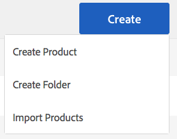
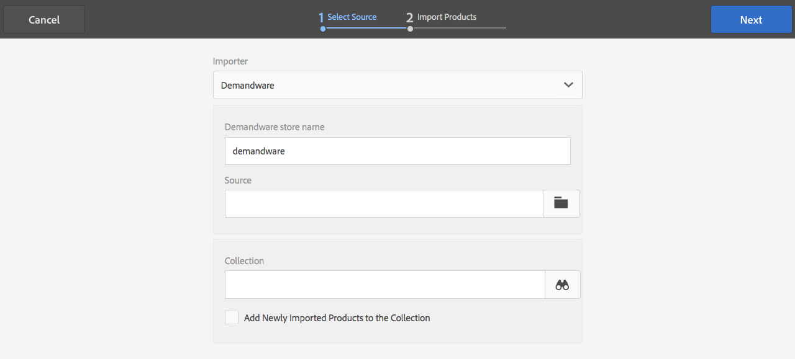
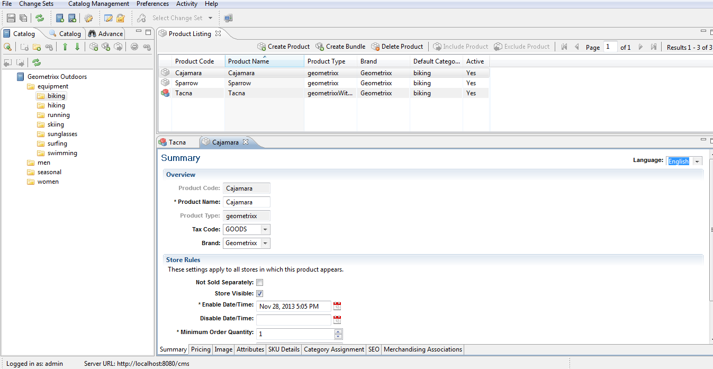

# Integrate with Adobe Search&Promote{#integrating-with-adobe-search-promote}

To call the Adobe Search&Promote service from your website, perform the following tasks:

1. Specify the URL of the Cloud.
1. Configure the connection to the Search&Promote service.
1. Add Search&Promote components to Sidekick.
1. Use the components to author the content. (See [Add Search&Promote features to a web page](/help/sites-authoring/search-and-promote.md).)
1. Add banners to your pages. Banner images are sensitive to Search&Promote data.
1. Generate a site map for the Search&Promote service to consume.

>[!NOTE]
>
>If you are using Search&Promote with a custom proxy configuration, you must configure both HTTP Client proxy configurations as some functionalities of Adobe Experience Manager are using the 3.x APIs and some others the 4.x APIs:
>
>* 3.x is configured with [https://localhost:4502/system/console/configMgr/com.day.commons.httpclient](https://localhost:4502/system/console/configMgr/com.day.commons.httpclient)
>* 4.x is configured with [https://localhost:4502/system/console/configMgr/org.apache.http.proxyconfigurator](https://localhost:4502/system/console/configMgr/org.apache.http.proxyconfigurator)
>

## Change the Search&Promote service URL {#changing-the-search-promote-service-url}

The default URL that is configured for the Search&Promote service is `https://searchandpromote.omniture.com/px/`. To use a different service, use the OSGi console to specify a different URL.

1. Open the OSGi console and select the **[!UICONTROL Configuration]** tab. ([https://localhost:4502/system/console/configMgr](https://localhost:4502/system/console/configMgr))
1. Select the Day CQ Search&Promote Configuration item.
1. Enter the URL in the Remote Server URI box, and select **[!UICONTROL Save]**.

## Configure the connection to Search&Promote {#configuring-the-connection-to-search-promote}

Configure one or more connections to Search&Promote so that your web pages can interact with the service. To connect, you need the member identification and account number of your Search&Promote account.

1. In Experience Manager, navigate to **[!UICONTROL Tools]** > **[!UICONTROL Deployment]** > select **[!UICONTROL Cloud Services]**.

   If you are on a local machine, the URL of the dashboard looks similar to the following:

   [https://localhost:4502/libs/cq/core/content/tools/cloudservices.html](https://localhost:4502/libs/cq/core/content/tools/cloudservices.html)

1. On the Cloud Services page, select the Adobe Search&Promote link or the Search&Promote icon.

1. If you are configuring Adobe Search&Promote for the first time, select **[!UICONTROL Configure Now]** to open the Create Configuration panel.

   To learn more about Search&Promote, select **[!UICONTROL Learn More]**.

   

1. Enter a **[!UICONTROL Title]** that is recognizable to page authors, and enter a unique **[!UICONTROL Name]**.
1. Select **[!UICONTROL Create]**.

   Also, the newly created Configuration appears below **Available Configurations** on the **Cloud Services dashboard** Adobe Search&Promote list item.

   

1. In the **[!UICONTROL Edit Component]** dialog box, add the following to the fields.

    * **Member ID**
    * **Account number**

   >[!NOTE]
   >
   >To get this information **yourself,** first you must log into
   >
   >[https://searchandpromote.omniture.com/center/](https://searchandpromote.omniture.com/center/)
   >
   >
   >using your valid Seach&Promote credentials (email/password).
   >Then, you must look at your url in your browser's address bar which should look something like this:
   >
   >[https://searchandpromote.omniture.com/px/home/?sp_id=XXXXXXXX-spYYYYYYYY](https://searchandpromote.omniture.com/px/home/?sp_id=XXXXXXXX-spYYYYYYYY)
   >
   >**Where:**
   >
   >    * **XXXXXXXX** corresponds with your** Member id**
   >    * **spYYYYYYYY** corresponds with your **Account Number**

1. Select **[!UICONTROL Connect To Search&Promote]**.

   When the connection success message appears, select **[!UICONTROL OK]**.

   (After connecting, the button text changes to** Re-Connect To Search&Promote**.)

1. Select **[!UICONTROL OK]**. The Search&Promote Settings page appears for the configuration that you have created.

## Configure the data center {#configuring-the-data-center}

If your Search&Promote account is in Asia or Europe, you must change the default data center so it points to the right one (the default data center is for North American accounts).

**To configure the data center:**

1. Navigate to the Web console at `https://localhost:4502/system/console/configMgr/com.day.cq.searchpromote.impl.SearchPromoteServiceImpl`

   

1. Depending on the location of the server, change the URI to one of the following:

    * North America: [https://center.atomz.com/px/](https://center.atomz.com/px/)
    * EMEA: [https://center.lon5.atomz.com/px/](https://center.lon5.atomz.com/px/)
    * APAC: [https://center.sin2.atomz.com/px/](https://center.sin2.atomz.com/px/)

1. Select **[!UICONTROL Save]**.

## Add Search&Promote components to Sidekick {#adding-search-promote-components-to-sidekick}

In Design mode, edit a **par** component to allow the Search&Promote components in Sidekick. (See the [Components](/help/sites-developing/components.md#addinganewcomponenttotheparagraphsystemdesignmode) documentation for more information.)

For information about using the components, see See [Add Search&Promote features to a web page](/help/sites-authoring/search-and-promote.md).)

## Specify the Search&Promote service that your pages use {#specifying-the-search-promote-service-that-your-pages-use}

Configure web pages so that they use a specific Search&Promote service. Search&Promote components automatically use the service of their host page.

When you configure the Search&Promote properties for a page, all child pages inherit the settings. If necessary, you can configure child pages to override the inherited settings.

>[!NOTE]
>
>The service connection must be configured beforehand. (See [Configure the connection to Search&Promote](#connection).)

1. Open the **[!UICONTROL Page Properties]** dialog box. For example, on the** Websites** page, right-click the page and select **[!UICONTROL Properties]**.
1. Select the **[!UICONTROL Cloud Services]** tab.
1. To disable the inheritance of cloud services configurations from a parent page, select the padlock icon next to the inheritance path.

   

1. Select **[!UICONTROL Add Service]**.
1. Select **[!UICONTROL Adobe Search&Promote]**, then select **[!UICONTROL OK]**.
1. Select the connection configuration for your Search&Promote account, and then select **OK**.

## Product Feed {#product-feed}

The Search&Promote integration lets you do the following:

* Use the eCommerce API, independently of the underlying repository structure and commerce platform.
* Use the Index Connector feature of Search&Promote so you can have a product feed in XML format.
* Use the Remote Control feature of Search&Promote if you want to perform on-demand or scheduled requests of the product feed.
* Feed generation for different Search&Promote accounts, configured as cloud services configurations.

For more information, see [Product Feed](/help/sites-administering/product-feed.md).
