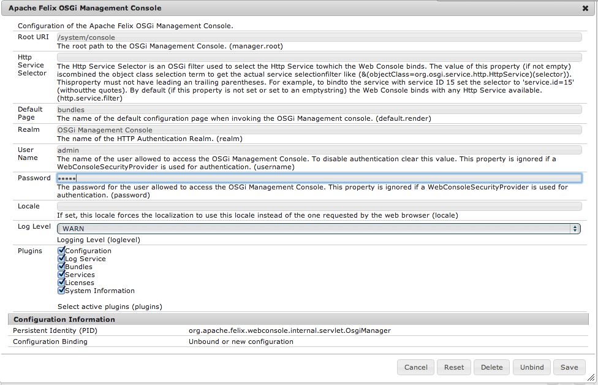

# Security Checklist {#security-checklist}

This section deals with various steps that you should take to ensure that your AEM installation is secure when deployed. The checklist is meant to be applied from top to bottom.

>[!NOTE]
>
>Further information is also available about the most dangerous security threats as published by [Open Web Application Security Project (OWASP)](https://owasp.org/www-project-top-ten/).

>[!NOTE]
>
>There are some additional [security considerations](/help/sites-developing/dev-guidelines-bestpractices.md#security-considerations) applicable at the development phase.

## Main Security Measures {#main-security-measures}

### Run AEM in Production Ready Mode {#run-aem-in-production-ready-mode}

For more information, see [Running AEM in Production Ready Mode](/help/sites-administering/production-ready.md).

### Enable HTTPS for transport layer security {#enable-https-for-transport-layer-security}

Enabling the HTTPS transport layer on both author and publish instances is mandatory for having a secure instance.

>[!NOTE]
>
>See the [Enabling HTTP Over SSL](/help/sites-administering/ssl-by-default.md) section for more information.

### Install Security Hotfixes {#install-security-hotfixes}

Ensure that you have installed the latest [Security Hotfixes provided by Adobe](https://experienceleague.adobe.com/docs/experience-manager-release-information/aem-release-updates/aem-releases-updates.html?lang=en).

### Change Default Passwords For the AEM and OSGi Console Admin Accounts {#change-default-passwords-for-the-aem-and-osgi-console-admin-accounts}

Adobe recommends after installation that you change the password for the privileged [**AEM** `admin` accounts](#changing-the-aem-admin-password) (on all instances).

These accounts include:

* The AEM `admin` account

  After you have changed the password for the AEM admin account, use the new password when accessing CRX.

* The `admin` password for the OSGi Web console

  This change is also applied to the admin account used for accessing the Web console, so use the same password when accessing that.

These two accounts use separate credentials and having distinct, strong password for each is vital to a secure deployment.

#### Changing the AEM admin password {#changing-the-aem-admin-password}

The password for the AEM admin account can be changed via the [Granite Operations - Users](/help/sites-administering/granite-user-group-admin.md) console.

Here you can edit the `admin` account and [change the password](/help/sites-administering/granite-user-group-admin.md#changing-the-password-for-an-existing-user).

>[!NOTE]
>
>Changing the admin account also changes the OSGi web console account. After changing the admin account, you should then change the OSGi account to something different.

#### Importance of Changing the OSGi Web Console Password {#importance-of-changing-the-osgi-web-console-password}

Aside from the AEM `admin` account, failing to change the default password for the OSGi web console password can lead to:

* Exposure of the server with a default password during startup and shutdown (that can take minutes for large servers);
* Exposure of the server when the repository is down/restarting bundle - and OSGI is running.

For more information on changing the web console password, see [Changing the OSGi web console admin password](/help/sites-administering/security-checklist.md#changing-the-osgi-web-console-admin-password) below.

#### Changing the OSGi web console admin password {#changing-the-osgi-web-console-admin-password}

Change the password used for accessing the Web console. Use an [OSGI configuration](/help/sites-deploying/configuring-osgi.md) to update the following properties of the **Apache Felix OSGi Management Console**:

* **User Name** and **Password**, the credentials for accessing the Apache Felix Web Management Console itself.
The password must be changed *after* the initial installation to ensure the security of your instance.

>[!NOTE]
>
>See [OSGI configuration](/help/sites-deploying/configuring-osgi.md) for full details of configuring OSGi settings.

**To change the OSGi web console admin password**:

1. Using the **Tools**, **Operations** menu, open the **Web Console** and navigate to the **Configuration** section. 
   For example, at `<server>:<port>/system/console/configMgr`.
1. Navigate to, and open, the entry for **Apache Felix OSGi Management Console**.
1. Change the **user name** and **password**.

   

1. Select **Save**.

### Implement Custom Error Handler {#implement-custom-error-handler}

Adobe recommends defining custom error handler pages, especially for 404 and 500 HTTP Response codes to prevent information disclosure.

>[!NOTE]
>
>See [How can I create custom scripts or error handlers](https://experienceleague.adobe.com/docs/experience-manager-cloud-service/content/implementing/developing/full-stack/custom-error-page.html?lang=en) for more details.

### Complete Dispatcher Security Checklist {#complete-dispatcher-security-checklist}

AEM Dispatcher is a critical piece of your infrastructure. Adobe recommends that you complete the [Dispatcher security checklist](https://experienceleague.adobe.com/docs/experience-manager-dispatcher/using/getting-started/security-checklist.html?lang=en).

>[!CAUTION]
>
>Using the Dispatcher you must disable the ".form" selector.

## Verification Steps {#verification-steps}

### Configure replication and transport users {#configure-replication-and-transport-users}

A standard installation of AEM specifies `admin` as the user for transport credentials within the default [replication agents](/help/sites-deploying/replication.md). Also, the admin user is used to source the replication on the author system.

For security considerations, both should be changed to reflect the particular use case at hand, with the following two aspects in mind:

* The **transport user** must not be the admin user. Rather, set up a user on the publish system that has only access rights to the relevant portions of the publish system and use that user's credentials for the transport.

  You can start from the bundled replication-receiver user and configure this user's access rights to match your situation

* The **replication user** or **Agent User Id** also must not be the admin user, but a user who can only see content that is replicated. The replication user is used to collect the content to be replicated on the author system before it is sent to the publisher.

### Check the Operations Dashboard Security Health Checks {#check-the-operations-dashboard-security-health-checks}

AEM 6 introduces the new Operations Dashboard, aimed at aiding system operators troubleshoot problems and monitor the health of an instance.

The dashboard also comes with a collection of security health checks. It is recommended you check the status of all the security health checks before going live with your production instance. For more information, consult the [Operations Dashboard documentation](/help/sites-administering/operations-dashboard.md).

### Check if Example Content is Present {#check-if-example-content-is-present}

All example content and users (for example, the Geometrixx project and its components) should be uninstalled and deleted completely on a productive system before making it publicly accessible.

>[!NOTE]
>
>The sample `We.Retail` applications are removed if this instance is running in [Production Ready Mode](/help/sites-administering/production-ready.md). If this scenario is not the case, you can uninstall the sample content by going to Package Manager, then searching for, and uninstalling, all `We.Retail` packages. 

See [Work With Packages](package-manager.md).

### Check if the CRX development bundles are present {#check-if-the-crx-development-bundles-are-present}

These development OSGi bundles should be uninstalled on both author and publish productive systems before making them accessible.

* Adobe CRXDE Support (com.adobe.granite.crxde-support)
* Adobe Granite CRX Explorer (com.adobe.granite.crx-explorer)
* Adobe Granite CRXDE Lite (com.adobe.granite.crxde-lite)

### Check if the Sling development bundle is present {#check-if-the-sling-development-bundle-is-present}

The [AEM Developer Tools](/help/sites-developing/aem-eclipse.md) deploy the Apache Sling Tooling Support Install (org.apache.sling.tooling.support.install).

This OSGi bundle should be uninstalled on both author and publish productive systems before making them accessible.

### Protect against Cross-Site Request Forgery {#protect-against-cross-site-request-forgery}

#### The CSRF Protection Framework {#the-csrf-protection-framework}

AEM 6.1 ships with a mechanism that helps protect against Cross-Site Request Forgery attacks, called the **CSRF Protection Framework**. For more information on how to use it, consult the [documentation](/help/sites-developing/csrf-protection.md).

#### The Sling Referrer Filter {#the-sling-referrer-filter}

To address known security issues with Cross-Site Request Forgery (CSRF) in CRX WebDAV and Apache Sling, add configurations for the Referrer filter to use it.

The referrer filter service is an OSGi service that lets you configure the following:

* which http methods should be filtered
* whether an empty referrer header is allowed
* and a list of servers to be allowed in addition to the server host.

   By default, all variations of localhost and the current host names the server is bound to are in the list.

To configure the referrer filter service:

1. Open the Apache Felix console (**Configurations**) at:

   `https://<server>:<port_number>/system/console/configMgr`

1. Login as `admin`.
1. In the **Configurations** menu, select:

   `Apache Sling Referrer Filter`

1. In the `Allow Hosts` field, enter all hosts that are allowed as a referrer. Each entry must be of the form

   &lt;protocol&gt;://&lt;server&gt;:&lt;port&gt;

   For example:

    * `https://allowed.server:80` allows all requests from this server with the given port.
    * If you also want to allow https requests, you have to enter a second line.
    * If you allow all ports from that server, you can use `0` as the port number.

1. Check the `Allow Empty` field, if you want to allow empty/missing referrer headers.

   >[!CAUTION]
   >
   >Adobe recommends that you provide a referrer while using command-line tools such as `cURL` instead of allowing an empty value as it might expose your system to CSRF attacks.

1. Edit the methods that this filter uses for checks with the `Filter Methods` field.

1. Click **Save** to save your changes.

### OSGI Settings {#osgi-settings}

Some OSGI settings are set by default to allow easier debugging of the application. Change such settings on your publish and author productive instances to avoid internal information leaking to the public.

>[!NOTE]
>
>All the settings below, except for **The Day CQ WCM Debug Filter**, are automatically covered by the [Production Ready Mode](/help/sites-administering/production-ready.md). As such, Adobe recommends that you review all the settings before deploying your instance in a productive environment.

For each of the following services, the specified settings must be changed:

* [Adobe Granite HTML Library Manager](/help/sites-deploying/osgi-configuration-settings.md#day-cq-html-library-manager):

    * enable **Minify** (to remove CRLF and whitespace characters).
    * enable **Gzip** (to allow files to be gzipped and accessed with one request).
    * disable **Debug**
    * disable **Timing**

* [Day CQ WCM Debug Filter](/help/sites-deploying/osgi-configuration-settings.md#day-cq-wcm-debug-filter):

    * uncheck **Enable**

* [Day CQ WCM Filter](/help/sites-deploying/osgi-configuration-settings.md):

    * on publish only, set **WCM Mode** to "disabled"

* [Apache Sling JavaScript Handler](/help/sites-deploying/osgi-configuration-settings.md#apache-sling-javascript-handler):

    * disable **Generate Debug Info**

* [Apache Sling JSP Script Handler](/help/sites-deploying/osgi-configuration-settings.md#apache-sling-jsp-script-handler):

    * disable **Generate Debug Info**
    * disable **Mapped Content**

See [OSGi Configuration Settings](/help/sites-deploying/osgi-configuration-settings.md).

When working with AEM, there are several methods of managing the configuration settings for such services; see [Configuring OSGi](/help/sites-deploying/configuring-osgi.md) for more details and the recommended practices.

## Further Readings {#further-readings}

### Mitigate Denial of Service (DoS) Attacks {#mitigate-denial-of-service-dos-attacks}

A denial of service (DoS) attack is an attempt to make a computer resource unavailable to its intended users. This attack is often done by overloading the resource; for example:

* A flood of requests from an external source.
* A request for more information than the system can successfully deliver.

  For example, a JSON representation of the entire repository.

* By requesting a content page with an unlimited number of URLs, The URL can include a handle, some selectors, an extension, and a suffix - any of which can be modified.

  For example, `.../en.html` can also be requested as:

    * `.../en.ExtensionDosAttack`
    * `.../en.SelectorDosAttack.html`
    * `.../en.html/SuffixDosAttack`

  All valid variations (for example, return a `200` response and are configured to be cached) are cached by the Dispatcher, eventually leading to a full file system and no service for further requests.

There are many points of configuration for preventing such attacks, but only those points that relate to AEM are discussed here.

**Configuring Sling to Prevent DoS**

Sling is *content-centric*. Processing is focused on the content as each (HTTP) request is mapped onto content in the form of a JCR resource (a repository node):

* The first target is the resource (JCR node) holding the content.
* Second, the renderer, or script, is located from the resource properties with certain parts of the request (for example, selectors and/or the extension).

See [Sling Request Processing](/help/sites-developing/the-basics.md#sling-request-processing) for more information.

This approach makes Sling powerful and flexible, but as always it is the flexibility that must be carefully managed.

To help prevent DoS misuse, you can do the following:

1. Incorporate controls at the application level. Due to the number of variations possible, a default configuration is not feasible.

   In your application you should:

    * Control the selectors in your application, so that you *only* serve the explicit selectors needed and return `404` for all others.
    * Prevent the output of an unlimited number of content nodes.

1. Check the configuration of the default renderers, which can be a problem area.

    * In particular, the JSON renderer transverses the tree structure over multiple levels.

      For example, the request:

      `http://localhost:4502/.json`

      could dump the whole repository in a JSON representation which can cause significant server problems. For this reason, Sling sets a limit on the number of maximum results. To limit the depth of the JSON rendering, set the value for the following:

      **JSON Max results** ( `json.maximumresults`)

      in the configuration for the [Apache Sling GET Servlet](/help/sites-deploying/osgi-configuration-settings.md#apache-sling-get-servlet). When this limit is exceeded, the rendering is collapsed. The default value for Sling within AEM is `1000`.

    * As a preventive measure, you should disable the other default renderers (HTML, plain text, XML). Again, by configuring the [Apache Sling GET Servlet](/help/sites-deploying/osgi-configuration-settings.md#apache-sling-get-servlet).

   >[!CAUTION]
   >
   >Do not disable the JSON renderer because it is required for the normal operation of AEM.

1. Use a firewall to filter access to your instance.

    * The use of an operating system level firewall is necessary to filter access to points of your instance that might lead to denial of service attacks if left unprotected.

**Mitigate Against DoS Caused by Using Form Selectors**

>[!NOTE]
>
>This mitigation should be performed only on AEM environments that are not using Forms.

Because AEM does not provide out-of-the-box indexes for the `FormChooserServlet`, using form selectors in queries can trigger a costly repository traversal, usually grinding the AEM instance to a halt. Form selectors can be detected by the presence of the **&ast;.form.&ast;** string in queries.

To mitigate this issue, you can do the following steps:

1. Go to the Web Console by pointing your browser to *https://&lt;serveraddress&gt;:&lt;serverport&gt;/system/console/configMgr*

1. Search for **Day CQ WCM Form Chooser Servlet**
1. After you click the entry, disable the **Advanced Search Require** in the following window.

1. Click **Save**.

**Mitigate Against DoS Caused by Asset Download Servlet**

The default asset download servlet allows authenticated users to issue arbitrarily large, concurrent, download requests to create ZIP files of assets. Creating large ZIP archives can overload the server and the network. To mitigate a potential Denial of Service (DoS) risk caused by this behavior, `AssetDownloadServlet` OSGi component is disabled by default on [!DNL Experience Manager] publish instance. It is enabled on [!DNL Experience Manager] author instance by default. 

If you do not need the download capability, disable the servlet on author and publish deployments. If your setup requires that the asset download capability is enabled, see [this article](/help/assets/download-assets-from-aem.md) for more information. Also, you can define a maximum download limit that your deployment can support.

### Disable WebDAV {#disable-webdav}

Disable WebDAV on both the author and publish environments by stopping the appropriate OSGi bundles.

1. Connect to the **Felix Management Console** running on:

   `https://<*host*>:<*port*>/system/console`

   For example, `http://localhost:4503/system/console/bundles`.

1. In the list of bundles, find the bundle named:

   `Apache Sling Simple WebDAV Access to repositories (org.apache.sling.jcr.webdav)`

1. To stop this bundle, in the Actions column, click the stop button.

1. Again, in the list of bundles, find the bundle named:

   `Apache Sling DavEx Access to repositories (org.apache.sling.jcr.davex)`

1. To stop this bundle, click the stop button.

   >[!NOTE]
   >
   >A restart of AEM is not required.

### Verify That You Are Not Disclosing Personally Identifiable Information In the Users Home Path {#verify-that-you-are-not-disclosing-personally-identifiable-information-in-the-users-home-path}

It is important to protect your users by making sure that you do not expose any personally identifiable information in the repository users home path.

Since AEM 6.1, the way user (also known as authorizable) ID node names are stored is changed with a new implementation of the `AuthorizableNodeName` interface. The new interface no longer exposes the user ID in the node name but generates a random name instead.

No configuration must be performed to enable it, because it is now the default way of generating authorizable IDs in AEM.

Although not recommended, you can disable it in case you need the old implementation for backward compatibility with your existing applications. To do so, you must do the following:

1. Go to the Web Console and remove the** org.apache.jackrabbit.oak.security.user.RandomAuthorizableNodeName** entry from property **requiredServicePids** in **Apache Jackrabbit Oak SecurityProvider**.

   You can also find the Oak Security Provider by looking for the **org.apache.jackrabbit.oak.security.internal.SecurityProviderRegistration** PID in the OSGi configurations.

1. Delete the **Apache Jackrabbit Oak Random Authorizable Node Name** OSGi configuration from the Web Console.

   For easier lookup, the PID for this configuration is **org.apache.jackrabbit.oak.security.user.RandomAuthorizableNodeName**.

>[!NOTE]
>
>For more information, see the Oak documentation on [Authorizable Node Name Generation](https://jackrabbit.apache.org/oak/docs/security/user/authorizablenodename.html).

### Anonymous Permission Hardening Package {#anonymous-permission-hardening-package}

By default, AEM stores system metadata, such as `jcr:createdBy` or `jcr:lastModifiedBy` as node properties, next to regular content, in the repository. Depending on the configuration and the access control setup, in some cases this could lead to exposure of personally identifiable information (PII), for example when such nodes are rendered as raw JSON or XML. 

Like all repository data, these properties are mediated by the Oak authorization stack. Access to them should be restricted in accordance with the principle of least privilege.

To support this, Adobe provides a permission hardening package as a basis for customers to build upon. It works by installing a "deny" access control entry at the repository root, restricting anonymous access to commonly used system properties. The package is available for download [here](https://experience.adobe.com/#/downloads/content/software-distribution/en/aem.html?package=/content/software-distribution/en/details.html/content/dam/aem/public/adobe/packages/helper/anonymous-permissions-pkg-0.1.2.zip) and can be installed on all supported versions of AEM. 

To illustrate the changes, we can compare the node properties that can be viewed anonymously before installing the package:

with the ones viewable after installing the package, where `jcr:createdBy` and `jcr:lastModifiedBy` are not visible:

For more information please see the package release notes.

### Prevent Clickjacking {#prevent-clickjacking}

To prevent clickjacking, Adobe recommends that you configure your webserver to provide the `X-FRAME-OPTIONS` HTTP header set to `SAMEORIGIN`.

For more information on clickjacking, see the [OWASP site](https://www.owasp.org/index.php/Clickjacking).

### Make Sure You Properly Replicate Encryption Keys When Needed {#make-sure-you-properly-replicate-encryption-keys-when-needed}

Certain AEM features and authentication schemes require that you replicate your encryption keys across all AEM instances.

Before you do so, key replication is done differently between versions because the way keys are stored is different between 6.3 and older versions.

See below for more information.

#### Replicating Keys for AEM 6.3 {#replicating-keys-for-aem}

Whereas in older versions the replication keys were stored in the repository, beginning with AEM 6.3 they are stored on the filesystem.

Therefore, to replicate your keys across instances, copy them from the source instance to the target instances' location on the filesystem.

More specifically, you must do the following:

1. Access the AEM instance &ndash; typically an author instance &ndash; that contains the key material to copy;
1. Locate the com.adobe.granite.crypto.file bundle in the local file system. For example, under this path:

    * `<author-aem-install-dir>/crx-quickstart/launchpad/felix/bundle21`

   The `bundle.info` file inside each folder identifies the bundle name.

1. Navigate to the data folder. For example:

    * `<author-aem-install-dir>/crx-quickstart/launchpad/felix/bundle21/data`

1. Copy the HMAC and master files.
1. Then, go to the target instance you want to duplicate the HMAC key to, and navigate to the data folder. For example:

    * `<publish-aem-install-dir>/crx-quickstart/launchpad/felix/bundle21/data`

1. Paste the two files you previously copied.
1. [Refresh the Crypto Bundle](/help/communities/deploy-communities.md#refresh-the-granite-crypto-bundle) if the target instance is already running.
1. Repeat the above steps for all instances that you want to replicate the key to.

>[!NOTE]
>
>You can revert to the pre-6.3 method of storing keys by adding the below parameter when you first install AEM:
>
>`-Dcom.adobe.granite.crypto.file.disable=true`

#### Replicating Keys for AEM 6.2 and Older Versions {#replicating-keys-for-aem-and-older-versions}

In AEM 6.2 and older versions, the keys are stored in the repository under the `/etc/key` node.

The recommended way to securely replicate the keys across your instances is to only replicate this node. You can selectively replicate nodes via CRXDE Lite:

1. Open CRXDE Lite by going to *`https://&lt;serveraddress&gt;:4502/crx/de/index.jsp`*
1. Select the `/etc/key` node.
1. Go to the **Replication** tab.
1. Press the **Replication** button.

### Perform a Penetration Test {#perform-a-penetration-test}

Adobe recommends that you perform a penetration test of your AEM infrastructure before going on production.

### Development Best Practices {#development-best-practices}

It is critical that new development are following the [Security Best Practices](/help/sites-developing/security.md) to ensure that your AEM environment stays safe.
