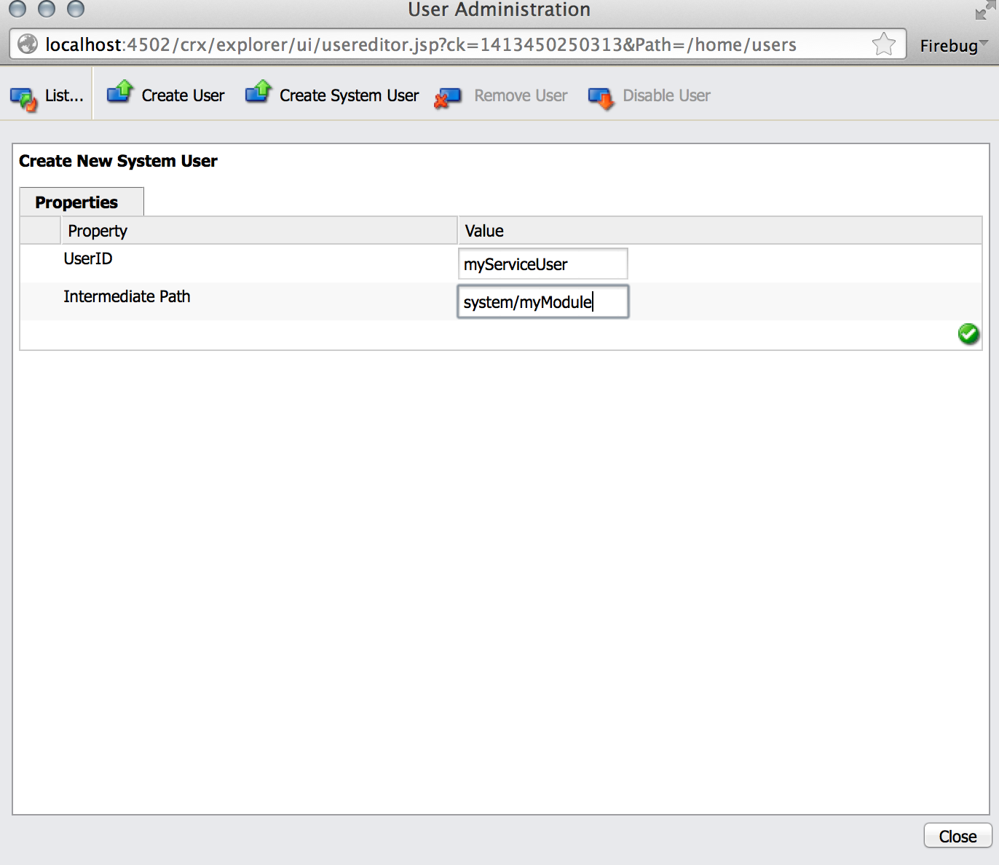

# Service Users in Adobe Experience Manager (AEM) {#service-users-in-aem}

## Overview {#overview}

The main way of getting an administrative session or resource resolver in AEM was using the `SlingRepository.loginAdministrative()` and `ResourceResolverFactory.getAdministrativeResourceResolver()` methods provided by Sling.

However, neither of these methods were designed around the [principle of least privilege](https://en.wikipedia.org/wiki/Principle_of_least_privilege). It makes it too easy for a developer not to plan for a proper structure and corresponding Access Control Levels (ACLs) for their content early on. If a vulnerability is present in such a service it often leads to privilege escalations to the `admin` user, even if the code itself would not need administrative privileges to work.

## How to Phase Out Admin Sessions {#how-to-phase-out-admin-sessions}

### Priority 0: Is the feature active/needed/derelict? {#priority-is-the-feature-active-needed-derelict}

There may be cases where the admin session is not used, or the feature is disabled entirely. If so with your implementation, make sure you remove the feature altogether or fit it with [NOP code](https://en.wikipedia.org/wiki/NOP).

### Priority 1: Use The Request Session {#priority-use-the-request-session}

Whenever possible refactor your feature so that the given, authenticated request session can be used for reading or writing content. If this is not doable, it can often be achieved by applying the priorities following the ones below.

### Priority 2: Restructure Content {#priority-restructure-content}

Many issues can be resolved by restructuring the content. Keep these simple rules in mind when doing the restructure:

* **Change access control**

    * Make sure that the users or groups that really need access actually have access;

* **Refine content structure**

    * Move it to other locations, for example, where access control matches the request sessions available;
    * Change the content granularity;

* **Refactor your code to be a proper service**

    * Move the business logic from JSP code to service. This allows different content modeling.

Also, make sure that any new features you develop adhere to these principles:

* **Security requirements should drive the content structure**

    * Managing access control should feel natural
    * Access control must be enforced by the repository, not the application

* **Use nodetypes**

    * Restrict the set of properties that can be set

* **Respect privacy settings**

    * If there are private profiles, one example would be to not expose the profile picture, email, or full name found on the private `/profile` node.

## Strict Access Control {#strict-access-control}

Whether you apply access control while restructuring content or when you do it for a new service user, you must apply the strictest ACLs possible. Use all possible facilities of access control:

* For example, instead of applying `jcr:read` on `/apps`, only apply it to `/apps/*/components/*/analytics`

* Use [restrictions](https://jackrabbit.apache.org/oak/docs/security/authorization/restriction.html)

* Apply ACLs for node types
* Limit permissions

    * for example, when only needing to write properties, do not give the `jcr:write` permission; use `jcr:modifyProperties` instead

## Service Users and Mappings {#service-users-and-mappings}

If the above fails, Sling 7 offers a Service User Mapping service, which lets you configure a bundle-to-user mapping and two corresponding API methods:

* [`SlingRepository.loginService()`](https://sling.apache.org/apidocs/sling7/org/apache/sling/jcr/api/SlingRepository.html#loginService-java.lang.String-java.lang.String-)
* [`ResourceResolverFactory.getServiceResourceResolver()`](https://sling.apache.org/apidocs/sling7/org/apache/sling/api/resource/ResourceResolverFactory.html#getServiceResourceResolver-java.util.Map-)

The methods return a session/resource resolver with the privileges of a configured user only. These methods have the following characteristics:

* They allow mapping services to users
* They make it possible to define subservice users
* The central configuration point is: `org.apache.sling.serviceusermapping.impl.ServiceUserMapperImpl`
* `service-id` = `service-name` [ ":" subservice-name ]

* `service-id` is mapped to a resource resolver and/or JCR repository user ID for authentication
* `service-name` is the symbolic name of the bundle providing the service

## Other Recommendations {#other-recommendations}

### Replacing the admin-session with a service-user {#replacing-the-admin-session-with-a-service-user}

A service user is a JCR user with no password set and a minimal set of privileges that are necessary to perform a specific task. Having no password set means that it is not possible to log in with a service user.

A way to deprecate an administrative session is to replace it with service user sessions. It could also be replaced by multiple subservice users if needed.

To replace the admin session with a service user, you should perform the following steps:

1. Identify the necessary permissions for your service, keeping the principle of least permission in mind.
1. Check if there is already a user available with exactly the permission setup you need. Create a system service user if no existing user matches your needs. RTC is needed to create a service user. Sometimes, it makes sense to create multiple subservice users (for example, one for writing and one for reading) to compartmentalize access even more.
1. Set up and test ACEs for your user.
1. Add a `service-user` mapping for your service and for `user/sub-users`

1. Make the service user sling feature available to your bundle: update to the most recent version of `org.apache.sling.api`.

1. Replace the `admin-session` in your code with the `loginService` or `getServiceResourceResolver` APIs.

## Creating a service user {#creating-a-new-service-user}

After you verified that no user in the list of AEM service users is applicable for your use case and the corresponding RTC issues have been approved, add the new user to the default content.

The recommended approach is to create a service user to use the repository explorer at *https://&lt;server&gt;:&lt;port&gt;/crx/explorer/index.jsp*

The goal is to get a valid `jcr:uuid` property which is mandatory to create the user via a content package installation.

You can create service users by:

1. Going to the repository explorer at *https://&lt;server&gt;:&lt;port&gt;/crx/explorer/index.jsp*
1. Logging in as admin by pressing the **Log In** link in the upper left corner of the screen.
1. Next, create, and name your system user. To create the user as a system one, set the intermediate path as `system` and add optional subfolders depending on your needs:

   

1. Verify that your system user node looks as follows:

   

   >[!NOTE]
   >
   >There are no mixin types associated with service users. This means that there are no access control policies for system users.

When adding the corresponding .content.xml to the content of your bundle, make sure you have set the `rep:authorizableId` and that the primary type is `rep:SystemUser`. It should look like this:

```xml
<?xml version="1.0" encoding="UTF-8"?>
<jcr:root xmlns:jcr="https://www.jcp.org/jcr/1.0" xmlns:rep="internal"
    jcr:primaryType="rep:SystemUser"
    jcr:uuid="4917dd68-a0c1-3021-b5b7-435d0044b0dd"
    rep:principalName="authentication-service"
    rep:authorizableId="authentication-service"/>
```

## Adding a configuration amendment to the ServiceUserMapper configuration {#adding-a-configuration-amendment-to-the-serviceusermapper-configuration}

To add a mapping from your service to the corresponding System Users, create a factory configuration for the [`ServiceUserMapper`](https://sling.apache.org/apidocs/sling7/org/apache/sling/serviceusermapping/ServiceUserMapper.html) service. To keep this modular, such configuration can be provided using the [Sling amend mechanism](https://issues.apache.org/jira/browse/SLING-3578). The recommended way to install such configurations with your bundle is by using [Sling Initial Content Loading](https://sling.apache.org/documentation/bundles/content-loading-jcr-contentloader.html):

1. Create a subfolder SLING-INF/content below the src/main/resources folder of your bundle
1. In this folder, create a file named org.apache.sling.serviceusermapping.impl.ServiceUserMapperImpl.amended-&lt;some unique name for your factory configuration&gt;.xml with the content of your factory configuration (including all subservice user mappings). Example:

1. Create a `SLING-INF/content` folder below the `src/main/resources` folder of your bundle;
1. In this folder, create a file `named org.apache.sling.serviceusermapping.impl.ServiceUserMapperImpl.amended-<a unique name for your factory configuration>.xml` with the content of your factory configuration, including all subservice user mappings.

   For illustration purposes, take the file called `org.apache.sling.serviceusermapping.impl.ServiceUserMapperImpl.amended-com.adobe.granite.auth.saml.xml`:

   ```xml
   <?xml version="1.0" encoding="UTF-8"?>
   <node>
       <primaryNodeType>sling:OsgiConfig</primaryNodeType>
       <property>
           <name>user.default</name>
           <value></value>
       </property>
       <property>
           <name>user.mapping</name>
           <values>
               <value>com.adobe.granite.auth.saml=authentication-service</value>
           </values>
       </property>
   </node>
   ```

1. Reference the Sling initial content in the configuration of the `maven-bundle-plugin` in the `pom.xml` of your bundle. Example:

   ```xml
   <Sling-Initial-Content>
      SLING-INF/content;path:=/libs/system/config;overwrite:=true;
   </Sling-Initial-Content>
   ```

1. Install your bundle and make sure that the factory configuration is installed. You can do this by:

    * Going to the Web Console at *https://serverhost:serveraddress/system/console/configMgr*
    * Search for **Apache Sling Service User Mapper Service Amendment**
    * Click the link so you can see if the proper configuration is in place.

## Dealing with shared sessions in services {#dealing-with-shared-sessions-in-services}

Calls to `loginAdministrative()` often appear together with shared sessions. These sessions are acquired on service activation and are only logged out after the service is stopped. Although this is common practice, it leads to two problems:

* **Security:** Such admin sessions are used to cache and return resources or other objects that are bound to the shared session. Later in the call stack these objects could get adapted to sessions or resource resolvers with elevated privileges. Often it is not clear to the caller that it is an admin session with which they are operating.
* **Performance:** In Oak, shared sessions can cause performance problems, and it is not recommended that you use them.

The most obvious solution for the security risk is to simply replace the `loginAdministrative()` call with a `loginService()` one to a user with restricted privileges. However, this does not have any impact on any potential performance degradation. A possibility to mitigate that is to wrap all requested information in an object that has no association with the session. Then, create (or destroy) the session on demand.

The recommended approach is to refactor the service's API to give the caller control over the creation/destruction of the session.

## Administrative sessions in JSPs {#administrative-sessions-in-jsps}

JSPs cannot use `loginService()`, because there is no associated service. However, administrative sessions in JSPs are usually a sign of a violation of the MVC paradigm.

This can be fixed in two ways:

1. Restructuring the content in a way that allows manipulating it with the user session;
1. Extracting the logic to a service that provides an API that can then be used by the JSP.

The first method is the preferred one.

## Processing Events, Replication Preprocessors and Jobs {#processing-events-replication-preprocessors-and-jobs}

When processing events or jobs, and sometimes workflows, the corresponding session that triggered the event is lost. This leads to event handlers and job processors often using administrative sessions to do their work. There are different conceivable approaches to solve this problem, each with their advantages and disadvantages:

1. Pass the `user-id` in the event payload and use impersonation.

   **Advantages:** Easy to use.

   **Disadvantages:** Still uses `loginAdministrative()`. It reauthenticates a request that has already been authenticated.

1. Create or reuse a service user that has access to the data.

   **Advantages:** Consistent with the current design. Needs minimal change.

   **Disadvantages:** Needs powerful service users to be flexible, which can easily lead to privilege escalations. Circumvents the security model.

1. Pass a serialization of the `Subject` in the event payload, and create a `ResourceResolver` based on that subject. One example would be using the JAAS `doAsPrivileged` in the `ResourceResolverFactory`.

   **Advantages:** Clean implementation from a security standpoint. It avoids reauthentication and it operates with the original privileges. Security relevant code is transparent to the consumer of the event.

   **Disadvantages:** Needs refactoring. The fact that the security relevant code transparent to the consumer of the event might also lead to problems.

The third approach is the preferred processing technique.

## Workflow Processes {#workflow-processes}

Within workflow process implementations, the corresponding user session that triggered the workflow is lost. This leads to workflow processes that often use administrative sessions to perform their work.

To fix these issues, it is recommended that the same approaches mentioned in [Processing Events, Replication Preprocessors and Jobs](/help/sites-administering/security-service-users.md#processing-events-replication-preprocessors-and-jobs) be used.

## Sling POST Processors and Deleted Pages {#sling-post-processors-and-deleted-pages}

There are a couple of administrative sessions used in sling POST processor implementations. Usually, administrative sessions are used to access nodes that are pending deletion within the POST being processed. In consequence, they are no longer available via the request session. A node pending deletion may be accessed to disclose metadata that otherwise should not be accessible.
