# User Administration and Security{#user-administration-and-security}

This chapter describes how to configure and maintain user authorization and also describes the theory behind how authentication and authorization work in AEM.

## Users and Groups in AEM {#users-and-groups-in-aem}

This section deals with the various entities and related concepts in more detail to help you configure an easy to maintain user management concept.

### Users {#users}

Users log on to AEM with their account. Each user account is unique and holds the basic account details, together with the privileges assigned.

Users are often members of Groups, which simplify the allocation of these permissions and/or privileges.

### Groups {#groups}

Groups are collections of users, or other groups, or both. These collections are all called Members of a group.

Their primary purpose is to simplify the maintenance process by reducing the number of entities to be updated, as a change made to a group is applied to all members of the group. Groups often reflect:

* a role within the application; such as someone who is allowed to surf the content, or someone who is allowed to contribute content.
* your own organization; you may want to extend the roles to differentiate between contributors from different departments when they are restricted to different branches in the content tree.

Therefore groups tend to remain stable, whereas users come and go more frequently.

With planning and a clean structure, the use of groups can reflect your structure, giving you a clear overview and an efficient mechanism for updates.

### Built-in Users and Groups {#built-in-users-and-groups}

AEM WCM installs several users and groups. These collections are seen when you first access the Security Console after installation.

The following tables list each item together with:

* a short description
* any recommendations about necessary changes

*Change all default passwords* (if you do not delete the account itself in certain circumstances).

<table>
 <tbody>
  <tr>
   <td>User ID</td>
   <td>Type</td>
   <td>Description</td>
   <td>Recommendation</td>
  </tr>
  <tr>
   <td>
admin
 
Default password: admin
 </td>
   <td>User</td>
   <td>
System administration account with full access rights.
 
This account is used for the connection between AEM WCM and CRX.
 
If you accidentally delete this account, it is re-created upon repository restart (in the default setup).
 
The admin account is a requirement of the AEM platform. As a consequence, this account cannot be deleted.
 </td>
   <td>
Adobe recommends that you change the default password for this user account.
 
Preferably on installation, though it can be done afterwards.
 
Note: Do not confuse this account with the admin account of the CQ Servlet Engine.
 </td>
  </tr>
  <tr>
   <td>
anonymous
 
 
 </td>
   <td>User</td>
   <td>
Holds the default rights for unauthenticated access to an instance. Per default, this account holds the minimum access rights.
 
If you accidentally delete this account, it is re-created on startup. It cannot be permanently deleted, but it can be disabled.
 </td>
   <td>Avoid deleting or disabling this account, as it negatively impacts the functioning of author instances. If there are security requirements that mandate you to delete it, make sure you properly test the effects it has on your systems first.</td>
  </tr>
  <tr>
   <td>
author
 
Default password: author
 </td>
   <td>User</td>
   <td>
An author account allowed to write to /content. Encompasses contributor and surfer privileges.
 
Can be used as a webmaster as it has access to the entire /content tree.
 
This account is not a built-in user, but another Geometrixx demo user
 </td>
   <td>
Adobe recommends that either the account is deleted completely, or the default password is changed.
 
Preferably on installation, though it can be done afterwards.
 </td>
  </tr>
  <tr>
   <td>administrators</td>
   <td>Group</td>
   <td>
Group that gives administrator rights to all its members. Only admin is allowed to edit this group.
 
Has full access rights.
 </td>
   <td>Even if you set a 'deny-everyone' on a node, the administrators can still access the node</td>
  </tr>
  <tr>
   <td>content-authors</td>
   <td>Group</td>
   <td>
Group responsible for content editing. Requires read, modify, create, and delete permissions.
 </td>
   <td>You can create your own content-author groups with project-specific access rights, provided you add read, modify, create, and delete permissions.</td>
  </tr>
  <tr>
   <td>contributor</td>
   <td>Group</td>
   <td>
Basic privileges that allow the user to write content (as in, functionality only).
 
Does not allocate any privileges to the /content tree. Must be allocated for the individual groups or users.
 </td>
   <td> </td>
  </tr>
  <tr>
   <td>dam-users</td>
   <td>Group</td>
   <td>Out-of-the-box reference group for a typical AEM Assets user. Members of this group have appropriate privileges to enable uploading/sharing of assets and collections.</td>
   <td> </td>
  </tr>
  <tr>
   <td>everyone</td>
   <td>Group</td>
   <td>
Every user in AEM is a member of the group everyone, even though you may not see the group or the membership relation in all tools.
 
This group can be thought of as the default rights as it can be used to apply permissions for everyone, even users that will be created in the future.
 </td>
   <td>
Do not modify or delete this group.
 
Modifying this account has additional security implications.
 </td>
  </tr>
  <tr>
   <td>tag-administrators</td>
   <td>Group</td>
   <td>Group that is allowed to edit tags.</td>
   <td> </td>
  </tr>
  <tr>
   <td>user-administrators</td>
   <td>Group</td>
   <td>Authorizes user administration, that is, the right to create users and groups.</td>
   <td> </td>
  </tr>
  <tr>
   <td>workflow-editors</td>
   <td>Group</td>
   <td>Group that is allowed to create and modify workflow models.</td>
   <td> </td>
  </tr>
  <tr>
   <td>workflow-users</td>
   <td>Group</td>
   <td>
A user participating in a workflow must be a member of group workflow-users. Gives the user full access to: /etc/workflow/instances so that they can update the workflow instance.
 
The group is included in the standard installation, but you must manually add your users to the group.
 </td>
  </tr>
 </tbody>
</table>

## Permissions in AEM {#permissions-in-aem}

AEM uses ACLs to determine what actions a user or group and can take and where it can perform those actions.

### Permissions and ACLs {#permissions-and-acls}

Permissions define who can perform which actions on a resource. The permissions are the result of [access control](#access-control-lists-and-how-they-are-evaluated) evaluations.

You can change the permissions granted/denied to a given user by selecting or clearing the checkboxes for the individual AEM [actions](security.md#actions). A check mark indicates that an action is allowed. No checkmark indicates that an action is denied.

Where the checkmark is in the grid also indicates what permissions users have in what locations within AEM (that is, which paths).

### Actions {#actions}

Actions can be performed on a page (resource). For each page in the hierarchy, you can specify which action the user is allowed to take on that page. [Permissions](#permissions-and-acls) enable you to allow or deny an action.

<table>
 <tbody>
  <tr>
   <td><strong>Action </strong></td>
   <td><strong>Description </strong></td>
  </tr>
  <tr>
   <td>Read</td>
   <td>The user is allowed to read the page and any child pages.</td>
  </tr>
  <tr>
   <td>Modify</td>
   <td>
The user can:

    <ul>
     <li>modify existing content on the page and on any child pages.</li>
     <li>create paragraphs on the page or on any child page.</li>
    </ul> 
At the JCR level, users can edit a resource by editing its properties, locking, versioning, nt-modifications, and they have complete write permission on nodes defining a jcr:content child node. For example cq:Page, nt:file, cq:Asset.
 </td>
  </tr>
  <tr>
   <td>Create</td>
   <td>
The user can:

    <ul>
     <li>create a page or child page.</li>
    </ul> 
If <strong>modify</strong> is denied, the subtrees below jcr:content are excluded because the creation of jcr:content and its child nodes are considered a page modification. This rule only applies to nodes defining a jcr:content child node.
 </td>
  </tr>
  <tr>
   <td>Delete</td>
   <td>
The user can:

    <ul>
     <li>delete existing paragraphs from the page or any child page.</li>
     <li>delete a page or child page.</li>
    </ul> 
If <strong>modify</strong> is denied any subtrees below jcr:content are excluded as removing jcr:content and its child nodes is considered a page modification. This rule only applies to nodes defining a jcr:content child node.
 </td>
  </tr>
  <tr>
   <td>Read ACL</td>
   <td>The user can read the access control list of the page or child pages.</td>
  </tr>
  <tr>
   <td>Edit ACL</td>
   <td>The user can modify the access control list of the page or any child pages.</td>
  </tr>
  <tr>
   <td>Replicate</td>
   <td>The user can replicate content to another environment (for example, the Publish environment). The privilege is also applied to any child pages.</td>
  </tr>
 </tbody>
</table>

>[!NOTE]
>
>AEM automatically generates user groups for role-assignment (Owner, Editor, Viewer) in [Collections](/help/assets/manage-collections.md). However, manually adding ACLs for such groups can introduce security vulnerabilities within AEM. Adobe recommends that you avoid adding ACLs manually.

### Access Control Lists and how they are evaluated {#access-control-lists-and-how-they-are-evaluated}

AEM WCM uses Access Control Lists (ACLs) to organize the permissions being applied to the various pages.

Access Control Lists are made up of the individual permissions and are used to determine the order in which these permissions are applied. The list is formed according to the hierarchy of the pages under consideration. This list is then scanned bottom-up until the first appropriate permission to apply to a page is found.

>[!NOTE]
>
>There are ACLs that are included with the samples. It is recommended that you review and determine what is appropriate for your applications. To review the ACLs that are included, go to **CRXDE** and select the **Access Control** tab for the following nodes:
>
>* `/etc/cloudservices`
>* `/home/users/we-retail`
>
>Your custom application may set access for other relationships, such as:
>
>* `*/social/relationships/friend/*` 
>* or `*/social/relationships/pending-following/*`.
>
>When you create ACLs specific to communities, members joining those communities may be granted additional permissions. For example, when users join the communities at: `/content/we-retail/us/en/community` 

### Permission States {#permission-states}

>[!NOTE]
>
>For CQ 5.3 users:
>
>In contrast to previous CQ versions, **create** and **delete** should no longer be granted if a user must only modify pages. Instead, grant the **modify** action only if you want users to be able to create, modify, or delete components on existing pages.
>
>For backwards compatibility reasons, the tests for actions does not take the special treatment of nodes defining **jcr:content** into account.

| **Action** |**Description** |
|---|---|
| Allow (Checkmark) |AEM WCM allows the user to perform the action on this page or on any child pages. |
| Deny (No checkmark) |AEM WCM does not allow the user to perform the action on this page nor on any child pages. |

The permissions are also applied to any child pages.

If a permission is not inherited from the parent node but has at least one local entry for it, then the following symbols are appended to the check box. A local entry is one that is created in the CRX 2.2 interface (Wildcard ACLs currently can only be created in CRX.)

For an action at a given path:

<table>
 <tbody>
  <tr>
   <td>* (asterisk)</td>
   <td>There is at least one local entry (either effective or ineffective). These wildcard ACLs are defined in CRX.</td>
  </tr>
  <tr>
   <td>! (exclamation mark)</td>
   <td>There is at least one entry that currently has no effect.</td>
  </tr>
 </tbody>
</table>

When you hover over the asterisk or exclamation mark, a tooltip provides more details about the declared entries. The tooltip is split into two parts:

<table>
 <tbody>
  <tr>
   <td>Upper part</td>
   <td>
Lists the effective entries.
 </td>
  </tr>
  <tr>
   <td>Lower part</td>
   <td>Lists the noneffective entries that can effect somewhere else in the tree (as indicated by a special attribute present with the corresponding ACE limiting the scope of the entry). Alternatively, it is an entry whose effect is revoked by another entry defined at the given path, or at an ancestor node.</td>
  </tr>
 </tbody>
</table>

>[!NOTE]
>
>If no permissions are defined for a page, then all actions are denied.

The following are recommendations about managing access control lists:

* Do not assign permissions directly to users. Assign them only to groups.

  Doing so simplifies the maintenance, as the number of groups is much smaller than the number of users, and also less volatile.

* If you want a group/user to be able only to modify pages, do not grant them create or deny rights. Only grant them modify and read rights.
* Use Deny sparingly. As far as possible use only Allow.

  Using deny can cause unexpected effects if the permissions are applied in a different order than the order expected. If a user is a member of more than one group, the Deny statements from one group may cancel the Allow statement from another group or the opposite way. It is hard to keep an overview when such a thing happens and can easily lead to unforeseen results, whereas Allow assignments do not cause such conflicts.

  Adobe recommends that you work with Allow rather than Deny see [Best Practices](#best-practices).

Before modifying either permission, be sure you understand how they work and inter-relate. See the CRX documentation that illustrates how AEM WCM [evaluates access rights](/help/sites-administering/user-group-ac-admin.md#how-access-rights-are-evaluated), and examples on setting up access control lists.

### Permissions {#permissions}

Permissions give users and groups access to AEM functionality on AEM pages.

You browse permissions by path by expanding/collapsing the nodes and you can track the permission inheritance up to the root node.

You allow or deny permissions by selecting or clearing the appropriate check boxes.

### Viewing Detailed Permission Information {#viewing-detailed-permission-information}

Along with the grid view, AEM provides a detailed view of permissions for a selected user/group at a given path. The detail view provides additional information.

In addition to viewing information, you can also include or exclude the current user or group from a group. See [Adding Users or Groups while Adding Permissions](#adding-users-or-groups-while-adding-permissions). Changes made here are immediately reflected in the upper portion of the detailed view.

To access the Detail view, in the **Permissions** tab, click **Details** for any selected group/user and path.

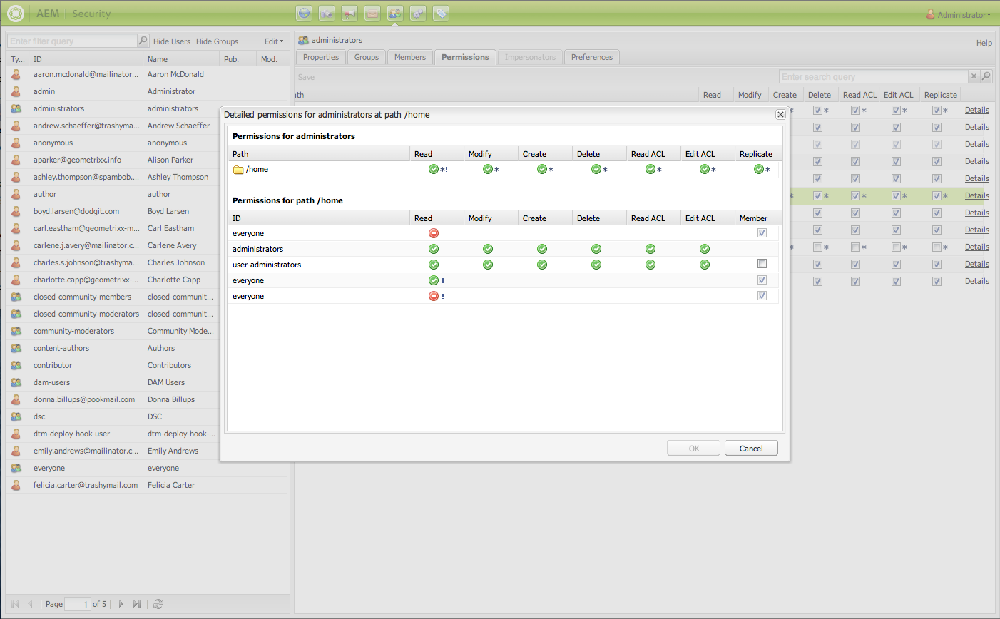

Details are split into two parts:

<table>
 <tbody>
  <tr>
   <td>Upper part</td>
   <td>
Repeats the information that you see in the tree grid. For each action, an icon shows whether the action is allowed or denied:

    <ul>
     <li>no icon = no declared entry</li>
     <li>(tick) = declared action (allow)</li>
     <li>(-) = declared action (deny)</li>
    </ul> </td>
  </tr>
  <tr>
   <td>Lower part</td>
   <td>
Shows the grid of users and groups that does the following:

    <ul>
     <li>Declares an entry for the given path AND</li>
     <li>Is the given authorizable OR is a group</li>
    </ul> </td>
  </tr>
 </tbody>
</table>

### Impersonating another User {#impersonating-another-user}

With the [Impersonate functionality](/help/sites-authoring/user-properties.md#user-settings), a user can work on behalf of another user.

That is, a user account can specify other accounts that can operate with their account. For example, if user-B is allowed to impersonate user-A, then user-B can act using the full account details of user-A.

This functionality lets impersonator accounts complete tasks as if they were using the account they are impersonating. For example, during an absence or to share an excessive load short term.

>[!NOTE]
>
>For impersonating to work for non-admin users, the impersonator (in the above case user-B) is required to have READ permissions in the `/home/users` path.
>
>See [Permissions in AEM](/help/sites-administering/security.md#permissions-in-aem).

>[!CAUTION]
>
>If one account impersonates another, it is difficult to see. An entry is made in the audit log when the impersonation starts and ends, but the other log files (such as the access log) hold no information that an impersonation has occurred on the events. So, if user-B is impersonating user-A, all events look as if user-A performed them.

>[!CAUTION]
>
>Locking a page can be performed when impersonating a user. However a page locked in this way can only then be unlocked as the user who was impersonated or a user with administrator privileges.
>
>Pages cannot be unlocked by impersonating the user who locked the page.

### Best Practices {#best-practices}

The following describes best practices when working with permissions and privileges:

|Rule|Reason|
|--- |--- |
|*Use Groups*|Avoid assigning access rights on a user-by-user basis. There are several reasons for this advice:<ul><li>You have many more users than groups, so groups simplify the structure.</li><li>Groups help provide an overview over all accounts.</li> <li>Inheritance is simpler with groups.</li><li>Users come and go. Groups are long term.</li></ul>|
|*Be Positive*|Always use Allow statements to specify the group's rights (wherever possible). Avoid using a Deny statement. Groups are evaluated in order, and the order may be defined differently per user. In other words: You may have little control over the order in which the statements are implemented and evaluated. If you use only Allow statements, the order does not matter.|
|*Keep It Simple*|Investing some time and thought when configuring a new installation is worth it. Applying a clear structure simplifies the ongoing maintenance and administration, ensuring that both your current colleagues and future successors can easily understand what is implemented.|
|*Test*|Use a test installation to practice and ensure that you understand the relationships between the various users and groups.|
|*Default Users/Groups*|Always update the Default Users and Groups immediately after installation to help prevent any security issues.|

## Managing Users and Groups {#managing-users-and-groups}

Users include people using the system and foreign systems making requests to the system.

A group is a set of users.

Both can be configured using the User Administration functionality within the Security Console.

### Accessing User Administration with the Security Console {#accessing-user-administration-with-the-security-console}

You access all users, groups, and associated permissions using the Security console. All the procedures described in this section are performed in this window.

To access AEM WCM security, do one of the following:

* From the Welcome screen or various locations in AEM, click the security icon:

* Navigate directly to `https://<server>:<port>/useradmin`. Be sure you log into AEM as an administrator.

The following window displays:

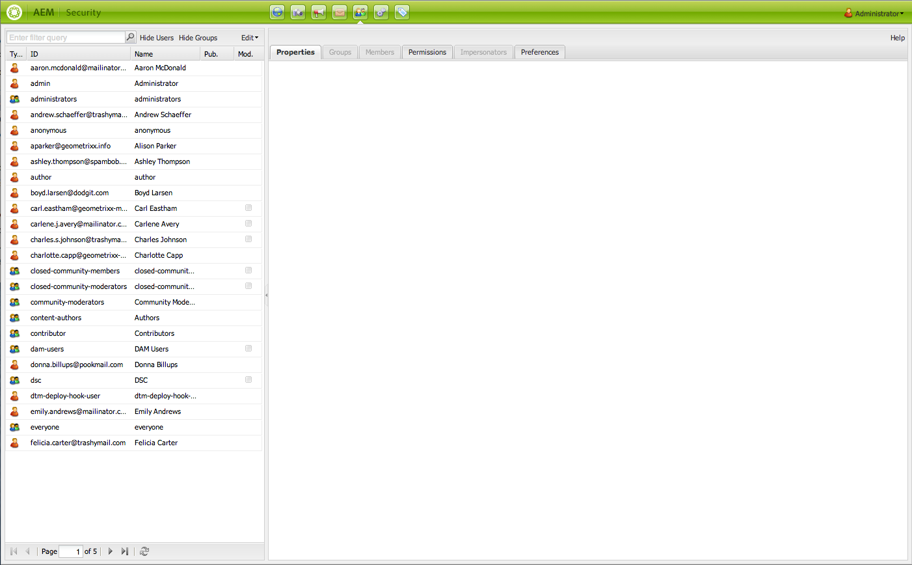

The left tree lists all the users and groups currently in the system. You can select the columns you want displayed, sort the contents of the columns, and even change the order in which the columns are displayed by dragging the column-header to a new position.

The tabs provide access to various configurations:

<!-- ??? in table below. -->

|Tab|Description|
|--- |--- |
|Filter box|A mechanism for filtering the listed users, or groups, or both. See [Filtering Users and Groups](#filtering-users-and-groups).|
|Hide Users|A toggle switch that hides all listed users listed, leaving only groups. See [Hiding Users and Groups](#hiding-users-and-groups).|
|Hide Groups|A toggle switch that hides all groups listed, leaving only users. See [Hiding Users and Groups](#hiding-users-and-groups).|
|Edit|A menu allowing you to create and delete as well activate and deactivate users or groups. See [Creating Users and Groups](#creating-users-and-groups) and [Deleting Users and Groups](#deleting-users-and-groups).|
|Properties|Lists information about the user or group that can include email information, a description, and name information. Also allows you to change a user's password. See [Creating Users and Groups](#creating-users-and-groups), [Modifying User and Group Properties](#modifying-user-and-group-properties) and [Changing a User Password](#changing-a-user-password).|
|Groups|Lists all groups that the selected user or group belongs to. You can assign the selected user or groups to additional groups or remove them from groups. See [Groups](#adding-users-or-groups-to-a-group).|
|Members|Available for groups only. Lists the members of a particular group. See [Members](#members-adding-users-or-groups-to-a-group).|
|Permissions|You can allocate permissions to a user or group. Lets you control the following:<ul><li>Permissions related to particular pages/nodes. See [Setting Permissions](#setting-permissions). </li><li>Permissions related to creating and deleting pages and hierarchy modification. ??? lets you [allocate privileges](#settingprivileges), such as hierarchy modification, which lets you create and delete pages,</li><li>Permissions related to [replication privileges](#setting-replication-privileges) (usually from author to publish) according to a path.</li></ul>|
|Impersonators|Lets another user impersonate the account. Useful when you need a user to act on behalf of another user. See [Impersonating Users](#impersonating-another-user).|
|Preferences|Sets [preferences for the group or user](#setting-user-and-group-preferences). For example, language preferences.|

### Filtering Users and Groups {#filtering-users-and-groups}

You can filter the list by entering a filter expression, which hides all the users and groups that do not match the expression. You can also hide users and groups by using the [Hide User and Hide Group](#hiding-users-and-groups) buttons.

To filter users or groups:

1. In the left tree list, type your filter expression in the space provided. For example, entering **admin** displays all users and groups containing this string.
1. Click the magnifying glass to filter the list.

   

1. Click the **x** when you want to remove all filters.

### Hiding Users and Groups {#hiding-users-and-groups}

Hiding users or groups is another way to filter the list of all users and groups in a system. There are two toggle mechanisms. Clicking Hide User hides all users from view and clicking Hide Groups hides all groups from view (you cannot hide both users and groups at the same time). To filter the list by using a filter expression, see [Filtering users and groups](#filtering-users-and-groups).

To hide users and groups:

1. In the **Security** console, click **Hide Users** or **Hide Groups**. The selected button appears highlighted.

   

1. To make either users or groups reappear, click the corresponding button again.

### Creating Users and Groups {#creating-users-and-groups}

To create a user or group:

1. In the **Security** console tree list, click **Edit** and then either **Create User** or **Create Group**.

   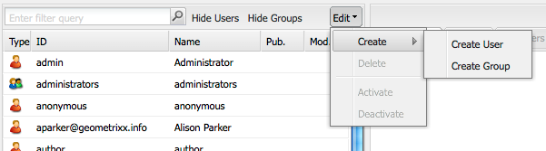

1. Enter the required details, according to whether you are creating a user or a group.

    * If you select **Create User,** you enter the Login ID, first and last name, e-mail address and a password. By default, AEM creates a path based on the first letter of the last name, but you can select another path.

   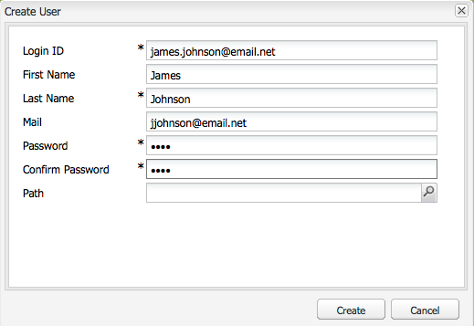

    * If you select **Create Group**, you enter a group ID and an optional description.

   

1. Click **Create**. The user or group you created appears in the tree list.

### Deleting Users and Groups {#deleting-users-and-groups}

To delete a user or group:

1. In the **Security** console, select the user or group you want to delete. If you want to delete multiple items, Shift+click or Control+click to select them.
1. Click **Edit,** then select Delete. AEM WCM asks whether you want to delete the user or group.
1. Click **OK** to confirm or Cancel.

### Modifying User and Group Properties {#modifying-user-and-group-properties}

To modify user and group properties:

1. In the **Security** console, double-click the user or group name you want to modify.

1. Click the **Properties** tab, make the required changes, and click **Save**.

   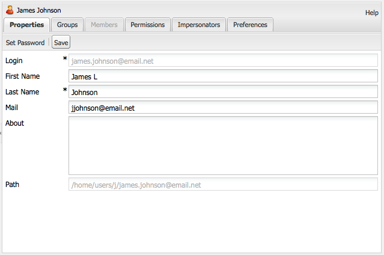

>[!NOTE]
>
>The path of the user is displayed at the bottom of the user properties. It cannot be modified.

### Changing a User Password {#changing-a-user-password}

Use the following procedure to modify a user's password.

>[!NOTE]
>
>You cannot use the Security console to change the admin password. To change the password for the admin account, use the [Users console](/help/sites-administering/granite-user-group-admin.md#changing-the-password-for-an-existing-user) that Granite Operations provides.
>
>If you are using AEM Forms on JEE, do not use below instructions to change password rather use AEM Forms on JEE Admin Console (/adminui) to change the password.

1. In the **Security** console, double-click the user name you want to change the password for.
1. Click the **Properties** tab (if not already active).
1. Click **Set Password**. The Set Password window opens where you can change your password.

   

1. Enter the new password twice; as they are not displayed in clear text, this action is for confirmation - if they do not match, the system shows an error.
1. Click **Set** to activate the new password for the account.

### Adding Users or Groups to a Group {#adding-users-or-groups-to-a-group}

AEM offers three different ways to add users or groups to an existing group:

* When you are in the group, you can add members (either users or groups).
* When you are in the member, you can add members to groups.
* When you are working on Permissions, you can add members to groups.

### Groups - Adding Users or Groups to a Group {#groups-adding-users-or-groups-to-a-group}

The **Groups** tab shows you which groups the current account belongs to. You can use it to add the selected account to a group:

1. Double-click the name of the account (user or group) that you want to assign to a group.
1. Click the **Groups** tab. You see a list of groups that the account already belongs to.
1. In the tree list, click the name of the group you want to add to the account to and drag it to the **Groups** pane. (If you want to add multiple users, Shift+click or Control+click those names and drag them.)

   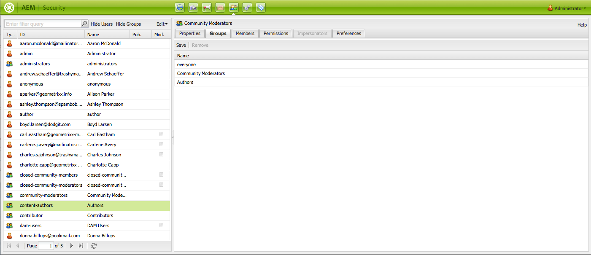

1. Click **Save** to save your changes.

### Members - Adding Users or Groups to a Group {#members-adding-users-or-groups-to-a-group}

The **Members** tab only works for groups and shows you which users and groups belong to the current group. You can use it to add accounts to a group:

1. Double-click the name of the group to which you want to add members.
1. Click the **Members** tab. You see a list of members that already belong to this group.
1. In the tree list, click the name of the member you want to add to the group and drag it to the **Members** pane. (If you want to add multiple users, Shift+click or Control+click those names and drag them.)

   

1. Click **Save** to save your changes.

### Adding Users or Groups while Adding Permissions {#adding-users-or-groups-while-adding-permissions}

To add members to a group at in a certain path:

1. Double-click the name of the group or user that you want to add users to.

1. Click the **Permissions** tab.

1. Navigate to the path that you want to add permissions to and click **Details**. The lower part of the details window provides information about who has permissions for that page.

   

1. Select the check box in the **Member** column for the members that you want to have permissions to that path. Clear the check box for the member that you want to remove permissions for. A red triangle appears in the cell that you changed.
1. Click **OK** to save your changes.

### Removing Users or Groups from Groups {#removing-users-or-groups-from-groups}

AEM offers three different ways to remove users or groups from a group:

* When you are in the group profile, you can remove members (either users or groups).
* When you are in the member profile, you can remove members from groups.
* When you are working on Permissions, you can remove members from groups.

### Groups - Removing Users or Groups from Groups {#groups-removing-users-or-groups-from-groups}

To remove a user or group account from a group:

1. Double-click the name of the group or user account that you want to remove from a group.
1. Click the **Groups** tab. You see what groups the selected account belongs to.
1. In the **Groups** pane, click the name of the user or group you want to remove from the group and click **Remove**. (If you want to remove multiple accounts, Shift+click or Control+click those names and click **Remove**.)

   

1. Click **Save** to save your changes.

### Members - Removing Users or Groups from Groups {#members-removing-users-or-groups-from-groups}

To remove accounts from a group:

1. Double-click the name of the group that you want to remove members from.
1. Click the **Members** tab. You see a list of members that already belong to this group.
1. In the **Members** pane, click the name of the member you want to remove from the group and click **Remove**. (If you want to remove multiple users, Shift+click or Control+click those names and click **Remove**.)

   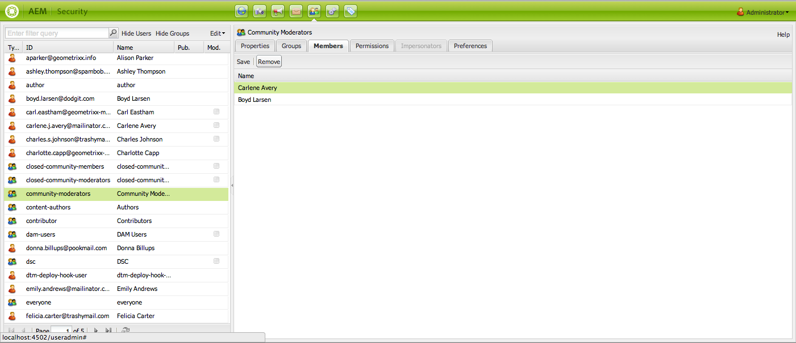

1. Click **Save** to save your changes.

### Removing Users or Groups while Adding Permissions {#removing-users-or-groups-while-adding-permissions}

To remove members from a group at a certain path:

1. Double-click the name of the group or user that you want to remove users from.

1. Click the **Permissions** tab.

1. Navigate to the path that you want to remove permissions to and click **Details**. The lower part of the details window provides information about who has permissions for that page.

   

1. Select the check box in the **Member** column for the members that you want to have permissions to that path. Clear the check box for the member that you want to remove permissions for. A red triangle appears in the cell that you changed.
1. Click **OK** to save your changes.

### User Synchronization {#user-synchronization}

When the deployment is a [publish farm](/help/sites-deploying/recommended-deploys.md#tarmk-farm), users and groups must be synchronized among all publish nodes.

To learn about user sync and how to enable it, see [User Synchronization](/help/sites-administering/sync.md).

## Managing Permissions {#managing-permissions}

>[!NOTE]
>
>Adobe has introduced a new Touch UI based principal view for permissions management. For more details on how to use it, see [this page](/help/sites-administering/touch-ui-principal-view.md).

This section describes how to set permissions, including replication privileges.

### Setting Permissions {#setting-permissions}

Permissions allow users to perform certain actions on resources at certain paths. It also includes the ability to create or delete pages.

To add, modify, or delete permissions:

1. In the **Security** console, double-click the name of the user or group you want to set permissions for or [search for nodes](#searching-for-nodes).

1. Click the **Permissions** tab.

   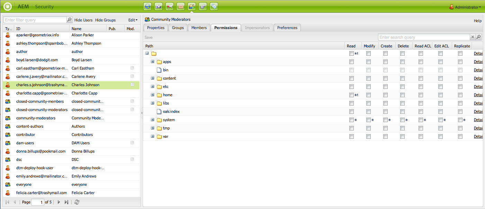

1. In the tree grid, select a check box to allow the selected user or group to perform an action or clear a check box to deny the selected user or group to perform an action. For more information click **Details**.

1. When finished, click **Save**.

### Setting Replication Privileges {#setting-replication-privileges}

Replication privilege is the right to publish content, and it can be set for groups and users.

>[!NOTE]
>
>* Any replication rights applied to a group apply to all the users in that group.
>* A user's replication privileges supersedes a group's replication privileges.
>* The Allow replication rights have a higher precedence than the Deny replication rights. See [Permissions in AEM](#permissions-in-aem) for more information.
>

To set replication privileges:

1. Select the user or group from the list, double-click to open, and click **Permissions**.
1. In the grid, navigate to the path where you want the user to have replication privileges or [search for nodes.](#searching-for-nodes)

1. In the **Replicate** column at the path selected, select a check box to add the replication privilege for that user or group, or clear the check box to remove the replication privilege. AEM displays a red triangle anywhere you have made changes that have not yet been saved.

   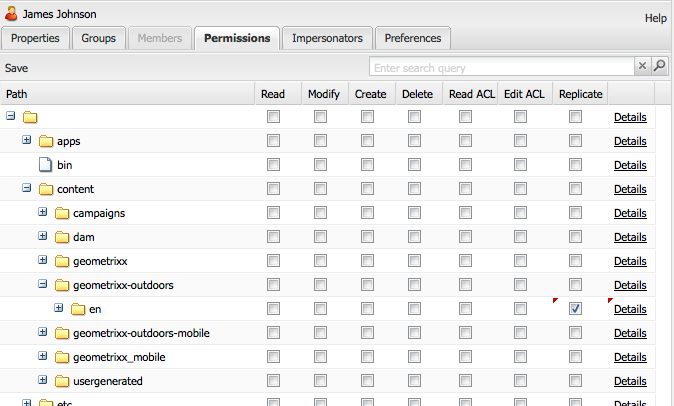

1. Click **Save** to save your changes.

### Searching for nodes {#searching-for-nodes}

When adding or removing permissions, you can either browse or search for the node.

There are two different types of path search:

* Path search - If the search string starts with a "/", then it searches for the direct subnodes of the given path:

In the search box, you can do the following:

|Action | What it does|
|--- |--- |
|Right arrow key|Selects a subnode in the search result|
|Down arrow key|Starts the search again.|
|Enter (Return) key|Selects a subnode and loads it in the tree grid|

* FullText search - If the search string does not start with a "/" then a fulltext search is executed on all the nodes under the path "/content."

To perform a search on paths or fulltext:

1. In the Security console, select a user or group and then click the **Permissions** tab.

1. In the Search box, enter a term to search for.

### Impersonating Users {#impersonating-users}

You can specify one or more users that are allowed to impersonate the current user. This ability means they can switch their account settings to the current user's and act on behalf of this user.

Use this function with caution as it may allow users to perform actions that their own user cannot. When impersonating a user, users are notified that they are not logged in as themselves.

There are various scenarios when you may want to use this functionality, including:

* If you are out of the office, you can let another person impersonate you while you are away. By using this feature, you can make sure that somebody has your access rights and you do not need to modify a user profile or give out your password.
* You can use it for debugging purposes. For example, to see how the Web site looks for a user with restricted access rights. Also, if a user complains about technical problems, you can impersonate that user to diagnose and fix the problem.

To impersonate an existing user:

1. In the tree list, select the name of the person who you want to assign other users to impersonate. Double-click to open.
1. Click the **Impersonators** tab.
1. Click the user that you want to be able to impersonate the selected user. Drag the user (the impersonator) from the list to the Impersonate pane. The name appears in the list.

   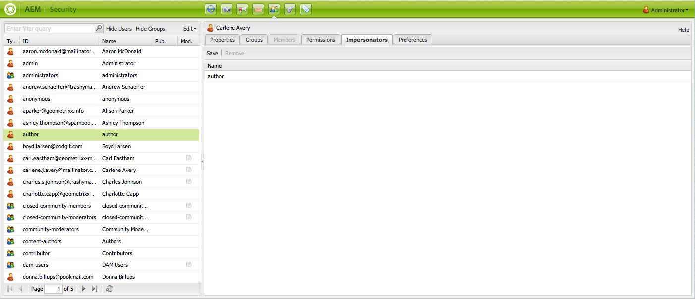

1. Click **Save**.

### Setting User and Group Preferences {#setting-user-and-group-preferences}

To set user and group preferences, including language, window management, and toolbar preferences:

1. Select the user or group whose preferences that you want to change in the left-hand tree. To select multiple users or groups, Ctrl+click or Shift+click your selections.
1. Click the **Preferences** tab.

   

1. Make changes, as necessary to the group or user preferences and click **Save** when finished.

### Setting users or administrators to have the privilege to manage other users {#setting-users-or-administrators-to-have-the-privilege-to-manage-other-users}

To set users or administrators to have the privileges to delete/activate/deactivate other users:

1. Add the user that you want to give privileges to manage other users to the administrator group and save your changes.

   

1. In the user's **Permissions** tab, navigate to "/" and in the Replicate column, select the check box to allow replication at "/" and click **Save**.

   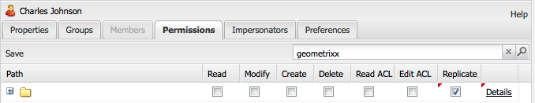

   The selected user can now deactivate, activate, delete, and create users.

### Extending Privileges on a Project Level {#extending-privileges-on-a-project-level}

If you plan to implement application-specific privileges, the following information describes what you must know to implement a custom privilege and how to enforce it throughout CQ:

The hierarchy-modification privilege is covered by a combination of jcr-privileges. The replication privilege is named **crx:replicate** that is stored/evaluated along with other privileges on the jcr repository. It is, however, not enforced on the jcr level.

The definition and registration of custom privileges is officially part of the [Jackrabbit API](https://jackrabbit.apache.org/oak/docs/security/privilege.html) as of version 2.4 (see also [JCR-2887](https://issues.apache.org/jira/browse/JCR-2887)). Further usage is covered by JCR Access Control Management such as definedby [JSR 283](https://jcp.org/en/jsr/detail?id=283) (section 16). In addition, the Jackrabbit API defines a couple of extensions.

The privilege registration mechanism is reflected in the UI under **Repository Configuration**.

The registration of new (custom) privileges is itself protected by a built-in privilege that must be granted on the repository level. In JCR: passing 'null' as the 'absPath' parameter in the ac mgt api, see jsr 333 for details. By default, **admin** and all members of administrators have that privilege granted.

>[!NOTE]
>
>While the implementation takes care of validating and evaluating custom privileges, it cannot enforce them unless they are aggregates of built-in privileges.
