# Configuring Segmentation with ContextHub{#configuring-segmentation-with-contexthub}

>[!NOTE]
>
>This section describes configuring segmentation when using the ContextHub. If you are using the Client Context functionality, see the relevant documentation for [configuring segmentation for Client Context](/help/sites-administering/campaign-segmentation.md).
>

Segmentation is a key consideration when creating a campaign. See [Managing Audiences](/help/sites-authoring/managing-audiences.md) for information on how segmentation works and key terms.

Depending on the information you have already collected about your site visitors and the goals you want to achieve, you must define the segments and strategies needed for your targeted content.

These segments are then used to provide a visitor with specifically targeted content. This content is maintained in the [Personalization](/help/sites-authoring/personalization.md) section of the website. [Activities](/help/sites-authoring/activitylib.md) defined here can be included on any page and define which visitor segment the specialized content is applicable for.

AEM lets you easily personalize your users' experience. It also lets you verify the results of your segment definitions.

## Accessing Segments {#accessing-segments}

The [Audiences](/help/sites-authoring/managing-audiences.md) console is used to manage segments for ContextHub or Client Context and audiences for your Adobe Target account. This documentation covers managing segments for ContextHub. For [Client Context segments](/help/sites-administering/campaign-segmentation.md) and Adobe Target segments, see the relevant documentation.

To access your segments you need to select your configuration. In global navigation select **Navigation &gt; Personalization &gt; Audiences**. You will see the available configurations:

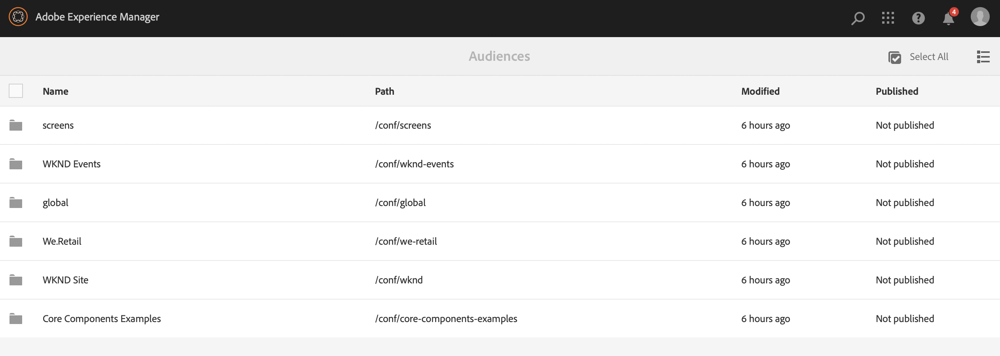

Select your configuration to see the segments, for example, WKND Site:

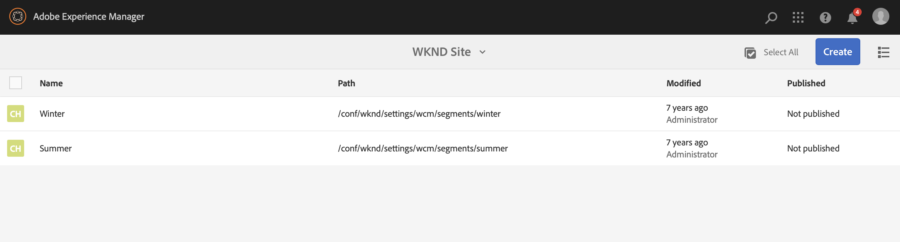

## Segment Editor {#segment-editor}

The **Segment Editor** lets you easily modify a segment. To edit a segment, select a segment in the [list of segments](/help/sites-administering/segmentation.md#accessing-segments) and click the **Edit** button.

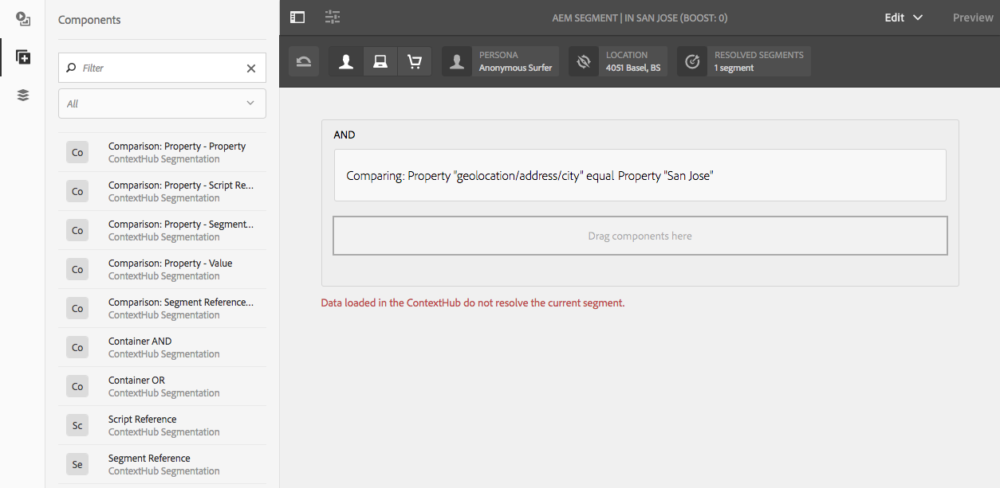

Using the components browser you can add **AND** and **OR** containers to define the segment logic, then add additional components to compare properties and values or reference scripts and other segments to define the selection criteria (see [Creating a New Segment](#creating-a-new-segment)) to define the exact scenario for selecting the segment.

When the entire statement evaluates to true then the segment has resolved. If there are multiple applicable segments, then the **Boost** factor is also used. See [Creating a New Segment](#creating-a-new-segment) for details on the [boost factor.](/help/sites-administering/campaign-segmentation.md#boost-factor)

>[!CAUTION]
>
>The segment editor does not check for any circular references. For example, segment A references another segment B, which in turn references segment A. Ensure that your segments do not contain any circular refernces.

### Containers {#containers}

The following containers are available out-of-the-box and let you group comparisons and references together for boolean evaluation. They can be dragged from the components browser to the editor. See the following section [Using AND and OR Containers](/help/sites-administering/segmentation.md#using-and-and-or-containers) for more information.

<table>
 <tbody>
  <tr>
   <td>Container AND<br /> </td>
   <td>The boolean AND operator<br /> </td>
  </tr>
  <tr>
   <td>Container OR<br /> </td>
   <td>The boolean OR operator</td>
  </tr>
 </tbody>
</table>

### Comparisons {#comparisons}

The following segment comparisons are available out-of-the-box to evaluate segment properties. They can be dragged from the components browser to the editor.

<table>
 <tbody>
  <tr>
   <td>Property-Value<br /> </td>
   <td>Compares a property of a store to a defined value<br /> </td>
  </tr>
  <tr>
   <td>Property-Property</td>
   <td>Compares one property of a store to another property<br /> </td>
  </tr>
  <tr>
   <td>Property-Segment Reference</td>
   <td>Compares a property of a store to another referenced segment<br /> </td>
  </tr>
  <tr>
   <td>Property-Script Reference</td>
   <td>Compares a property of a store to the results of a script<br /> </td>
  </tr>
  <tr>
   <td>Segment Reference-Script Reference</td>
   <td>Compares a referenced segment to the results of a script<br /> </td>
  </tr>
 </tbody>
</table>

>[!NOTE]
>
>When comparing values, if the data type of the comparison is not set (that is, set to auto detect), ContextHub's segmentation engine will simply compare the values as javascript would. It does not cast values to their expected types, which can lead to misleading results. For example:
>
>`null < 30 // will return true`
>
>Therefore when [creating a segment](/help/sites-administering/segmentation.md#creating-a-new-segment), you should select a **data type** whenever the types of compared values are known. For example:
>
>When comparing the property `profile/age`, you already know that the compared type will be **number**, so even if `profile/age` is not set, a comparison `profile/age` less-than 30 will return **false**, as you would expect.

### References {#references}

The following references are available out-of-the-box to link directly to a script or another segment. They can be dragged from the components browser to the editor.

<table>
 <tbody>
  <tr>
   <td>Segment Reference<br /> </td>
   <td>Evaluate the referenced segment</td>
  </tr>
  <tr>
   <td>Script Reference</td>
   <td>Evaluate the referenced script. See the following section <a href="/help/sites-administering/segmentation.md#using-script-references">Using Script References</a> for more information.</td>
  </tr>
 </tbody>
</table>

## Creating a New Segment {#creating-a-new-segment}

To define your new segment:

1. After [accessing the segments](/help/sites-administering/segmentation.md#accessing-segments), [navigate to the folder](#organizing-segments) where you would like to create the segment.

1. click the Create button and select **Create ContextHub Segment**.

   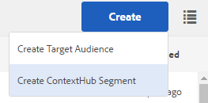

1. In the **New ContextHub Segment**, enter a title for the segment and a boost value if necessary and then click **Create**.

   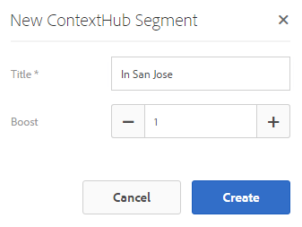

   Each segment has a boost parameter that is used as a weighting factor. A higher number indicates that the segment will be selected in preference to a segment with a lower number in instances where multiple segments are valid.

    * Minimum value: `0`
    * Maximum value: `1000000`

1. Drag a comparison or reference to the segment editor it will appear in the default AND container.
1. Double-click the configure option of the new reference or segment to edit the specific parameters. In this example, we are testing for people in San Jose.

   

   Always set a **Data Type** if possible to ensure that your comparisons are evaluated properly. See [Comparisons](/help/sites-administering/segmentation.md#comparisons) for more information.

1. Click **OK** to save your definition:
1. Add more components as required. You can formulate boolean expressions using the container components for AND and OR comparisons (see [Using AND and Or Containers](/help/sites-administering/segmentation.md#using-and-and-or-containers) below). With the segment editor you can delete components not needed anymore, or drag them to new positions within the statement.

### Using AND and OR Containers {#using-and-and-or-containers}

Using the AND and OR container components, you can construct complex segments in AEM. When doing this, it helps to be aware of a few basic points:

* The top-level of the definition is always the AND container that is initially created. This cannot be changed, but does not have an effect on the rest of your segment definition.
* Ensure that the nesting of your container makes sense. The containers can be viewed as the brackets of your boolean expression.

The following example is used to select visitors who are considered in our prime age group:

Male and between the ages of 30 and 59

OR

Female and between the ages of 30 and 59

You start by placing an OR container component within the default AND container. Within the OR container, you add two AND containers and within both of these you can add the property or reference components.

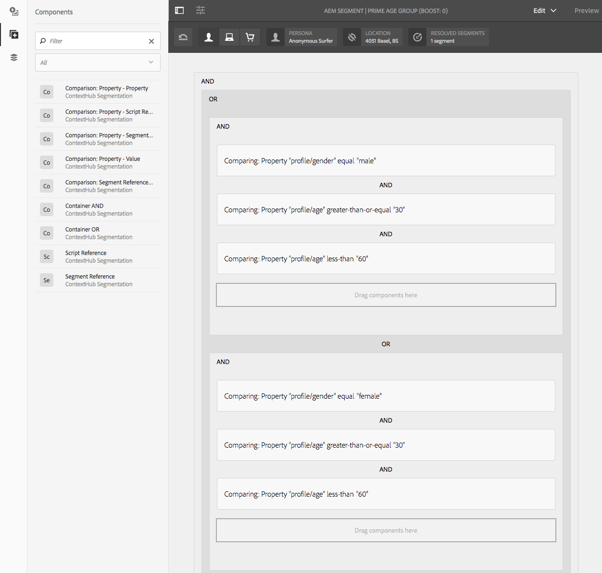

### Using Script References {#using-script-references}

By using the Script Reference component, the evaluation of a segment property can be delegated to an external script. Once the script is configured properly, it can be used as any other component of a segment condition.

#### Defining a Script to Reference {#defining-a-script-to-reference}

1. Add file to `contexthub.segment-engine.scripts` clientlib.
1. Implement a function that returns a value. For example:

   ```
   ContextHub.console.log(ContextHub.Shared.timestamp(), '[loading] contexthub.segment-engine.scripts - script.profile-info.js');

   (function() {
       'use strict';

       /**
        * Sample script returning profile information. Returns user info if data is available, false otherwise.
        *
        * @returns {Boolean}
        */
       var getProfileInfo = function() {
           /* let the SegmentEngine know when script should be re-run */
           this.dependOn(ContextHub.SegmentEngine.Property('profile/age'));
           this.dependOn(ContextHub.SegmentEngine.Property('profile/givenName'));

           /* variables */
           var name = ContextHub.get('profile/givenName');
           var age = ContextHub.get('profile/age');

           return name === 'Joe' && age === 123;
       };

       /* register function */
       ContextHub.SegmentEngine.ScriptManager.register('getProfileInfo', getProfileInfo);

   })();
   ```

1. Register the script with `ContextHub.SegmentEngine.ScriptManager.register`.

If the script depends on additional properties, the script should call `this.dependOn()`. For example, if the script depends on `profile/age`:

```
this.dependOn(ContextHub.SegmentEngine.Property('profile/age'));
```

#### Referencing a Script {#referencing-a-script}

1. Create ContextHub segment.
1. Add **Script Reference** component in the desired place of the segment.
1. Open the edit dialog of the **Script Reference** component. If [properly configured](/help/sites-administering/segmentation.md#defining-a-script-to-reference), the script should be available in the **Script name** drop-down.

## Organizing Segments {#organizing-segments}

If you have many segments, they can become hard to manage as a flat list. In such cases, it can be useful to create folders to manage your segments.

### Create a New Folder {#create-folder}

1. After [accessing the segments](#accessing-segments), click the **Create** button and select **Folder**.

   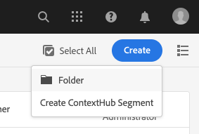

1. Provide a **Title** and a **Name** for your folder.
   * The **Title** should be descriptive.
   * The **Name** will become the node name in the repository.
      * It will be automatically generated based on the title and adjusted according to [AEM naming conventions.](/help/sites-developing/naming-conventions.md)
      * It can be adjusted if necessary.

    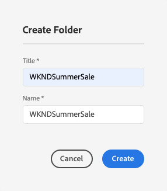

1. Click **Create**.

   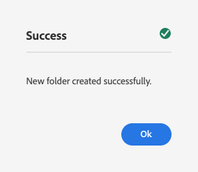

1. The folder will appear in the list of segments.
   * How you sort your columns will affect where in the list the new folder appears.
   * You can click the column headings to adjust your sort.
   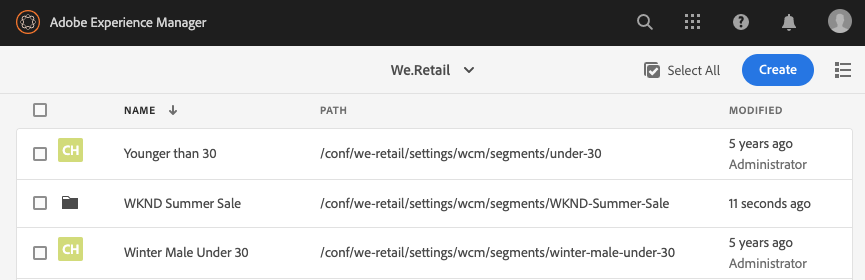

### Modify Existing Folders {#modify-folders}

1. After [accessing the segments](#accessing-segments), click the folder you wish to modify to select it.

   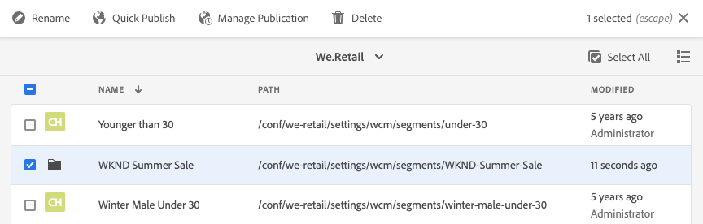

1. Click **Rename** in the toolbar to rename the folder.

1. Provide a new **Folder Title** and click **Save**.

   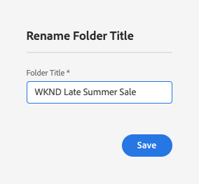

>[!NOTE]
>
>When renaming folders, only the title can be changed. The name cannot be changed.

### Delete a Folder

1. After [accessing the segments](#accessing-segments), click the folder you wish to modify to select it.

   

1. Click **Delete** in the toolbar to delete the folder.

1. A dialog presents a list of folders selected for deletion.

   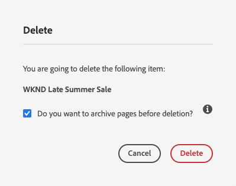

   * Click **Delete** to confirm.
   * Click **Cancel** to abort.

1. If any of the selected folders contains subfolders or segments, their deletion must be confirmed.

   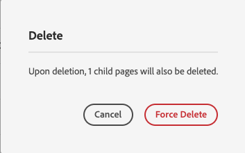

   * Click **Force Delete** to confirm.
   * Click **Cancel** to abort.

>[!NOTE]
>
>It is not possible to move a segment from one folder to another.

## Testing the Application of a Segment {#testing-the-application-of-a-segment}

Once the segment has been defined, potential results can be tested with the help of the **[ContextHub](/help/sites-authoring/ch-previewing.md).**

1. Preview a page
1. Click the ContextHub icon to reveal the ContextHub toolbar
1. Select a persona that matches the segment you created
1. The ContextHub will resolve the applicable segments for the selected persona

For example, our simple segment defintion to identify users in our prime age group is a simple segment definition is based on the age and gender of the user. Loading a specific persona that matches those criteria shows if that the segment is successfully resolved:


Or if it is not resolved:

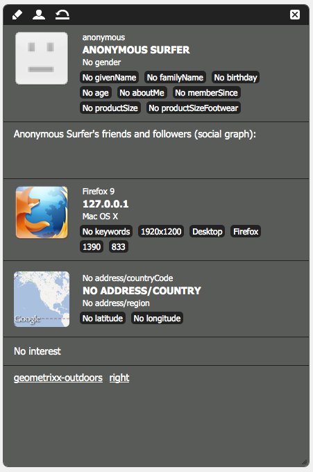

>[!NOTE]
>
>All traits are resolved immediately, though most only change on page reload.

Such tests can also be performed on content pages and in combination with targeted content and related **Activities** and **Experiences**.

If you have set up an activity and experience using the prime age group segment example above, you can easily test your segment with the activity. For details about setting up an activity, see the related [documentation on authoring targeted content](/help/sites-authoring/content-targeting-touch.md).

1. In editing mode of a page where you have set up targeted content, you can see that the content is targeted via arrow icon on the content.

   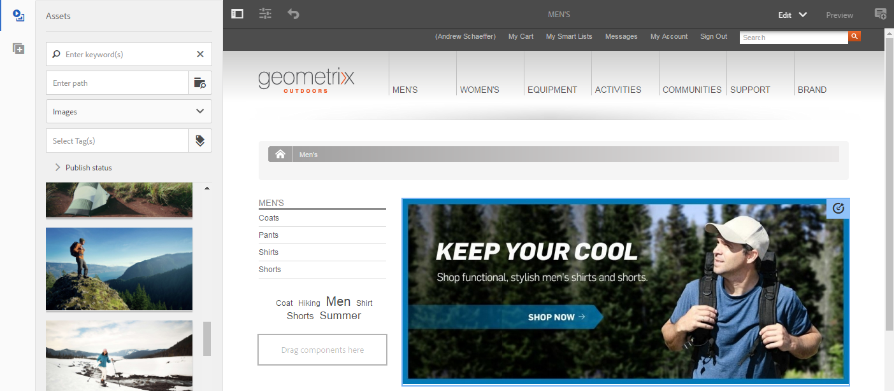

1. Switch to preview mode and using the context hub, switch to a persona that does not match the segmentation configured for the experience.

   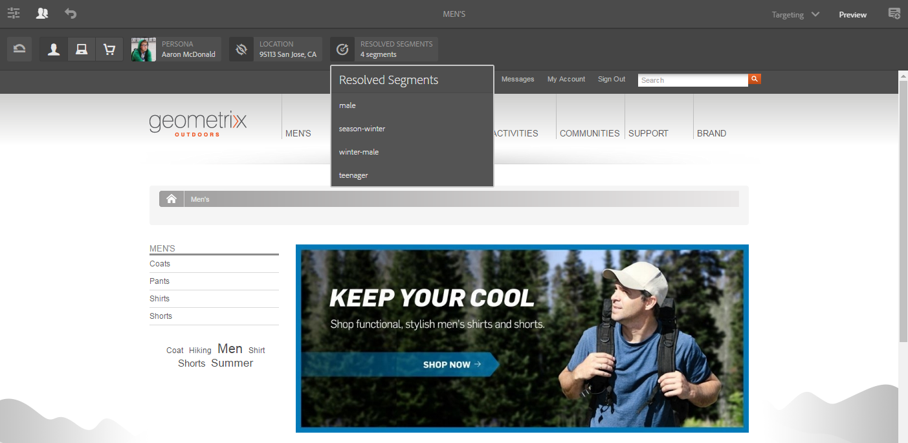

1. Switch to a persona that does match the segmentation configured for the experience and see that the experience changes accordingly.

   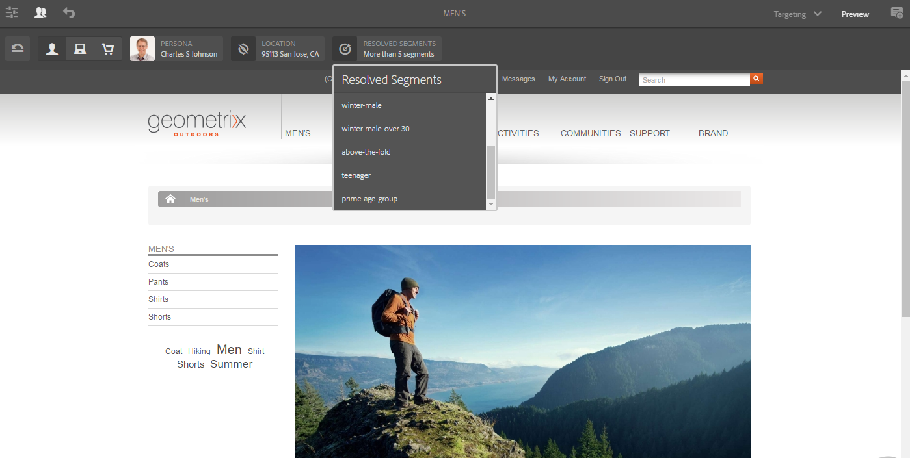

## Using Your Segment {#using-your-segment}

Segments are used are used to steer the actual content seen by specific target audiences. See [Managing Audiences](/help/sites-authoring/managing-audiences.md) for more information about audiences and segments and [Authoring Targeted Content](/help/sites-authoring/content-targeting-touch.md) about using audiences and segments to target content.
