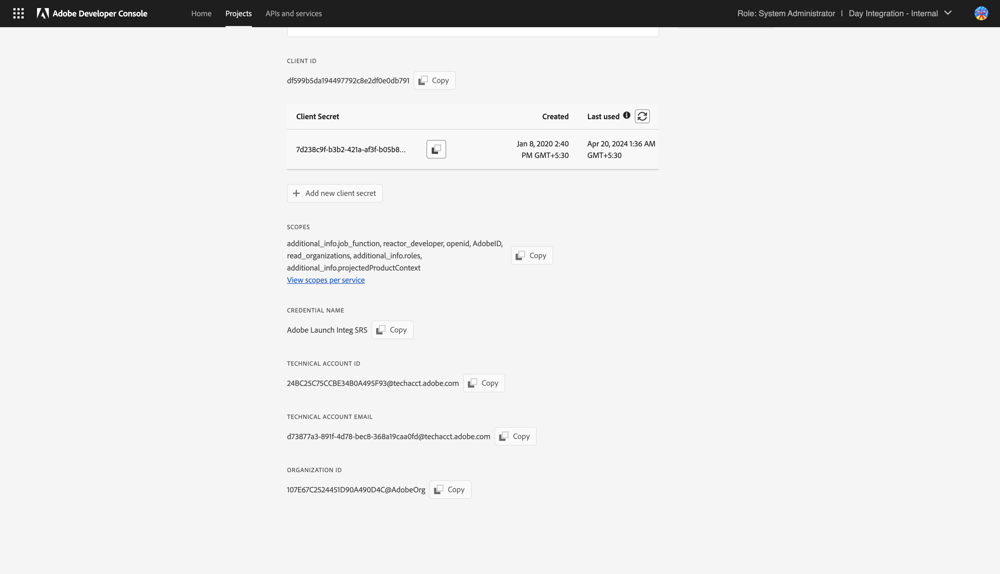
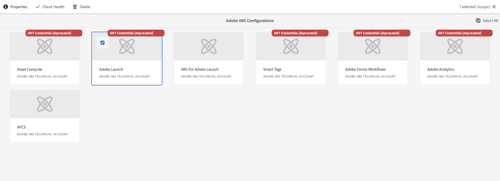
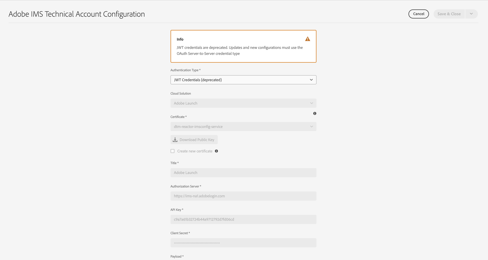
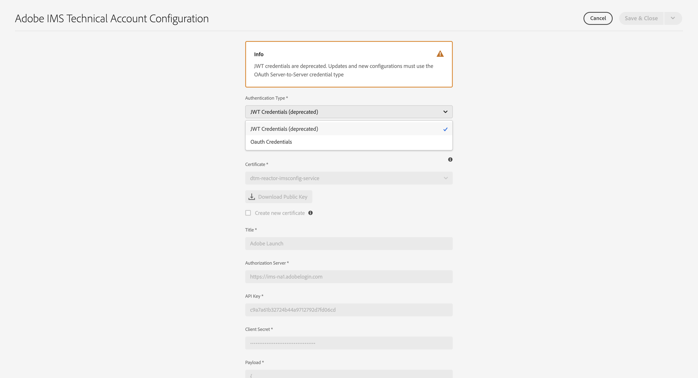
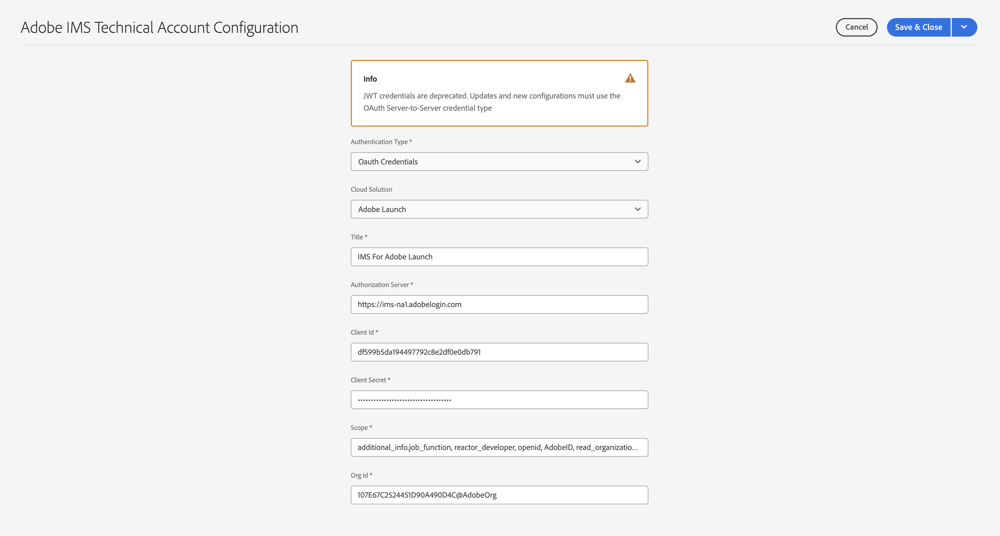

# Setting Up IMS Integrations for AEM {#setting-up-ims-integrations-for-aem}

>[!NOTE]
>
>Adobe customers use [Adobe Developer Console](https://developer.adobe.com/console) to generate credentials that enable access to various APIs. Customers select from various credential types ranging from OAuth Server-to-Server to Single-Page App. One of those credential types, Service Account (JWT) credentials, has been deprecated in favor of the OAuth Server-to-Server credentials with Service Pack 20. This change can be back ported to older Service Packs, starting with Service Pack 11 up to Service Pack 20 with the use of a hotfix that you can download [here](https://experience.adobe.com/#/downloads/content/software-distribution/en/aem.html?package=/content/software-distribution/en/details.html/content/dam/aem/public/adobe/packages/cq650/hotfix/ims-jwt-compatibility-package-6.5-1.0.zip). 

Adobe Experience Manager (AEM) can be integrated with many other Adobe solutions. For example, Adobe Target, Adobe Analytics, and others. 

The integrations use an IMS integration, configured with S2S OAuth.

* Once you have created:

  * [Credentials in the Developer Console](#credentials-in-the-developer-console) 

* Then you can:

  * Create a (new) [OAuth configuration](#creating-oauth-configuration)

  * [Migrate an existing JWT configuration to an OAuth configuration](#migrating-existing-JWT-configuration-to-oauth)

>[!CAUTION]
>
>Previously, configurations were made with [JWT Credentials that are now subject to deprecation in the Adobe Developer Console](/help/sites-administering/jwt-credentials-deprecation-in-adobe-developer-console.md).
>
>Such configurations can no longer be created or updated, but can be migrated to OAuth configurations. 

## Credentials in the Developer Console {#credentials-in-the-developer-console}

As the first step you need to configure the OAuth credentials in the Adobe Developer Console. 

For details on how to do this, see the Developer Console documentation, depending on your requirements:

* Overview:

  * [Server to Server authentication](https://developer.adobe.com/developer-console/docs/guides/authentication/ServerToServerAuthentication/)

* Creating a new OAuth credential:

  * [OAuth Server-to-Server credential implementation guide](https://developer.adobe.com/developer-console/docs/guides/authentication/ServerToServerAuthentication/implementation/)

* Migrating an existing JWT credential to an OAuth credential:

  * [Migrating from Service Account (JWT) credential to OAuth Server-to-Server credential](https://developer.adobe.com/developer-console/docs/guides/authentication/ServerToServerAuthentication/migration/)

For example:

## Creating an OAuth configuration {#creating-oauth-configuration}

To create a new Adobe IMS Integration using OAuth:

1. In AEM, navigate to **Tools**, **Security**, **Adobe IMS Integration**.

1. Select **Create**.

1. Complete the configuration based on details from the [Developer Console](https://developer.adobe.com/developer-console/docs/guides/authentication/ServerToServerAuthentication/implementation/). For example:

   

1. **Save** your changes.

## Migrating an existing JWT configuration to an OAuth configuration {#migrating-existing-JWT-configuration-to-oauth}

To migrate an existing Adobe IMS Integration based on JWT credentials:

>[!NOTE]
>
>This example shows a Launch IMS Configuration.

1. In AEM, navigate to **Tools**, **Security**, **Adobe IMS Integration**.

1. Select the JWT configuration that needs to be migrated. JWT configurations are marked with the warning **JWT Credentials (deprecated)**.

1. Select **Properties**:

   

1. The configuration will open as read-only:

   

1. Select **OAuth** from the **Authentication Type** dropdown:

   

1. The properties available will be updated. Use details from the Developer Console to complete them:

   

1. Use **Save & Close** to persist your updates. 
   When you return to the console the **JWT Credentials (deprecated)** warning will be gone.
