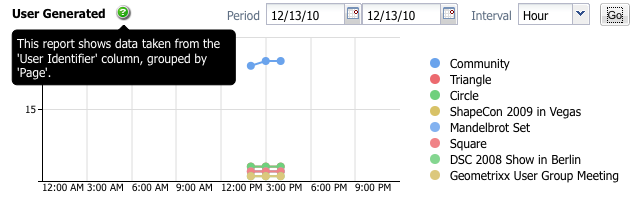

# SharePoint Connector{#sharepoint-connector}

This article includes details around the Adobe JCR Connector for Microsoft SharePoint 2010 and Microsoft SharePoint 2013, version 4.0.

The SharePoint connector supports the following base functionalities:

* Reading content and metadata from SharePoint.
* Acknowledging SharePoint security settings for accessed content by applying native SharePoint authentication and authorization
* Content Integration using Content Finder
* Using AEM components, such as External Resource to display SharePoint images and videos
* Synchronizing SharePoint with AEM Assets

All functionalities are implemented using the native SharePoint web services as the interface to SharePoint content and services.

>[!NOTE]
>
>SharePoint Connector is also supported with AEM 6.1 service pack 2. The connector no longer supports virtual repository mount and, therefore, it cannot be mounted. If you want to access the Sharepoint repository using Java APIs, use the Sharepoint connector's JCR repository implementation in your project.
>
>Installation, configuration, management, and IT operations of the SharePoint server and related IT infrastructure are outside the scope of this document. See vendor documentation on [SharePoint](https://www.microsoft.com/sharepoint) for information about these topics. The connector requires these parts of the infrastructure to be properly installed, configured, and operated.
>

## Getting started {#getting-started}

To get started with the connector, do the following:

* Ensure that you have at least Java 7 installed.
* Download the connector package distribution file from Software Distribution.
* Copy a valid *license.properties* file to the directory that contains the *cq-quickstart-6.4.0.jar* file.

* Double-click the .jar file to start AEM, or start it from the command line.
* Install the connector package from Package Manager.
* Configure the connector options.

## Installing SharePoint connector {#installing-sharepoint-connector}

The connector is a content package that facilitates easy installation. Install the package using Package Manager, and then set the SharePoint server URL
and other configuration options. The SharePoint content is available in the AEM repository.

### Installation requirements {#installation-requirements}

The connector requires the following:

* Java Runtime Environment 1.7 or later
* SharePoint Web Services available through the network
* SharePoint server URL
* User credentials and permissions for CRX and SharePoint repositories
* [Supported platforms](#supported-platforms)

The SharePoint connector is available for downloading from [Software Distribution](https://experience.adobe.com/#/downloads/content/software-distribution/en/aem.html?package=/content/software-distribution/en/details.html/content/dam/aem/public/adobe/packages/cq630/featurepack/cq-6.3.0-featurepack-17673).

### Supported Platforms {#supported-platforms}

The connector supports the following:

* AEM versions:

    * AEM 6.4, 6.3

* Microsoft SharePoint versions:

    * Microsoft Office SharePoint Server (MOSS) 2010
    * Microsoft Office SharePoint Server (MOSS) 2013

* If you require support for custom deployments of the connector (OEM, special requirements, customized authentication methods), contact the Adobe office for your region.

>[!NOTE]
>
>The connector only supports configurations officially supported by Microsoft. See [MOSS 2010](https://technet.microsoft.com/en-us/library/cc262485(office.14).aspx) and [MOSS 2013](https://technet.microsoft.com/en-us/library/cc262485.aspx) system requirements.

### Standard installation {#standard-installation}

Software Distribution is used to distribute product features, examples, and hot fixes. For details, see the [Software Distribution documentation](https://experienceleague.adobe.com/docs/experience-cloud/software-distribution/home.html#software-distribution).


#### Integrating with AEM {#integrating-with-aem}

To install the connector content package.

1. Open an Adobe Support ticket to request for the connector featurepack.
1. Download the package when it is available and then open Package Manager for your AEM instance.
1. Click **Install** from the package description page.
1. From the **Install Package** dialog, click **Install**.

   **Note**: Make sure that you are logged-in as administrator.

1. When the package is installed, click **Close**.

## Configuring SharePoint connector {#configuring-sharepoint-connector}

After you install the SharePoint connector, configure the application and the SharePoint layers for the connector.

Set the SharePoint server URL to make your SharePoint repository JCR compliant. You can set extra parameters to configure the connection with the SharePoint server. In addition, configure authentication with the SharePoint connector.

### Configuring the connection with the SharePoint server {#configuring-the-connection-with-the-sharepoint-server}

To set the URL of the SharePoint server and advanced options, perform these steps:

1. Navigate to the OSGi Management Console: [http://localhost:4502/system/console/configMgr](http://localhost:4502/system/console/configMgr).
1. Search for the **Day JCR Connector for Microsoft Sharepoint** bundle.
1. Edit the configuration values.
1. Set the SharePoint Server URL as the value of **Workspaces**.
1. Click **Save**.



'Workspaces' and 'Default Workspace Name' parameters:

By default the connector exposes a single JCR workspace. The SharePoint server which is exposed by this workspace is set through the 'Sharepoint Server URL' configuration parameter.

The connector can also be configured for multiple workspaces. In this case, each workspace is associated with the URL of the respective SharePoint server that is exposed through the workspace. To add a workspace, add a workspace definition to the Workspaces parameter. A workspace definition has the following format:
`<name>`= `<url>` where
`<name>` is the name of the JCR workspace and
`<url>` is the URL of the SharePoint server for that workspace.

In AEM, perform one more step apart from above configuration steps. Allow list the '**com.day.cq.dam.cq-dam-jcr-connectors**' bundle.

To allow list bundles in AEM, perform the following steps:

1. Navigate to the OSGi Management Console: http://localhost:4502/system/console/configMgr.
1. Search for "Apache Sling Login Admin Whitelist" service.
1. Select **Bypass the whitelist**.
1. Add `com.day.cq.dam.cq-dam-jcr-connectors` in whitelist bundles default
1. Click Save.


>[!NOTE]
>
>If you configure multiple workspaces, specify the name of the default workspace in the Default Workspace Name parameter.

For additional information around authentication-related parameters, see [Authentication](/help/sites-administering/sharepoint-connector.md#configuring-authentication).

### Verifying the Sharepoint setup {#verifying-the-sharepoint-setup}

After you configure the connector, verify the following:

* SharePoint server runs, and the web services are accessible to the connector instance
* SharePoint user credentials are valid and the user has necessary SharePoint permissions
* The connector is installed and configured properly

### Configuring DAM Sync with the SharePoint server {#configuring-dam-sync-with-the-sharepoint-server}

To synchronize the SharePoint Assets with AEM, perform the following steps:

1. Navigate to the OSGi Management Console: [http://localhost:4502/system/console/configMgr](http://localhost:4502/system/console/configMgr).
1. Search for "Default DAMAssetSynchronization" service.
1. Edit the configuration values.
1. Set the user name and the corresponding Password of the user having access on the SharePoint site.
1. Click Save.

Enable the DAM Sync Service, which is disabled by default:

1. Navigate to the OSGi Web Console Components: [http://localhost:4502/system/console/components](http://localhost:4502/system/console/components)
1. Search for "com.day.cq.dam.jcrconnectors.impl.AssetSynchronizationService."
1. Click Enable.

Optionally, you can configure the Synchronization delay between different synchronization cycles:

1. Navigate to the OSGi Management Console: [http://localhost:4502/system/console/configMgr](http://localhost:4502/system/console/configMgr)
1. Search for "DAY CQ DAM JCR Connector Asset Synchronization Service."
1. Edit the configuration values.
1. Set the value of the Synchronization Period (in seconds).
1. Click Save.

### Configuring Authentication {#configuring-authentication}

Sharepoint includes the Classic and Claims Based authentication methods, both of which support the following authentication types:

* Basic
* Forms-Based

In particular, the following types of authentication are available:

* Classic-Basic
* Classic-Forms-based
* Claims-Basic
* Claims-Forms-based

The AEM JCR Connector for Microsoft SharePoint 2010 and Microsoft SharePoint 2013, version 4.0. supports Claims-based authentication (which is suggested by Microsoft), which operates in the following modes:

* **Basic/NTLM authentication**: The connector first tries to connect using basic authentication. If not available, it switches to NTLM-based authentication.
* **Forms-based authentication**: Sharepoint validates users based on credentials that users type in a login form (typically a web page). The system issues a token for authenticated requests that contains a key for reestablishing the identity for subsequent requests.

**Configuring Forms Based Authentication**

Go to: [http://localhost:4502/system/console/bundles](http://localhost:4502/system/console/bundles)

1. Click OSGI > Configuration
1. Search "Day JCR Connector for Microsoft Sharepoint"
1. Click "Edit the configuration values"
1. Set the value of 'Sharepoint Connection Factory' as 'com.day.crx.spi.sharepoint.security.FormsBasedAuthenticationConnectionFactory'
1. Click **Save**.

**Configuring Basic Authentication (Windows)**

1. [Disable Token Authentication](#disable-token-authentication).
1. Go to [http://localhost:4502/system/console/bundles](http://localhost:4502/system/console/bundles).
1. Click OSGI &gt; Configuration.
1. Search for **Day JCR Connector for Microsoft Sharepoint**.
1. Click `Edit the configuration values`.
1. Set the value of Sharepoint Connection Factory to `com.day.crx.spi.sharepoint.security.WindowsAuthenticationConnectionFactory`.
1. Click **Save**.

Only a user who is authenticated on both AEM and SharePoint can access the SharePoint content through the connector.

You can also use the connector extension for authentication to create a custom authentication module, which, for example, maps access by AEM users to specific SharePoint users. Create AEM users corresponding to SharePoint users (user name and password should match) to be able to see SharePoint content mapped to the connector instance.

To create a user in AEM:

1. Login to http://localhost:9502/with the admin user.
1. Click Tools.
1. Click Security.
1. Click Users.
1. Click **Create User**.
1. Provide the user ID (User name having access on SharePoint).
1. Provide the corresponding password.
1. Click the Green tick symbol to create the user.

To add the user in the admin group:

1. Go to Group Administration.
1. Click the 'a' node.
1. Click 'administrators'.
1. Type the user ID create above in the text box before **Browse** button.
1. Click the Green tick symbol to add the user to admin group.

### Disable Token Authentication {#disable-token-authentication}

1. Download and install the package `basic auth`. `zip` from Software Distribution.

1. Close Quickstart.
1. Open the file *\crx-quickstart\repository\repository.xml*.
1. Find the tag `<LoginModule class="com.day.crx.core.CRXLoginModule"> ... </LoginModule>.`
1. Insert the tag `<param name="disableTokenAuth" value="true"/>` inside the tag mentioned in step 4.
1. Save and close the xml file.
1. Restart QuickStart and log in with your credentials.

#### Supporting different authentication methods of the SharePoint server {#supporting-different-authentication-methods-of-the-sharepoint-server}

In its standard version, the connector supports the standard IIS **Windows** authentication (Basic) and Forms-based authentication (token based). The [other authentication methods](https://technet.microsoft.com/en-us/library/cc262350.aspx#section2) can be supported through the extensibility mechanism.

The following steps provide guidelines around extending the standard authentication to support various authentication methods of the SharePoint server:

1. Implement `com.day.crx.spi.sharepoint.security.SharepointConnectionFactory` to handle the client side of your specific authentication process.
1. Install the `SharepointConnectionFactory` implementation as a fragment bundle with fragment host `com.day.crx.spi.crx2sharepoint-bundle`.

   When using Maven, adapt the following configuration of the `maven-bundle-plugin` to the requirements of your project:

   ```xml
              <plugin>
                  <groupId>org.apache.felix</groupId>
                  <artifactId>maven-bundle-plugin</artifactId>
                  <extensions>true</extensions>
                  <configuration>
                      <instructions>
                          <Export-Package />
                          <Private-Package>
                              <!-- your private package here -->
                          </Private-Package>
                          <Fragment-Host>
                              com.day.crx.spi.crx2sharepoint-bundle
                          </Fragment-Host>
                       </instructions>
                  </configuration>
              </plugin>
   ```

1. Register the `SharepointConnectionFactory` implementation in the connector configuration. In the configuration window of the connector, click **Advanced options**. In the for **Sharepoint Connection Factory** field, specify the name of the implementation `com.day.crx.spi.sharepoint.auth.CustomConnectionFactory`.

1. Restart the connector.
