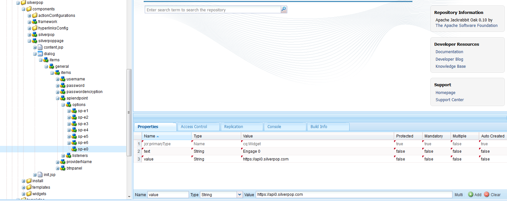
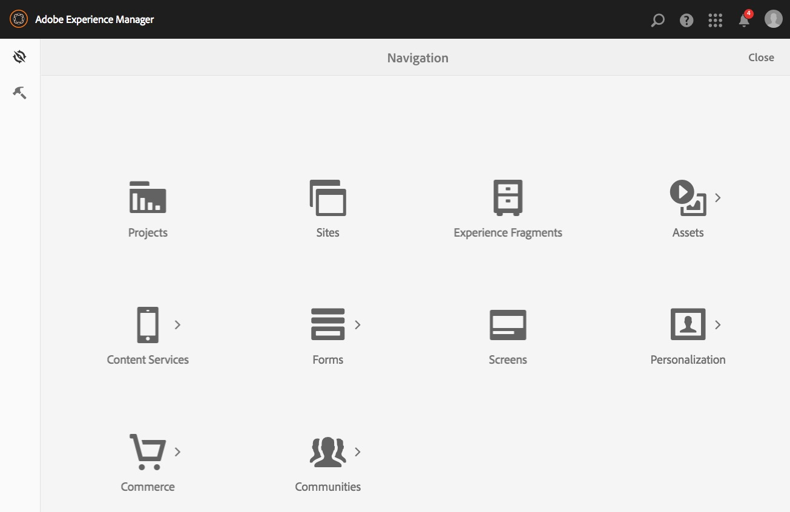

# Integrating with Silverpop Engage{#integrating-with-silverpop-engage}

<!-- THIS ENTIRE TOPIC APPEARS OBSOLETE BECAUSE SILVERPOP NO LONGER EXISTS AND THERE ARE NO REDIRECTS FOR THE DOWNLOAD URL BELOW THAT IS 404.
>[!NOTE]
>
>Silverpop integration is **not** available out of the box. You must download the Silverpop integration package `https://www.adobeaemcloud.com/content/marketplace/marketplaceProxy.html?packagePath=/content/companies/public/adobe/packages/aem620/product/cq-mcm-integrations-silverpop-content` from Package Share and install it on your instance. After you have installed the package, you can configure it as described in this document. -->

Integrating AEM with Silverpop Engage lets you manage and send emails created in AEM via Silverpop. It also allows you to use the lead management features of Silverpop via AEM forms on AEM pages.

The integration provides you with the following features:

* The ability to create Emails in AEM and publish them to Silverpop for distribution.
* The ability to set action of a AEM form to create a Silverpop subscriber.

After Silverpop Engage is configured, you can publish newsletters or emails to Silverpop Engage.

## Creating a Silverpop Configuration {#creating-a-silverpop-configuration}

Silverpop configurations can be added by way of **Cloud Services**, **Tools**, or **API end points**. All methods are described in this section.

### Configuring Silverpop by way of Cloud Services {#configuring-silverpop-via-cloudservices}

To create a Silverpop configuration in Cloud Services:

1. In AEM, tap or click **Tools** > **Deployment** > **Cloud Services**. (Or directly access at `https://<hostname>:<port>/etc/cloudservices.html`.)
1. Under third-party services, click **Silverop Engage** and then **Configure**. The Silverpop configuration window opens.

   >[!NOTE]
   >
   >Silverpop Engage is not available as an option under third-party services unless you download the package from Package Share.

1. Enter a title and optionally, a name and click **Create**. The** Silverpop Settings** configuration window opens.
1. Enter the username, password, and select an API endpoint from the dropdown list.
1. Click **Connect to Silverpop.** When you have successfully connected, you see a success dialog box. Click **OK** so you exit the window. You can go to Silverpop by clicking **Go to Silverpop Engage**.
1. Silverpop has been configured. You can edit the configuration by clicking **Edit**.
1. Also, Silverpop Engage framework can be configured for personalized actions by providing title and name (optional). Click Create successfully creates the framework for the already configured Silverpop connection.

   Imported data extension columns can later be used through the AEM component - **Text and Personalization**.

### Configuring Silverpop via Tools {#configuring-silverpop-via-tools}

To create a Silverpop configuration in Tools:

1. In AEM, tap or click **Tools** > **Deployment** > **Cloud Services**. Or navigate there directly by going to `https://<hostname>:<port>/misadmin#/etc`.
1. Select **Tools**, then **Cloud Services Configurations,** then **Silverpop Engage**.
1. Click **New**.

   

1. In the **Create Page** window, enter the **Title** and optionally the **Name**, and click **Create**.
1. Enter the configuration information as outlined in step 4 in the previous procedure. Follow that procedure so you can finish configuring Silverpop.

### Adding multiple configurations {#adding-multiple-configurations}

To add multiple configurations:

1. On the welcome page, click **Cloud Services** and click **Silverpop Engage**. Click **Show Configurations** button which appears if one or more Silverpop configurations are available. All available configurations are listed.
1. Click the **+** sign next to Available configurations. It opens the **Create Configurations** window. Follow the previous configuration procedure so you can create a configuration.

### Configuring API end points for connecting to Silverpop {#configuring-api-end-points-for-connecting-to-silverpop}

Currently, AEM has six unsecured end points (Engage 1 – 6). Silverpop now provides two new end points and changed connection end points for the existing ones.

To configure the API end points:

1. Go to `/libs/mcm/silverpop/components/silverpoppage/dialog/items/general/items/apiendpoint/options node` on `https://<hostname>:<port>/crxde.`
1. Right-click and select **Create**, then **Create Node**.
1. Enter the **Name** as `sp-e0` and choose **Type** as `cq:Widget`.
1. Add two properties to the newly added node:

    1. **Name**: `text`, **Type**: `String`, **Value**: `Engage 0`
    1. **Name**: `value`, **Type**: `String`, **Value**: `https://api0.silverpop.com`

   

   Click "Save All".

1. Create one more node with **Name** as `sp-e7` and **Type** as `cq:Widget`.

   Add two properties to the newly added node:

    1. **Name**: `text`, **Type**: `String`, **Value**: `Pilot`
    1. **Name**: `value`, **Type**: `String`, **Value**: `https://apipilot.silverpop.com/XMLAPI`

1. To change the existing API End points (Engage 1 – 6), click each of them one-by-one and replace the values as follows:

   | **Node Name** |**Existing End Point Value** |**New End Point Value** |
   |---|---|---|
   | sp-e1 | `https://api.engage1.silverpop.com/XMLAPI` | `https://api1.silverpop.com` |
   | sp-e2 | `https://api.engage2.silverpop.com/XMLAPI` | `https://api2.silverpop.com` |
   | sp-e3 | `https://api.engage3.silverpop.com/XMLAPI` | `https://api3.silverpop.com` |
   | sp-e4 | `https://api.engage4.silverpop.com/XMLAPI` | `https://api4.silverpop.com` |
   | sp-e5 | `https://api.engage5.silverpop.com/XMLAPI` | `https://api5.silverpop.com` |
   | sp-e6 | `https://api.pilot.silverpop.com/XMLAPI` | `https://api6.silverpop.com` |

1. Click **Save All**. AEM is now ready to connect to Silverpop over secured end points.

   
