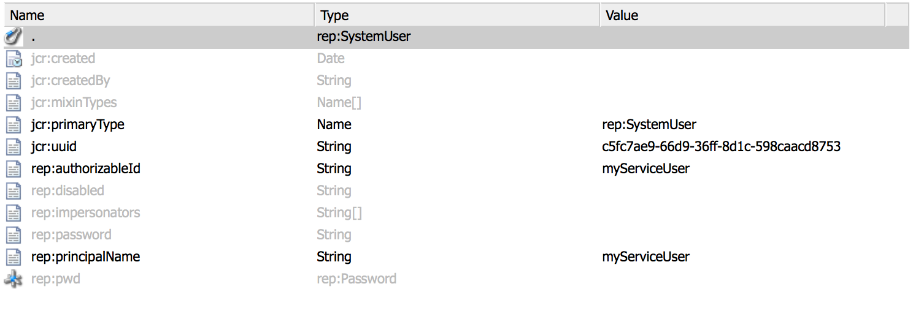
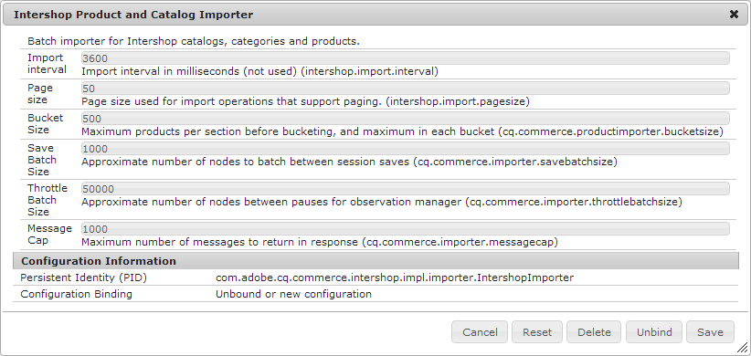
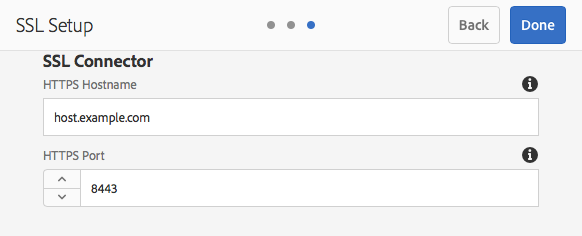

# SSL/TLS By Default{#ssl-tls-by-default}

In an effort to continuously improve the security of AEM, Adobe has introduced a feature called SSL By Default. The purpose is to encourage the use of HTTPS to connect to AEM instances.

## Enabling SSL/TLS By Default {#enabling-ssl-tls-by-default}

You can start configuring SSL/TLS By Default by clicking the relevant Inbox message from your AEM home screen. To reach the Inbox, press the bell icon in the upper right corner of the screen. Then, click on **View All**. This will bring up a list of all alerts ordered in a list view.

In the list, select and open the **Configure HTTPS** alert:



>[!NOTE]
>
>If the **Configure HTTPS** alert is not present in the Inbox, you can navigate directly to the HTTPS Wizard by going to *<http://serveraddress:serverport/libs/granite/security/content/sslConfig.html?item=configuration%2fconfiguressl&_charset_=utf-8>*

A service user called **ssl-service** has been created for this feature. Once you open the alert, you will be guided through the following configuration wizard:

1. First, set up the Store Credentials. These are the credentials for the **ssl-service** system user's key store that will contain the private key and trust store for the HTTPS listener.

   

1. Once you enter the credentials, click **Next** in the upper right corner of the page. Then, upload the associated private key and certificate for the SSL/TLS connection.

   

   >[!NOTE]
   >
   >For info on how to generate a private key and a certificate to use with the wizard, see [this procedure](/help/sites-administering/ssl-by-default.md#generating-a-private-key-certificate-pair-to-use-with-the-wizard) below.

1. Lastly, specify the HTTPS hostname and the TCP port for the HTTPS listener.

   

## Automating SSL/TLS By Default {#automating-ssl-tls-by-default}

There are three ways of automating SSL/TLS By Default.

### Via HTTP POST {#via-http-post}

The first method involves posting to the SSLSetup server that is being used by the configuration wizard:

```shell
POST /libs/granite/security/post/sslSetup.html
```

You can use the following payload in your POST to automate configuration:

```xml
------WebKitFormBoundaryyBO4ArmGlcfdGDbs
Content-Disposition: form-data; name="keystorePassword"

test
------WebKitFormBoundaryyBO4ArmGlcfdGDbs
Content-Disposition: form-data; name="keystorePasswordConfirm"
test
------WebKitFormBoundaryyBO4ArmGlcfdGDbs
Content-Disposition: form-data; name="truststorePassword"
test
------WebKitFormBoundaryyBO4ArmGlcfdGDbs
Content-Disposition: form-data; name="truststorePasswordConfirm"
test
------WebKitFormBoundaryyBO4ArmGlcfdGDbs
Content-Disposition: form-data; name="privatekeyFile"; filename="server.der"
Content-Type: application/x-x509-ca-cert

------WebKitFormBoundaryyBO4ArmGlcfdGDbs
Content-Disposition: form-data; name="certificateFile"; filename="server.crt"
Content-Type: application/x-x509-ca-cert

------WebKitFormBoundaryyBO4ArmGlcfdGDbs
Content-Disposition: form-data; name="httpsPort"
8443
```

The servlet, like any sling POST servlet, will respond with 200 OK or an error HTTP status code. You can find details about status in the response's HTML body.

Below are examples for both a successful response and an error.

**SUCCESS EXAMPLE** (status = 200):

```xml
<!DOCTYPE html>
<html lang='en'>
<head>
<title>OK</title>
</head>
<body>
<h1>OK</h1>
<dl>
<dt class='foundation-form-response-status-code'>Status</dt>
<dd>200</dd>
<dt class='foundation-form-response-status-message'>Message</dt>
<dd>SSL successfully configured</dd>
<dt class='foundation-form-response-title'>Title</dt>
<dd>OK</dd>
<dt class='foundation-form-response-description'>Description</dt>
<dd>HTTPS has been configured on port 8443. The private key and
certificate were stored in the key store of the user ssl-service.
Please take note of the key store password you provided. You will need
it for any subsequent updating of the private key or certificate.</dd>
</dl>
<h2>Links</h2>
<ul class='foundation-form-response-links'>
<li><a class='foundation-form-response-redirect' href='/'>Done</a></li>
</ul>
</body>
</html>
```

**ERROR EXAMPLE** (status = 500):

```xml
<!DOCTYPE html>
<html lang='en'>
<head>
<title>Error</title>
</head>
<body>
<h1>Error</h1>
<dl>
<dt class='foundation-form-response-status-code'>Status</dt>
<dd>500</dd>
<dt class='foundation-form-response-status-message'>Message</dt>
<dd>The provided file is not a valid key, DER format expected</dd>
<dt class='foundation-form-response-title'>Title</dt>
<dd>Error</dd>
</dl>
</body>
</html>

```

### Via Package {#via-package}

Alternatively, you can automate the SSL/TLS setup by uploading a package that already contains these required items:

* The ssl-service user's keystore. This is located under */home/users/system/security/ssl-service/keystore* in the repository.
* The `GraniteSslConnectorFactory` configuration

### Generating a Private Key/Certificate Pair to Use with the Wizard {#generating-a-private-key-certificate-pair-to-use-with-the-wizard}

Below you will find an example for creating a self-signed certificate in DER format that the SSL/TLS Wizard can use. Install OpenSSL based on the operating system, open the OpenSSL command prompt, and change the directory to the folder where you want to generate the Private Key/Certificate.

>[!NOTE]
>
>The use of a self-signed certificate is for example purposes only and should not be used in production.

1. First, create the private key:

   ```shell
   openssl genrsa -aes256 -out localhostprivate.key 4096
   openssl rsa -in localhostprivate.key -out localhostprivate.key
   ```

1. Then, Generate a Certificate Signing Request (CSR) using private key:

   ```shell
   openssl req -sha256 -new -key localhostprivate.key -out localhost.csr -subj "/CN=localhost"
   ```

1. Generate the SSL/TLS certificate and sign it with the private key. In this example, will expire one year from now:

   ```shell
   openssl x509 -req -days 365 -in localhost.csr -signkey localhostprivate.key -out localhost.crt
   ```

Convert the Private Key to DER format. This is because the SSL wizard requires key to be in DER format:

```shell
openssl pkcs8 -topk8 -inform PEM -outform DER -in localhostprivate.key -out localhostprivate.der -nocrypt
```

Finally, upload the **localhostprivate.der** as the Private Key and **localhost.crt** as the SSL/TLS Certificate in step 2 of the graphical SSL/TLS Wizard described at the beginning of this page.

### Updating the SSL/TLS Configuration Via cURL {#updating-the-ssl-tls-configuration-via-curl}

>[!NOTE]
>
>See [Using cURL with AEM](https://helpx.adobe.com/experience-manager/6-4/sites/administering/using/curl.html) for a centralized list of useful cURL commands in AEM.

You can also automate the SSL/TLS configuration by using the cURL tool. You can do this by posting the configuration parameters to this URL:

*https://&lt;serveraddress&gt;:&lt;serverport&gt;/libs/granite/security/post/sslSetup.html*

Below are the parameters you can use in order to change the various settings in the configuration wizard:

* `-F "keystorePassword=password"` - the keystore password;

* `-F "keystorePasswordConfirm=password"` - confirm the keystore password;

* `-F "truststorePassword=password"` - the truststore password;

* `-F "truststorePasswordConfirm=password"` - confirm the truststore password;

* `-F "privatekeyFile=@localhostprivate.der"` - specify the private key;

* `-F "certificateFile=@localhost.crt"` - specify the certificate;

* `-F "httpsHostname=host.example.com"`- specify the hostname;
* `-F "httpsPort=8443"` - the port the HTTPS listener will work on.

>[!NOTE]
>
>The fastest way of running cURL to automate the SSL/TLS configuration is from the folder where the DER and CRT files are. Alternatively, you can specify the full path in the `privatekeyFile` and certificateFile arguments.
>
>You also need to be authenticated in order to perform the update, so make sure you append the cURL command with the `-u user:passeword` parameter.
>
>A correct cURL post command should look like this:

```shell
curl -u user:password -F "keystorePassword=password" -F "keystorePasswordConfirm=password" -F "truststorePassword=password" -F "truststorePasswordConfirm=password" -F "privatekeyFile=@localhostprivate.der" -F "certificateFile=@localhost.crt" -F "httpsHostname=host.example.com" -F "httpsPort=8443" https://host:port/libs/granite/security/post/sslSetup.html
```

#### Multiple certificates using cURL {#multiple-certificates-using-curl}

You can send the servlet a chain of certificates by repeating the certificateFile parameter like this:

`-F "certificateFile=@root.crt" -F "certificateFile=@localhost.crt"..`

Once you have executed the command, verify that all the certificates made it to the keystore. Check the keystore from:
[http://localhost:4502/libs/granite/security/content/userEditor.html/home/users/system/security/ssl-service](http://localhost:4502/libs/granite/security/content/userEditor.html/home/users/system/security/ssl-service)

### Enabling a TLS 1.3 Connection {#enabling-tls-connection}

1. Go to the Web Console
1. Then, navigate to **OSGi** - **Configuration** - **Adobe Granite SSL Connector Factory**
1. Go to the **Included cipher suites** field and add the following entries. You can confirm each addition by pressing the "**+**" button to the left of the field, after adding each in:

   * `TLS_AES_256_GCM_SHA384`
   * `TLS_AES_128_GCM_SHA256`
   * `TLS_CHACHA20_POLY1305_SHA256`
   * `TLS_AES_128_CCM_SHA256`
   * `TLS_AES_128_CCM_8_SHA256`