# User Synchronization{#user-synchronization}

## Introduction {#introduction}

When the deployment is a [publish farm](/help/sites-deploying/recommended-deploys.md#tarmk-farm), members must be able to log in and see their data on any Publish node.

Users and user groups (user data) created in the publish environment are not needed in the author environment.

Most user data created in the author environment is intended to remain in the author environment and not be copied to Publish instances.

Registration and modifications made on one Publish instance must be synchronized with other Publish instances for them to have access to the same user data.

As of AEM 6.1, when user synchronization is enabled, user data is automatically synchronized across the Publish instances in the farm and are not created on author.

## Sling Distribution {#sling-distribution}

The user data, along with their [ACLs](/help/sites-administering/security.md), are stored in the [Oak Core](/help/sites-deploying/platform.md), the layer below Oak JCR, and are accessed using the [Oak API](https://developer.adobe.com/experience-manager/reference-materials/6-5/javadoc/org/apache/jackrabbit/oak/api/package-tree.html). With infrequent updates, it is reasonable for user data to be synchronized with other Publish instances using [Sling Content Distribution](https://github.com/apache/sling-old-svn-mirror/blob/trunk/contrib/extensions/distribution/README.md) (Sling distribution).

The benefits of user sync using Sling distribution, compared to traditional replication are:

* *users*, *user profiles*, and *user groups* created on Publish are not created on Author

* Sling distribution sets properties in jcr events, making it possible to act within publish-side event listeners without concern for infinite replication loops
* Sling distribution only sends user data to non-originating Publish instances, eliminating unnecessary traffic
* [ACLs](/help/sites-administering/security.md) set in the user node are included in the synchronization

>[!NOTE]
>
>If sessions are required, it is recommended to use either an SSO solution or use a sticky session and have customers log in if they get switched to another Publish instance.

>[!CAUTION]
>
>Synchronization of the **administrators** group is not supported, even when user sync is enabled. Instead, a failure to 'import the diff' is logged in the error log.
>
>Therefore, when the deployment is a publish farm, if a user is added to or removed from the **administrators** group, the modification must be manually made on each Publish instance.

## Enable User Sync {#enable-user-sync}

>[!NOTE]
>
>By default, user sync is `disabled`.
>
>Enabling user sync involves modifying *existing* OSGi configurations.
>
>No new configurations should be added as a result of enabling user sync.

User sync relies on the author environment to manage the user data distributions, even though the user data is not created on the Author. Much, but not all, of the configuration takes place in the author environment and each step clearly identifies whether it is to be performed on Author or Publish.

Following are the steps necessary to enable user synchronization, followed by a [Troubleshooting](#troubleshooting) section:

### Prerequisites {#prerequisites}

1. If users and user groups have already been created on one Publish instance, it is recommended to [manually sync](#manually-syncing-users-and-user-groups) the user data to all Publish instances before configuring and enabling user sync.

Once user sync is enabled, only newly created users and groups are synchronized.

1. Ensure that the latest code is installed:

* [AEM platform updates](https://experienceleague.adobe.com/docs/experience-manager-release-information/aem-release-updates/aem-releases-updates.html)
* [AEM Communities updates](/help/communities/deploy-communities.md#latestfeaturepack)

### 1. Apache Sling Distribution Agent - Sync Agents Factory {#apache-sling-distribution-agent-sync-agents-factory}

**Enable user sync**

* **on author**

    * sign in with administrator privileges
    * access the [Web Console](/help/sites-deploying/configuring-osgi.md)

        * for example, [https://localhost:4502/system/console/configMgr](https://localhost:4502/system/console/configMgr)

    * locate `Apache Sling Distribution Agent - Sync Agents Factory`

        * select the existing configuration so you can open it for editing (pencil icon)
          Verify `name`: **`socialpubsync`**

        * select the `Enabled` checkbox
        * select `Save`

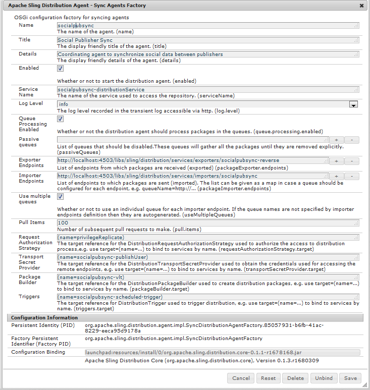

### 2. Create Authorized User {#createauthuser}

**Configure permissions**

The authorized user is used in step 3 to configure the Sling distribution on Author.

* **on each Publish instance**

    * sign in with administrator privileges
    * access the [Security Console](/help/sites-administering/security.md)

        * for example, [https://localhost:4503/useradmin](https://localhost:4503/useradmin)

    * create a user

        * for example, `usersync-admin`

    * add this user to the **`administrators`** user group
    * [add ACL for this user to /home](#howtoaddacl)

        * `Allow jcr:all` with restriction `rep:glob=*/activities/*`

>[!CAUTION]
>
>A new user must be created.
>
>* The default user assigned is **`admin`**.
>* Do not use `communities-user-admin user.`
>

#### How to Add ACL {#addacls}

* access CRXDE Lite

    * for example, [https://localhost:4503/crx/de](https://localhost:4503/crx/de)

* select `/home` node
* in right pane, select the `Access Control` tab
* to add an ACL entry, select the `+` button

    * **Principal**: *search for user created for user sync*
    * **Type**: `Allow`
    * **Privileges**: `jcr:all`
    * **Restrictions** `rep:glob`: `*/activities/*`
    * select **OK**

* select **Save All**

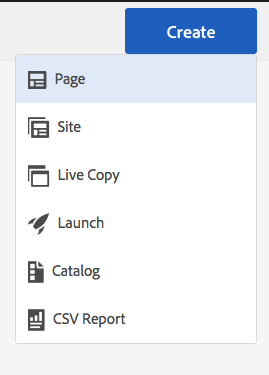

See also

* [Access Right Management](/help/sites-administering/user-group-ac-admin.md#access-right-management)
* Troubleshooting section [Modify Operation Exception During Response Processing](#modify-operation-exception-during-response-processing).

### 3. Adobe Granite Distribution - Encrypted Password Transport Secret Provider {#adobegraniteencpasswrd}

**Configure permissions**

Once an authorized user&ndash;a member of the **`administrators`** user group&ndash;is created on all Publish instances, the authorized user must be identified on Author as having permission to sync user data from Author to Publish.

* **on Author**

    * sign in with administrator privileges
    * access the [Web Console](/help/sites-deploying/configuring-osgi.md)

        * for example, [https://localhost:4502/system/console/configMgr](https://localhost:4502/system/console/configMgr)

    * locate `com.adobe.granite.distribution.core.impl.CryptoDistributionTransportSecretProvider.name`
    * to open for edit, select the existing configuration (pencil icon)
      Verify `property name`: **`socialpubsync-publishUser`**

    * set the username and password to the [authorized user](#createauthuser) created on Publish in step 2

        * for example, `usersync-admin`

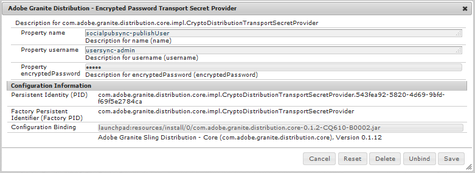

### 4. Apache Sling Distribution Agent - Queue Agents Factory {#apache-sling-distribution-agent-queue-agents-factory}

**Enable user sync**

* **on each Publish instance**:

    * sign in with administrator privileges
    * access the [Web Console](/help/sites-deploying/configuring-osgi.md)

        * for example, [https://localhost:4503/system/console/configMgr](https://localhost:4503/system/console/configMgr)

    * locate `Apache Sling Distribution Agent - Queue Agents Factory`

        * to open for edit, select the existing configuration (pencil icon)
          Verify `Name`: `socialpubsync-reverse`

        * select the `Enabled` checkbox
        * select `Save`

    * **repeat** for each Publish instance

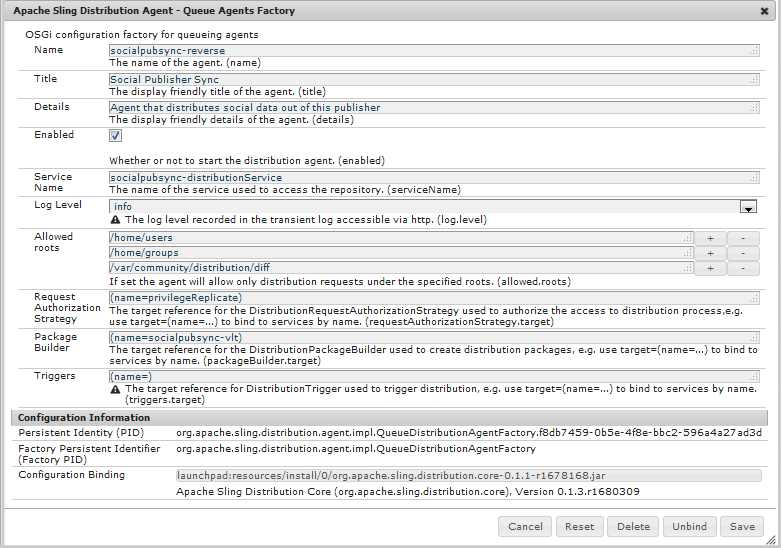

### 5. Adobe Social Sync - Diff Observer Factory {#diffobserver}

**Enable group sync**

* **on each Publish instance**:

    * sign in with administrator privileges
    * access the [Web Console](/help/sites-deploying/configuring-osgi.md)

        * for example, [https://localhost:4503/system/console/configMgr](https://localhost:4503/system/console/configMgr)

    * locate **`Adobe Social Sync - Diff Observer Factory`**

        * to open for edit, select the existing configuration (pencil icon)

          Verify `agent name`: `socialpubsync-reverse`

        * select the `Enabled` checkbox
        * select `Save`

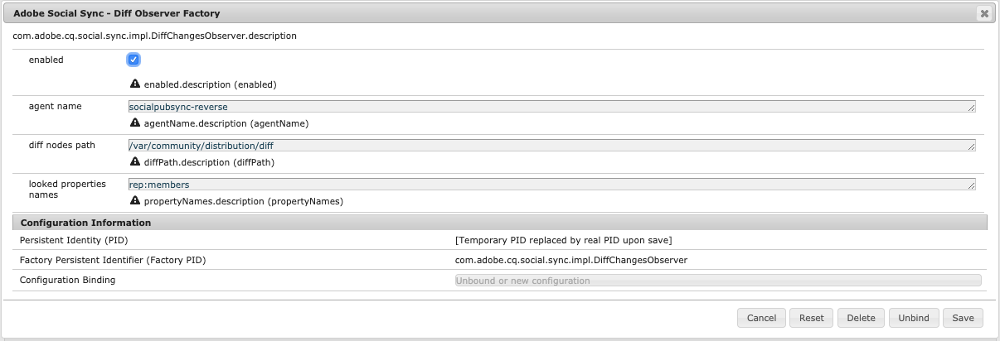

### 6. Apache Sling Distribution Trigger - Scheduled Triggers Factory {#apache-sling-distribution-trigger-scheduled-triggers-factory}

**(Optional) modify polling interval**

By default, the Author polls for changes every 30 seconds. To alter this interval:

* **on Author**

    * sign in with administrator privileges
    * access the [Web Console](/help/sites-deploying/configuring-osgi.md)

        * for example, [https://localhost:4502/system/console/configMgr](https://localhost:4502/system/console/configMgr)

    * locate `Apache Sling Distribution Trigger - Scheduled Triggers Factory`

        * to open for edit, select the existing configuration (pencil icon)

            * Verify `Name`: `socialpubsync-scheduled-trigger`

        * set the `Interval in Seconds` to the desired interval
        * select `Save`

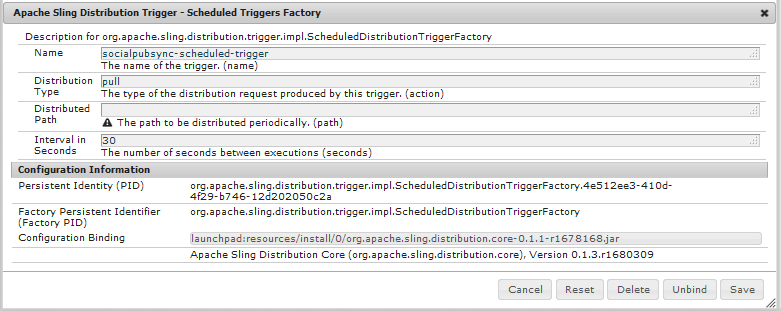

## Configure for Multiple Publish Instances {#configure-for-multiple-publish-instances}

The default configuration is for a single Publish instance. As the reason for enabling user sync is to synchronize multiple Publish instances, such as for a publish farm, the additional Publish instances must be added to the Sync Agents Factory.

### 7. Apache Sling Distribution Agent - Sync Agents Factory {#apache-sling-distribution-agent-sync-agents-factory-1}

**Add Publish Instances:**

* **on Author**

    * sign in with administrator privileges
    * access the [Web Console](/help/sites-deploying/configuring-osgi.md)

        * for example, [https://localhost:4502/system/console/configMgr](https://localhost:4502/system/console/configMgr)

    * locate `Apache Sling Distribution Agent - Sync Agents Factory`

        * to open for edit, select the existing configuration (pencil icon)
          Verify `Name`: `socialpubsync`


* **Exporter Endpoints**
  There should be an exporter endpoint for each Publish instance. For example, if there are 2 Publish instances, localhost:4503 and 4504, there should be two entries:

    * `https://localhost:4503/libs/sling/distribution/services/exporters/socialpubsync-reverse`
    * `https://localhost:4504/libs/sling/distribution/services/exporters/socialpubsync-reverse`

* **Importer Endpoints**
  There should be an importer endpoint for each Publish instance. For example, if there are 2 Publish instances, localhost:4503 and 4504, there should be two entries:

    * `https://localhost:4503/libs/sling/distribution/services/importers/socialpubsync`
    * `https://localhost:4504/libs/sling/distribution/services/importers/socialpubsync`

* select `Save`

### 8. AEM Communities User Sync Listener {#aem-communities-user-sync-listener}

**(Optional) Sync additional JCR nodes**

If there is custom data to synchronize across multiple Publish instances, then:

* **on each Publish instance**:

    * sign in with administrator privileges
    * access the [Web Console](/help/sites-deploying/configuring-osgi.md)

        * for example, `https://localhost:4503/system/console/configMgr`

    * locate `AEM Communities User Sync Listener`
    * to open for edit, select the existing configuration (pencil icon)
      Verify `Name`: `socialpubsync-scheduled-trigger`


* **Node Types**
  This is the list of node types that are synchronized. Any node type other than sling:Folder must be listed here (sling:folder is handled separately).
  Default list of node types to synchronize:

    * rep:User
    * nt:unstructured
    * nt:resource

* **Ignorable Properties**
  This is the list of properties that are ignored if any change is detected. Changes to these properties might get synchronized as a side effect of other changes (since synchronization is always at the node level), but changes to these properties do not, by themselves, trigger synchronization.
  Default property to ignore:

    * cq:lastModified

* **Ignorable Nodes**
  Subpaths that are ignored during synchronization. Nothing under these subpaths is synchronized at any time.
  Default nodes to ignore:

    * .tokens
    * system

* **Distributed Folders**
  Most sling:Folders are ignored because synchronization is not necessary. The few exceptions are listed here.
  Default folders to synchronize

    * segments/scoring
    * social/relationships
    * activities

### 9. Unique Sling ID {#unique-sling-id}

>[!CAUTION]
>
>If the Sling ID matches between two or more Publish instances then user group sync fails.

If the Sling ID is the same for multiple Publish instances in a publish farm, then user groups are not synchronized.

To validate that all Sling ID values differ, on each Publish instance:

1. browse to `http://<host>:<port>/system/console/status-slingsettings`
1. check the value of **Sling ID**


If the Sling ID of a Publish instance matches the Sling ID of any other Publish instance, then:

1. stop one of the Publish instances that has a matching Sling ID
1. in the crx-quickstart/launchpad/felix directory

    * search for and delete the file named *sling.id.file*

        * for example, on a Linux&reg; system:
          `rm -i $(find . -type f -name sling.id.file)`

        * for example, on a Windows system:
          `use windows explorer and search for *sling.id.file*`

1. start the Publish instance

    * on startup it is assigned a new Sling ID

1. validate that the **Sling ID** is now unique

Repeat these steps until all Publish instances have a unique Sling ID.

## Vault Package Builder Factory {#vault-package-builder-factory}

For updates to sync properly, it is necessary to modify the vault package builder for user sync:

* on each AEM Publish instance
* access the [Web Console](/help/sites-deploying/configuring-osgi.md)

    * for example, [https://localhost:4503/system/console/configMgr](https://localhost:4503/system/console/configMgr)

* locate the `Apache Sling Distribution Packaging - Vault Package Builder Factory`

    * `Builder name: socialpubsync-vlt`

* select the edit icon
* add two `Package Node Filters`:

    * `/home/users|-.*/.tokens`
    * `/home/users|-.*/rep:cache`

* policy handling:

    * to overwrite existing rep:policy nodes with new ones, add a third Package Filter:

        * `/home/users|+.*/rep:policy`

    * to prevent policies from being distributed, set

        * `Acl Handling:` `IGNORE`

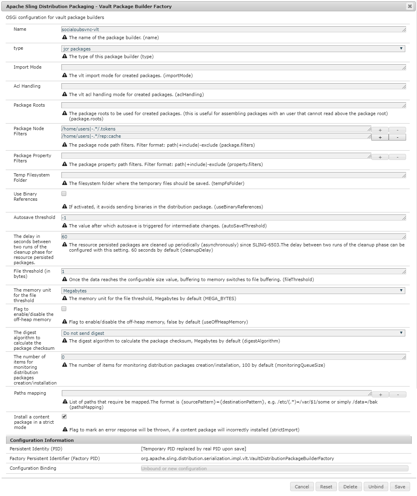

## What Happens When ... {#what-happens-when}

### User Self-Registers or Edits Profile on Publish {#user-self-registers-or-edits-profile-on-publish}

By design, users and profiles created in the publish environment (self-registration) do not appear in the author environment.

When the topology is a [publish farm](/help/sites-deploying/recommended-deploys.md#tarmk-farm) and user sync has been correctly configured, the *user* and *user profile* is synchronized across the publish farm using Sling distribution.

### Users or User Groups are Created Using Security Console {#users-or-user-groups-are-created-using-security-console}

By design, user data created in the publish environment does not appear in the author environment and conversely.

When the [User Administration and Security](/help/sites-administering/security.md) console is used to add new users in the publish environment, user sync synchronizes the new users and their group membership to other Publish instances, if necessary. User sync also synchronizes user groups created through the security console.

## Troubleshooting {#troubleshooting}

### How to Take User Sync Offline {#how-to-take-user-sync-offline}

To take user sync offline, to [remove a Publish instance](#how-to-remove-a-publish-instance) or [manually sync data](#manually-syncing-users-and-user-groups), the distribution queue must be empty and quiet.

To check the state of the distribution queue:

* on Author:

    * using [CRXDE Lite](/help/sites-developing/developing-with-crxde-lite.md)

        * look for entries in `/var/sling/distribution/packages`

            * folder nodes named with the pattern `distrpackage_*`

    * using [Package Manager](/help/sites-administering/package-manager.md)

        * look for pending packages (not yet installed)

            * named with the pattern `socialpubsync-vlt*`
            * created by `communities-user-admin`

When the distribution queue is empty, disable user sync:

* on Author

    * *uncheck *the `Enabled` checkbox for [Apache Sling Distribution Agent - Sync Agents Factory](#apache-sling-distribution-agent-sync-agents-factory)

When tasks are completed, to re-enable user sync:

* on Author

    * check the `Enabled` checkbox for [Apache Sling Distribution Agent - Sync Agents Factory](#apache-sling-distribution-agent-sync-agents-factory)

### User Sync Diagnostics {#user-sync-diagnostics}

User Sync Diagnostics is a tool that checks the configuration and attempts to identify any problems.

On Author, simply navigate from the main console through **Tools, Operations, Diagnosis, User Sync Diagnostics.**

Simply entering the User Sync Diagnostics console displays the results.

This is what is displayed when User Synchronization has not been enabled:

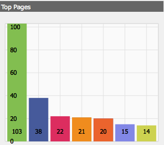

#### How To Run Diagnostics for Publish Instances {#how-to-run-diagnostics-for-publish-instances}

When the diagnostic is run from the author environment, the pass/fail results include an [INFO] section displaying the list of configured Publish instances for confirmation.

Included in the list is a URL for each Publish instance that runs the diagnostics for that instance. The url param `syncUser` is appended to the diagnostics URL with its value set to the *authorized sync user* created in [Step 2](#createauthuser).

**Note**: before launching the URL, the *authorized sync user* must already be signed into that Publish instance.

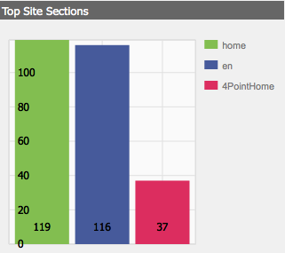

### Configuration Improperly Added {#configuration-improperly-added}

When user sync fails to work, the most common problem is that additional configurations were *added*. Instead, the *existing *default configuration should have been *edited*.

Following are views of how the edited, default configurations should appear in the Web Console. If more than the one instance appears, the added configuration should be removed.

#### (Author) One Apache Sling Distribution Agent - Sync Agents Factory {#author-one-apache-sling-distribution-agent-sync-agents-factory}

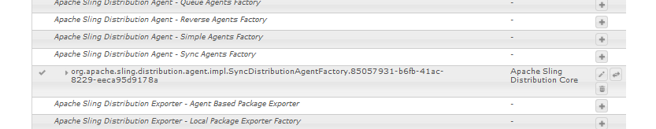

#### (Author) One Apache Sling Distribution Transport Credentials - User Credentials based DistributionTransportSecretProvider {#author-one-apache-sling-distribution-transport-credentials-user-credentials-based-distributiontransportsecretprovider}

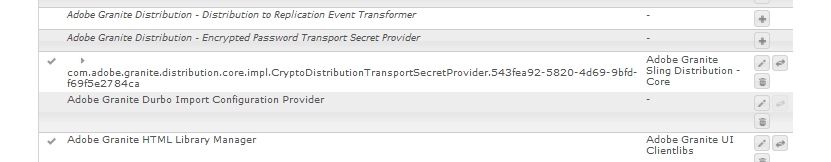

#### (Publish) One Apache Sling Distribution Agent - Queue Agents Factory {#publish-one-apache-sling-distribution-agent-queue-agents-factory}

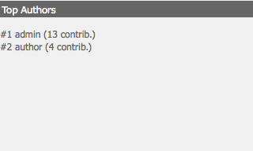

#### (Publish) One Adobe Social Sync - Diff Observer Factory {#publish-one-adobe-social-sync-diff-observer-factory}

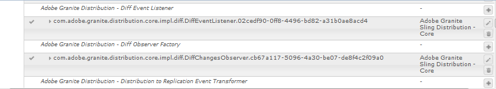

#### (Author) One Apache Sling Distribution Trigger - Scheduled Triggers Factory {#author-one-apache-sling-distribution-trigger-scheduled-triggers-factory}


### Modify Operation Exception During Response Processing {#modify-operation-exception-during-response-processing}

If the following is visible in the log:

`org.apache.sling.servlets.post.impl.operations.ModifyOperation Exception during response processing.`

`java.lang.IllegalStateException: This tree does not exist`

Then verify that the section [2. Create Authorized User](#createauthuser) was properly followed.

This section describes creating an authorized user, who exists on all Publish instances, and identifying them in the 'Secret Provider' OSGi config on author. By default, the user is `admin`.

The authorized user should be made a member of the **`administrators`** user group and permissions for that group should not be altered.

The authorized user should explicitly have the following privileges and restrictions on all Publish instances:

| **path** |**jcr:all** |**rep:glob** |
|---|---|---|
| /home |X |&#42;/activities/&#42; |
| /home/users |X |&#42;/activities/&#42; |
| /home/groups |X |&#42;/activities/&#42; |

As a member of the `administrators` group, the authorized user should have the following privileges on all Publish instances:

| **path** |**jcr:all** |**jcr:read** |**rep:write** |
|---|---|---|---|
| /etc/packages/sling/distribution |  |  |X |
| /libs/sling/distribution |  |X |  |
| /var |  |  |X |
| /var/eventing |  |X |X |
| /var/sling/distribution |  |X |X |

### User Group Sync Failed {#user-group-sync-failed}

If the Sling ID matches between two or more Publish instances, then the user group sync fails.

See section [9. Unique Sling ID](#unique-sling-id)

### Manually Syncing Users and User Groups {#manually-syncing-users-and-user-groups}

* on Publish instances on which users and user groups exist:

    * [if enabled, disable user sync](#how-to-take-user-sync-offline)
    * [create a package](/help/sites-administering/package-manager.md#creating-a-new-package) of `/home`

        * when editing the package

            * Filters tab: Add Filter: Root path: `/home`
            * Advanced tab: AC Handling: `Overwrite`

    * [export the package](/help/sites-administering/package-manager.md#downloading-packages-to-your-file-system)

* on other Publish instances:

    * [import the package](/help/sites-administering/package-manager.md#installing-packages)

To configure or enable user sync, go to step 1: [Apache Sling Distribution Agent - Sync Agents Factory](#apache-sling-distribution-agent-sync-agents-factory)

### When a Publish Instance Becomes Unavailable {#when-a-publish-instance-becomes-unavailable}

When a Publish instance becomes unavailable, it should not be removed if it is coming back online in the future. Changes are queued up for the Publish instance, and when it is back online, the changes are processed.

If the Publish instance is never coming back online, if it is offline permanently, then it must be removed because the queue buildup results in noticeable disk space usage in the Author environment.

When a Publish instance is down, the Author log has exceptions similar to the following:

```
28.01.2016 15:57:48.475 ERROR
 [pool-12-thread-34-org_apache_sling_distribution_queue_socialpubsync_endpoint1
 (org/apache/sling/distribution/queue/socialpubsync/endpoint1)]
 org.apache.sling.distribution.agent.impl.SimpleDistributionAgent [agent][socialpubsync] could not deliver package distrpackage_1454014575838_a2b45ec8-0400-42f3-bed8-ae09b66381cb
 org.apache.sling.distribution.packaging.DistributionPackageImportException: failed in importing package ...
```

### How To Remove a Publish Instance {#how-to-remove-a-publish-instance}

To remove a Publish instance from the [Apache Sling Distribution Agent - Sync Agents Factory](#apache-sling-distribution-agent-sync-agents-factory), the distribution queue must be empty and quiet.

* on Author:

    * [Take user sync offline](#how-to-take-user-sync-offline)
    * follow [step 7](#apache-sling-distribution-agent-sync-agents-factory) to remove the Publish instance from both server lists:

        * `Exporter Endpoints`
        * `Importer Endpoints`

    * re-enable user sync

        * check the `Enabled` checkbox for [Apache Sling Distribution Agent - Sync Agents Factory](#apache-sling-distribution-agent-sync-agents-factory)
