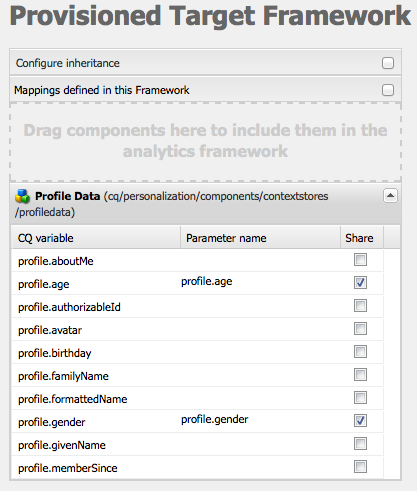
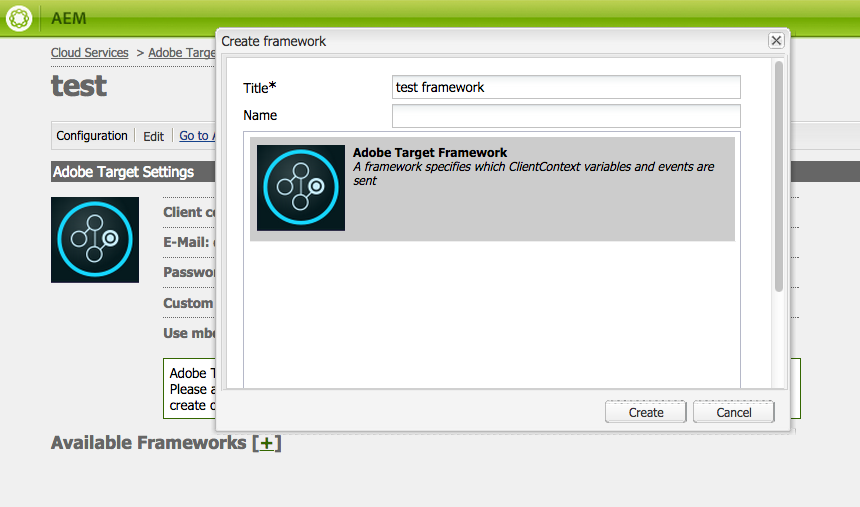
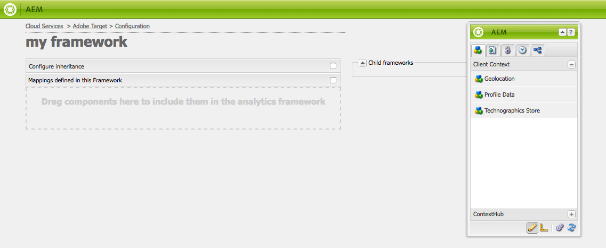
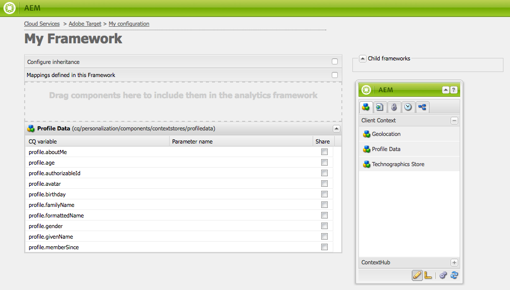
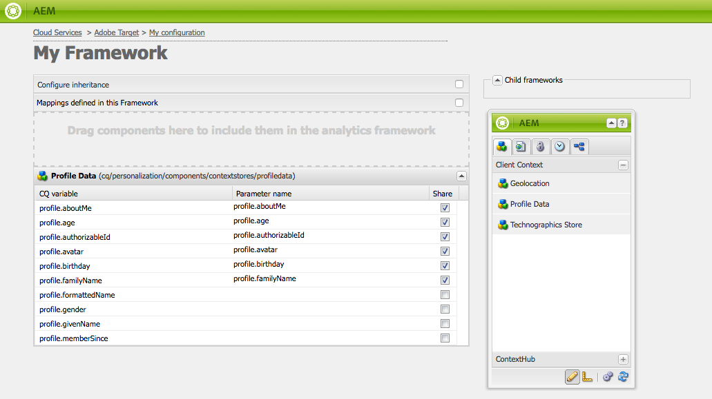
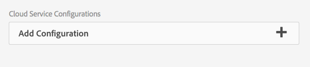

# Manually Configuring the Integration with Adobe Target {#manually-configuring-the-integration-with-adobe-target}

You can either modify the opt-in wizard configurations that you made when using the wizard, or you can manually integrate with Adobe Target without using the wizard.

## Modifying the Opt-In Wizard Configurations {#modifying-the-opt-in-wizard-configurations}

The [Opt-in wizard](/help/sites-administering/opt-in.md) that [integrates AEM with Adobe Target](/help/sites-administering/target.md) automatically creates a Target cloud configuration named Provisioned Target Configuration. The wizard also creates a Target framework for the cloud configuration named Provisioned Target Framework. You can modify the properties of the cloud configuration and framework, if necessary.

You can also configure Adobe Target to use Adobe Target as the reporting source when targeting content by configuring the A4T Analytics Cloud Configuration.

To locate the cloud configuration and the framework, Navigate to **Cloud Services** via **Tools** &gt; **Deployment** &gt; **Cloud**. ([http://localhost:4502/libs/cq/core/content/tools/cloudservices.html](http://localhost:4502/libs/cq/core/content/tools/cloudservices.html))
Below Adobe Target, click or tap **Show Configurations**.

### Provisioned Target Configuration Properties {#provisioned-target-configuration-properties}

The following property values are used in the Provisioned Target Configuration cloud configuration that the Opt-in wizard creates:

* **Client Code:** As entered in the Opt-in wizard.
* **E-Mail:** As entered in the Opt-in wizard.
* **Password:** As entered in the Opt-in wizard.
* **API Type:** REST
* **Synchronize Segments From Adobe Target:** Selected.

* **Client library:** mbox.js.
* **Use DTM to deliver client library:** Not selected. Select this option if you [use DTM](/help/sites-administering/dtm.md) or another tag management system to host the mbox.js or AT.js file. Adobe recommends that you use DTM rather than AEM to deliver the library.

* **Custom mbox.js:** None specified so that the default mbox.js file is used. Specify a custom mbox.js file that you want to use, as necessary. Only appears if you have selected mbox.js.
* **Custom AT.js:** None specified so that the default AT.js file is used. Specify a custom AT.js file that you want to use, as needed. Only appears if you have selected AT.js.

>[!NOTE]
>
>In AEM 6.3, you can select the Target Library file, [AT.JS](https://developer.adobe.com/target/implement/client-side/atjs/atjs-functions/mboxcreate-atjs/), which is a new implementation library for Adobe Target that is designed for both typical web implementations and single-page applications.
>
>AT.js offers several improvements over the mbox.js library:
>
>* Improved page load times for web implementations
>* Improved security
>* Better implementation options for single-page applications
>* AT.js contains the components that were included in target.js, so there is no longer a call to target.

<!-- OLD URL WHICH IS 404 https://experienceleague.adobe.com/docs/target/using/implement-target/client-side/mbox-implement/mbox-download.html -->

### Provisioned Target Framework Properties {#provisioned-target-framework-properties}

The Provisioned Target Framework that the Opt-in wizard creates is configured to send context data from the Profile Data store. The age and the gender data items of the store is sent to Target by default. Your solution likely requires additional parameters to be sent.



You can configure the framework to send additional context information to Target as described in [Adding a Target Framework](/help/sites-administering/target-configuring.md#adding-a-target-framework).

### Configuring A4T Analytics Cloud Configuration {#configuring-a-t-analytics-cloud-configuration}

You can configure Adobe Target to use Adobe Analytics as the reporting source when targeting content.

>[!NOTE]
>
>User-Credential Authentication (Legacy) does not work with A4T (for both Target and Analytics). As such, customers should use IMS authentication instead of User-Credential authentication.

To do so, you specify which A4T cloud configuration to connect your Adobe Target cloud configuration with:

1. Navigate to **Cloud Services** via the **AEM logo** &gt; **Tools** &gt; **Deployment** &gt; **Cloud Services**.
1. In the **Adobe Target** section, click **Configure Now**.
1. Reconnect to your Adobe Target configuration.
1. In the **A4T Analytics Cloud Configuration** drop-down menu, select the framework.

   >[!NOTE]
   >
   >Only analytics configurations that are enabled for A4T are available.
   >
   >When configuring A4T with AEM, you may see a Configuration reference missing entry. To be able to select the analytics framework, do the following:
   >
   >1. Navigate to **Tools** &gt; **General** &gt; **CRXDE Lite**.
   >1. Navigate to the [A4T Analytics Configuration Dialog](#a4t-analytics-config-dialog) (see below)
   >1. Set the property **disable** to **false**.
   >1. Tap or click **Save All**.

#### A4T Analytics Configuration Dialog {#a4t-analytics-config-dialog}

```xml
/libs/cq/analytics/components/testandtargetpage/dialog/items/tabs/items/tab1_general/items/a4tAnalyticsConfig

```

   

   Click **OK**. When you target content with Adobe Target, you are able to [select your report source](/help/sites-authoring/content-targeting-touch.md).

## Manually Integrating with Adobe Target {#manually-integrating-with-adobe-target}

Manually integrate with Adobe Target instead of using the opt-in wizard.

>[!NOTE]
>
>The Target Library file, [AT.JS](https://developer.adobe.com/target/implement/client-side/atjs/atjs-functions/mboxcreate-atjs/), is a new implementation library for Adobe Target that is designed for both typical web implementations and single-page applications. Adobe recommends that you use AT.js instead of mbox.js as the client library.
>
>AT.js offers several improvements over the mbox.js library:
>
>* Improved page load times for web implementations
>* Improved security
>* Better implementation options for single-page applications
>* AT.js contains the components that were included in target.js, so there is no longer a call to target.js
>
>You can select AT.js or mbox.js in the **Client library** drop-down menu.

<!-- OLD URL from above was 404 https://experienceleague.adobe.com/docs/target/using/implement-target/client-side/mbox-implement/mbox-download.html -->

### Creating a Target Cloud Configuration {#creating-a-target-cloud-configuration}

To enable AEM to interact with Adobe Target, create a Target cloud configuration. To create the configuration, you provide the Adobe Target client code and user credentials.

You create the Target cloud configuration only once because you can associate the configuration with multiple AEM campaigns. If you have several Adobe Target client codes, create one configuration for each client code.

You can configure the cloud configuration to synchronize segments from Adobe Target. If you enable synchronization, segments are imported from Target in the background when the cloud configuration is saved.

Use the following procedure to create a Target cloud configuration in AEM:

1. Navigate to **Cloud Services** via the **AEM logo** &gt; **Tools** &gt; **Cloud Services** &gt; **Legacy Cloud Services**. ([http://localhost:4502/libs/cq/core/content/tools/cloudservices.html](http://localhost:4502/libs/cq/core/content/tools/cloudservices.html))

   The **Cloud Services** overview page opens.

1. In the **Adobe Target** section, click **Configure Now**.
1. In the **Create Configuration** dialog:

    1. Give the configuration a **Title**.
    1. Select the **Adobe Target Configuration** template.
    1. Click **Create**.

   The edit dialog opens.

   

   >[!NOTE]
   >
   >When configuring A4T with AEM, you may see a Configuration reference missing entry. To be able to select the analytics framework, do the following:
   >
   >1. Navigate to **Tools** &gt; **General** &gt; **CRXDE Lite**.
   >1. Navigate to **/libs/cq/analytics/components/testandtargetpage/dialog/items/tabs/items/tab1_general/items/a4tAnalyticsConfig**
   >1. Set the property **disable** to **false**.
   >1. Tap or click **Save All**.

1. In the dialog, provide values for these properties.

    * **Client Code**: the Target account Client Code
    * **E-Mail**: the Target account email.
    * **Password**: the Target account password.
    * **API Type**: either REST or XML
    * **A4T Analytics Cloud Configuration**: Select the Analytics Cloud configuration that is used for target activity goals and metrics. You need this configuration if you are using Adobe Analytics as the reporting source when targeting content. If you do not see your cloud configuration, see note in [Configuring A4T Analytics Cloud Configuration](#configuring-a-t-analytics-cloud-configuration).

    * **Use accurate targeting:** By default this check box is selected. If selected, the cloud service configuration waits for the context to load before loading content. See note that follows.
    * **Synchronize Segments from Adobe Target:** Select this option so you can download segments that are defined in Target to use them in AEM. Select this option when the API Type property is REST, because inline segments are not supported and you must use segments from Target. (The AEM term of 'segment' is equivalent to the Target 'audience'.)
    * **Client library:** Select whether you want the mbox.js or AT.js client library.
    * **Use DTM to deliver client library** - Select this option to use either AT.js or mbox.js from DTM or another tag management system. Configure [the DTM integration](/help/sites-administering/dtm.md) to use this option. Adobe recommends that you use DTM rather than AEM to deliver the library.
    * **Custom mbox.js**: Leave blank if you checked the DTM box or to use the default mbox.js. Alternatively upload your custom mbox.js. Only appears if you have selected mbox.js.
    * **Custom AT.js**: Leave blank if you checked the DTM box or to use the default AT.js. Alternatively upload your custom AT.js. Only appears if you have selected AT.js.

   >[!NOTE]
   >
   >By default when you opt into the Adobe Target configuration wizard, Accurate Targeting is enabled.
   >
   >Accurate targeting means that the cloud service configuration waits for the context to load before loading content. As a result, in terms of performance, accurate targeting may create a few millisecond delay before loading content.
   >
   >Accurate targeting is always enabled on the author instance. However, on the publish instance you can opt to turn accurate targeting off globally by clearing the check mark next to Accurate Targeting in the cloud service configuration (**http://localhost:4502/etc/cloudservices.html**). You can also still turn accurate targeting on and off for individual components regardless of your setting in the cloud service configuration.
   >
   >If you have ***already*** created targeted components and you change this setting, your changes do not affect those components. Change those components directly.

1. Click **Connect to Target** to initialize the connection with Target. If the connection is successful, the message **Connection successful** is displayed. Click **OK** on the message and then **OK** on the dialog.

   If you cannot connect to Target, see the [troubleshooting](/help/sites-administering/target-configuring.md#troubleshooting-target-connection-problems) section.

### Adding a Target Framework {#adding-a-target-framework}

After you configure the Target cloud configuration, add a Target framework. The framework identifies the default parameters that are sent to Adobe Target from the available [Client Context](/help/sites-administering/client-context.md) or [ContextHub](/help/sites-developing/ch-configuring.md) components. Target uses the parameters to determine the segments that apply to the current context.

You can create multiple frameworks for a single Target configuration. Multiple frameworks are useful when you must send a different set of parameters to Target for different sections of your website. Create a framework for each set of parameters that you send. Associate each section of your website with the appropriate framework. A web page can use only one framework at a time.

1. On your Target configuration page, click the **+** (plus sign) next to Available Frameworks.
1. In the Create Framework dialog, specify a **Title**, select the **Adobe Target Framework**, and click **Create**.

   

   The framework page opens. Sidekick provides components that represent information from the [Client Context](/help/sites-administering/client-context.md) or [ContextHub](/help/sites-developing/ch-configuring.md) that you can map.

   

1. Drag the Client Context component that represents the data that you want to use for mapping to the drop target. Alternatively, drag the**ContextHub Store** component to the framework.

   >[!NOTE]
   >
   >When mapping, parameters are passed to an mbox via simple strings. You cannot map arrays from ContextHub.

   For example, to use **Profile Data** about your site visitors to control your Target campaign, drag the **Profile Data** component to the page. The profile data variables that are available for mapping to Target parameters appear.

   

1. Select the variables that you want to make visible to the Adobe Target system by selecting the **Share** checkbox in the appropriate columns.

   

   >[!NOTE]
   >
   >Synchronizing parameters is one way only - from AEM to Adobe Target.

Your framework is created. To replicate the framework to the publish instance, use the **Activate Framework** option from the sidekick.

### Associating Activities With the Target Cloud Configuration  {#associating-activities-with-the-target-cloud-configuration}

Associate your [AEM activities](/help/sites-authoring/activitylib.md) with your Target cloud configuration so that you can mirror the activities in [Adobe Target](https://experienceleague.adobe.com/docs/target/using/experiences/offers/manage-content.html).

>[!NOTE]
>
>What types of activities are available is determined by the following:
>
>
>* If the **xt_only** option is enabled on the Adobe Target tenant (clientcode) used on the AEM side to connect to Adobe Target, then you can create **only** XT activities in AEM.
>
>* If the **xt_only** option is **not** enabled on the Adobe Target tenant (clientcode), then you can create **both** XT and A/B activities in AEM.
>
>**Additional note:** **xt_only** option is a setting applied on a certain Target tenant (clientcode) and can only be modified directly in Adobe Target. You cannot enable or disable this option in AEM.

### Associating the Target Framework With Your Site {#associating-the-target-framework-with-your-site}

After you create a Target framework in AEM, associate your web pages with the framework. The targeted components on the pages send the framework-defined data to Adobe Target for tracking. (See [Content Targeting](/help/sites-authoring/content-targeting-touch.md).)

When you associate a page with the framework, the child pages inherit the association.

1. In the **Sites** console, navigate to the site that you want to configure.
1. Using either [quick actions](/help/sites-authoring/basic-handling.md#quick-actions) or [selection mode](/help/sites-authoring/basic-handling.md), select **View Properties.**
1. Select the **Cloud Services** tab.
1. Tap/click **Edit**.
1. Tap/click **Add Configuration** under **Cloud Service Configurations** and select **Adobe Target**.

   

1. Select the framework that you want under **Configuration Reference**.

   >[!NOTE]
   >
   >Make sure that you select the specific **framework** that you created and not the Target cloud configuration under which it was created.

1. Tap/click **Done**.
1. Activate the root page of the website so you replicate it to the publish server. (See [How To Publish Pages](/help/sites-authoring/publishing-pages.md).)

   >[!NOTE]
   >
   >If the framework you attached to the page was not activated yet, a wizard opens which allows you to publish it as well.

## Troubleshooting Target Connection Problems {#troubleshooting-target-connection-problems}

To troubleshoot problems that occur when connecting to Target, you can perform the following tasks:

* Make sure that the user credentials that you provide are correct.
* Make sure that the AEM instance can connect to the Target server. For example, make sure that firewall rules are not blocking outbound AEM connections, or that AEM is configured to use necessary proxies.
* Look for helpful messages in the AEM error log. The error.log file is in the **crx-quickstart/logs** directory where AEM is installed.
* When editing the activity in Adobe Target, the URL is pointing to localhost. Work around this understanding by setting the AEM Externalizer to the correct URL.
