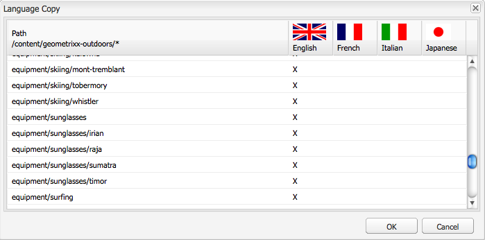

# Creating a Language Root Using the Classic UI{#creating-a-language-root-using-the-classic-ui}

The following procedure uses the classic UI to create a language root of a site. For more information, see [Creating a Language Root](/help/sites-administering/tc-prep.md#creating-a-language-root).

1. In the Websites console, in the Websites tree, select the root page of the site. ([http://localhost:4502/siteadmin#](http://localhost:4502/siteadmin#))
1. Add a new child page that represents the language version of the site:

    1. Click New > New Page.
    1. In the dialog, specify the Title and the Name. The Name needs to be in the format of `<language-code>` or `<language-code>_<country-code>`, for example, en, en_US, en_us, en_GB, en_gb.

        * The supported language code is lower-case, two-letter code as defined by ISO-639-1
        * The supported country code is lower-case or upper-case, two-letter code as defined by ISO 3166

    1. Select the Template and click Create.

   

1. In the Websites console, in the Websites tree, select the root page of the site.
1. In the Tools menu, select Language Copy.

   

   The Language Copy dialog displays a matrix of available language versions and web pages. An x in a language column means that the page is available in that language.

   

1. To copy an existing page or page tree to a language version, select the cell for that page in the language column. Click the arrow and select the type of copy to create.

   In the following example, the equipment/sunglasses/irian page is being copied to the French language version.

   

   | Type of language copy |Description |
   |---|---|
   | auto |Uses the behavior from parent pages |
   | ignore |Does not create a copy of this page and its children |
   | `<language>+` (for example, French+) |Copies the page and all its children from that language |
   | `<language>` (for example, French) |Copies only the page from that language |

1. Click OK to close the dialog.
1. In the next dialog, click Yes to confirm the copy.
