# Managing Translation Projects{#managing-translation-projects}

After preparing content for translation, you need to complete the language structure by creating missing language copies, and create translation projects.

Translation projects enable you to manage the translation of AEM content. A translation project is a type of AEM [project](/help/sites-authoring/projects.md) that contains resources that are to be translated into other languages. These resources are the pages and assets of the [language copies](/help/sites-administering/tc-prep.md) that are created from the language master.

When resources are added to a translation project, a translation job is created for them. Jobs provide commands and status information that you use to manage the human translation and machine translation workflows that execute on the resources.

>[!NOTE]
>
>A translation project can contain multiple translation jobs.

Translation projects are long-running items, defined by language and translation method/provider to align with organizational governance for globalization. They should be initiated once, either during initial translation or manually, and remain in effect throughout content and translation update activities.

Translation projects and jobs are created with translation preparation workflows. These workflows have three options, for both initial translation (Create&Translate) and updates (Update Translation):

1. [Create new project](#creating-translation-projects-using-the-references-panel)
1. [Add to existing project](#adding-pages-to-a-translation-project)
1. [Content structure only](#creating-the-structure-of-a-language-copy)

>[!NOTE]
>
>Option 3 is unrelated from translation job/project. It allows you to copy content and structural changes in the language master to (untranslated) language copies. You can use this to keep your language masters in sync, even without translation.

## Performing Initial Translations and Updating Existing Translations {#performing-initial-translations-and-updating-existing-translations}

AEM detects whether a translation project is being created for the initial translation of content, or to update already-translated language copies. When you create a translation project for a page and indicate the language copies for which you are translating, AEM detects whether the source page already exists in the targeted language copies:

* **The language copy does not include the page:** AEM treats this situation as the initial translation. The page is immediately copied to the language copy, and included in the project. When the translated page is imported into AEM, AEM copies it directly to the language copy.
* **The language copy already includes the page:** AEM treats this situation as an updated translation. A launch is created and a copy of the page is added to the launch, and included in the project. Launches enable you to review updated translations before committing it to the language copy:

    * When the translated page is imported into AEM, it overwrites the page in the launch.
    * The translated page overwrites the language copy only when the launch is promoted.

For example, the /content/geometrixx/fr language root is created for the French translation of the /content/geometrixx/en master language. There are no other pages in the French language copy.

* A translation project is created for the /content/geometrixx/en/products page and all child pages, targeting the French language copy. Because the language copy does not include the /content/geometrixx/fr/products page, AEM immediately copies the /content/geometrixx/en/products page and all child pages to the French language copy. The copies are also included in the translation project.
* A translation project is created for the /content/geometrixx/en page and all child pages, targeting the French language copy. Because the language copy includes the page that corresponds with the /content/geometrixx/en page (the language root), AEM copies the /content/geometrixx/en page and all child pages and adds them to a launch. The copies are also included in the translation project.

## Creating Translation Projects Using the References Panel {#creating-translation-projects-using-the-references-panel}

Create translation projects so that you can execute and manage the workflow for translating the resources of your language master. When you create projects, you specify the page in the language master that you are translating and the language copies for which you are performing the translation:

* The cloud configuration of the translation integration framework that is associated with the selected page determines many properties of the translation projects, such as the translation workflow to use.
* A project is created for each language copy that is selected.
* A copy of the selected page and associated assets are created and added to each project. These copies are later sent to the translation provider for translating.

You can specify that the child pages of the selected page are also selected. In this case, copies of the child pages are also added to each project so that they are translated. When any child pages are associated with different translation integration framework configurations, AEM creates additional projects.

You can also [manually create translation projects](#creating-a-translation-project-using-the-projects-console).

>[!NOTE]
>
>To create a project, your account must be a member of the `project-administrators` group.

**Initial Translations and Updating Translations**

The References panel indicates whether the you are updating existing language copies or creating the first version of the language copies. When a language copy exists for the selected page, the Update Language Copies tab appears to provide access to project-related commands.

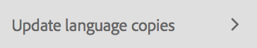

After translating, you can [review the translation](#reviewing-and-promoting-updated-content) before overwriting the language copy with it. When no language copy exists for the selected page, the Create & Translate tab appears to provide access to project-related commands.

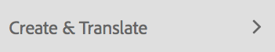

### Create Translation Projects for a New Language Copy {#create-translation-projects-for-a-new-language-copy}

1. Use the Sites console to select the page that you are adding to translation projects.

   For example, to translate the English pages of Geometrixx Demo Site, select Geometrixx Demo Site &gt; English.

1. On the toolbar, click or tap References.

   

1. Select Language Copies, and then select the language copies for which you are translating the source pages.
1. Click or tap Create & Translate and then configure the translation job:

    * Use the Languages drop-down to select a language copy for which you want to translate. Select additional languages as required. Languages that appear in the list correspond with the [language roots that you have created](/help/sites-administering/tc-prep.md#creating-a-language-root).
    * To translate the page that you selected and all child pages, select Select All Sub-Pages. To translate only the selected page that you selected, clear the option.
    * For Project, select Create New Translation Project.
    * Type a name for the project.

   

1. Click or tap Create.

### Create Translation Projects for an Existing Language Copy {#create-translation-projects-for-an-existing-language-copy}

1. Use the Sites console to select the page that you are adding to the translation projects.

   For example, to translate the English pages of Geometrixx Demo Site, select Geometrixx Demo Site &gt; English.

1. On the toolbar, click or tap References.

   

1. Select Language Copies, and then select the language copies for which you are translating the source pages.
1. Click or tap Update Language Copies and then configure the translation job:

    * To translate the page that you selected and all child pages, select Select All Sub-Pages. To translate only the selected page that you selected, clear the option.
    * For Project, select Create New Translation Project.
    * Type a name for the project.

   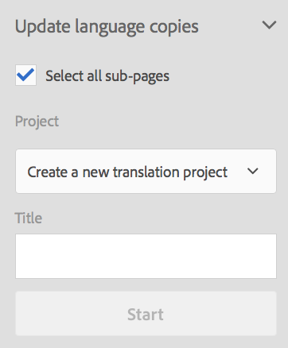

1. Click or tap Start.

## Adding Pages to a Translation Project {#adding-pages-to-a-translation-project}

After you have created a translation project, you can use the Resources pane to add pages to the project. Adding pages is useful when you are including pages from different branches in the same project.

When you add pages to a translation project, the pages are included in a new translation job. You can also [add pages to an existing job](#adding-pages-assets-to-a-translation-job).

As when creating a new project, when adding pages, copies of the pages are added to a launch when necessary to avoid overwriting existing language copies. (See [Creating Translation Projects for Existing Language Copies](#performing-initial-translations-and-updating-existing-translations).)

1. Use the Sites console to select the page that you are adding to the translation project.

   For example, to translate the English pages of Geometrixx Demo Site, select Geometrixx Demo Site &gt; English.

1. On the toolbar, click or tap References.

   

1. Select Language Copies, and then select the language copies for which you are translating the source pages.

   

1. Click or tap Update Language Copies and then configure the properties:

    * To translate the page that you selected and all child pages, select Select All Sub-Pages. To translate only the selected page that you selected, clear the option.
    * For Project, select Add To Existing Translation Project.
    * Select the project.

   >[!NOTE]
   >
   >The target language set in the Translation Project should match with the path of the language copy as shown in References Panel.

   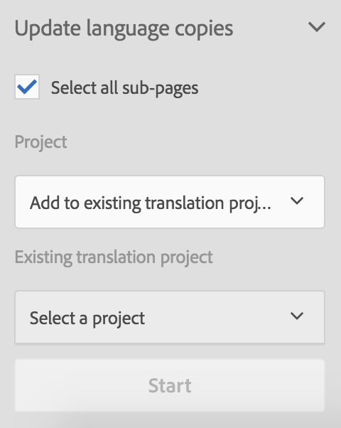

1. Click or tap Start.

## Adding Pages/Assets to a Translation Job {#adding-pages-assets-to-a-translation-job}

You can add pages, assets, tags or i18n dictionaries to the Translation Job of your Translation project. To add pages or assets:

1. On the bottom of the Translation Job tile of your translation project, click or tap the ellipsis.

   

1. Click or tap Add and Pages/Assets.

   

1. Select the topmost item of the branch that you want to add, and then click or tap the checkmark icon. You can multi-select.

   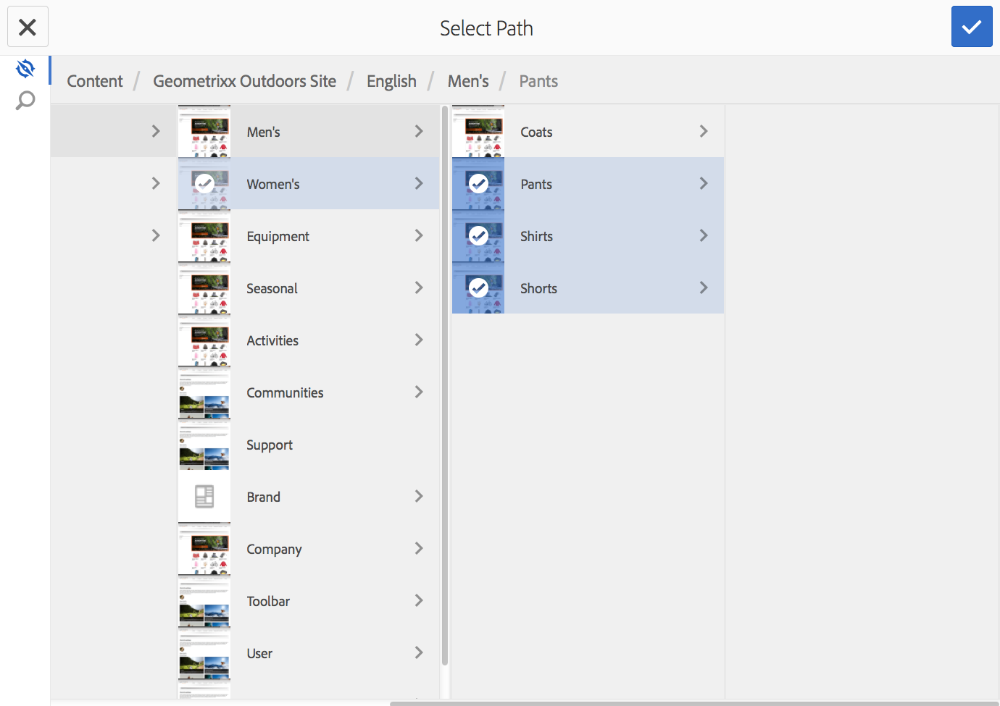

1. Alternatively, you can select the search icon to easily look for pages or assets you want to add to your translation job.

   

Your pages and/or assets are added to you translation job.

## Adding i18n Dictionaries to a Translation Job {#adding-i-n-dictionaries-to-a-translation-job}

You can add pages, assets, tags or i18n dictionaries to the Translation Job of your Translation project. To add an i18n dictionary:

1. On the bottom of the Translation Job tile of your translation project, click or tap the ellipsis.

   

1. Click or tap Add and I18N-Dictionary.

   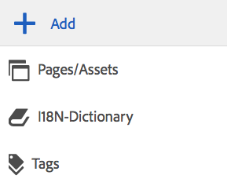

1. Select the dictionary that you want to add, and then click or tap Add button.

   

Your dictionary is now in your translation job.

>[!NOTE]
>
>For more information about i18n dictionaries, read [Using Translator to Manage Dictionaries](/help/sites-developing/i18n-translator.md).

## Adding Tags to a Translation Job {#adding-tags-to-a-translation-job}

You can add pages, assets, tags or i18n dictionaries to the Translation Job of your Translation project. To add Tags:

1. On the bottom of the Translation Job tile of your translation project, click or tap the ellipsis.

   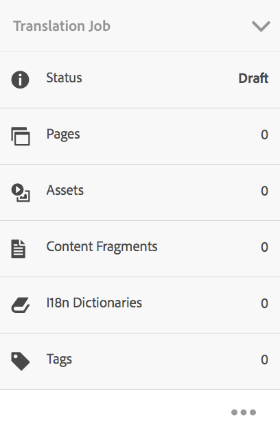

1. Click or tap Add and then Tags.

   

1. Select the tags that you want to add, and then click or tap the checkmark icon. You can multi-select.

   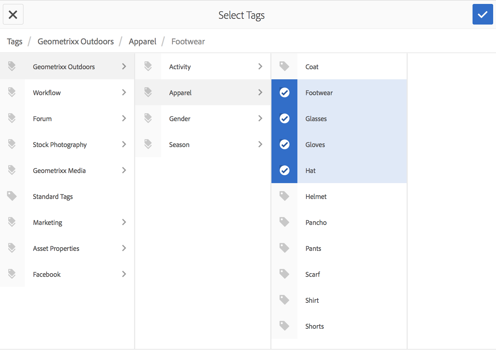

Your tags are now added in your translation job.

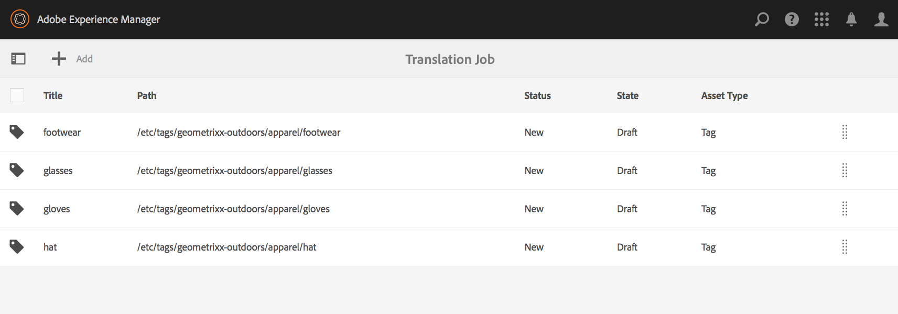

## Seeing Translation Project Details {#seeing-translation-project-details}

The Translation Summary tile contains the properties that are configured for a translation project. In addition to the generic [project information](/help/sites-authoring/projects.md#project-info), the Translation tab contains translation-specific properties:

* Source Language: The language of the pages that are being translated.
* Target Language: The language into which the pages are being translated.
* Translation Method: The translation workflow. Either Human Translation or Machine Translation is supported.
* Translation Provider: The translation service provider that is performing the translation.
* Content Category: (Machine Translation) The content category that is used for translating.
* Cloud Config: The cloud configuration for the translation service connector that is used for the project.

When a project is created using the Resources pane of a page, these properties are automatically configured based on the properties of the source page.

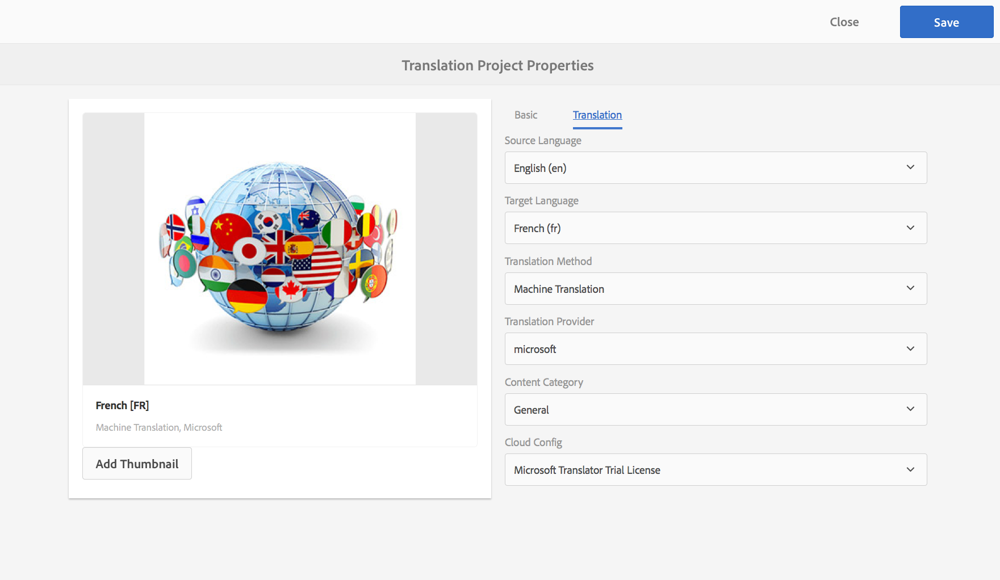

## Monitoring the Status of a Translation Job {#monitoring-the-status-of-a-translation-job}

The Translation Job tile of a Translation project provides the status of a translation job, as well as the number of pages and assets in the job.

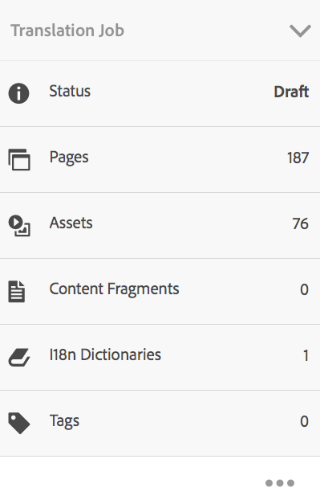

The following table describes each status that a job or an item in the job can have:

| Status |Description |
|---|---|
| Draft |The translation job has not been started. Translation jobs are in DRAFT status when they are created. |
| Submitted |Files in the translation job have this status when they have been successfully sent to the translation service. This status can occur aftertheRequest Scope command or the Start command is issued. |
| Scope Requested |For the Human Translation workflow, the files in the job have been submitted to the translation vendor for scoping. This status appears after the Request Scope command is issued. |
| Scope Completed |The vendor has scoped the translation job. |
| Committed for Translation |The project owner has accepted the scope. This status indicates that the translation vendor should begin translating the files in the job.  |
| Translation In Progress |For a job, the translation of one or more files in the job is not yet complete. For an item in the job, the item is being translated. |
| Translated |For a job, the translation of all files in the job is complete. For an item in the job, the item is translated. |
| Ready For Review |The item in the job is translated and the file has been imported into AEM. |
| Complete |The project owner has indicated that the translation contract is complete. |
| Cancel |Indicates that the translation vendor should stop working on a translation job. |
| Error Update |An error has occurred while transferring files between AEM and the translation service. |
| Unknown State |An unknown error has occurred. |

To see the status of each file in the job, click or tap the ellipsis on the bottom of the tile.

## Setting the Due Date of Translation Jobs {#setting-the-due-date-of-translation-jobs}

Specify the date before which your translation vendor needs to return translated files. You can set the due date for the project or for a specific job:

* **Project:** Translation jobs in the project inherit the due date.
* **Job:** The due date that you set for the job overrides the due date that is set for the project.

Setting the due date functions correctly only when the translation vendor that you are using supports this feature.

The following procedure sets the due date for a project.

1. Click or tap the ellipsis at the bottom of the Translation Summary tile.

   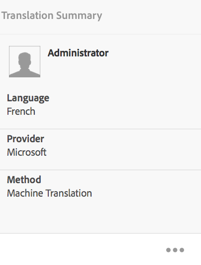

1. On the Basic tab, use the date picker of the Due Date property to select the due date.

   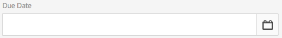

1. Click or tap Done.

The following procedure sets the due date for a translation job.

1. On the Translation Job tile, click or tap the commands menu, then click or tap Due Date.

   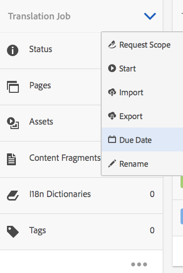

1. In the dialog box, click or tap the calendar icon, then select the date and time to use as the due date, then click Save.

   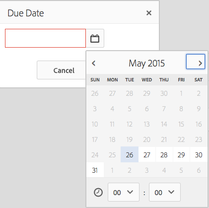

## Scoping a Translation Job {#scoping-a-translation-job}

Scope a translation job to obtain an estimate of the cost of translation from your translation service provider. When you scope a job, source files are submitted to the translation vendor who compares the text to their pool of stored translations (translation memory). Typically, the scope is the number of words that require translating.

To obtain more information about scoping results, please contact your translation vendor.

>[!NOTE]
>
>Scoping is optional. You can start a translation job without scoping.

When you scope a translation job, the status of the job is `Scope Requested`. When the translation vendor returns the scope, the status is changed to `Scope Completed`. When scoping is completed you can use the Show Scope command to review the scoping results.

Scoping functions correctly only when the translation vendor that you are using supports this feature.

1. In the Projects console, open your translation project.
1. On the Translation Job tile, click or tap the commands menu, then click or tap Request Scope.

   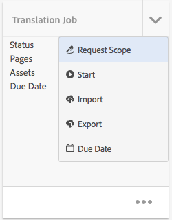

1. When the job status changes to SCOPE_COMPLETED, on the Translation Job tile click or tap the commands menu, then click or tap Show Scope.

## Starting a Translation Job {#starting-a-translation-job}

Start a translation job to translate the source pages to the target language. The translation is performed according to the property values of the Translation Summary tile.

After you start the translation job, the Translation Job tile shows the Translation in Progress status.

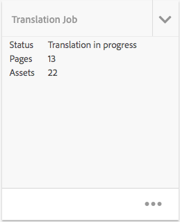

1. In the Projects console, open the translation project.
1. On the Translation Job tile, click or tap the commands menu, then click or tap Start.

   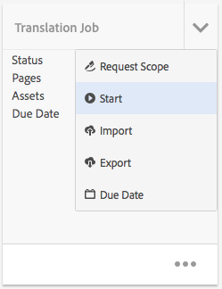

1. In the Action dialog that confirms the starting of the translation, click or tap Close.

## Canceling a Translation Job {#canceling-a-translation-job}

Cancel a translation job to halt the translation process and prevent the translation vendor from performing any further translations. You can cancel a job when the job has the `Committed For Translation` or `Translation In Progress` status.

1. In the Projects console, open the translation project.
1. On the Translation Job tile, click or tap the commands menu, then click or tap Cancel.
1. In the Action dialog that confirms the cancellation of the translation, click or tap OK.

## Accept/Reject Workflow {#accept-reject-workflow}

When the content comes back after translation and is in Ready for Review status, you can go in the translation job and accept/reject content.

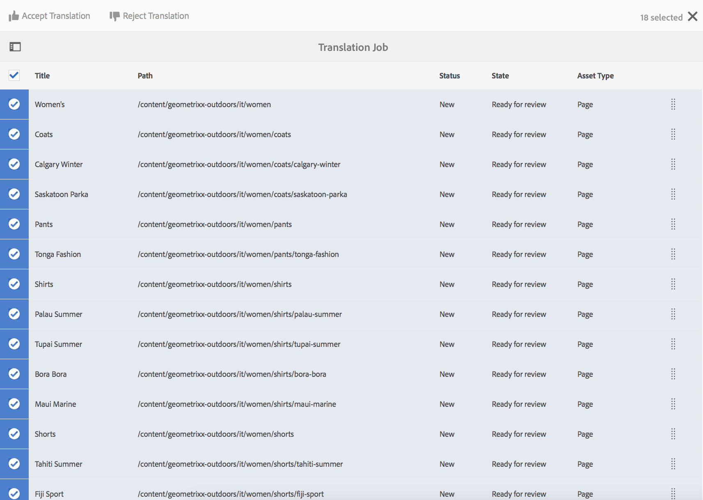

If you select Reject Translation, you have the option to add a comment.

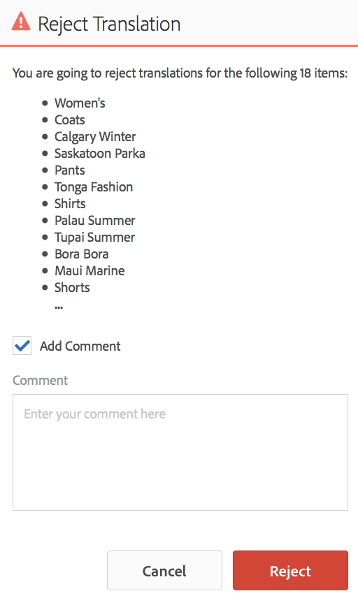

Rejecting content sends it back to translation vendor where he will be able to see the comment.

## Reviewing and Promoting Updated Content {#reviewing-and-promoting-updated-content}

When content is translated for an existing language copy, review the translations, make changes if necessary, and then promote the translations to move it to the language copy. You can review translated files when the translation job shows the Ready For Review status.

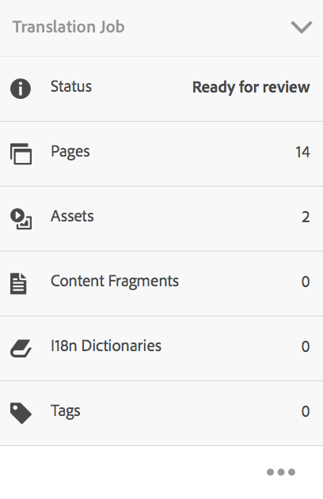

1. Select the page in the language master, click or tap References, then click or tap Language Copies.
1. Click or tap the language copy to review.

   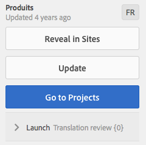

1. Click or tap Launch to reveal the launch-related commands.

   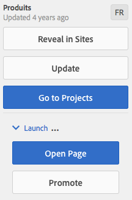

1. To open the launch copy of the page to review and edit the content, click Open Page.
1. After you have reviewed the content and made necessary changes, to promote the launch copy click Promote.
1. On the Promote Launch page, specify which pages to promote and then click or tap Promote.

## Comparing Language Copies {#comparing-language-copies}

To compare Language Copies to the language Master:

1. In the **Sites** console, navigate to the language copy you want to compare.
1. Open the **[References](/help/sites-authoring/basic-handling.md#references)** panel.
1. Under the **Copies** heading select **Language Copies.**
1. Select your specific language copy and then you can either click **Compare to Master **or **Compare to Previous **if applicable.

   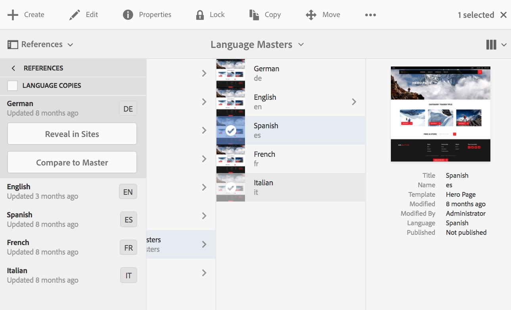

1. The two pages (launch and source) will be opened side-by-side.

   For full information about using this feature see [Page Diff](/help/sites-authoring/page-diff.md).

## Completing and Archiving Translation Jobs {#completing-and-archiving-translation-jobs}

Complete a translation job after you have reviewed the translated files from the vendor. For human translation workflows, completing a translation indicates to the vendor that the translation contract has been fulfilled, and that they should save the translation to their translation memory.

After you complete the job, the job has the Complete status.

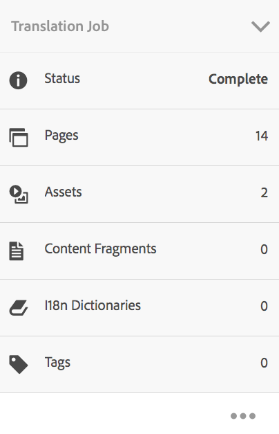

Archive a translation job after it is complete and you no longer need to see job status details. When you archive the job, the Translation Job tile is removed from the project.

## Creating the Structure of a Language Copy {#creating-the-structure-of-a-language-copy}

Populate your language copy so that it contains content from the master language that you are translating. Before you populate your language copy, you must have [created the language root](/help/sites-administering/tc-prep.md#creating-a-language-root) of the language copy.

1. Use the Sites console to select the language root of the master language that you are using as the source. For example, to translate the English pages of the Geometrixx Demo Site, select Content &gt; Geometrixx Demo Site &gt; English.
1. On the toolbar, click or tap References.

   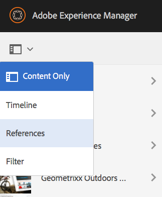

1. Select Language Copies, and then select the language copies that you want to populate.

   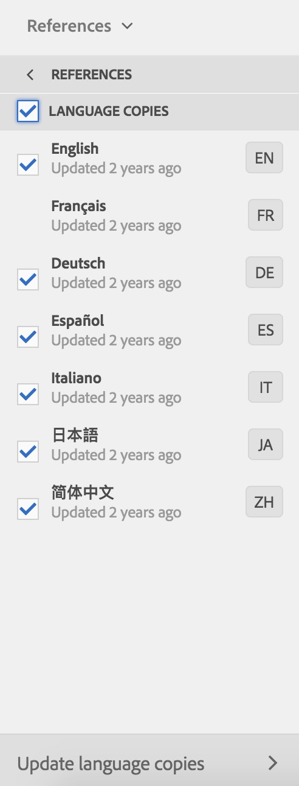

1. Click or tap Update Language Copies to reveal the translation tools, and configure the properties:

    * Select the Select All Sub-pages option.
    * For Project, select Create Structure Only.

   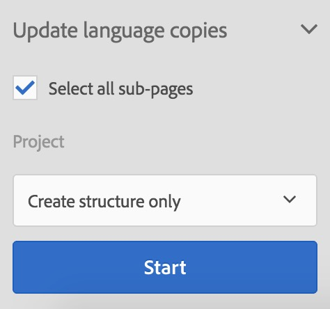

1. Click or tap Start.

## Moving or Renaming a Source Page {#move-source}

If an already translated source page needs to be [renamed or moved](/help/sites-authoring/managing-pages.md#moving-or-renaming-a-page), translating the page again after the move will create a new language copy based on the new page name/location. The old language copy based on the previous name/location will still be there. To prevent this, you can use the update language copy functionality after the move:

1. Move a page which has a language copy.
1. Select the language copy root.
1. Open the **References** panel.
1. Select **Languages Copies**.
1. Select the target languages you want to update.
1. Select **Update language copies**.
1. Click **Update**. A [Launch](/help/sites-authoring/launches-promoting.md) will be created.
1. Navigate to the required language root and select it.
1. Using the **References** panel, select **Launches**.
1. Click on the Launch that was just created and click **Promote launch**.

Now the source page was moved, as well as the associated language copy.

## Creating a Translation Project Using the Projects Console {#creating-a-translation-project-using-the-projects-console}

You can manually create a translation project if you prefer to use the Projects console.

>[!NOTE]
>
>To create a project, your account must be a member of the `project-administrators` group.

When you manually create a translation project, you must provide values for the following translation-related properties in addition to the [basic properties](/help/sites-authoring/touch-ui-managing-projects.md#creating-a-project):

* **Name:** Project name.
* **Source Language:** The language of the source content.
* **Target Language:** The language into which the content is being translated.
* **Translation Method:** Select Human Translation to indicate that the translation is to be performed manually.

1. On the toolbar of the Projects console, click or tap Create.
1. Select the Translation Project template and then click or tap Next.
1. Enter values for the Basic properties.
1. Click or tap Advanced and provide values for the translation-related properties.
1. Click or tap Create. In the confirmation box, click or tap Done to return to the Projects console, or click or tap Open Project to open and start managing the project.

## Exporting a Translation Job {#exporting-a-translation-job}

You can download the content of a translation job, for example to send to a translation provider that is not integrated with AEM via a connector, or to review the content.

1. From the drop-down menu of the Translation Job tile, click or tap Export.
1. In the Export dialog box, click or tap Download Exported File, and if necessary use the web browser dialog box to save the file.
1. On the Export dialog box, click or tap Close.

## Importing a Translation Job {#importing-a-translation-job}

You can import translated content into AEM, for example when your translation provider sends it to you because they are not integrated with AEM via a connector.

1. From the drop-down menu of the Translation Job tile, click or tap Import.
1. Use the web browser's dialog box to select the file to import.
1. On the Import dialog box, click or tap Close.
